# Magia Sihr

La magia o sihr en las 1001 Noches es un elemento importantísimo. Hay pocas historias sin que haya alguien que practique algún tipo de hechizo o use algún tipo de ingenio mágico. Piensa en el simple "Ábrete, sésamo" de Alibaba o el poderoso genio que cumplía todas las órdenes de Aladino. Sin olvidarnos de caballos mecánicos voladores o de espadas danzantes.

La magia también es algo fundamental en los Mitos de Cthulhu, pero es bastante distinta de la magia que vemos en los cuentos. La magia de los cuentos es una magia muy clásica que se centra en poderes muy sencillos, volar, curar, hablar con los animales, transformar en rana, nadar como un pez, etc. Nada que ver con los terribles hechizos que presenta el autor de Providence en sus obras. Conceptos como teletransporte, psicometría o viajes en el tiempo no existen en la magia de las 1001 Noches. Por suerte, los mitos se encargan de introducir conceptos modernos a la magia clásica de las 1001 Noches.

La mezcla de los estilos da un tipo de magia muy curioso y que puede ser muy divertida de jugar. Piensa en alfombras voladoras que funcionan con tecnología cuasi-mágica de la gran raza de Yith, oasis que crecen en una noche en el desierto por acción de algún oscuro y casi desconocido primigenio o malvados hechiceros serpigente que invoca serpientes gigantes para que te devoren.

Otra cosa que comparten ambas posturas mágicas es que el estudio de grimorios malditos y libros de hechizos prohibidos es necesario para avanzar en tus poderes mágicos. Un schahriar sin acceso a su biblioteca no puede aumentar y/o mejorar sus capacidades taumatúrgicas.

Ambas magias también están basadas en rituales, fórmulas mágicas y componentes extraños y raros. No es algo innato de las personas con dones mágicos, se ha de preparar y a veces con mucho tiempo de dedicación.

\sp

\sinc

[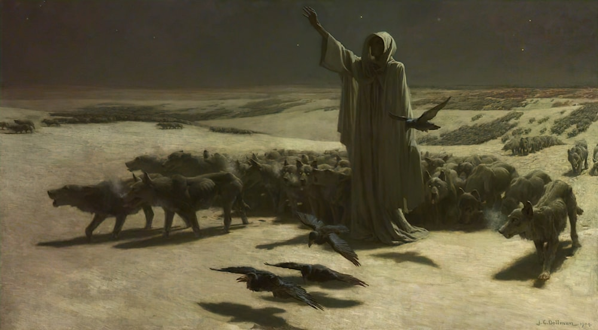](https://en.wikipedia.org/wiki/John_Charles_Dollman "Hambre de John Charles Dollman") 

&nbsp;

## Los secretos del Sihr

\conc

Ya hemos comentado que la Afinidad mágica, que solo pueden tener los comodines, permite hacer uso de objetos mágicos, pero para poder hacer prodigios mágicos debemos tener la ventaja Trasfondo arcano (Sihr), explicada anteriormente.

El Sihr o magia funciona como se describe en el manual básico, pero con alguna diferencias, como ya hemos visto en la descripción del propio Trasfondo Arcano, y en tema de recuperación de PP y de aprendizaje de la magia. Además, los poderes que se pueden aprender están limitados a una lista específica con menos poderes que los del manual básico, pero también con algunos nuevos y los poderes especiales de las maldiciones.

### Recuperación de PP

Todo personaje dispone de tantos puntos de poder diarios como su nivel de Espíritu que recupera tras una noche de descanso (8 horas de descanso sin interrupciones importantes).

\sp

Descanso no implica estar dormido, puede ser disfrutar de estar a la sombra en un exótico oasis o disfrutando y bebiendo con tus amistades en un khan. En general, acciones que no impliquen avanzar la trama son descanso.

Un combate o curar a tus aliados son interrupciones graves, levantarte de tu alcoba para llenar el orinal no.

### Mejorar nuestros poderes mágicos

Toda mejora de poderes mágicos implica gastar avances y la lectura de un grimorio al que le queden Niveles de Poder (NP).

Cada vez que lees un grimorio y usas esa lectura para subir tu habilidad Saber de Suleimán o para aprender alguna ventaja mágica, el grimorio pierde un NP para ti, hasta que llega a cero y ya no puedes aprender más cosas de él.

Que para ti tenga NP 0 no quiere decir que otras personas no puedan aprender magia de él, ya que para esa persona el NP estará al máximo. Puedes:

* dejar libremente que cada schahriar gaste los NP del libro como quiera,
* fijar en que exactamente se puede gastar los NP antes de dar el libro a tus schahriar
* o un modo mixto en el que el primer lector deja fijo que se aprende del libro con sus decisiones a la hora de gastar sus avances y los siguientes lectores se tienen que ceñir a esa lista de gastos.

\sp

\sinc

## Ventajas mágicas

\conc

Veamos como afectan las ventajas mágicas normales a este trasfondo arcano.

### Puntos de poder

La ventaja Puntos de poder otorga tantos puntos de poder nuevos como el Espíritu del personaje. Si aumenta el Espíritu (temporal o permanentemente) aumentan los puntos de poder.

Adquirir esta ventaja supone también el estudio de un libro de hechizo.

### Nuevos poderes

La ventaja de Nuevos poderes solo podrá adquirirse tras leer un libro de hechizos y gastará un nivel de poder de dicho libro.

Si durante el avance no tuvo acceso a su grimorio, no habrá podido estudiar nuevos hechizos y no podrá gastar el avance en nuevos poderes. Por ejemplo, si ha estado encerrado en la cárcel sin su libro.

Adquirir esta ventaja supone también el estudio de un libro de hechizo.

### Recuperación rápida

Recuperación rápida supondrá que necesitará la mitad de tiempo de descanso para recuperar todos sus puntos de poder. Como ejemplo:

* Un personaje con Espíritu d6 y Puntos de poder, recuperará 12 puntos de poder tras dormir 8 horas.
* Un personaje con Espíritu d6, Puntos de poder x3 y Recuperación rápida, recuperará 24 puntos de poder tras descansar 4 horas.

### Otras ventajas mágicas

Otras ventajas asociadas a la ventaja Trasfondo Arcano, como Canalización, funcionarán normalmente, pero puede que haya ventajas de otras ambientaciones que quieras usar y que tengas que adaptar teniendo en cuenta estas reglas.

* Los puntos de poder se basan en Espíritu. Si una ventaja da o quita puntos de poder no será un valor fijo, sino basado en el nivel de Espíritu del personaje.

\sp

* La adquisición de ventajas que den (como Nuevos poderes) o mejoren poderes debe estar asociadas al estudio de grimorios malditos y al gasto de su nivel de poder.

\sp

\sinc

## Poderes

\conc

[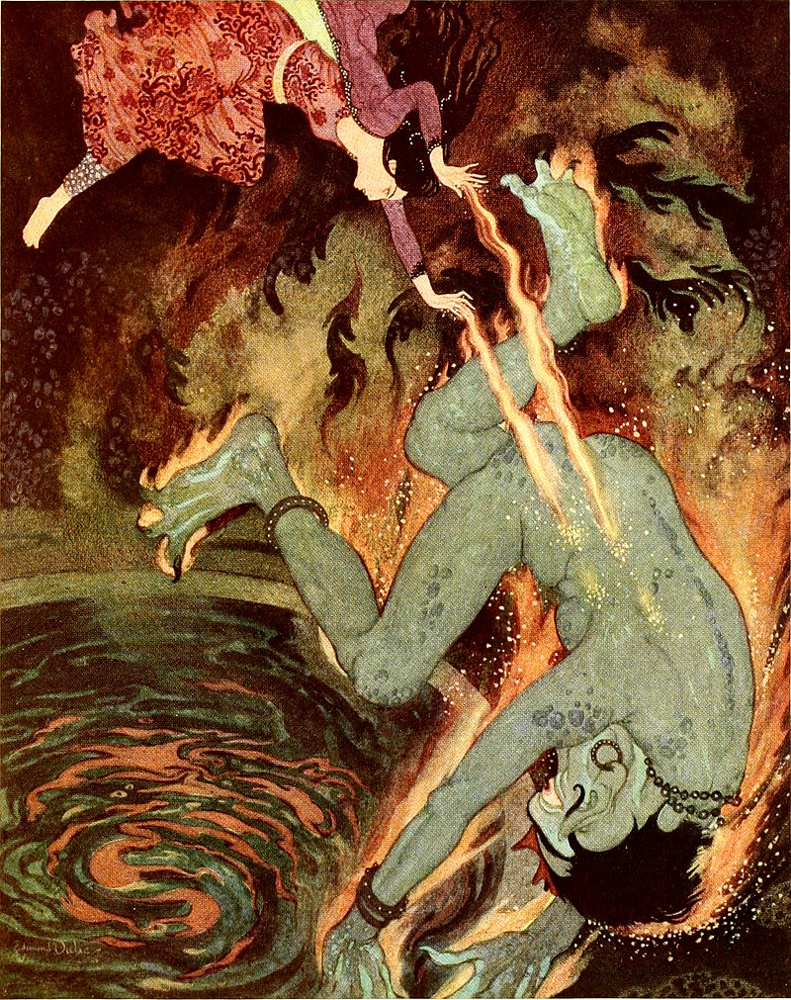](https://en.wikisource.org/wiki/Sindbad_the_sailor_and_other_stories_from_the_Arabian_nights/The_Story_of_the_Three_Calenders#/media/File:Sindbad_the_sailor_&_other_stories_from_the_Arabian_nights_-_Dulac_color_plate_facing_page_168.jpg "Edmund Dulac") 

No todos los poderes de SWEA están disponibles en esta ambientación. Aun así, esto es una sugerencia.

Si crees que hemos eliminados poderes que pudieran cuadrar, eres muy libre de meterlos. Aquí tienes un listado de poderes posibles en 1001 Ghūles.

### Adivinación

Desde que los humanos aparecieron estos se han preguntado por su futuro y su pasado y es por ello que la adivinación siempre ha estado presente en toda fantasía. Desde complicados rituales mágicos a leer las líneas de la mano o hablar con los muertos.

### Aura dañina

Son frecuentes los ejemplos de efrits cubiertos de fuego y quedarían muy bien seres llenos de pinchos con veneno o ácido.

### Cambio de forma

El cambio de forma es un poder muy común entre los seres de las 1001 Noches, pero no tanto de los Mitos de Cthulhu donde los cambiaformas no abundan.

### Captura

Estamos hablando de desde muros de tierra que aprisionan a la víctima a convertirte en piedra de cintura para abajo.

En versiones más lovecraftianas podemos ver como pseudópodos de todo tipo que atrapan a la víctima, arenas movedizas o zarzas endemoniadas que se enroscan en tus piernas.

\sp

[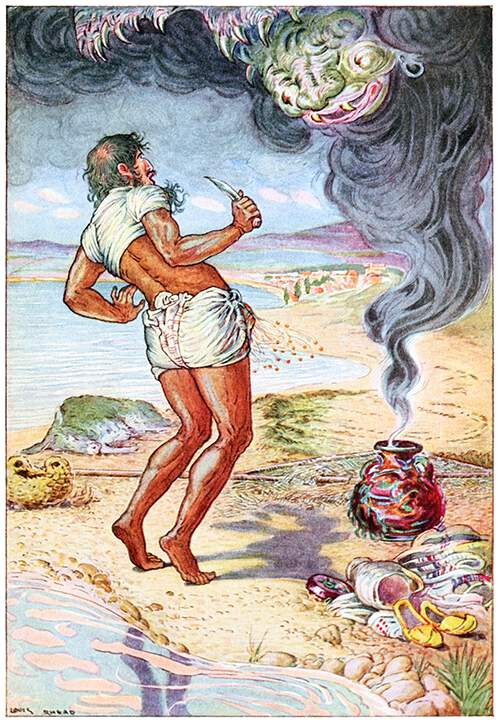](https://www.oldbookillustrations.com/illustrations/huge-monster/ "The Fisherman Wished to Run Away - Rhead, Louis") 

### Castigo

Tenemos varios ejemplos de armas mágicas en los cuentos de las 1001 Noches, pero podemos darle un toque especial con armas emponzoñadas y oxidadas que no hacen cortes limpios, sino que producen gangrena y mucho más dolor.

### Ceguera

Algo muy medieval y bastante bíblico es dejar ciego a tu oponente tanto de forma aleatoria, como permanente de en forma de maldición.

### Chorro

Los alientos de fuego o pestilentes o incluso los pedos venenosos son usuales entre los monstruos de las 1001 noches. Los magos, siguiendo la tradición del autor de Providence, deberían poder lanzar nubes ácidas y corrosivas que pudran la carne de sus objetivos o nubes de escarabajos o langostas carnívoras que devoren a tus schahriars.

### Curación

La curación mágica es principalmente a través de pócimas y emplastos. Aunque normalmente estas sanaciones son realizadas tras el combate en hammames y suntuosas habitaciones de palacio por jóvenes de gran belleza de ambos sexos, también pueden usarse en mitad de un combate entre heridas abiertas, tajos y fracturas.

### Destierro

El destierro es algo muy común usado por practicantes de magia para deshacerse de yinns, cheitáns y entidades más poderosas como avatares de dioses exteriores.

\sp

Se les encierra en botellas y tinajas que son lanzadas a las profundidades marinas y a pozos sin fondo o se les manda a otras dimensiones o las profundidades del espacio exterior.

### Disfraz

Si Cambiaformas es un poder típico de yinn, Disfraz es un poder típico de humano. 

Muchos son los ejemplos de personajes de las 1001 Noches que se disfrazan, es por ello que es interesante dejar su versión mágica.

Este poder, que pueden usar tanto schahriars como PNJ, puede ser importante en muchas tramas donde colarse en la guarida de los villanos sea esencial.

Hay disfraces tan convincentes en muchas historias que nadie lo sospecha, solo las personas más listas y avispadas se dan cuenta.

El jefe de los 40 ladrones se hace pasar por un vendedor de aceite y el mago malvado de Aladino por una santona que engaña a la princesa Badrú’l-Budur.

### Gigantismo

Que los personajes se hagan enormes es algo muy típico en las 1001 Noches sobre todo los yinns, no tanto en los mitos donde los seres que tienen que ser gigantescos ya lo son de por sí.

Aunque quede muy Disney, este poder puedes reservarlo para villanos que se convierten en gigantes en la épica batalla final.

### Invisibilidad

La invisibilidad es otro de esos puntos donde los dos mundos que forman esta ambientación están de manos.

Son comunes en los Mitos con muchos seres invisibles y en las 1001 Noches con objetos mágicos que hacen invisible al schahriar para colarse en el palacio del califa o para salvar a su amor.

### Invocación de aliados

Las invocaciones son parte fundamental de la magia de los Mitos. Llamar a seres del espacio profundo o extradimensionales para que maten a mis enemigos, roben algún objeto o secuestres a víctimas inocentes es algo esencial de todo buen líder o lideresa de culto innombrable.

\sp

La duración de las invocaciones no es 5 turnos, si no de 5 horas y no se pueden meter los modificadores de poder de Mordisco/Garras, Volar y Jinete Mental.

También hay posibilidades de que el aliado invocado no este muy contento con la invocación. Es por ello que la tirada de invocación debería ser hecha por Scheherazade, ya que, siempre que haya una pifia en la tirada de invocación, el ser invocado será agresivo al o la invocadora.

Algunos podrían atacar directamente como los sirrush, pero otros como los rokhs o qatrams podrían parecer aliados y esperar al momento adecuado para atacar y jugársela.

#### Aliados que pueden ser invocados

Los aliados que pueden invocarse son monstruos de los Mitos, normalmente razas servidoras como las gentes del mar o los ghūles. Las razas independientes y poderosas como los qareens son más complejas de invocar.

Según el rango del lanzador, podrá invocar los aliados de rango igual o inferior. Para poder invocar a un ser de los Mitos ha debido conocerse y haber sobrevivido a su visión, es decir, haber hecho una TPC y haberla pasado.

\sinc

##### Tabla de Aliados que pueden ser invocados

|Coste PP|Rango del lanzador|Monstruo|
|---|---|---|
|2|Novato|Gente del mar, ghūl, sukaan|
|4|Experimentado|Serpigente, abu-qith científico, fuego de la Yahannam|
|6|Veterano|Sirviente alado, abu-qith soldado, abibil|
|8|Heroico|Vástago de Astarte, sirrush|
|15|Legendario|Qatrams, ave de Rokh|

&ast; Recuerda que debes ser experimentado para poder lanzar hechizos, con lo que siendo novato/a no puedes lanzar este hechizo.

\conc

\sp

Los monstruos invocados generan una TPC igual a la del monstruo a todos los que lo vean, excepto el invocador que su TPC es menos dos niveles con un mínimo de d4. No se puede usar el modificador de Horror.

### Manipulación elemental

La creación agua o fuego, mover tierra o hacer soplar fuego es un tipo de magia que pega muy bien en esta ambientación. Son pequeños prodigios mágicos que dan color a los cuentos.

### Manipulación de recuerdos

Al contrario que la mayoría de poderes, este poder es solo típicamente de los Mitos, pero junto a Marioneta queda muy bien para villanos, magos tenebrosos, visires malvados, etc.

En el manual básico se dice que pruebas claras podrían hacer volver destellos del recuerdo manipulado (Tirada de Astucia -2).

En esta ambientación basada en las 1001 Noches, los olores, los sabores, etc. tienen su importancia y el olor del perfume que usaba tu pareja olvidada o unos sensuales bailes que ejecutaba para ti pueden recordártela. Quizás un plato típico de una zona te haga recordar una ciudad de esa zona hecha desaparecer por los Al-mighos y que hicieron olvidar a todo el mundo.

Aunque se use este poder para hacer olvidar hechos traumáticos, la psique está ya rota y no se puede recuperar puntos de Cordura.

### Marioneta

Este poder es típicamente de los Mitos, junto a Manipulación de recuerdos queda muy bien para que el típico cultista lo use con tus schahriars y les haga hacer cosas horribles e ignominiosas.

### Protección medioambiental

Caminar sobre fuego, andar por el fondo marino o simplemente sobrevivir a los rigores del desierto son algo normal en los cuentos, pero los mitos son mucho más modernos y en ellos se hablan de conceptos más modernos como radiaciones, presión, vacío, etc.

\sp

Considera que la protección medioambiental cubre todos los aspectos de un tipo de acción sin importar todos los riesgos. Por ejemplo, respirar debajo del agua te da agallas para respirar y resistencia contra la presión.

### Proyectil

Los proyectiles normalmente son de fuego. Hay ejemplos de proyectiles asociados a yinns que respiran fuego y pueden escupirlo, pero no aparecen rayos eléctricos o flechas de hielo. 

Deberías dejar el fuego para tus schahriars y el hielo, la electricidad, el veneno o el ácido para tus villanos y villanas. 

El fuego, entre las creencias religiosas de la zona como en el zoroastrismo, no tiene connotaciones diabólicas, sino más bien de elemento purificador y sagrado.

### Aumento/Reducción de atributo

Este poder se ve muchas veces reflejado en las 1001 Noches en bebedizos que potencian las cualidades de tus schahriars.

Como reductor de atributos y con un toque más lovecraftiano, este poder puede tener varias formas de aplicarse en tus partidas en forma de enfermedades con reminiscencias medievales como la lepra, la tuberculosis o la sarna que restan Fuerza, Vigor o Destreza.

También puedes tener una vertiente de robar la juventud.

### Sueño

El sueño es algo común en las historias de las 1001 Noches desde sueños profundos en el que despiertas semanas, meses o incluso años después hasta sueños premonitorios en que tus schahriars pueden conseguir visiones del futuro, del pasado o consejos de seres queridos muertos.

Todo esto coincide con las historias del autor de Providence, donde los sueños pueden ser auténticas pesadillas inducidas por primigenios acuáticos.

### Vuelo

Volar es un poder muy habitual en las historias de las 1001 Noches, tanto con objetos mágicos como con monturas aladas o pócimas místicas.

\sp

Aunque la mayoría de las veces volar supone una forma de viajar muy rápido por todo el mundo, también hay veces en que los seres vuelan y combaten en el aire.

### Zombi

En las 1001 Noches no existen los zombis como los conocemos actualmente, pero tienen un monstruo muy parecido, los Nasnas. 

Un Nasnas es la mitad de un cuerpo humano, media cabeza, medio tronco, y solo un brazo y una pierna. Si bien no son cadáveres putrefactos, al verse las tripas y el cerebro tienen un aspecto de muerto viviente. También son lentos al tener que moverse a la pata coja con su única pierna. Sin embargo, pueden dar grandes saltos.

Cuando uses este poder, usa la plantilla del Nasnas de esta ambientación y necesitarás cortar en dos partes un cadáver reciente completo.

\sp

\sinc

## Nuevos poderes de las 1001 Noches

\conc

En 1001 Ghūles hay nuevos poderes disponibles, aparte de los que puedas encontrar en el Manual Básico de SWEA.

### Abrir puertas

* **Rango:** Novato
* **Puntos de poder:** 2 PP
* **Distancia:** Astucia
* **Duración:** Instantáneo

Este poder hace que las puertas se abran lo suficiente para que la persona que uso el poder pueda entrar. Las puertas se desatrancarán, los rastrillos se subirán, las cerraduras se abrirán, etc. El efecto es instantáneo y la puerta se puede volver a cerrar, las trancas volver a colocar y bajar los rastrillos en el siguiente turno.

El hechizo abre los elementos normales de una puerta, pero no afecta a elementos especiales. El pestillo y la cadena de la puerta se quitarán solas, pero si han puesto un armario para evitar que se abra la puerta, el armario y, por tanto, la puerta no se moverá ni un centímetro.

#### Modificadores

**Saltar las cerraduras (+2):** Gastando 2 PP extras las cerraduras y las trancas saltarán por los aires y los rastrillos se saldrán de sus carriles. Esto obligará al defensor a gastar 2 acciones completas para poder cerrar la puerta.

**¡Sésamo, ciérrate! (+2):** Se puede usar el poder a la inversa para cerrar la puerta. El rastrillo se bajará solo, la tranca se pondrá en su sitio sola y los candados se pondrán solos aunque hayan saltado por los aires. Para poder usar este modificador debemos estar al otro lado de la puerta en el lugar del defensor. Habrá que pasar una tirada enfrentada en caso de querer cerrar una puerta abierta con este poder.

### Buscar el camino

* **Rango:** Novato
* **Puntos de poder:** 2
* **Distancia:** —
* **Duración:** Hasta llegar al objetivo

\sp

Según el ornamento, aparecerá delante de la persona que use el poder una guía que marcará el camino hasta el lugar que se busca.

Debemos conocer el nombre del lugar que buscar y debe haber una forma física de llegar a ella. Si buscamos un sitio en las tierras de Sueños sin saber como llegar a mundo onírico, el hechizo fallará.

[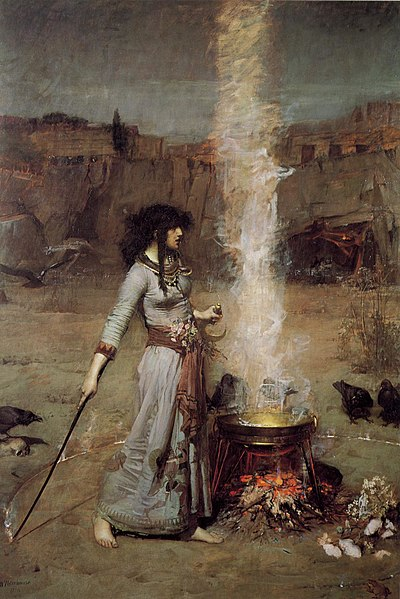](https://es.m.wikipedia.org/wiki/Archivo:John_William_Waterhouse_-_Magic_Circle.JPG "John William Waterhouse: El círculo mágico") 

La guía es visible para todo el mundo, con lo que, por ejemplo, un fuego fatuo que marca el camino podría ser visto por los guardias que protegen la muralla.

A medida que se acerque al destino será cada vez más impreciso. Por ejemplo, nos puede llevar hasta el palacio del Califa, pero no específicamente a las habitaciones del Califa. Los lugares tendrán que tener nombre y cosas como «dónde está el Califa» no funcionan.

La guía siempre marca el camino más rápido posible que sea factible. Por ejemplo, evitará ríos y buscará puentes, pero no se preocupará si hay enemigos en la zona o si se quiere moverse sin ser detectado.

Si nos alejamos demasiado de la guía, esta se disipa (a discreción de Scheherazade) y en caso de ser sitios ocultos con magia deberá hacerse una tirada enfrentada con el hechizo de ocultación que se usó. Una vez lanzado este hechizo se mantiene solo y no afecta al lanzamiento de otros hechizos.

#### Modificadores

**Preciso (+2):** Nos permite establecer un lugar mucho más concreto.

**Oculto (+1):** Solo la persona que lo lanzo ve la guía que marca el camino.

\sp

### Caminar sobre las aguas

* **Rango:** Experimentado
* **Puntos de poder:** 2
* **Distancia:** Astucia
* **Duración:** 2 horas

Caminar sobre las aguas permite al objetivo caminar por superficies líquidas como el mar como si fueran sólidas. El éxito le permite desplazarse a su Paso normal, con aumento, podrá correr. No podrá sumergirse en el agua, pero podrá tumbarse. Si hay oleaje, se considerará terreno difícil.

#### Modificadores

**Objetivos adicionales (+1):** Es posible afectar a más de un objetivo, incrementando el coste en 1 PP por blanco adicional.

### Invocar montura

* **Rango:** Novato
* **Puntos de poder:** 4
* **Distancia:** —
* **Duración:** Una semana

Con este poder se invoca una montura (mula, caballo o camello) que tiene la capacidad de moverse a gran velocidad recorriendo en 1 día, lo que haría en 2 semanas. Además, no se ve afectado por los terrenos difíciles. Con un avance en la tirada se duplica la velocidad avanzando en 1 día lo que se recorrería en 1 mes.

El poder incluye que los testigos que vean la montura y su jinete no se percaten de la gran velocidad que lleva.

No se puede usar en combate más que como forma de huida. Durante el turno de subirte a la montura podrían atacarte. En cuanto te subes a la montura se mueve tan deprisa que quedas fuera de su alcance. Esto hace que nadie tenga capacidad de atacarte por métodos mundanos mientras huyes.

#### Modificadores

**Un mes en un día (x2):** La montura va tan rápido que en un día hace lo de un mes y con avance harían en un día lo que en un año.

**Mayor carga (+2):** Se dobla la capacidad de carga de la montura. Si de normal sería una mula, en este caso podría ser un camello.

\sp

**Pasajero adicional (+2):** Esta modificación permite llevar a solo un pasajero adicional y como en el modificador anterior pasaríamos de invocar una mula a invocar monturas más grandes como camellos o caballos.

### Transmutación

* **Rango:** Especial
* **Puntos de poder:** 3 PP x nivel de dificultad
* **Distancia:** Toque
* **Duración:** 1 hora

La transmutación es el poder de convertir una materia en otra. Puede ser cosas tan clásicas como el plomo en oro o el agua en vino o más complejas como la carne en piedra.

A la hora de calcular la dificultad y los PP que debes gastar para lanzar una transmutación, debes tener en cuenta estas variables y calcular el nivel de dificultad:

* **Estado de la material:** Transformar una materia en otra materia que esté en el mismo estado no supone ningún nivel. Transformar un sólido a líquido o un líquido a un gas exige 1 nivel. De sólido a gaseoso serían 2 niveles.
* **Complejidad de la materia:** No es lo mismo transformar una barra de plomo que un cuerpo humano. Por cada, elemento principal adicional que contenga la materia a transmutar o trasmutada sería un nivel. Un barrote de hierro no necesitaría ningún nivel extra, mientras que un objeto complejo como un ataúd serían 2 niveles extra, 0 por la madera de la caja y 2 niveles por el metal de las bisagras y los clavos y tela del interior.
* **Rareza:**Las materias pueden ser más o menos raras, transformar algo común como la madera en algo común como piedra es más sencillo que convertir cantos rodados (comunes) en diamantes (extremadamente raro). Hay 4 niveles de rareza, común, poco común, raro o muy raro. Pasar de un nivel a otro supone un nivel de dificultad. Convertir cantos rodados (común) en esmeraldas (muy raro) serían 3 niveles de dificultad.
* **Cantidad de materia a transmutar:** Cada metro cúbico de materia a transmutar supone 1 nivel, con un mínimo de 1. Un cuerpo humano sería medio metro cúbico, un gran portón de madera reforzada podría ser 3.

\sp

La transmutación es muy complicada y hay muy pocas posibilidades de que salga bien. Hay demasiadas variables en juegos que han de ser modificadas y a la naturaleza no le gustan estos cambios y se resiste.

Para que la transmutación se produzca debe pasarse una tirada de Saber de Suleimán contra una dificultad de 4 + nivel de dificultad de la transmutación. En el caso de seres vivos o seres mágicos se hace una tirada enfrentada contra Vigor del objetivo + nivel de dificultad.

Según el nivel del lanzador, puede intentar transmutaciones más difíciles.

|Rango|Niveles|
|---|---|
|Novato|1 nivel &ast;|
|Experimentado|2 niveles|
|Veterano|4 niveles|
|Heroico|8 niveles|
|Legendario|sin límite|

&ast; Recuerda que debes ser experimentado para poder lanzar hechizos, con lo que siendo novato/a no puedes lanzar este hechizo.

La transmutación no sirve para crear otra cosa que la propia transformación de la materia. No puedes conseguir ventajas adicionales que puedan darte otros poderes.

* Si quieres tener Armadura convirtiendo tu piel en piedra no podrás conseguirlo con este hechizo, sino con un hechizo basado en el poder Armadura.
* No podrás volar convirtiéndote en gas, deberás tener el poder Vuelo para ello.
* Si deseas inmovilizar a un enemigo en pleno combate o mientras intenta huir tendrás que usar Captura.
* Quizás puedas convertir a tus enemigos en piedra después del combate como castigo o para poder llevarlos ante la justicia, pero nunca para emular otros poderes y sobre todo en situaciones de estrés.

#### Ejemplos de transmutación

**Una jarra de agua en vino (1 nivel, 3 PP, dificultad 5):** Sería 0 niveles por convertir un líquido en un líquido + 0 niveles por el agua + 0 niveles por el vino + 1 por la cantidad + 0 por la rareza (algo común en algo común).

\sp

**Carne en piedra (5 niveles, 15 PP, dificultad Vigor + 5 del objetivo):** Sería 0 niveles por convertir un sólido en un sólido (aunque la sangre sea líquida se considera en conjunto un sólido) + 3 niveles por el cuerpo humano (carne, huesos, piel y sangre) + 0 niveles por la piedra. + 1 por la cantidad + 1 por la rareza, de algo no común a algo común.

**Plomo en oro (3 niveles, 9 PP, dificultad 7):** Sería 0 niveles por convertir un sólido en un sólido + 0 niveles por el plomo + 0 niveles por el oro + 1 por la cantidad + 2 niveles por convertir algo no común en algo muy raro.

#### Modificadores

**A medías:** Normalmente transformas todo el objeto, si solo quieres transformar una parte el coste de PP se multiplica por 1,5.

\sc

### Nuevos modificadores de poder

#### Horror (gasto de poder/2):

Esta modificación es genérica para la mayoría de poderes. Gastando la mitad de los puntos poder normales que pide el poder se puede hacer que el hechizo infunda terror en los objetivos y los que los presencien. Por ejemplo, Adivinación puede hacerse tan horripilante (sombras aterradoras que rodean al o la vidente, voces graves y terroríficas, …) que los que lo presencien tengan que hacer una TPC de d4, si se gasta la misma cantidad de puntos de poder la TPC es un d6. Incluso poderes de sanación puede ser horripilantes con esta modificación.

Recuerda que este es más un recurso más para que lo usen tus PNJ, especialmente los malos que realmente para tus schahriars y deberías dejarles claro que ir sumiendo en la locura a la gente no es cosa de héroes.

\sp

\sinc

## Hechizos (Ornamentos)

\conc

En esta sección te ofrecemos una serie de hechizos basados en los poderes anteriores que pueden ayudarte a dar color a tus partidas. Estos hechizos no son más ornamentos explicados, de forma que se adapten a los pilares de esta ambientación, las 1001 Noches y los Mitos de Cthulhu.

### ¡Sésamo, ábrete!

_Poder:_ Abrir puertas

> Y he aquí que, al llegar a su casa, Alí Babá encontró la puerta cerrada por dentro con el pestillo grande de madera, y se dijo: «¡Voy a ensayar en ella la virtud de la fórmula!» Y dijo: «¡Sésamo, ábrete!» Y al punto, separándose de su pestillo, la puerta se abrió de par en par.
> 
> **Referencia:** Historia de Alí Babá y los cuarenta ladrones (n. 853)

Con esta sencilla fórmula, cualquier puerta por grande y pesada que sea se abre ante ti sin problema.

### Aura de fuego

_Poder:_ Aura dañina

> El yinn resoplo enfurecido expulsando vapores sulfurosos por su gran nariz, o lo que un siervo del único creador, diría que era una nariz, ya que aquel genio no se parecía nada a los cuentos que se contaban al anochecer en los fuegos de campamento. Los vapores apestosos fueron cubriéndole hasta que con chasquido de sus deformes dedos creo una chispa como si fueran de acero y pedernal y se prendieron cubriendo su larguirucho cuello de llamas sin humo.

Frotando azufre con firmeza y rapidez en tu tripa se crea un fuego que te cubre todo el cuerpo. Tu respiración sale de tu cuerpo en forma de humos y vapores sulfúricos. Tu cuerpo emite vapores ardientes y llamas infernales.

\sp

### Aceite de dan dan

_Poder:_ Protección medioambiental (agua y presión)

> Al oír estas palabras, el terrestre dijo al marítimo: "En ese caso, no tengo inconveniente en sumergirme contigo. ¡Tráeme, pues, el ungüento consabido para que lo ensaye!" El marítimo contestó: "¡Eso es lo que voy a hacer!" Y se llevó el cesto de frutas y se metió en el mar para volver al cabo de unos instantes llevando en las manos una vasija llena de un ungüento parecido a la grasa de las vacas y de un color amarillo como el oro, y de un olor absolutamente delicioso. Y preguntó Abdalah de la Tierra: "¿Con qué se compone este ungüento?" El otro contestó: "Se compone con grasa del hígado de una especie entre las especies de peces que se llama dan dan. ¡Y este pez dan dan es el más enorme de todos los peces del mar, hasta el extremo de que de un solo bocado devoraría sin dificultad lo que vosotros los terrestres llamáis un elefante o un camello!"
> 
> **Referencia:** Historia de Abdalah de la tierra y de Abdalah del mar (n. 512)

Aplicando aceite de hígado del gigantesco pez dan dan (o de cualquier pez) puedes sumergirte en el agua sin problemas para respirar o de presión.

### Aceite salomónico

_Poder:_ Protección medioambiental (fuego y calor)

> Entonces las dos viejas me vertieron sobre el cuerpo una zafra llena de aceite salomónico, cuyas virtudes me habían explicado, y me frotaron con él todos los miembros, sin omitir una partícula de mi persona. Tras de lo cual los guardias me colocaron en medio de la inmensa hoguera, a la que prendieron fuego. Y a los pocos instantes me rodearon las llamas furiosas. Pero las lenguas rojas que me lamían eran para mí más dulces y más frescas que la caricia del agua en los jardines del Irem. Y permanecía desde por la mañana hasta por la noche en medio de aquella hornaza, tan intacto como el día que salí del vientre de mi madre.
> 
> **Referencia:** Historia espléndida del príncipe Diamante (n. 918)

Frotando con este aceite extraído de la roca (o petraeolium) la cabeza y los brazos se consigue protección contra el calor y el fuego.

### Arma afiladísima

_Poder:_ Castigo

> E inmediatamente el efrit se convirtió en un león espantoso, el cual, abriendo la boca en toda su extensión, se abalanzó sobre la joven. Pero ella, rápidamente, se arrancó un cabello, se lo acercó a los labios, murmuró algunas palabras mágicas, y en seguida el cabello se convirtió en un sable afiladísimo. Y dio con él tal tajo al león, que lo abrió en dos mitades.
> 
> **Referencia:** Historia del segundo saaluk (n. 14)

El o la conjuradora afila su arma contra un objeto duro y adquiere un filo brillante y capaz de hacer mucho más daño del normal. En armas contundentes, estas crecen de tamaño o adquieren pinchos o puntas.

\sp

### Babuchas de agua

_Poder:_ Caminar sobre las aguas

> Haciendo lo que su maestro le había dicho, se quitó rápidamente las babuchas y las sumergió en el agua mientras rezaba las salmodias que le hizo memorizar su amo. Los zumbidos de esos seres se oían cerca y con el miedo recorriendo su espinazo, se puso de nuevo las babuchas que ahora estaban hinchadas y eran casi transparente como medusas del Mar Rojo. Esos seres no podían tocar el agua y cuando empezó a andar sobre la superficie del mar fue poco a poco recuperando la tranquilidad de su espíritu.

Al mojar tus babuchas, estás se vuelven transparentes, como de agua pura, y aumentan de tamaño. Ahora flotan sobre el agua y puedes caminar sobre ella.

### Boca como un horno

_Poder:_ Destierro

> Y el rey dijo: "¡Es preciso que al instante devuelvas el brazalete talismánico a este hijo de Adán, pues de no hacerlo así tendrás que entendértelas conmigo!" Pero el genni, que era un cochino obstinado, contestó con altanería: "¡El brazalete lo tengo yo, y no lo tendrá nadie más!" Y así diciendo, abrió una boca como un horno, y echó en ella el brazalete, que desapareció dentro.
> 
> **Referencia:** Historia del segundo saaluk (n. 14)

Puedes hacer tu boca gigantesca y tragarte el objeto, monstruo o persona a desterrar. También puedes hacerlos pequeños para engullirlos de sin masticar.

### Bola de fuego

_Poder:_ Proyectil

> Entonces, temiendo que nos abrasase, quisimos echarnos al agua, pero el efrit nos detuvo dando un grito espantoso, y empezó a resollar fuego contra todos. La princesa lanzaba fuego contra él, y fue el caso que nos alcanzó el fuego de los dos, y el de ella no nos hizo daño, pero el del efrit sí que nos lo produjo, pues una chispa me dio en este ojo y me lo saltó; otra dio al rey en la cara, y le abrasó la barbilla y la boca, arrancándole parte de la dentadura y otra chispa prendió en el pecho del eunuco y le hizo perecer abrasado.
> 
> **Referencia:** Historia del segundo saaluk (n. 14)

De tus manos, tus ojos o de tu pecho sale un proyectil incandescente que impacta contra el objetivo deseado provocando grandes daños por fuego.

### Los cerrojos se caen y las puertas se abren

_Poder:_ Abrir puertas

> Entonces habló a las puertas en un lenguaje que no entendí, y los cerrojos cayeron y las puertas se abrieron, y ella salió.
> 
> **Referencia:** Historia del joven encantado y de los peces (n. 7)

\sp

Sabiendo el auténtico nombre de los umbrales, ninguna puerta se te resiste.

### Círculo de detección

_Poder:_ Buscar el camino

> Solo entonces le dijo el sabio Offán: "¡Aquí es el lugar propicio para hacer los conjuros que deben enseñarnos el camino!" Se detuvieron, pues, y Offán trazó sobre la arena, en torno suyo, el círculo mágico, hizo los conjuros rituales, y no dejó de descubrir por aquel lado el sitio en que se hallaba la entrada a mi reino subterráneo.
> 
> **Referencia:** Historia de Belukia (n. 358)

Al crear un círculo místico en la tierra o la arena alrededor tuyo, aparecerá una marca en el círculo que te indique la dirección que debes tomar hasta el lugar deseado. El círculo te seguirá hasta llegar al objetivo, marcándote el camino correcto.

### Círculo de invocación

_Poder:_ Invocación de aliados

> Al oír la princesa el ruego de su padre, cogió un cuchillo que tenía unas inscripciones en lengua hebrea, trazó con él un círculo en el suelo, escribió allí varios renglones talismánicos, y después se colocó en medio del círculo, murmuró algunas palabras mágicas, leyó en un libro antiquísimo unas cosas que nadie entendía, y así permaneció breves instantes. Y he aquí que de pronto nos cubrieron unas tinieblas tan espesas, que nos creíamos enterrados bajo las ruinas del mundo. Y súbitamente apareció el efrit Georgirus bajo el aspecto más horrible, las manos como rastrillos, las piernas como mástiles y los ojos como tizones encendidos.
> 
> **Referencia:** Historia del segundo saaluk (n. 14)

Haciendo un círculo en el suelo con los símbolos apropiado podemos invocar diferentes aliados que nos ayuden en combate.

### Diamante líquido

_Poder:_ Proyectil

> Pero, en su emoción, Belukia había pronunciado al revés las palabras mágicas, y tal error resultó fatal para Offán, porque enseguida le cayó desde el techo una gota de diamante líquido, que le inflamó por entero y en unos instantes le dejó reducido a un montoncillo de cenizas al pie del trono de Suleimán.
> 
> **Referencia:** Historia de Belukia (n. 360)

Invocas una gota de diamante líquido que incinera el objetivo que toca.

\sp

### Dominio del agua, fuego,tierra, viento

_Poder:_ Manipulación elemental

> y de repente vislumbró que de entre el polvo disipado salía un ejército entero de efrits, de genn, de mareds, de ghūls, de khotrobs, de saals, de baharis, en una palabra, de todas las especies de espíritus del aire, del mar, de la tierra, de los bosques, de las aguas y del desierto.
> 
> **Referencia:** Historia de Belukia (n. 361)

Tradicionalmente, los yinns han tenido un aspecto elemental asociándolos con agua, fuego, viento, desierto, etc. El mago o la maga pide un "deseo menor" a los yinns asociados al elemento para conseguir los efectos de ese elemento que buscan, encontrar agua, cocinar comida, hinchar las velas del barco, etc.

### Dotar de alas

_Poder:_ Vuelo

> …les brotaban alas de los hombros, y se convertían en volátiles. Podían volar entonces hasta lo más alto de la bóveda aérea, y se aprovechaban de su nuevo estado para volar todos fuera de la ciudad, dejando en esta a los niños y mujeres, a quienes nunca brotaban alas.
> 
> **Referencia:** La séptima historia de las historias de Sindbad el marino, que trata de la séptima y última historia (n. 314)

Unas alas de ave salen de tus hombros dotándote de la capacidad de volar como un pájaro.

### Encerrar en una botella

_Poder:_ Destierro

> Entonces dijo: «Por el nombre del Altísimo, que está grabado en sello de Suleimán, te conjuro a que respondas con verdad a mi pregunta». Cuando el efrit oyó el nombre del Altísimo, respondió muy conmovido: «Pregunta, que yo contestaré la verdad». Entonces dijo el pescador: «¿Cómo has podido entrar por entero en este jarrón donde apenas cabe tu pie o tu mano?» El efrit dijo: «¿Dudas acaso de ello?» El pescador respondió: «Efectivamente, no lo creeré jamás mientras no vea con mis propios ojos que te metes en él». \[…\] el efrit comenzó a agitarse, convirtiéndose nuevamente en humareda que subía hasta el firmamento. Después se condensó, y empezó a entrar en el jarrón poco a poco, hasta el fin. Entonces el pescador cogió rápidamente la tapadera de plomo con el sello de Suleimán, y obstruyó la boca del jarrón.
> 
> **Referencia:** Historia del pescador y el efrit (n. 4)

Abriendo una botella, tinaja o cualquier otro tipo de recipiente con tapa y apuntándola al objetivo, podemos ordenarle que entre dentro. El objetivo se convierte en humo que entra en el recipiente. 

\sp

El hechizo se termina al cerrar la botella con su tapón o tapa. El ser desterrado volverá a discreción de Scheherazade o si se abre la botella.

### Geomancia

_Poder:_ Adivinación

> Y un día que estaba más lleno de rencor que de ordinario acabó por sentir curiosidad por los detalles de la muerte de Aladino. Y a este efecto, como estaba muy versado en la geomancia, cogió su mesa de arena adivinatoria, que hubo de sacar del fondo de un armario, sentóse sobre una estera cuadrada, en medio de un círculo trazado con rojo, alisó la arena, arregló los granos machos y los granos hembras, y las madres y los hijos, murmuró las fórmulas geománticas, y dijo: "Está bien, ¡oh arena! veamos. ¿Qué ha sido de la lámpara mágica? ¿Y cómo murió ese hijo de alcahuete, ese miserable, que se llamaba Aladino?" Y pronunciando estas palabras agitó la arena con arreglo al rito. Y he aquí que nacieron las figuras y se formó el horóscopo. Y el magrebí, en el límite de la estupefacción, después de un examen detallado de las figuras del horóscopo, descubrió sin ningún género de duda que Aladino no estaba muerto, sino muy vivo, que era dueño de la lámpara mágica y que vivía con esplendor, riquezas y honores, casado con la princesa Badrú’l-Budur, hija del rey de la China, a la cual amaba y la cual le amaba, y por último, que no se le conocía en todo el imperio de la China e incluso en las fronteras del mundo más que con el nombre del emir Aladino.
> 
> **Referencia:** Historia de Aladino y de la lámpara mágica (n. 764)

Llenando de arena una bandeja, una mesa o cualquier superficie plana, se empiezan a crear figuras que responden a nuestras preguntas. Los magos más poderosos pueden tener mesas de madera y piedra especiales que mejoran sus capacidades de adivinación.

### Habla de los animales y canto de los pájaros

_Poder:_ Adivinación

> Alah, el Altísimo, le dio igualmente el conocimiento de los lenguajes de los animales y el canto de los pájaros.
> 
> **Referencia:** Fábulas del asno, el buey y el labrador (n. 764)

Mirando fijamente a los ojos del animal o ave con la que se quiere hablar se crea un vínculo mental y puedes empezar a rugir, piar, mugir, etc. como forma de comunicarte con ese ser.

\sp

### Hincharse

_Poder:_ Vuelo

> Y mientras reflexionaba de este modo, oyó de pronto un ruido como el que produce el viento al pasar por el intersticio de una puerta, y vio que el vientre del gigante se inflaba a ojos vistas y alcanzaba en seguida las dimensiones de una cúpula. Y aquel ruido de viento a la sazón se hizo semejante al de un fuelle de herrero, a medida que se inflaba el vientre del gigante. Y de pronto Al-Simurg golpeó el suelo con el pie, y en un instante se remontó con su carga por encima del jardín. Luego continuó subiendo por el cielo, haciendo maniobrar sus piernas como un sapo en el agua. Y llegado que fue a una altura conveniente, tomó en línea recta hacia Occidente. Y cuando, a pesar suyo, sentía que no iba bien y estaba a más altura de la que deseaba, soltaba uno o dos o tres o cuatro cuescos de fuerza y duración variadas. Y cuando, por el contrario, a consecuencia de esta pérdida, se le desinflaba el vientre, aspiraba aire con todas sus aberturas superiores, o sea boca, nariz y oídos. Y al punto se remontaba por el cielo cerúleo, y seguía en línea recta con la rapidez del ave.
> 
> **Referencia:** Historia espléndida del príncipe Diamante (n. 913)

Aspiras fuerte y tu tripa se lleva de aire que te permite elevarte y volar. Controlas la dirección nadando con tus pies y piernas y la altura soltando flatulencias o cogiendo más aire.

### Hisopar

_Poder:_ Transmutación

> Apenas escuchó ella mis palabras, cogió una cacerola de cobre, llenándola de agua y pronunciando sus conjuros mágicos. Después roció con el líquido a la estatua, y le dijo: “Si te crearon estatua, sigue estatua, sin cambiar de forma; pero si estás encantado, recobra tu figura primera con el permiso de Suc’Naath”
> 
> **Referencia:** Cuento del primer Jeque (n. 2)

Usando algún tipo de recipiente lleno de agua para salpicar al objetivo y haciendo las plegarias adecuadas puedes conseguir la transmutación de un objeto o persona. Lo mejor sería algún tipo de hisopo que es un objeto con mango de madera o metal que lleva en su extremo un manojo de cerdas o una bola metálica hueca y agujereada. Las cerdas o la bola se introducen en agua y al agotarlo salpican agua normalmente para bendecir personas, cosas o lugares.

### Imposición de manos

_Poder:_ Manipulación de recuerdos

> Inmovilizado como estaba, Bahram el Gauro se retiró unos paso, se arremangó los brazos y abrió sus manos cuyas palmas empezaron a emitir una repugnante brillo cetrino. Con todas sus fuerzas el mago impuso sus manos sobre la cabeza de Amir gritando: "Como ayer y antes de ayer y desde hace semanas, volverás a olvidarte de todo y así poder disfrutar plenamente de la tortura que te infringiré mañana".

\sp

Imponiendo tus manos, que toman un brillo verdusco, sobre la cabeza (o donde este su cerebro o similar) puedes crear, modificar o borrar recuerdos de tu víctima.

### Interpretar sueños

_Poder:_ Adivinación

> Una tarde el hermoso Anís dormía una agradable siesta, como tenía costumbre, echado bajo un algarrobo de su jardín. Y tuvo un ensueño en el cual se vio jugando y entreteniéndose con cuatro hermosos pájaros y una paloma de blancura deslumbrante. Y sentía un placer intenso al acariciarlos, alisando su plumaje y besándolos, cuando un gran cuervo muy feo se abalanzó de pronto a la paloma, con el pico amenazador, dispersando a sus camaradas, los cuatro pájaros tan hermosos. Y Anís se despertó muy afectado, y se incorporó y salió en busca de alguien que le explicase aquel ensueño. Pero estuvo andando durante mucho tiempo sin encontrar a nadie.
> 
> **Referencia:** Los amores de Zein Al-Mawassif (n. 653)

El mago a maga puede acostarse cerca del lugar, objeto o persona dormida a la que quiere preguntar. Durante el sueño recibe la visita de alguna presencia relacionada que contestará a sus preguntas. También puedes interpretar sueños que te cuenten terceras personas.

### Levantar nasnas

_Poder:_ Zombis

> Yendo en contra de todos los mandatos del Libro, Huseeim, como un hábil carnicero del zoco despiezando carneros, corto por la mitad los cadáveres que sus acólitos habían desenterrado y robado. Con sus ropajes ceremoniales llenos de sangre y vísceras, empezó a recitar en lengua judaica los mantras talismánicos hasta que una de las mitades en un estertor movió su pierna.

Necesitarás cadáveres completos y relativamente reciente y cortarlos por la mitad de arriba abajo. De esa forma, cuando el cadáver se levante, será un nasnas. Si no se cortan los cadáveres, se obtendrán zombis normales.

La ventaja del nasnas es que es más poderoso y obtenemos 2 nasnas por cadáver, pero exige más tiempo de preparación.

### Luces deslumbrantes

_Poder:_ Ceguera

> Cuando intento acercarse dispuesto a acabar con la existencia de la yinn, esta exclamó unas fórmulas talismánicas y su propio cuerpo emitió un fogonazo tan deslumbrante como el sol del desierto en su cenit.

La persona que lanza el hechizo empieza a emitir una luz muy potente durante unos instantes que deslumbra al objetivo. 

\sp

[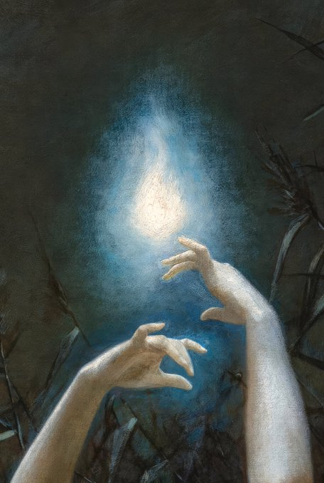](https://en.wikipedia.org/wiki/Leo_Lerch "Will-o’-the-Wisp (detail), 1888 - Lev Lerch") 

No se puede usar para iluminar una zona, ya que los destellos no duran ni segundos, pero un schahriar avispado puede usarlo para hacer señales.

### Montura yinn

_Poder:_ Invocar montura

> Al cabo de cierto tiempo, el magrebí preguntó a Juder: "¿Sabes ¡oh Juder! el camino que hemos recorrido desde El Cairo hasta aquí?" Juder contestó: "¡Por Alah, que no lo sé!" El otro dijo: "En dos horas hemos recorrido exactamente un trayecto que exige un mes de camino, por lo menos!" Juder preguntó: "¿Y cómo es eso?"  
> El otro dijo: "¡Sabe, oh Juder! que esta mula que montamos es nada menos que una gennia entre los genn. En un día suele recorrer el trayecto de un año de camino; pero hoy va despacio, al paso, para que no te fatigues".\[…\]  
> En cuanto al magrebí, comenzó primero por coger del lomo de la mula el saco, y dijo: "¡Oh, mula, vuélvete al sitio de donde viniste! ¡Y Alah te bendiga!"  
> Y he aquí que de pronto se abrió la tierra y recibió en su seno a la mula para cerrarse sobre ella inmediatamente.
> 
> **Referencia:** Historia de Juder el pescador o el saco encantado (n. 471)

Al recitar las fórmulas mágicas la tierra se abre y aparece una montura y cuando se termina de usar se vuelve a abrir la tierra y se traga la montura.

### Muralla de piedra

_Poder:_ Captura

> y una vez que estuvieron en el patio del palacio, trazó un círculo mágico en la arena alrededor del burro; y al punto alzóse en torno a él una muralla que le encerraba en un recinto muy estrecho, del que no podía escaparse.
> 
> **Referencia:** Historia de los artificios de Dalila la taimada y de su hija Zeinab la embustera con Ahmad-la-Tiña, Hassan-la-Peste y Alí Azogue (n. 462)

Lanzando una piedra u otro material de construcción a tu objetivo, se crea alrededor de él un muro que lo inmoviliza. Este muro no da ningún tipo de protección o cobertura al que se encuentra dentro de la estructura.

\sp

### Pedorrera

_Poder:_ Chorro

> Así es que, alzando la pierna, le soltó en pleno rostro una pedorrera que duró una hora de tiempo y que envenenaría a todos los seres animados en cuatro parasangas a la redonda. Y solo gracias a la virtud que tenían las armas de que era portador, pudo Diamante escapar de aquel soplo infernal.
> 
> **Referencia:** Historia espléndida del príncipe Diamante (n. 913)

Apuntas con tu culo a tus objetivos y puedes lanzar un poderoso ventosidad hacia ellos. Es una mezcla de veneno y ácido que provoca daños en tus enemigos, pero sobre todo humilla muchísimo.

### Ojos de serpiente

_Poder:_ Marioneta

> Badrú’l-Budur estaba embaucada por los ojos de la vieja santa, unos ojos profundos y de color cambiante que le hacían obedecer las órdenes de la jeiquesa por perversos y antinaturales que pudieran parecer a una persona auténticamente creyente.

Los ojos del brujo o bruja toman la forma de los de una serpiente y sus víctimas no puede dejar de mirarlos.

### Plantas sanadoras

_Poder:_ Curación

> Y el muchacho fue en busca de la joven por entre los árboles, llevando en su mano izquierda su brazo derecho cortado. Y la libertó. Y ella le dijo: "Aquí tiene tres hojas de una planta que he encontrado, \[…\] Aplícatelas en los muñones de tu brazo, y sanará". Y así lo hizo el muchacho. Y se le quedó el brazo como estaba antes.
> 
> **Referencia:** Historia contada por el duodécimo capitán de policía (n. 953)

Con una serie de extractos de plantas se pueden obrar milagros médicos que van desde sanar simples rasguños a regenerar miembros perdidos. Las cantidades y proporciones de las plantas deben ser muy precisas o podrían tener el efecto contrario.

### Pelo de gigante

_Poder:_ Gigantismo

> Aquello, sabe el creador, era una tarea que solo un gigante entre gigantes sería capaz de hacer. Así que desató su atillo de cuero de camello y cogió uno de los pelos de gigante y se ató a su barba. Inmediatamente empezó a crecer y crecer y crecer hasta golpear con el techo de la sala.  
> Ahora podría retirar la pesada losa que cerraba la salida con la facilidad que un adamita retira una cortina.

\sp

[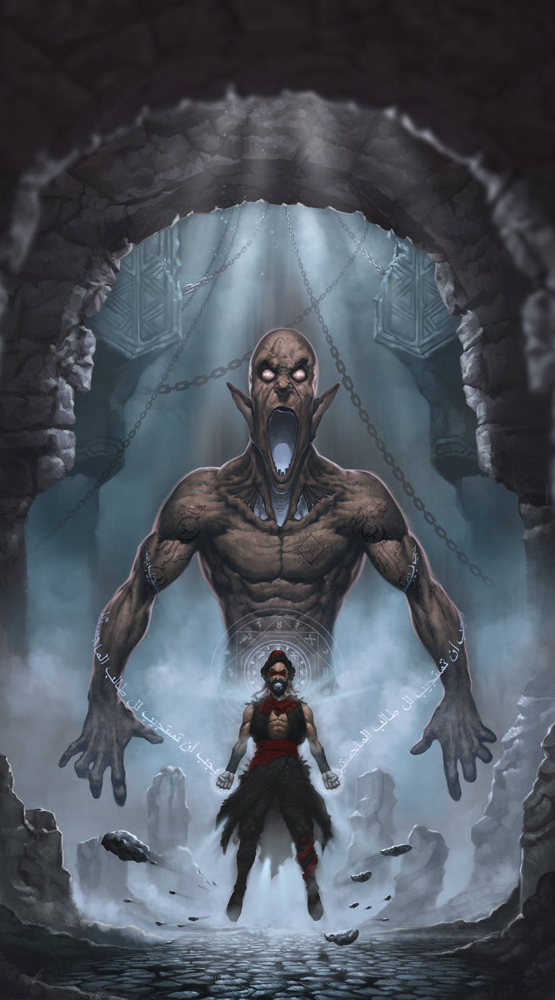](https://www.deviantart.com/muratcalis/art/Summoning-is-Complete-601771717 "Summoning is Complete by MuratCALIS") 

Los pelos de gigante tienen muchos usos como cuerdas o componentes mágicos, pero colocándolo como si fuera una barba o un bigote te permite convertirte en uno de ellos.

### Pelucas y postizos

_Poder:_ Disfraz

> "¡Oh amos míos! ¡Loores a Alah, que ha armado el brazo de una débil muchacha para vengaros del jefe de vuestros enemigos! ¡Ved si este muerto no es el mercader de aceite, el propio capitán de los ladrones con sus mismos ojos, el hombre que no quería probar la sal sagrada de la hospitalidad!" Y así diciendo, despojó de su manto el cuerpo yacente, e hizo ver bajo su larga barba y el disfraz con que se había embozado para la circunstancia al enemigo que juró destruirles.
> 
> **Referencia:** Historia de Alí Babá y los cuarenta ladrones (n. 859)

Cambiando de alguna forma tu pelo o vello, cortando tu barba o recortando el flequillo o añadiendo una barba postiza o una peluca, consigues cambiar de apariencia. Es necesario que el cambio tenga relación con el disfraz, pero de una forma muy general. Por ejemplo, afeitarse para ser más joven o ponerse una barba para ser más viejo. Si a tu mesa le resulta un problema por inseguridades físicas u otros temas, déjalo solo en cualquier cambio capilar, sea el que sea.

### Mecer

_Poder:_ Sueño

> Y Sett Budur le puso la cabeza en la curva de sus brazos, se la apoyó contra el pecho, y a media voz le cantó versos de un ritmo tan propio para mecer, que la joven durmióse a poco con una sonrisa de dicha en los labios.
> 
> **Referencia:** Historia de Kamaralzaman y la princesa Budur, la luna más bella entre todas las lunas (n. 210)

\sp

Cantando una sencilla canción de tono relajante, la víctima del hechizo cae dormida.

### Torbellino

_Poder:_ Vuelo

> Apenas había transcurrido una hora del día, cuando el mar empezó a agitarse. De pronto brotó de él una negra columna de humo, que llegó hasta el cielo y se dirigió después hacia la pradera. \[…\] Y he aquí que la columna de humo se convirtió en un efrit de elevada estatura, poderoso de hombros y robusto de pecho.
> 
> **Referencia:** Historia del rey Schahriar y su hermano el rey Schahzaman

Tus piernas se convierten en un remolino de viento que te permite volar, al igual que hacen los yinns. Otras opciones similares podrían ser un torbellino de agua o incluso algún tipo de nube tormentosa.

### Tú eres lo que comes

_Poder:_ Cambiar de forma

> Pero inmediatamente la cabeza del león se transformó en un escorpión horrible, que se arrastraba hacia el talón de la joven para morderla, y la princesa se convirtió en seguida en una serpiente enorme, que se precipitó sobre el maldito escorpión, imagen del efrit, y ambos trabaron descomunal batalla. De pronto, el escorpión se convirtió en un buitre y la serpiente en un águila, que se cernió sobre el buitre, y ya iba a alcanzarlo, después de una hora de persecución, cuando el buitre se transformó en un enorme gato negro, y la princesa en lobo.
> 
> **Referencia:** Historia del segundo saaluk (n. 14)

Consumiendo una pequeña parte del animal en el que se desea convertirse, puedes convertirte en el animal que desees. Puede ser desde pelos a plumas al propio animal entero si queremos convertirnos, por ejemplo, en moscas.

### Visto y no visto

_Poder:_ Invisibilidad

> Los extraños que habitan aquellas ruinas reptaban hacia ella, dejando surcos en la arena que el desierto, el viento y el tiempo habían acumulado dentro de la sala. Nahid sacó su capa y la lanzó delante suyo y cuando esta cayó al suelo había desaparecido para asombro de los reptadores.

La persona que lanza este hechizo debe, por lo menos, parcialmente ocultarse a la vista de sus objetivos, por ejemplo, tapándose con una capa, ocultándose detrás de una columna, etc.

\sp

\sinc

[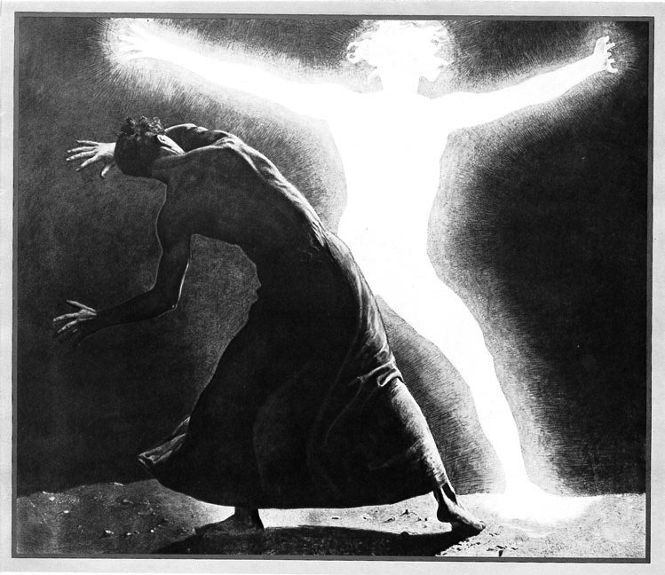](https://es.wikipedia.org/wiki/Sascha_Schneider#/media/Archivo:Sascha_Schneider_-_Der_Chodem.jpg "Sascha Schneider - Der Chodem") 

## Maldiciones

\conc

Las maldiciones son algo común en los relatos de las 1001 Noches y en los del escritor de Providence. Las hay desde muy clásicas como transformar a la víctima en animal o en piedra como o extrañas y bizarras como lepra, llagas supurantes, ceguera o hambre de carne o sangre humana.

Las maldiciones son hechizos que se lanzan buscando hacer daño físico y emocional al objetivo y sus seres queridos y amistades cercanas. Pero lo que lo convierte en maldición es su carácter permanente y que haya algún tipo de acción, objeto, ritual o contra-hechizo que la rompa.

No cualquier hechizo puede hacerse permanente y convertirse en maldición. Cómo hemos dicho, tiene que tener un componente maligno y dañino.

\sp

Mejorar un atributo y hacerlo permanente no es una maldición, no tiene una intención maligna. Hacer que te conviertas en asno para que tu pareja te use para arar sus campos y te castigue dando fustazos sin saber que está castigando a su querida pareja.

> Conviene recalcar que las maldiciones deberían ser hechizos que solo deberían tener le gente malvada de tus relatos que usarán para atormentar a tus schahriars. No es un conocimiento que deberían tener los propios schahriars para usarlos indiscriminadamente, como mucho deberían usarlo para quitar esa maldición o en casos de extrema necesidad.

Las maldiciones son hechizos que deben ser aprendidos como el resto de hechizos, pero que tienen la característica que son permanentes hasta que se cumpla una condición o alguna persona que conozca la maldición decida quitarla.

Las maldiciones son terribles hechizos que solo se pueden aprender de grimorios especiales, grimorios que estén malditos. Maldito es una característica que pueden tener algunos grimorios.

### Lanzar maldiciones

El lanzamiento de una maldición empieza con el lanzamiento del hechizo de un normal, siguiendo las instrucciones del poder del manual básico, pero con los siguientes cambios.

* Las maldiciones solo pueden usarse contra comodines y no importa su tamaño, pero exige un PP por cada dos niveles superior. Podrías petrificar un Falak (tamaño 30)con un coste de 24 PP (10 + 14 del tamaño).
* Un practicante de magia solo puede lanzar una vez una maldición a una víctima en concreto y no puede hacerse en un combate o en situaciones no estresantes como escapar de un incendio o escalar un acantilado. Normalmente se debería lanzar a objetivos indefensos derrotados, por ejemplo, meter en una botella a una poderosa hechicera serpigente tras derrotarla y lanzar el recipiente al mar.
* Para lanzar una maldición es necesario que las personas implicadas, el lanzador de la maldición y el maldecido, estén el mismo espacio, ya que se necesita una interacción física entre ellas. Por ejemplo, es muy normal en las maldiciones de transformaciones en animal que se lance agua al objetivo de la maldición.

\sp

* Lanzar una maldición es una tirada enfrentada entre Saber de Suleimán y el atributo especificado en cada maldición.
* Lanzar una maldición gasta tantos PP como marca cada maldición. Además, una maldición exitosa consume un PP del lanzador de forma permanente que no recupera hasta que la maldición sea revertida.
* Si el hechizo sale correctamente, tanto la persona que lanza el hechizo como la que lo recibe tendrán que pasar una TPC igual a la tirada de Saber de Suleimán que se hizo al lanzar la maldición. Una maldición afecta tanto a la cordura del mago o maga como de la víctima. Y cuanto mayor sea el efecto, más difícil será evitar sus efectos en la cordura.
* El efecto es permanente en la víctima hasta que otra persona que conozca la maldición la revierta o hasta que se cumpla una condición bastante difícil de cumplir. Pueden ser condiciones como leer un pasaje de algún grimorio perdido, alguna extraña conjunción astral, alguna improbable situación como que llueva sangre o conseguir algún objeto mágico. En cada maldición hay ejemplos de condiciones que puedes usar y la condición debe ser aprobada por Scheherazade.

#### Revertir una maldición

Para deshacer una maldición hay dos opciones, cumplir la condición para romperla o lanzar una contra-maldición.

Para lanzar una contra-maldición hay que lanzar la misma maldición con las mismas condiciones (PP, modificaciones, etc.) e igualar o superar la tirada que saco el maldecidor al lanzarla. Si se consigue la tirada, la maldición se rompe. Hay que tener en cuenta que no hay TPCs ni se consume un PP permanentemente.

La opción de deshacer una maldición cumpliendo una condición queda a discreción de Scheherazade y normalmente cumplir esa condición es una buena semilla de relato.

#### Modificadores

**Seguidores y súbditos (+2):** Las maldiciones pueden afectar a los seguidores y súbditos de la víctima no comodines. Es decir, que una maldición de sueño puede afectar al Califa y a todos sus súbditos, sumiendo a Bagdad en un sueño eterno. 

\sp

Los seguidores y súbditos caen víctimas de la maldición automáticamente, a no ser que estén en situaciones estresantes como combates en cuyo caso tienen derecho a tirada opuesta.

### Maldiciones más conocidas

En este listado tendrás una mezcla de maldiciones de las 1001 Noches con un toque de locura. Esperamos que sean dignas del autor de Providence y sus relatos.

#### Invidencia

* **Resistencia:** VIG
* **Puntos de poder:** 6

> Entonces el derviche se puso muy pálido y su rostro tomó un aire de dureza que no conocía yo en él, y me dijo: "Te vuelves ciego con tus propias manos". Y tomó un poco de pomada y me la aplicó alrededor del ojo derecho y en el párpado derecho. Y ya no vi más que tinieblas con mis dos ojos, y me convertí en el ciego que ves, ¡oh Emir de los Creyentes!
> 
> **Referencia:** Historia del ciego que se hacía abofetear en el puente (n. 876)

La víctima quedará completamente ciega hasta que se retire la maldición. Obtendrá la desventaja ciego (Mayor). Normalmente la condición para retirar la maldición debería ser algún tipo de ungüento para los ojos o algún tipo de objeto con poderes curativos.

#### Encerrar en una botella

* **Resistencia:** ESP
* **Puntos de poder:** 12

Esta maldición es una forma permanente del hechizo Destierro. 

> Al oírle, el efrit intentó salir, pero no pudo, y vio que estaba encarcelado y tenía encima el sello de Suleimán, convenciéndose entonces de que el pescador le había encerrado en un calabozo contra el cual no pueden prevalecer ni los más débiles ni los más fuertes de los efrits. Y comprendiendo que el pescador le llevaría hacia el mar, suplicó: «¡No me lleves! ¡No me lleves!» Y el pescador dijo: «No hay remedio». Entonces, dulcificando su lenguaje, exclamó el efrit: «¡Ah pescador! ¿Qué vas a hacer conmigo?» El otro dijo: «Echarte al mar, que si has estado en él mil ochocientos años, no saldrás esta vez hasta el día del Juicio. ¿No te rogué yo que me dejaras la vida para que Alah la conservase a ti y no me mataras para que Alah no te matase? Obrando infamemente, rechazaste mi plegaria. Por eso Alah te ha puesto en mis manos, y no me remuerde el haberte engañado». Entonces dijo el efrit: «Ábreme el jarrón y te colmaré de beneficios». El pescador respondió: «Mientes, ¡oh maldito! …
> 
> **Referencia:** Historia del pescador y el efrit (n. 4)

La víctima se convierte en humo que se mete en la botella y queda encerrado en una especie de dimensión de bolsillo que simula algún tipo de ambiente o sala con cojines, camas, etc.

\sp

Mientras la víctima esté encerrada, no necesita, ni comer, ni beber, ni respirar y es inmune a la edad, enfermedades, etc. Pero no puede interactuar con la realidad de ninguna manera es como si no existiera.

La condición normalmente es tan sencilla como quitar el tapón de la botella, lo difícil es encontrar la botella porque está en el fondo del mar o en algún lugar mágico y perdido lleno de trampas.

Algún schahriar inteligente podría meter a una persona con una enfermedad terminal en una botella esperando encontrar un remedio y sacarla cuando pueda curarla. Como Scheherazade está en tu mano permitirlo o no.

#### Enfermedad

* **Resistencia:** VIG
* **Puntos de poder:** 6

> «Sabrás, ¡oh, efrit! que, en la antigüedad del tiempo y en lo pasado de la edad, hubo en la ciudad de Fars, en el país de los rumán, un rey llamado Yunán. Era rico y poderoso, señor de ejércitos, dueño de fuerzas considerables y de aliados de todas las especies de hombres. Pero su cuerpo padecía una lepra que desesperaba a los médicos y a los sabios. Ni drogas, ni píldoras, ni pomadas le hacían efecto alguno, y ningún sabio pudo encontrar un eficaz remedio para la espantosa dolencia. Pero cierto día llegó a la capital del rey Yunán un médico anciano, de renombre, llamado Ruyán.
> 
> **Referencia:** Historia del visir del rey Yunán y el médico Ruyán (n. 4)

Hablamos de enfermedades no-mortales, pero visibles y estigmatizadas y que crean problemas para la víctima. Serían cosas como lepra o sarna. El lanzador podrá elegir entre:

* Pierde 2 niveles en 1 o más atributos físicos (mínimo d4) y desventaja Marginado (Mayor)
* Pierde 1 nivel en 1 atributo físico (mínimo d4) y desventaja Marginado (Menor)

Normalmente la condición para retirar la maldición debería ser algún tipo de ungüento o elixir mágico o algún tipo de objeto con poderes curativos. También puede ser que se deshaga de todos sus bienes o que alguien limpie y cure sus llagas desinteresadamente sin que es se lo pida.

#### Hambre no-humana

* **Resistencia:** ESP
* **Puntos de poder:** 6

\sp

> En tanto que caían en aquel estado mis amigos, los hombres desnudos llevaron un tazón lleno de cierta pomada con la que untaron todo el cuerpo a mis compañeros, resultando asombroso el efecto que hubo de producirles en el vientre. Porque vi que se les dilataba poco a poco en todos sentidos hasta quedar más gordos que un pellejo inflado. Y su apetito aumentó proporcionalmente, y continuaron comiendo sin tregua, mientras yo les miraba asustado al ver que no se llenaba su vientre nunca.  
> Por lo que a mí respecta, persistí en no tocar aquellos manjares, y me negué a que me untaran con la pomada al ver el efecto que produjo en mis compañeros. Y en verdad que mi sobriedad fue provechosa, porque averigüé que aquellos hombres desnudos comían carne humana, y empleaban diversos medios para cebar a los hombres que caían entre sus manos y hacer de tal suerte más tierna y más jugosa su carne. En cuanto al rey de estos antropófagos, descubrí que era ogro. Todos los días le servían asado un hombre cebado por aquel método; a los demás no les gustaba el asado y comían la carne humana al natural, sin ningún aderezo.
> 
> **Referencia:** La cuarta historia de las historias de Sindbad el marino, que trata del cuarto viaje (n. 302)

Esta maldición no está ligada a ningún poder, ya que no funciona exactamente como un hechizo, sino que cae sobre su víctima de otras formas. Simplemente tiene que darse una condición concreta para que te caiga encima, como que te muerda un ser con sed de sangre o comer carne humana y otra condición que te la quite, como beber determinado elixir o peregrinar a determinado lugar.

No hay gasto de PP ni temporales ni permanente, pero hay una tirada enfrentada de ESP para que la maldición surta efecto y ambos tienen que pasar una TPC d8.

Esta maldición se refleja en un Hábito (Mayor) que obliga al schahriar a consumir carne humana o sangre cada 24 horas. La condición puede ser hacer alguna peregrinación a algún lugar sagrado perdido o conseguir algún tipo de compuesto mágico.

#### Petrificar

* **Resistencia:** VIG
* **Puntos de poder:** 10

> se puso de pie, pronunciando unas palabras misteriosas, y dijo: “Por la virtud de mi magia, que Alah te convierta mitad piedra y mitad hombre". E inmediatamente, señor, quedé como me ves. Y ya no puedo valerme ni hacer un movimiento, de suerte que no estoy ni muerto ni vivo.
> 
> **Referencia:** Historia del joven encantado y de los peces (n. 8)

La víctima de la maldición es convertido en piedra total o parcialmente, de forma que está inmovilizada e indefensa. A discreción del lanzador puede estar consciente de todo lo que pasa y puede comunicarse con el exterior de alguna forma, por ejemplo, pudiendo mover la boca y hablar, mover los ojos, etc. 

\sp

La otra opción es que sean cachos de piedra inertes que ni sienten ni padecen.

Mientras la víctima esté petrificada no necesita, ni comer, ni beber, ni respirar y es inmune a la edad, enfermedades, etc. La piedra tiene la dureza del material que el lanzador eligió desde cristal a mármol o granito.

> »Entonces desembarcamos, pero apenas hubimos entrado en la ciudad, nos quedamos asombradas. Todos los habitantes estaban convertidos en estatuas de piedra negra. Y solo ellos habían sufrido esta petrificación, pues en los zocos y en las tiendas aparecían las mercancías en su estado normal, lo mismo que las cosas de oro y de plata. Al ver aquello llegamos al límite de la admiración, y nos dijimos: “En verdad que la causa de todo esto debe ser rarísima”.  
> »Y nos separamos, para recorrer cada cual a su gusto las calles de la ciudad, y recoger por su cuenta cuanto oro, plata y telas preciosas pudiese llevar consigo.
> 
> **Referencia:** Historia de Zobeida, la mayor de las jóvenes (n. 16)

La petrificación puede tener otras versiones, más bíblicas, como estatuas de sal, o más ciencia ficción, como congelar a la víctima en el tiempo.

#### Sueño eterno

* **Resistencia:** ESP
* **Puntos de poder:** 10

> Bajo un dosel de terciopelo salpicado de gemas y diamantes, en amplio lecho construido con tapices de seda superpuestos, reposaba una joven de tez brillante, de párpados entornados por el sueño tras unas largas pestañas combadas, y cuya belleza realzábase con la calma admirable de sus facciones, con la corona de oro que ceñía su cabellera, con la diadema de pedrerías que constelaba su frente y con el húmedo collar de perlas que acariciaban su dorada piel. A derecha y a izquierda del lecho se hallaban dos esclavos, blanco uno y negro otro, armado cada cual con un alfanje desnudo y una pica de acero. A los pies del lecho había una mesa de mármol, en la que aparecían grabadas las siguientes frases:  
> ¡Soy la virgen Tadnaar, hija del rey de los amalecitas, y esta ciudad es mi ciudad! ¡Puedes llevarte cuanto te plazca a tu deseo, viajero que lograste penetrar hasta aquí! ¡Pero ten cuidado con poner sobre mí una mano violadora, atraído por mis encantos y por la voluptuosidad!
> 
> **Referencia:** Historia prodigiosa de la ciudad de bronce (n. 345)

Una variación de la petrificación es el sueño eterno. En el relato que habla de la Ciudad de Bronce, todos los habitantes de la ciudad están congelados en el tiempo y la hija del rey está dormida en sus aposentos como la bella durmiente.

La víctima de la maldición se sume en un profundo sueño que está inmovilizada e indefensa. Una persona que sepa el hechizo Interpretar sueños podría intentar comunicarse con la víctima y hacerle preguntas.

\sp

Mientras la víctima esté dormida, no necesita, ni comer, ni beber, ni respirar y es inmune a la edad, enfermedades, etc.

Como condiciones podemos hacer que tenga que tomar algún fruto mágico o elixir mágico difícil de conseguir. Quizás pueda ser interesante que pase un número muy grande años y que esa fecha este a punto de cumplirse. Interacciones con el entorno pueden ser divertidas, como que se seque el lago en el que está sumergida la persona maldita o caigan las murallas de la ciudad sumida en un sueño eterno.

_Olvídate de la chorrada del beso de amor verdadero, la gente dormida no da su consentimiento._

#### Transformar en animal

* **Resistencia:** VIG
* **Puntos de poder:** 8

> Pero mi naturaleza real es la de un ser humano, kadí de profesión. Y me transformaron en pollino los enemigos que tengo, que están versados en la hechicería y en los encantamientos. Y como no conozco las ciencias ocultas, me veo privado de recursos y armas contra ellos. Sin embargo, como, a pesar de todo, son creyentes, permiten que de vez en cuando, en los días de sesiones de justicia, recobre mi forma humana, dejando de ser pollino, para ir a dar audiencia en el diwán. ¡Y de tal suerte tengo que vivir, siendo pollino unas veces y kadí otras, hasta que Alah el Altísimo quiera librarme de los encantos de mis enemigos y romper el hechizo que me escribieron!
> 
> **Referencia:** El pollino kadí (n. 801)

La víctima normalmente es transformada en un animal de granja o en aves. No sería muy inteligente convertir a tu enemigo en un tigre o un elefante, pero puedes transformarlo también en animales malditos como hienas, serpientes o cocodrilos o incluso "animales" de los Mitos, siempre que no sean 2 niveles más grandes que la víctima.

La trasformación sigue las reglas del poder "Cambio de forma" y puede elegir si la persona maldita puede hablar o no.

> La hija de mi tío, o sea esta gacela, estaba iniciada desde su infancia en la brujería y el arte de los encantamientos. Con la ciencia de su magia transformó a mi hijo en ternerillo, y a su madre, la esclava, en una vaca, y los entregó al mayoral de nuestro ganado.
> 
> **Referencia:** Cuento del primer Jeque (n. 1)

Las condiciones pueden ser variadas según el animal, por ejemplo, un animal de granja puede quitarse la maldición si rastrilla las tierras del emir en un día o si consigue que crezca hierba en el desierto y aves podría darles algún fruto mágico o bañarse en aguas de algún lago o cascada mágica.

\sp

\sinc

[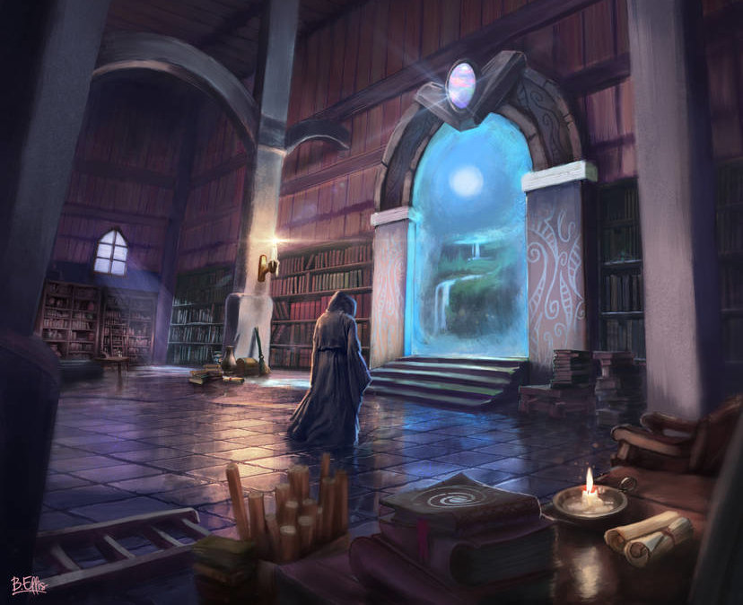](https://www.deviantart.com/brandon-ellis/art/Portal-Room-808922864 "Portal Room by Brandon-Ellis") 

## Grimorios y libros de hechizos

> Y sacó del bolsillo un libro antiguo, en el cual había trazados al revés caracteres desconocidos, semejantes a patas de hormigas, y se puso a leer en voz alta ante la montaña, moviendo la cabeza, unos versículos en lengua incomprensible. Y al punto, girando sobre sí misma por ambos lados a la vez, se separó en dos partes la montaña, dejando junto al suelo un espacio lo bastante ancho para permitir pasar a un solo hombre.
> 
> **Referencia:** Historia maravillosa del espejo de las vírgenes (n. 723)

\conc

\sp

El libro de hechizos o grimorio mágico es un elemento fundamental que necesita toda aquella persona que practique la magia. Su estudio permite aprender nuevos hechizos y mejorar tus capacidades mágicas, aumentando tu control sobre las energías mágicas y el poder de tus hechizos y maldiciones.

[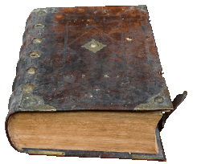](https://pixabay.com/es/photos/un-libro-leer-literatura-viejo-1740515/ "Un Libro Leer Literatura por garten-gg") 

El grimorio es algo muy importante para su propietario. Nunca viajas sin él, nunca lo prestas, lo mantienes cuidado y protegido y lo tienes siempre a buen recaudo. Sin tener acceso a un grimorio, la única forma de acceder a poderes mágicos y mejorarlos es a través de una mentora o un mentor, pero será él el que paute qué hechizos aprendes o qué aspectos de tu magia mejoras y no podrá enseñarte algo que no sepas.

Los grimorios normalmente no se venden, no de manos de una persona con poderes mágicos. Son demasiado preciados para ellas. Podrías comprarlo a algún buhonero o a alguien que los ha recibido en una herencia y desconoce su valor real.

Todos los grimorios tiene un nivel de poder que representa el conocimiento que se puede aprender, el número de hechizos que se pueden aprender de él y la cantidad de poder mágico (PP) que se puede conseguir siguiendo sus enseñanzas.

Un libro de magia con un nivel de poder 4 permite gastar 4 avances en ventajas mágicas como Puntos de poder o Nuevos poderes. Adquirir otras ventajas de tipo mágico quedan a descripción de Scheherazade si gastan o no niveles de poder. También podemos gastar niveles de poder en subir nuestra habilidad de Saber de Suleimán.

Además de nivel de poder, todos los libros de magia tienen un idioma que se debe dominar mínimamente (d6 o más) para poder leerlo.

\sp

### Leer un grimorio

Leer un libro de hechizos exige mínimo de una semana ininterrumpida dedicándole por lo menos 8 horas diarias. Es decir, que puedes dormir 8 horas, estudiar 8 horas y dedicarte a tus quehaceres durante 8 horas.

Por ejemplo, podrías estudiar mientras viajas de pasajero en un barco, pero no si trabajas de aguador en el zoco. 8 h dormir + 8 h de trabajar + 4 horas de comer, hacer recados, etc. no deja tiempo a estudiar.

Se puede dedicar 4 horas diarias, pero entonces tendrá que ser 2 semanas sin interrupción. Si se interrumpe el estudio se exigen el doble de semanas de las normales.

Leer un manuscrito mágico exige una tirada de TPC igual al NP que le queda para el lector, redondeando hacia abajo. La primera vez que se lee un grimorio de NP 8, la TPC será d8, la siguiente vez el nivel de poder es 7 y la TPC será de d6, la siguiente NP 6 y TPC d6, etc. Así hasta un mínimo de TPC d4.

### Compartir o intercambiar grimorios

Aunque no es muy normal, puedes compartir tu grimorio con más practicantes de magia. El trato al que se llegue a la hora de compartir o intercambiar grimorios es cosa tuya. La cuestión es que al compartir solo una persona podrá usarlo para mejorar sus habilidades durante el avance actual.

Los libros, si te dan acceso, pueden copiarse. Su magia no está en el libro en sí, sino en el conocimiento que encierran sus palabras, así que una buena copia es tiene tanto poder como el original.

Si la copia es mala o se hace rápidamente, podrías quitarle niveles de poder. Es un proceso tan largo que debería hacerse entre partidas y, como siempre, exige conocer el idioma del libro para poder copiarlo.

\sp

### Vender y comprar grimorios

Los libros son artículos de lujo, solo al alcance de la gente más rica y de las personas de más alto rango social. Y los grimorios mágicos son todavía más exclusivos. Es por ello que comprar y vender un manuscrito mágico debería ser casi el tema principal de un cuento salvaje.

Para poderse hacer una idea, el precio de un grimorio rondaría los 10.000 dinares por nivel de poder. Pero este es un valor orientativo, y puedes subirlo o bajarlo según te interese. En una subasta el precio podría ascender a 20.000 por NP y seguramente que un avaro prestamista lo tasaría en como mucho 5.000 dinares el NP.

### Modificaciones de los grimorios

Hay cosas que pueden modificar el nivel de poder del grimorio:

* **Edición original:** El grimorio está tal y como lo escribió su autor o autora original.
* **Traducción:** La traducción a otro idioma diferente del original supone un nivel menos de poder. La traducción de una traducción serían dos niveles menos y así sucesivamente.
* **Incompleto:** A discreción de Scheherazade puede juzgar que un grimorio al estar incompleto tiene menos niveles que su versión completa.
* **Anotado:** Puede estar anotado por anteriores practicantes de magia y añadirle un nivel extra de poder.
* **Dañado:** Tiene daños por agua, fuego, tiempo, etc. lo que supone que tiene la mitad del nivel de poder de su versión normal (redondeando hacia abajo).
* **Muy dañado:** Tiene graves daños por agua, fuego, tiempo, etc. lo que supone que tiene solo un tercio del nivel de poder de su versión normal (redondeando hacia abajo).
* **Maldito:** Pueden aprenderse maldiciones, no solo hechizos normales.

### Listado de libros y grimorios malditos

Crear un grimorio mágico es bastante fácil, solo necesitas, un título atractivo, una descripción interesante, un nivel de poder y el idioma en que fue escrito.

\sp

Es interesante que le metas alguna regla que lo haga especial, como que puede encontrarse en varios tomos o que solo puede ofrecer hechizos con ornamentos de fuego.

Te ofrecemos un listado con grimorios mágicos reales o inventados tanto de las 1001 Noches como de los Mitos de Cthulhu que cuadren en la época de esta ambientación.

#### Anales de los Antiguos (NP 8, Maldito)

> El más importante de aquellos manuscritos era un libro titulado Anales de los Antiguos, verdaderamente inestimable de precio y de valor, que ni siquiera podría pagarse con su peso en pedrerías. Porque en él se encontraban indicaciones precisas acerca de la solución de los enigmas y los signos misteriosos. Y en aquel manuscrito precisamente había agotado nuestro padre toda la ciencia que poseía.
> 
> **Referencia:** Historia de Juder el pescador o el saco encantado (n. 469)

**Idioma:** Árabe

Este tratado de matemáticas y criptografía de autor desconocido deriva poco en sus páginas en diferentes símbolos matemático-arcanos que permiten realizar prodigios mágicos e invocaciones de diversas entidades.

Entre sus hojas se encuentra la ubicación de la Ciudad sin nombre y como poder llegar a sus ruinas.

#### I ching (NP 4)

**Idioma:** Chino

Es un libro oracular chino cuyos primeros textos se suponen escritos hacia el 1200 a. C. Los astrólogos y adivinos chinos lo usaban como guía para hacer predicciones, pero si sabes interpretar sus metáforas y sus fábulas tienes un interesante grimorio mágico del que sacar poderosos hechizos.

#### Liber Ivonis - Libro de Eibon (NP 10, Maldito)

**Idioma:** Latín

El libro describe la vida de Eibon, un hechicero y nigromante hiperbóreo, así como varios hechizos, conjuros e invocaciones.

\sp

El libro original está escrito en el lenguaje hiperbóreo pictográfico conocido como tsath-yo. Pero se han hecho traducciones al latín y griego jónico.

#### Pnakotica - Manuscritos Pnakóticos (NP 10)

**Idioma:** Griego clásico

Pnakotica es la traducción al griego de los Manuscritos Pnakóticos, un grimorio escrito por la gran raza de los abu-qith antes de la aparición del hombre.

Contiene mucha información acerca de estos yinns, así como de otras muchas materias taumatúrgicas, incluyendo descripciones de dioses exteriores, primigenios y lugares míticos y como llegar a ellos.

#### Séfer HaRazim - El libro de los secretos (NP 8)

**Idioma:** Hebreo

El libro de los secretos es un texto mágico presuntamente entregado a Noé por el ángel Raziel, y transmitido a lo largo de la historia bíblica a al gran Rey Suleimán, para quien fue una gran fuente de su sabiduría, y supuestos poderes mágicos.

[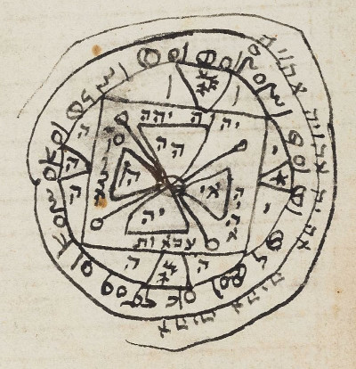](https://es.wikipedia.org/wiki/S%C3%A9fer_HaRazim#/media/Archivo:Sefer_HaRazim_(page_3_crop).jpg "Sefer HaRazim (page 3 crop)") 

El libro está dividido en siete secciones más un prefacio. Cada una de las secciones corresponde a un cielo, y contiene una lista de ángeles, e instrucciones para realizar uno o más ritos mágicos.

Puede encontrarse en un único tomo con NP 8 o en tomos separados con NP 1 por sección que contenga.

#### Kitab an-nawamis - Libro de las leyes (NP 6)

**Idioma:** Árabe, griego clásico

Kitab an-nawamis es la traducción al árabe, atribuida a Hunayn ibn Ishaq de un texto helenístico que habría escrito Platón, el Liber Aneguemis.

\sp

Este libro se divide en dos partes: el libro mayor y el libro menor. El libro mayor trata de recetas para adquirir poderes (invisibilidad, adivinación, dominio de los fenómenos naturales, transformación, entre otros) y para la creación artificial de entidades vivientes híbridas, todo a partir de sustancias que incluyen preparados minerales, fluidos orgánicos (como el esperma y la sangre) y restos corporales de hombres y animales, empleándose, además, envases de vidrio y de metal dentro de un laboratorio mágico.

El libro menor, por su parte, trata sobre el asunto de las ilusiones ópticas y la creación de artefactos para lograrlo.

#### Séfer Raziel HaMalaj - El Libro del Arcángel Raziel (NP 10)

**Idioma:** Hebreo, árabe

Está escrita por el Patriarca Adán, al dictado del arcángel Raziel, de ahí su nombre. Esto lo haría la obra más antigua de la Humanidad, que no de la Tierra, ya que tenemos libros más antiguos escritos por yinns anteriores a los hombres.

[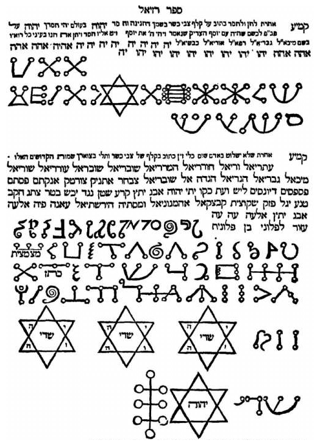](https://es.wikipedia.org/wiki/S%C3%A9fer_Raziel_HaMalaj#/media/Archivo:Sefer_raziel_segulot.png "Sample page of Sefer Raziel HaMalakh, a medieval work of Jewish mysticism.") 

El libro contiene las enseñanzas del arcángel Raziel a Adán y a Abraham explicando las leyes de la Creación. Se divide en cinco libros que tratan sobre la angelología, los Nombres divinos, la gematría, la astronomía y la construcción.

Puede encontrarse en un único tomo con NP 10 o en tomos separados con NP 2 por cada libro (angelología, nombres, geometría, …).

\sp

#### Historia de las Aventuras de Hassan Al-Bassri (NP 4)

**Idioma:** Árabe

> Y de improviso, en medio de las lamentaciones, hizo su entrada el mameluco Mobarak, blandiendo el manuscrito, y se acercó a su amo, y después de besarle la mano, le entregó las hojas preciosas, la primera de las cuales ostentaba en letras grandes el título: Historia de las Aventuras de Hassan Al-Bassri.
> 
> **Referencia:** Las aventuras de Hassan Al-Bassri (n. 578)

Hassan Al-Bassri o Hassan de Basora fue un antiguo predicador, asceta, teólogo, erudito, juez y místico. Todos sus aventuras y anécdotas fueron recopiladas en diferentes tomos por diferentes autores y en mucho de ellos se puede extraer enseñanzas mágicas.

Dentro de los grimorios mágicos puede ser el más popular y fácil de encontrar.

#### El Libro de Dzyan (NP 10, Maldito)

**Idioma:** Chino

> Aprendí del Libro de Dzyan, cuyos primeros seis capítulos se remontan antes de que el gran creador diese forma a la Tierra y que era antiguo cuando los señores del Lucero del Alba vinieron a través del éter en sus naves voladoras para civilizar nuestro planeta.

Este libro, totalmente hereje para casi todas las fes, trata, entre otras cosas, sobre los orígenes de la humanidad en los continentes perdidos de Hiperbórea, Lemuria y la Atlántida.

Solo el visir Giafar posee una copia de este libro en su idioma original, el senzar, una de las lenguas habladas en la Atlántida.

\sp

\sinc

[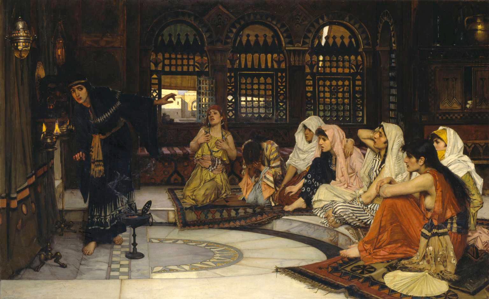](https://es.wikipedia.org/wiki/Consultando_al_or%C3%A1culo#/media/Archivo:John_William_Waterhouse_-_Consulting_the_Oracle_-_Tate_Britain.jpg "John William Waterhouse - Consulting the Oracle") 

\conc

### Enseñar magia

Alternativamente a la lectura de grimorios mágicos, se puede aprender magia de otras personas que tengan conocimientos mágicos. Pero mientras el conocimiento que aporta un grimorio es muy extenso, el del mentor o mentora está más limitado.

Solo podemos aprender los poderes que esa persona sepa y solo podemos comprar las ventajas que conozca. Si tiene cogida la ventaja Puntos de poder 2 veces, solo podremos aprender de esa persona 2 veces Puntos de poder. Tampoco podremos aprender hechizos desconocidos para esa persona.

Aprender de un maestro exige el mismo tiempo que leer el libro, pero en este caso maestre y aprendiz tendrán que poder destinar ese tiempo a enseñar y aprender secretos mágicos.