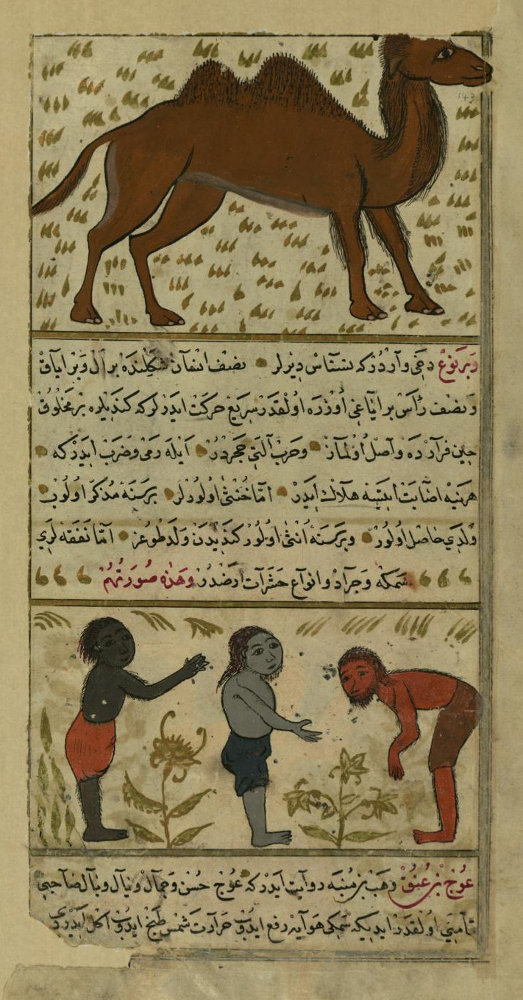
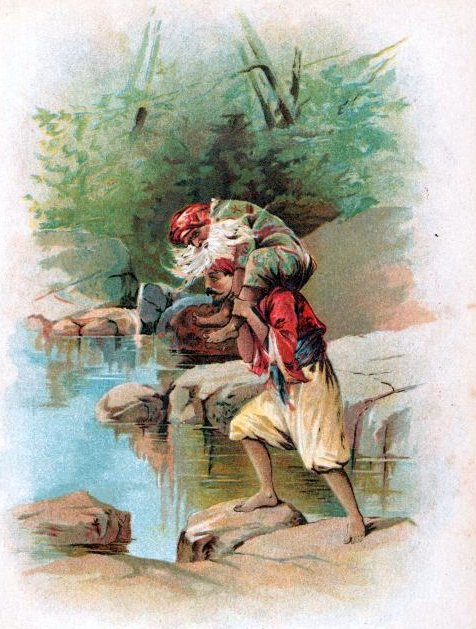
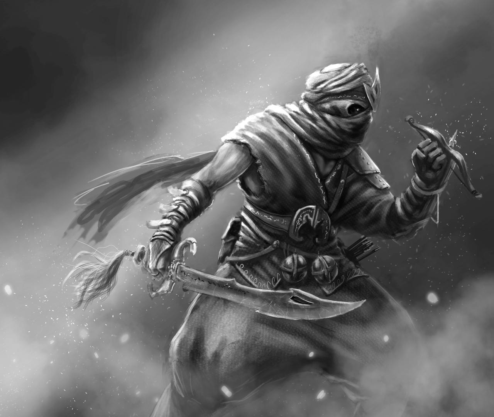
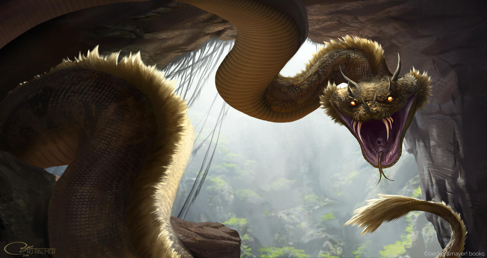

# Seres y monstruos de las tenebrosas 1001 Noches


En este bestiario encontrarás todas las criaturas que Abdul Alhazred describió en sus 1001 Noches. Desde pequeños Ghūles hasta gigantescos Falaks con capacidad de devorar el mundo.

```
Recuerda que los seres con el símbolo ☾ son considerados comodines.
```

\sinc

&nbsp;

## Yinns

\conc

> Mientras andaba de este modo vio una gran polvareda de la que salía un estrépito que se hizo ensordecedor como el trueno, y oyó chocar lanzas y espadas detrás de ella, y un tumulto producido por galopes y gritos que nada tenían de humano; y de repente vislumbró que de entre el polvo disipado salía un ejército entero de efrits, de genn, de mareds, de ghūls, de khotrobs, de saals, de baharis, en una palabra, de todas las especies de espíritus del aire, del mar, de la tierra, de los bosques, de las aguas y del desierto.
> 
> **Referencia:** Historia de Belukia (n. 361)

Los Yinns, según la tradición islámica, es la tercera raza de seres que creo Alá. Los creo con su fuego sin humo y habitan el mundo físico como los humanos. Hay varias clases distintas, cada una con sus habilidades y poderes. Tenemos desde los ghūles que son pequeños carroñeros y necrófagos a mareds que es lo más parecido a la visión occidental que tenemos de los genios.

Pero como ya hemos visto, según Abdul Alhazred los cuentos y leyendas se equivocan, los Yinns provienen de más allá de las estrellas y luchan entre ellos y conspiran contra la humanidad por el control de la Tierra.

Como ya hemos dicho, tienen libre albedrío, con lo que pueden ser buenos y malos, pero normalmente cada tipo suele tener un carácter ya marcado que hace que sean buenos o malos. Al tener libre albedrío, los teólogos consideran que puede ser o no creyentes. Los Yinns no creyentes son llamados cheitáns, que podríamos traducir por demonios.

La verdad es que, quitando a los ghūles que están muy cerca de la humanidad, el resto de Yinns poco o nada se interesan por las religiones de los humanos. Casi todos ellos rezan a sus propios dioses degenerados y corruptos de más allá de las estrellas.

\sp

### Ghūl (Gul)

> Y he aquí que surgió de entre las tumbas una forma cuya especie no podía yo adivinar aún y que salió al encuentro de mi esposa. Y por el horror de su fisonomía y por su cabeza de hiena carnicera, reconocí una ghūla en aquella forma sepulcral.
> 
> **Referencia:** Historia del joven dueño de la yegua blanca (n. 861-865)

[](https://en.wikipedia.org/wiki/Ghoul#/media/File:Amine_Discovered_with_the_Goule.jpg "Amine Discovered with the Goule, from the story of Sidi Nouman in the One Thousand and One Nights") 

Los ghūles son unos humanoides desgarbados con rasgos de hiena que viven de noche debido a que son altamente fotosensibles. Son necrófagos y, por tanto, se establecen cerca de zona de enterramiento.

Se organizan en pequeños grupos familiares y son muy territoriales. Pueden infectar a los humanos mediante heridas con una enfermedad que convierte a la víctima en un ghūl.

* **Atributos:** Agilidad d8, Astucia d8, Espíritu d8, Fuerza d12, Vigor d8
* **Habilidades:** Pelear d6, Atletismo d12, Notar d6, Sigilo d12
* **Paso:** 6; **Parada:** 5; **Dureza:** 7 (1)
* **Capacidades especiales:**
  * **Armadura +1:** Piel dura.
  * **Garras/Mordisco:** FUE+d6
  * **Infección:** Cualquiera que sufra una herida de un ghūl debe hacer una tirada de Vigor al de una semana. El éxito indica que está bien. El fracaso le otorga un nivel inmediato de fatiga debido a las fiebres. Un fallo crítico indica que el personaje está infectado. El infectado tiene un d6 meses antes de la transformación completa en ghūl (y el personaje se vuelve injugable).
  * **Excavar 4:** Los ghūles pueden excavar en tierra y piedras suelta y reaparecer en el siguiente turno en cualquier sitio a 6 pasos.
  * **Debilidad luz solar:** Sufren un -2 a todas sus tiradas de habilidad a plena luz del día.

\sp

* **Capacidades especiales:**
  * **Visión nocturna:** No sufren penalización por condiciones de iluminación.
  * **Hechizos:** Puedes ponerles hechizos
* **Equipo:** Pueden llevar herramientas toscas y armas simples y ropajes sucios y andrajosos que les cubran del sol.
* **TPC:** 1d4 (manada).

Sobre la infección que producen, quizás puedas encontrar a alguien con los suficientes conocimientos en Mitos que sepa como curarla, pero seguramente le deberás un gran favor. Los propios ghūles podrían darte esa información. Si se supera la infección o se pasa la tirada de Vigor la víctima se vuelve inmune a la infección y la próxima vez ni tendrá el nivel de fatiga.

### Al mighos (Hongos de Yuggoth)

> /p/ «Eran unos bestias imberbes y rosadas de alrededor de 3 codos de altura. Los cuerpos eran de cangrejo, pero con alas de murciélago y varios grupos de patas de insecto acabados en unas terribles pinzas. En el lugar donde el Gran Creador pondría la cabeza había una especie de plato de bronce cubierto por muchísimas antenitas. Si tuviera que describirlo diría que lo más parecido serían las langostas que arrasan las cosechas en verano.»

[](https://en.wikipedia.org/wiki/Mi-Go#/media/File:Migo.jpg "Mi-Go by Khannea") 

Los al mighos tienes aspecto de crustáceos, aunque en realidad son parte animal, parte hongo. Tienen varios pares de extremidades terminadas en pinzas y alas membranosas funcionales. Se comunican mediante patrones de color en sus cabezas o telepatía.

Los al mighos son una tribu de yinns que se dedica a moverse por el espacio e ir conquistando planetas de los que explotan sus recursos minerales. Su asentamiento más cercano a la Tierra se encuentra ahora mismo en Plutón (que no será descubierto hasta 1930).

\sp

Suelen buscarse aliados indígenas en los planetas que quieren conquistar para que les ayuden en sus planes. Adoran a varios dioses primigenios como difundiendo Nyarlathotep y Shub-Niggurath y en sus planes de colonización siempre está difundir el culto a estos primigenios.

Los al mighos son famosos por sus conocimientos en cirugía cerebral que les permite extraer un cerebro de un cuerpo humano y mantenerlo conservados en unos tubos metálicos llenos de líquido llamados cilindros cerebrales. Estos tubos pueden conectarse a diferentes aparatos que le permiten al cerebro, ver, oír, hablar, etc. Esta tecnología les permite a los al mighos llevarse con ellos en sus viajes especiales a los humanos con los mínimos riesgos para los cerebros. También saben como conservar los cuerpos y si es necesario, pueden devolver al cerebro a su cuerpo sin ningún tipo de problema.

Con el material adecuado, un al migho sabio puede extraer el cerebro de un humano y meterlo en un cilindro cerebral en dos horas pasando una tirada de Medicina. El mismo tiempo para el proceso a la inversa. La extracción de un cerebro supone una tirada de TPC d8 al sujeto que sufra la operación siempre que no la haya permitido.

#### Al migho obrero

Los obreros son la mano de obra y la fuerza de combate de los al mighos. Trabajan en las minas extrayendo extraños minerales y defienden sus asentamientos secretos. Son fuertes, ágiles y resistentes.

* **Atributos:** Agilidad d8, Astucia d6, Espíritu d6, Fuerza d8 Vigor d8
* **Habilidades:** Ciencias d6, Disparar d8, Medicina d4, Mitos d6, Notar d8, Pelear d8
* **Paso:** 6; **Parada:** 6; **Dureza:** 8 (2)
* **Ventajas:** Frenesí Mejorado.
* **Capacidades especiales:**
  * **Armadura +2:** Caparazón de crustáceo
  * **Pinzas:** FUE+d4
  * **Volar:** Paso volando 12. Los al mighos tienen unas alas con las que vuelan.
  * **Viaje espacial:** Pueden viajar por el espacio sin sufrir ningún tipo de daño.
  * **Telepatía:** Los al mighos puede comunicarse mediante telepatía entre ellos y con humanos afines.
* **TPC:** 1d6 (manada)

\sp

#### Al migho sabio

Sobre ellos recae todo el desarrollo tecnológico de la tribu. No son tan fuertes y resistentes como los colonos, pero son más inteligentes.

* **Atributos:** Agilidad d6, Astucia d10, Espíritu d8, Fuerza d4, Vigor d6
* **Habilidades:** Ciencias d10, Medicina d10, Mitos d6, Notar d6, Pelear d4
* **Paso:** 6; **Parada:** 4; **Dureza:** 7(2)
* **Capacidades especiales:**
  * **Armadura +2:** Caparazón de crustáceo
  * **Pinzas:** FUE+d4
  * **Volar:** Paso volando 8. Los al mighos tienen unas alas con las que vuelan.
  * **Tecnología Migho:** Puedes asignarle a un sabio hasta 3 aparatos tecnológicos con diferentes funciones que emulen diferentes poderes/hechizos. En partida tienen 8 PP que pueden gastar para hacer funcionar esos 3 aparatos como si fueran hechizos usando Astucia como habilidad de lanzamiento. Recuperan esos 8 puntos en la siguiente escena. Uno de esos aparatos puede ser uno que se injerta en su «garganta» y que les permite comunicarse con los humanos. En ese caso, podrán hablar 1 idioma a d6. Los al mighos pueden usar cualquier poder del manual básico, no tienes las limitaciones de esta ambientación.
  * **Viaje espacial:** Pueden viajar por el espacio sin sufrir ningún tipo de daño.
  * **Telepatía:** Los al mighos puede comunicarse mediante telepatía entre ellos y con humanos afines.
* **TPC:** 1d6

### Abu-qith (Gran raza de Yith)

> /p/ … llegó ante una columna de piedra negra, a la cual estaba encadenado un ser extraño del que no se veía más que medio cuerpo, pues el otro medio aparecía enterrado en el suelo. 
> /p/ Aquella concha cónica con pseudópodos que surgía de la tierra, diríase un engendro monstruoso arrojado allí por la fuerza de las potencias infernales. Era negro y grande como el tronco de una palmera vieja, seca y desprovista de sus palmas. Tenía cuatro enormes tentáculos, dos de las cuales semejaban pinzas de cangrejos. Al final del tercero de forma espantosa se agitaba una especie de cabeza con ojos sin pupilas lanzando iguales resplandores verdes que la mirada de tigres y panteras. En el último tentáculo tenía una caja de hueso con varios tubos a modo de trompa que usaba para hablar.
> /p/ 
> /p/ **Referencia:** Historia de la ciudad de bronce (n. 341)

\sp

[](https://www.deviantart.com/nottsuo/art/Grate-race-of-YITH-retouch2-875186832 "Grate race of YITH by Nottsuo") 

Los abu-qiths es una tribu de yinns que no tiene forma corpórea. Vinieron a la Tierra para escapar de la destrucción de su mundo y se vieron obligados a tomar los cuerpos actuales, una raza de moluscos cónicos mucho más grandes que un humano con 4 pseudópodos en la parte superior, dos acaban en pinzas, otro en unos ojos y otro en una especie de boca.

Se caracterizan por su control del viaje a través del tiempo. De hecho, se les conoce como Gran raza, ya que han sido capaces de controlar los viajes temporales. Cuando te encuentres con un abu-qith debe tener en cuenta que igual estás hablando con alguien de tu pasado o de tu futuro, con todas las implicaciones que tiene eso.

Pueden mandar su mente a través del tiempo y ocupar los cuerpos de seres inteligentes de diferentes épocas. Las mentes de los cuerpos ocupados pasan al cuerpo del abu-qith y este puede usarlo para interactuar con otros abu-qiths. 

Cuando la mente del abu-qith vuelve a su cuerpo, la mente del huésped vuelve a su cuerpo tras ser borrada su memoria.

#### Erudito abu-qith ☾

Los abu-qiths son grandes científicos, como demuestra su capacidad de viajar en el tiempo o sus armas de rayos. El más simple de los abu-qiths está al nivel de grandes nombres de la ciencia como Abulcasis o Mariam Al-Ijliya al-Asturlabi.

* **Atributos:** Agilidad d6, Astucia d10, Espíritu d8, Fuerza d12, Vigor d12
* **Habilidades:** Ciencias d10, Disparar d6, Investigar d10, Mitos de Cthulhu d8, Notar d8, Pelear d6

\sp

* **Paso:** 6; **Parada:** 5; **Dureza:** 17 (4)
* **Capacidades especiales:**
  * **Armadura quitinosa +4:** Como los moluscos, poseen un exoesqueleto quitinoso que les protege de ataques.
  * **Tamaño +5:** Mide entre 3 y 4 metros. Los atacantes añaden +2 a sus tiradas de ataque contra un abu-qith. También tiene 1 herida extra.
  * **Pinzas:** FUE+d6
  * **Telepatía:** Los abu-qiths son capaces de comunicarse con cualquier especie inteligente mentalmente.
  * **Tecnología abu-qith:** Puedes asignarle a un abu-qith hasta 3 aparatos tecnológicos con diferentes funciones que emulen diferentes poderes/hechizos. En partida tienen 8 PP que pueden gastar para hacer funcionar esos 2 aparatos como si fueran hechizos usando Astucia como habilidad de lanzamiento. Recuperan esos 8 puntos en la siguiente escena. Los abu-qiths pueden usar cualquier poder del manual básico, no tienes las limitaciones de esta ambientación.
* **TPC:** 1d8

#### Soldado abu-qith ☾

Los abu-qiths combatieron y derrotaron a un gran enemigo, los warams, y es por ello que puede ser formidables combatientes, sobre todo si disponen de sus temibles armas lanzarrayos.

* **Atributos:** Agilidad d8, Astucia d8, Espíritu d8, Fuerza d12+2, Vigor d12+2
* **Habilidades:** Ciencias d6, Disparar d10, Mitos de Cthulhu d6, Notar d8, Pelear d8, Notar
* **Paso:** 6; **Parada:** 5; **Dureza:** 18 (4)
* **Capacidades especiales:**
  * **Armadura quitinosa +4:** Como los moluscos, poseen un exoesqueleto quitinoso que les protege de ataques.
  * **Tamaño +5:** Mide entre 3 y 4 metros. Los atacantes añaden +2 a sus tiradas de ataque contra un abu-qith. También tiene 1 herida extra.
  * **Pinzas:** FUE+d6
  * **Telepatía:** Los abu-qiths son capaces de comunicarse con cualquier especie inteligente mentalmente.

\sp

* **Capacidades especiales:**
  * **Tecnología abu-qith:** Puedes asignarle a un abu-qith hasta 3 aparatos tecnológicos con diferentes funciones que emulen diferentes poderes/hechizos. En partida tienen 8 PP que pueden gastar para hacer funcionar esos 2 aparatos como si fueran hechizos usando Astucia como habilidad de lanzamiento. Recuperan esos 8 puntos en la siguiente escena. Los abu-qiths pueden usar cualquier poder del manual básico, no tienes las limitaciones de esta ambientación, aunque suelen estar orientados al combate.
* **TPC:** 1d8

```
Su capacidad de viajar en el tiempo no tiene reglas, ya que creemos que es más un recurso narrativo que una habilidad para usar en el juego.
```

#### Lanzador de rayos

Esta arma de rayos, parecida a una cámara de fotos de gran tamaño, posee un gran poder destructivo. Tiene dos grandes asas y al pulsarse los gatillos que hay en cada asa lanza unos rayos que calcinan a su objetivo. Es por ello que se necesitan dos manos para poder usarla.

Al dispararse los rayos de eléctricos generan un terrible zumbido. El rayo de energía que lanza es plenamente visible, mucho más de noche, y usarla en público no es algo que se pueda esconder. Es el terrible ruido que produce esta arma y los rayos que lanza, lo que da fama a los abu-qith de seres terribles y malignos relacionados con el fuego.

|Distancia|Daño|
|---|---|
|50/100/150|2d8|
|PA|2|
|CDF|1|
|Munición|35|
|FUE Min.| — |
|Peso|2|
|Coste| — |

**Notas:** Exige usar las dos manos para disparar. Cauterizante (+2 a sus tiradas de Vigor para evitar el desangramiento). Recarga 1 de munición por minuto, de forma que en 35 minutos tendrías el arma plenamente cargada.

\sp

### Warams (Pólipos volantes) ☾

> /p/ Estos seres eran de constitución amorfa, parte de carne, parte de aire. Pese a que toda su estirpe es ciega, tenían sus otros sentidos muy desarrollados, lo que les hace capaces de moverse en la oscuridad como a plena luz día. Siendo parte aire son capaces de hacerse invisible y convocar vientos que sobre los que pueden cabalgar, pero su naturaleza ventosa hacen que cuando se mueven produzcan el mismo ruido que el siroco del desierto.

[](https://en.wikipedia.org/wiki/File:Flying_Polyp.jpg "Flying Polyp by Dagonweb (Khannea SunTzu)") 

Los warams son una tribu de yinns que tienen forma de pólipos, un gran tronco con gran cantidad de pseudópodos en uno de los extremos. No tienen sentidos como los humanos, de hecho, son ciegos, pero usan sus otros sentidos para poder moverse por la oscuridad sin problemas o sentir a través de las paredes.

Están relacionados con el elemento aire. Así pues, son semi materiales, no son del todo materiales, pero tampoco totalmente incorpóreos. Son lo suficientemente materiales para interactuar con los objetos y los suficientemente incorpóreos para que los vientos los sostengan y para que puedan hacerse invisibles.

Pueden volar, generando vientos debajo de sus cuerpos que hacen un ruido característico, pero pueden arrastrarse si fuera necesario. Tiene cierto control de los vientos, de forma pueden invocarlos a su voluntad.

Durante milenios dominaron la Tierra antes de la aparición de los humanos, pero con los siglos han ido decayendo hasta casi extinguirse. Los pocos que han sobrevivido viven ahora escondidos en cavernas y templos ruinosos.

Se cree que son inteligentes, pero su forma de pensar es tan extraña que muchas de las decisiones que toman parecen no tener sentido.

\sp

* **Atributos:** Agilidad d8, Astucia d8, Espíritu d12, Fuerza d12+6, Vigor d12+2
* **Habilidades:** Mitos d8, Notar d8, Pelear d12
* **Paso:** 4; **Parada:** 8; **Dureza:** 16 (14)
* **Capacidades especiales:**
  * **Armadura +2:** Su gruesa piel les confieren una buena armadura.
  * **Tamaño +5** Los warams son del tamaño de un hipopótamo (+5 dureza, +2 bonificación al atacarla, +1 heridas)
  * **Sentidos extraterrestres:** No tienen sentidos como los humanos, es por ello que no sufren penalizaciones por iluminación o por cobertura (aunque no puedan atacar, si podrán verte). Todas las tiradas de Sigilo sufren un negativo de -4, ya que los humanos no entendemos realmente como perciben y, por tanto, como podemos ocultarnos a sus sentidos.
  * **Volar:** Paso volando 12. Mediante el control de los vientos pueden volar.
  * **Dominio del aire:** Pueden usar este hechizo a voluntad sin necesidad de gastar PP.
  * **Invisibilidad:** Pueden usar este hechizo a voluntad sin necesidad de gastar PP.
  * **Tentáculos:** FUE+d6. Suelen tener entre 10 y 15 tentáculos. Por ronda pueden usar 3 tentáculos para atacar. Cada tentáculo tiene un alcance de dos casillas y son independientes, es decir, no reciben penalizadores, por ejemplo, por acciones múltiples.
* **TPC:** 1d10

Los warams ya son de por sí enemigos temibles, pero pueden ponerles hechizos si quieres aumentar su dificultad. Ten en cuenta que deberían ser hechizos ofensivos como Proyectil o Confusión que tenga un ornamento basado en el aire.

### Janns (Antiguos) ☾

> /p/ … hasta que una noche llegó ante una columna de piedra negra, a la cual estaba encadenado un ser extraño. Aquel, diríase un engendro monstruoso, parecía arrojado allí por la fuerza de las potencias infernales. Parecía una gran tinaja de aceite de cinco lados y 2 metros de alto. Cada lado de su tronco atinajado tenía una especie de alas retráctiles enormes semejantes a murciélagos y varios tentáculos ramificados en más tentáculos que debía usar como manos. En lo que debía ser su cabeza se agitaban de un modo salvaje 5 apéndices y cada apéndice tenía una boca y un par de pseudópodos donde debía tener los ojos. 

\sp

> /p/ \[…\] Igual que en la parte superior, en la parte inferior del tronco habíase cinco tentáculos de gran tamaño acabados en algo parecido a pezuñas de camello que hacían un clic espantoso al golpear el suelo de piedra. \[…\] Al acercarse empezó a hablar en una extraña lengua u parecía una extraña mezcla de sonidos y silbidos de aves.

Según Alhazred, los janns fueron la primera tribu de yinns en aparecer en la tierra. Llegaron miles de siglos antes de que los humanos y en teoría están extintos, pero ya sabemos que no está muerto lo que yace eternamente.

A pesar de que son morfológicamente los yinns más extraños, ya que no se parecen a ningún ser de la naturaleza, eran muy parecidos a los humanos. Ambos tienen una sociedad compleja, con clases sociales, formas de producción avanzadas, donde se cultivaba el arte y la ciencia y en la que sus individuos no solo vivían para sobrevivir, sino que tenían vidas plenas, llenas de todo tipo de relaciones sociales.

Aunque podemos detectar cabeza, cuerpo y extremidades son tan extraños y de tan gran tamaño que los objetos creados por los janns no son utilizables de forma normal por humanos y habría que adaptarlos.

[](https://upload.wikimedia.org/wikipedia/commons/8/8b/Old_One_by_Tom_Ardans.jpg "An Old One. Tom Ardans artwork based on H. P. Lovecraft’s short novel At the Mountains of Madness.") 

El cinco es un número importante entre los janns debido a que su torso de tonel tiene 5 lados, tiene 5 tentáculos, etc. La estrella de 5 puntas es también un símbolo importante para los janns.

* **Atributos:** Agilidad d10, Astucia d10, Espíritu d6, Fuerza d12+3, Vigor d12+2
* **Habilidades:** Atletismo d10, Ciencias d6, Humanidades d6, Pelear d6, Notar d6, Pelear d6, Saber de Suleimán d6, Sigilo d6
* **Paso:** 6; **Parada:** 5; **Dureza:** 12(2)
* **Capacidades especiales:**
  * **Vuelo:** Paso volando 10
  * **Armadura +2:** Su dura piel de aspecto gomoso le protege de los ataques.

\sp

* **Capacidades especiales:**
  * **Tentáculos (2):** FUE+d4. Los tentáculos tienen un alcance de 2 y no sufren penalización por múltiples acciones, ni penalización por mano torpe. Por turno 2 de los 5 tentáculos pueden tomar acciones independientes y sostenidas.
  * **Tamaño +2:** Un ejemplar adulto puede llegar a los 350 kg (+2 a dureza).
  * **Visión nocturna:** Ve sin problemas excepto en oscuridad completa.
  * **Tecnología Jann:** Puedes asignarle a un jann hasta 2 aparatos tecnológicos con diferentes funciones que emulen diferentes poderes/hechizos. En partida tienen 6 PP que pueden gastar para hacer funcionar esos 2 aparatos como si fueran hechizos usando Astucia como habilidad de lanzamiento. Recuperan esos 8 puntos en la siguiente escena. Los janns pueden usar cualquier poder del manual básico, no tienes las limitaciones de esta ambientación.
* **Equipo:** Herramientas y utensilios que use en su trabajo
* **TPC:** d8

Los janns son una sociedad compleja, tan compleja como la humana, con todo tipo de profesiones y dedicaciones; así pues, puede haber janns que se dedican a la medicina o que son artistas o soldados. Es por ello que puedes personalizar las habilidades del jann según su profesión, intereses y estudios. Un jann explorador podría tener Supervivencia, un militar más Pelear y si trabaja en algún taller puede tener Reparar.

Los janns con conocimientos mágicos podrían lanzar hechizos, pero mejor resérvalo para invocaciones o rituales para emular poderes tienen su tecnología que a ojos de los mortales, puede parecer magia.

### Qareen (Lloigor) ☾

Los qareens son yinns hechos de energía e invisibles para los humanos provenientes de Alpheratz (Andrómeda). Tienen una mente malvada y pesimista, carecen de sentimientos y jamás olvidan. Su mente es tan poderosa que afecta a los humanos cercanos, llevándoles a la depresión y atener ideas suicidas.

\sp

Según la tradición, los qareen son gemelos espirituales de cada ser humano. Tratan de corromperlos y llevarlos al mal y al pecado.

De normal, no pueden interactuar en el mundo físico, pero cuando han corrompido a su humano pueden poseerlo.

Sin embargo, las teorías que Alhazred expone en su Necronomicón difieren mucho del relato tradicional. 

Llevan miles de años en la Tierra y vinieron con su caudillo Ghatanothoa, el primogénito de Bahamūt, al que ellos llaman Cthulhu, estableciéndose en un continente ya perdido. 

Cuando Ghatanothoa fue encerrado en un volcán, entraron en decadencia y ahora solo quedan unos pocos qareens en la Tierra.

Son considerados cheitáns, yinns malvados. Además, son tremendamente poderosos y sus mentes llevan poco a poco a la locura a los humanos. Un solo qareen podría llevar al mal y la decadencia a toda una ciudad como Bagdad.

\sc

#### Qareen forma inmaterial

> /p/ Las ideas suicidas hacía semanas que rondaban la cabeza del viejo jeique, no le costaría nada adentrarse solo en el desierto sin agua y sin comida y no volver nunca más. Moriría como un digno hijo del desierto. Pero sabía que esas ideas no eran suyas, venían de lo que habitaba aquel oasis, aquella energía extraña que lo rodeaba todo, que entraba dentro de ti con cada respiración, con cada bocado de los dátiles de las palmeras, con cada sorbo del agua del pequeño pozo.

Los qareens son seres de energía invisibles en forma de vórtice. En este estado suelen coger a individuos marginales y de mente débiles y convertirlos en sus siervos que se encargan de hacer las tareas que ellos no pueden.

* **Atributos:** Agilidad —, Astucia d12+1, Espíritu d12+3, Fuerza —, Vigor —
* **Habilidades:** Saber de Suleimán d12, Notar d10, Sigilo d8
* **Paso:** 6; **Parada:** —; **Dureza:** —
* **Ventajas:** Puntos de poder, Nuevo poder x2
* **Capacidades especiales:**
  * **Incorpóreo:** En su forma incorpórea son totalmente invulnerables contra armas físicas y mágicas. Solo los ataques mentales podrían hacerles daño. También los hace casi invisibles dándoles un -4 a los que quieran detectarlos.

\sp

* **Capacidades especiales:**
  * **Telepatía:** Se comunica con cualquier criatura de forma telepática
  * **Depresión:** Un aura depresiva rodea siempre a un qareen, todos los héroes que pasen una hora en una localización donde hay un qareen y fallen una tirada de Espíritu enfrentada, tendrán que coger como trastorno mental Depresión (mayor).
* **Hechizos:** 30 PP, Vórtice (Explosión), Telekinesis, Marioneta, Drenar magia (Drenaje de puntos de poder)

#### Qareen corpóreo

> /p/ Aquel extraño ser que había aparecido de la nada tenía la forma de un dragón como los que aparecían en el libro del creador. Grande, reptilesco, patilargo y con solo mirarte sentías que pudiera atravesar tu alma como un alfanje atraviesa el pecho de un enemigo de la verdadera fe. Sus grandes garras habían destrozado al protector del califa y ahora reptaba hacia el propio califa.

Aunque los textos sagrados y la tradición dice que los qareen solo son seres espirituales, un qareen puede hacerse corpóreo adoptando la forma de un dragón.

* **Atributos:** Agilidad d8, Astucia d12+1, Espíritu d12+1, Fuerza d12+3, Vigor d12
* **Habilidades:** Mitos d12, Notar d10, Pelear d10, Sigilo d8
* **Paso:** 6; **Parada:** 7; **Dureza:** 19(15)
* **Ventajas:** Puntos de poder, Nuevo poder x2
* **Capacidades especiales:**
  * **Mordisco/Garras:** FUE+d10
  * **Armadura +4:** Su piel dura y escamosa y es muy resistente.
  * **Tamaño enorme (7):** Los qareens como reptiles adultos miden entre 8 y 10 metros de largo y 3 de alto (+7 dureza, +4 bonificación al atacarla, +2 heridas).
  * **Telepatía:** Se comunica con cualquier criatura de forma telepática
  * **Depresión:** Un aura depresiva rodea siempre a un qareen, todo ser que pase una hora en una localización donde haya un qareen y fallen una tirada de Espíritu enfrentada, tendrán que coger como trastorno mental Depresión (mayor). Si fallan la TPC, también tendrán que coger la Depresión como trastorno mental.
* **Hechizos:** 30 PP, Vórtice (Explosión), Telekinesis, Marioneta, Drenar magia (Drenaje de puntos de poder)
* **TPC:** 1d12

\sp

#### Poseído por un qareen

> /p/ Parecía ido. Ni los más delicados manjares, ni las más perfumadas esencias, ni los más sensuales bailes parecían despertar su interés. Como mucho podías sacarle una bobalicona risa, mientras murmuraba cosas sin sentido. 
> /p/ Y de repente se levantaba y desaparecía en las montañas durante de días, volviendo sucio y flaco y más perdido que antes. A veces había sangre en sus andrajos y no siempre era suya.

Un humano poseído por un qareen tiene sus atributos y habilidades normales y una serie de ventajas y desventajas. Aplica la siguiente plantilla al humano que ha caído bajo el influjo de un qareen.

* **Características especiales:**
  * **Cheitán:** Al estar poseído por un cheitán se convierte en un ser malvado y pierde todas las ventajas y desventajas de carácter bondadoso. Dejaría, por ejemplo, de tener las desventajas Heroico o Leal. Les afectarían todos los objetos que afecten a los cheitáns.
  * **Inmune a control mental:** La poderosa mente del qareen ha invadido la mente del poseído y hace nadie más pueda intentar usar poderes mentales sobre el poseído o la poseída.
  * **Foco:** El qareen puede hacer que se enfoque en una tarea olvidando todo lo demás. De esa forma, tiene un +2 a las tiradas de habilidad relacionadas con su foco (lo que el qareen le ha ordenado) y -2 al resto de tiradas.

\sp

\sinc

## Otros seres de las 1001 Noches

\conc

### Abibil (Byakhee)

> /p/ … Una horda de mansos, híbridos seres alados que ningún ojo, ningún cerebro en su sano juicio, ha podido contemplar jamás. No eran águilas, ni hienas, ni búhos, ni hormigas, ni murciélagos, sino una mezcla impía de todos y de ninguno; eran algo que no consigo —a nuestro señor se lo agradezco— recordar. Daban saltos blandos y torpes, impulsándose a medias con sus pies palmeados y a medias con sus alas membranosas. Y cuando llegaron hasta los cuarenta celebrantes, cada uno de los 40 se agarró a ellos, montó a horcajadas, y se alejó volando…

Si bien la tradición oral dice que los abibil son grandes aves rapaces que ayudan a los creyentes a defenderse de los herejes, Alhazred no los consideró unos seres buenos y bondadosos, sino simplemente una raza servidora que sirven a un gran poder.

Son seres voladores, pero no tienen nada que ver con aves. Son de apariencia insectoide con grandes alas membranosas y pies palmeados. Según Alhazred viven en el espacio interestelar donde sobreviven sin problemas. Se pueden mover entre estrellas de forma muy rápida y suelen bajar a diferentes planetas a alimentarse.

Principalmente, se concentran en las Híades cerca de Aldebarán donde está exiliado un ser de tremendo poder al que Alhazred denomino Hastur y que parece ser un enemigo acérrimo de su adorado Bahamūt. Solo aparecen para acompañar a su señor o si son invocados. De hecho, no se conocen colonias estables en la Tierra a diferencia de otros seres voladores con capacidad para viajar por el espacio.

Pueden ser usados como monturas voladoras y si se pueden evitar los peligros del vacío especial, por ejemplo con hidromiel espacial, podría viajarse montado en abibil entre cuerpos celestes.

* **Atributos:** Agilidad d8, Astucia d6, Espíritu d6, Fuerza d8, Vigor d8
* **Habilidades:** Notar d6, Pelear d8, Sigilo d6
* **Paso:** 6; **Parada:** 6; **Dureza:** 8(2)
* **Ventajas:** Frenesí Mejorado, Temple
* **Capacidades especiales:**
  * **Garras:** FUE+d4
  * **Armadura quitinosa:** +2
  * **Tamaño +1:** Hasta 3 metros de tamaño.

\sp

* **Capacidades especiales:**
  * **Mordisco:** FUE+d4. Si el abibil consigue hacer una herida con mordisco es porque ha mordido en una vena y ha chupado sangre. Además del daño, hará un nivel de fatiga.
  * **Volar:** Paso volando 12. En Tierra, a pesar de no moverse a la velocidad de la luz, son tremendamente rápidos.
* **TPC:** 1d6 (manada)

### Ave de Rokh (Shantak) ☾

> … y me acordé de lo que en mi juventud me habían contado viajeros y marineros acerca de un pájaro de tamaño extraordinario, llamado «rokh», que se encontraba en una isla muy remota y que podía levantar un elefante.
> 
> **Referencia:** La segunda historia de las historias de Sindbad el marino, que trata del segundo viaje (n. 295)

Estas gigantescas aves son uno de los seres que con más frecuencia salen en las 1001 Noches. 

A pesar de que la mayoría de la gente los asocia con águilas de tamaño gigantesco, los rokhs se parecen más dinosaurios volares como los pterodáctilos, con la peculiaridad de tener una cabeza que recuerda a las de un caballo.

Como comenta Alhazred, los rokhs son fieles a la entidad Azathoth y pueden viajar por el espacio con un jinete hasta el centro del universo, donde vive esa todopoderosa entidad a la que adoran. Los rokhs provienen de las Tierras del sueño y sus antepasados llegaron a nuestro mundo hace milenios y se establecieron aquí debido a que existían su enemigo principal, los sirvientes alados.

Su zona principal de nidación es en los picos más altos de la cordillera del Cáucaso, entre el Mar Negro y el Mar Caspio, aunque se han encontrado rokhs solitarios en otras latitudes.

* **Atributos:** Agilidad d6, Astucia d6 (A), Espíritu d6, Fuerza d12+4, Vigor d8
* **Habilidades:** Atletismo d6, Pelea d8, Notar d8
* **Paso:** 8; **Parada:** 6; **Dureza:** 15(3)
* **Capacidades especiales:**
  * **Armadura +3:** Su piel escamosa y emplumada le confiere una buena protección.
  * **Garras/Mordisco:** FUE+d8
  * **Volar:** Paso volando 16

\sp

* **Capacidades especiales:**
  * **Tamaño +6:** Tiene el tamaño de un elefante africano (+6 dureza, +2 bonificación al atacarle, +1 herida).
  * **Capacidad de carga:** Pueden volar cargando con sus garras pesos de hasta unas 10 toneladas sin sufrir penalización.
  * **Viaje estelar:** Es inmune a los rigores del espacio exterior.
* **Equipo:** Si ha sido entrenado como cabalgadura, puede llevar una silla de montar en la que podría ir una persona de tamaño normal.
* **TPC:** d8

### Color que cayó del cielo ☾

> /p/ La duna estaba cubierta de aquel extraño color, mezcla del rojo del coral, del amarillo del oro y el púrpura del sol cuando se pone en el Wadi Rum. Y se estaba moviendo y extendiendo gracias al siroco que llevaba soplando desde hace semanas, acercándolo al oasis que infectaría y devoraría y convertiría en parte de él.  
> /p/ Algo tenía que hacer para evitarlo, pero no sabía qué y lo peor es que no podía dejar mirar el color. Ese color era magnífico, como no había visto nunca, ni en los más ricos ropajes de los más ricos emires.

El color es un extraño ser que se cree que no es de la Tierra, sino que viene de las estrellas. Las personas que han podido estudiar un color no se ponen de acuerdo sobre que son, desde magia viva hasta fuego sin humo del que se hizo a los yinns. Pero lo describen como un color que se van extendiendo y que impregna todo, rocas, plantas y hasta animales.

Es una criatura muy básica que vive para sobrevivir y procrear. Cuando cae del cielo en algún tipo de meteorito, se «planta» cerca de donde cae en algún lugar oscuro y cubierto y empieza a extraer la esencia vital de los seres vivos cercanos que se vuelven grises y quebradizos. Según consigue esencia vital, va creciendo en tamaño.

Cuando tiene suficiente tamaño, ponen huevos y los protegen hasta que eclosionan y el nuevo color madura. Entonces el primer color suele volver al espacio. El segundo color se dedica a crecer y procrear. Y así el ciclo se repite ampliando el radio de acción de los colores.

Permanecen inactivos por el día y mientras maduran se esconden en pozos, alcantarillas, cuevas, etc. No son agresivos directamente, los humanos que caen en su influencia se vuelven irracionales y violentos. Para poder combatir al color hay que enfrentarse a los humanos y animales a los que han corrompido.

\sp

* **Atributos:** Agilidad d10, Astucia d8, Espíritu d8, Fuerza d6, Vigor d6
* **Habilidades:** Pelear d6 (solo esquivar), Sigilo d8
* **Paso:** 6; **Parada:** 5; **Dureza:** 5
* **Capacidades especiales:**
  * **Morfología alíen:** No tiene puntos débiles como cabeza, cuello, por lo que los golpes apuntados no consiguen extras.
  * **Crecimiento:** El tamaño del color aumenta según va pasando el tiempo, pasando de una casilla a tener áreas de 20 casillas de cualquier forma. No tienen bonificadores, ni penalizadores por tamaño.
  * **Insustancial/solidificarse:** Un color es insustancial, parece gaseoso, pero no lo es. Es inmune a todo ataque físico. Puede solidificar partes de sí mismo para interactuar con su entorno. La parte sólida no es inmune a los ataques físicos.
  * **Volar:** Paso volando 12.
  * **Viaje espacial:** Pueden sobrevivir es el espacio, de hecho se sabe que llegan desde el espacio exterior en meteoritos.
  * **Ataque mental:** Un color puede lanzar un ataque mental a los seres inteligentes cada día que pase cerca de un color. Hay que hacer una Tirada enfrentada de Astucia. Si gana el color, la víctima del ataque mental quita un 1d4 de PP y obliga a pasar un TPC d8 no modificable de ninguna manera. En caso de fallar y llevarse un trastorno, serán problemas mentales que le mantengan encerrado en el lugar donde esté el color, como su granja o su casa. Serán trastornos como depresión y agorafobia. Los PP perdidos no se recuperan mientras no abandone el lugar donde habita el color. Cuando se quede sin PP, perderá todas las tiradas enfrentadas y acabará perdiendo su cordura si no es salvado del color.
  * **Drenaje de vida:** el color se alimenta de la esencia vital de los seres vivos (humanos, yinns, animales y plantas) Todos los seres vivos en un radio de 1 kilómetro tendrán que hacer una tirada enfrentada de Vigor contra el espíritu del color. Si fallan, reciben una herida que se refleja en que envejecen, su piel se llena de arrugas y se vuelve gris y su pelo se vuelve lacio y canoso. Cada día puede drenar de su entorno esencia suficiente para crecer d6 casillas.
* **TPC:** d8

\sp

### Falak (Dhol) ☾

> «¡Ahora, oh Belukia! para que sea perfecta tu instrucción a tu regreso entre los hijos de los hombres, has de saber que a la tierra que habitamos la están refrescando siempre las nieves del monte Cáucaso, que la rodea como un cinturón. De no ser así, no podría habitarse nuestra tierra por causa del fuego subterráneo. También está la tal constituida por siete pisos que gravitan sobre los hombros de un genni dotado de una fuerza maravillosa. Este genni está de pie encima de una roca que descansa a lomos de un toro; al toro lo sostiene un pez enorme, y el pez nada en la superficie del Mar de la Eternidad. \[…\]»
> «El Mar de la Eternidad tiene por lecho el piso superior del infierno, el cual, con sus siete regiones, está cogido entre las fauces de una serpiente monstruosa que permanecerá quieta hasta el día del Juicio.»
> 
> **Referencia:** Historia de Belukia (n. 362-363)

Los falak son inmensas serpientes/gusanos. Según la mitología árabe/islámica, un inmenso falak sostienen el mundo entero. De los que hablamos aquí son versiones más pequeñas, aunque no dejan de rondar los 400 metros de largo. No se sabe su forma exacta, ya que no salen a la luz del día y pocos sobreviven a su presencia.

Se dice que son albinos y están cubiertos de una baba que excreta su piel. No queda clara la forma de su boca. Hay versiones que dicen que es como un pico de tres partes y otras personas que está llena de dientes afiladísimos.

Los falaks devoran todo a su paso, dejando solamente la nada. De hecho, un astrofísico moderno diría que su sistema digestivo es un pequeño agujero negro que se traga toda la materia.

* **Atributos:** Agilidad d6, Astucia d12, Espíritu d12+4, Fuerza d12+12, Vigor d12+4
* **Habilidades:** Disparar d8, Notar d8, Pelear d12+1
* **Paso:** 20; **Parada:** 10; **Dureza:** 52(12)
* **Capacidades especiales:**
  * **Armadura +12:** La piel de falak es increíblemente fuerte y resistente.
  * **Gargantuesco:** Puede aplastar casi cualquier objeto de tamaño 15 o menos con un ataque de pisotón que causa d12+22 de daño, menos el propio Tamaño de la víctima. Se considera un arma pesada y para dañar a un falak hacen falta armas pesadas como catapultas o balistas.
  * **Tamaño +30:** Este monstruoso gusano mide más de cuatrocientos metros de longitud. Es tan grande que otorga +6 a todos los ataques que se le haga y tiene 3 heridas extras.

\sp

* **Capacidades especiales:**
  * **Morfología alien:** No tiene puntos débiles como cabeza, cuello, por lo que los golpes apuntados no consiguen extras.
  * **Mente alien:** Su cerebro es tan diferente que no se le puede engañar o intimidar, tampoco puede leerse y es imposible atacarle mentalmente.
  * **Baba ácida:** El falak puede escupir baba ácida a distancia (100/200/300). Hacen 5d6 de daño de ácida y puedes usar la plantilla de área grande.
  * **Excavar:** Paso 10
  * **Engullir:** El falak puede escoger una zona del tamaño de plantilla de área grande y engullir todo lo que haya en esa ella. Excepto los comodines, todo lo que haya dentro del área será devorado. Los comodines podrán hacer una tirada de Atletismo para escapar de la zona. En caso de fallar podrán gastar 1 deseo para esquivar el ataque. En caso de no tener deseos, será engullido, pero sin estar muerto. Se quedará agarrado a los dientes o en la garganta del falak y podrá ser salvado por otros comodines. El falak debe hacer una acción completa para matar al comodín que esté en su boca y si consigue huir también matará al comodín. Si derrotan al falak, el comodín podrá salir del cadáver. El falak solo puede usar esta acción si está sin deseos y no puede repetirla hasta no haber gastado todos los deseos conseguidos al esquivarle.
  * **Devorar realidad:** El falak puede devorar cualquier cosa, incluso la propia realidad. Se sabe de dimensiones devoradas hasta no quedar nada de ella más que puro vacío.
* **TPC:** d12+2

### Falak menor o cría de falak (Chthonianos) ☾

> /p/ El visir, que había aprendido en los libros la ciencia de los conjuros, se puso a quemar allá perfumes y a pronunciar las fórmulas mágicas que abren las puertas, mientras Hassib, por su parte, siguiendo órdenes del visir, emplazaba a la reina para que se mostrase a él. Y de pronto se produjo un temblor de tierra que tiró al suelo a la mayoría de los circunstantes, y se abrió un agujero por el que surgió, sentada en un azafate de oro transportado por cuatro gusanos colosales de cabezas tentaculadas, la reina Yamlika, cuyo rostro tenía áureos resplandores.
> /p/
> /p/ **Referencia:** Historia de la reina Yamlika, princesa subterránea (n. 372)

\sp

A pesar de lo que cree la gente, lo que se conoce como crías de falaks o los falak menores no son crías o versiones de menor tamaño de los falaks. En realidad son una especie completamente diferente. Aunque son muy grandes, no son gigantescos como los falaks y tienen tentáculos en el extremo que sería su cabeza. Sus cuerpos de gusano están cubiertos de una especie de limo que les protege de los ataques y parece que también de las altas temperaturas.

La tradición cuenta que vienen del propio infierno y son enviados a la tierra para castigar a los humanos. De hecho, puede ser muy agresivos y protectores con sus crías.

Son muy sensibles al agua, con lo que su hábitat natural son los grandes desiertos a poder ser con volcanes activos cercanos.

A diferencia de los falaks viven en grupos con cierta estructura social, pueden salir al sol y se comunican entre ellos y con los humanos con alguna especie de magia mental.

En grupo y coordinados puedes crear terremotos y maremotos, derribar ciudades y hundir islotes. Varios cataclismos como el terremoto de Golán de 749 podrían ser obra suya.

* **Atributos:** Agilidad d6, Astucia d8, Espíritu d8, Fuerza d12+6, Vigor d12+2
* **Habilidades:** Notar d6, Pelear d8, Sigilo d8
* **Paso:** 6; **Parada:** 6; **Dureza:** 16 (2)
* **Rasgos:** Vulnerables al agua (-4 resistir ataques de este tipo).
* **Capacidades especiales:**
  * **Armadura +2:** Estos gusanos están cubiertos por una gruesa piel y un limo pegajoso.
  * **Excavar 12:** Los chthonianos pueden excavar en tierra y piedras suelta y reaparecer en el siguiente turno en cualquier sitio a 12 pasos.
  * **Telepatía:** Pueden comunicarse telepáticamente con otros de su especie, incluso a miles de kilómetros. También puede detectar mentes de otros seres pensantes y controlar las mentes de los humanos (Marioneta usando Espíritu como habilidad).
  * **Tentáculos:** FUE+d10
  * **Terremoto:** Levantando la cola o la cabeza y dejándola caer pueden crear un terremoto. El terremoto es un ataque de Chorro que usa su habilidad de Pelear.

\sp

* **Capacidades especiales:**
  * **Tamaño enorme (8):** Los chthonianos adultos miden entre 9 y 12 metros y un par de metros de diámetro (+8 dureza, +4 bonificación al atacarla, +2 heridas).
  * **Debilidad agua:** Los chthonianos son extremadamente sensibles al agua. Pueden soportar pequeñas cantidades de agua, pero una inmersión completa supondría su destrucción.
* **TPC:** 1d8

### Fuego de la Yahannam (Vampiro de fuego)

> /p/ Parecían miles de pequeños puntos de luz… ¡Los miles de puntos de luz eran como las lucernas que aparecen en las orillas del Tigris cuando el sol se pone en Bagdad! ¡Pero ay, allá donde tocaran, prendían fuego!

Los fuegos de la Yahannam son unos seres gaseosos e inteligentes que al contacto con atmósferas ricas en oxígeno estallan en llamas. Su forma puede variar desde una especie de enjambre de cientos de chispas de fuego hasta bolas o espirales de fuego.

Sirven a los primigenios Cthugha y Fthaggua (dos primigenios relacionados con el fuego). Ambos los usan como avanzadilla cuando son invocados o cuando van a conquistar un mundo. También pueden ser invocados independientemente.

Como seres de fuego que son se les puede atacar con agua o arena y para protegerse de ellos es buena idea introducirse en masas de agua. Absorben poderes y recuerdos de aquello que queman y es por ello que se usan como avanzadilla, ya que recopilan muy buena información de lo que queman. Un brujo inteligente podría invocarlos para atacar a sus enemigos y a la vez sacarles información.

* **Atributos:** Agilidad d10, Astucia d6, Espíritu d6, Fuerza d6, Vigor d4
* **Habilidades:** Notar d8, Pelear d6, Sigilo d6
* **Paso:** 6; **Parada:** 5; **Dureza:** 4
* **Capacidades especiales:**
  * **Invulnerables:** Son gaseosos y solo pueden ser atacados con agua o con magia (que no tenga ornamentos de fuego).
  * **Lenguas de fuego:** Pueden hacer ataques cuerpo a cuerpo (tirada Pelear) con sus lenguas de fuego de 2d6 de daño.
  * **Tamaño -2:** Tiene un tamaño pequeño. Todo ataque dirigido a ellos tiene un -2.

\sp

* **Capacidades especiales:**
  * **Proyectiles de fuego:** Tratar como un hechizo de Proyectil con ornamento de fuego. Tiene 6 PP.
  * **Toque vampírico:** Si el fuego de la Yahannam consigue hacerte daño por fuego (cuerpo a cuerpo o a distancia), hay que hacer una tirada enfrentada de Espíritu contra Espíritu y obtendrá un ítem de información (más o menos útil) o 2 PP.
  * **Debilidad Agua:** El agua (y otras materiales que extingan el fuego como la arena) les hace daño, por cada 5 litros de agua que se le lance se puede hacerle d4 de daño. Si se le consigue meter debajo, por ejemplo, de una cascada o dentro del agua, muere directamente.
* **TPC:** 1d4 (manada)

### Gente del mar (Profundo)

> /p/ … un ser humano, un Adamita semejante a todos los Ibu-Adam, con la diferencia de que su cuerpo era verdusco y escamoso, con agallas en sus cortos cuellos, grandes bocas y ojos saltones como de pez; pero, aparte de eso, tenía cabeza, cara, tronco, piernas y brazos, como un hombre de la tierra.
> /p/
> /p/ **Referencia:** Historia de Abdalah de la tierra y de Abdalah del mar (n. 506)

[](https://www.deviantart.com/raphtor/art/Fishy-Alien-creature-315217052 "Fishy Alien creature by RAPHTOR") 

La gente del mar son unas criaturas humanoides acuáticas mezcla de pez y rana. Tienen cabezas de pez con unos grandes ojos sin párpados y agallas en el cuello. Pies y manos palmeadas que acaban en zarpas. Su piel resbaladiza de sapo, que se llena de escamas en la zona de la espina dorsal, es de color gris verdoso, aunque su vientre es blanquecino.

Solo mueren de forma violenta. Según las leyendas, viven eternamente en el fondo del mar, en asentamientos submarinos, sirviendo a Baba Daryä y Bu Diryan, adorando a Bahamūt y esperando el momento adecuado para alzarse de las profundidades y acabar con la raza humana.

\sp

Al ser inmortales no paran de crecer y hacerse más poderosos. Esto hace que los individuos más ancianos son los más grandes y poderosos. Cuando esto ocurre es más raro aún que salgan a la superficie. De hecho, se considera que Baba Daryä y Bu Diryan son gentes del mar muy muy antiguas y, por tanto, muy poderosas. Hay teorías que creen que todas las gentes del mar son primigenios en potencia si se le dan eones de tiempo.

* **Atributos:** Agilidad d6, Astucia d8, Espíritu d6, Fuerza d8, Vigor d8
* **Habilidades:** Atletismo d8, Idioma nativo d8, Saber de Suleimán d4, Notar d8, Pelear d6, Sigilo d10, Supervivencia d8
* **Paso:** 6; **Parada:** 6 (5); **Dureza:** 8 (2)
* **Capacidades especiales:**
  * **Acuático:** Paso nadando 6. Pueden respirar bajo el agua sin problemas y tampoco tienen problemas con la presión a grandes profundidades.
  * **Armadura +2:** Escamas y piel rugosa.
  * **Inmunidad a la edad, el veneno y las enfermedades:** No pueden morir de enfermedad, de viejo o por venenos.
  * **Garras:** FUE+d4
* **Equipo:** Tridente (FUE+d6, +1 Parada, a dos manos), Zurrón de algas trenzadas, red de pesca.
* **TPC:** 1d4 (manada).

#### Híbridos de la gente del mar y de la gente de la tierra

> /p/ Con los años, los jeiques de la aldea empezaron a comprender las ventajas de mezclar su sangre con la de la gente del mar. El impío mestizaje, ya que un kadí no podría llamarlo de otra manera, generaba unos ejemplares más fuertes y más resistentes, pero también carentes de toda empatía. Lo más aterrador de todo es que la gran Terminadora no podía encontrarles.

Las gentes del mar pueden hibridarse con los humanos. Estos híbridos parecen humanos, pero según van creciendo empiezan a tomar rasgos de pez: piel pálida y escamosa, ojos saltones, agallas, andares patosos y cuando llegan a la madurez suelen sentir la llamada del mar donde se adentran para desaparecer tras transformarse plenamente en gente del mar. Suelen ser seres ariscos y antisociales con tendencias violentas y no suelen destacar por su intelecto, pero son capaces de infiltrarse entre humanos.

\sp

Para hacer un híbrido añádele estas características a un PNJ.

* **Habilidades:** Idioma de la gente del mar d6
* **Desventajas:** Feo menor si es joven y mayor si es adulto. Suelen tener otras desventajas como Analfabeto, Marginado o Sanguinario.
* **Capacidades especiales:**
  * **Semiacuáticos:** Paso nadando 4. Pueden respirar bajo el agua sin problemas, pero no son tan hábiles nadadores como un profundo completo.
  * **Armadura +1:** Los híbridos tienen una piel gomosa que les proporciona cierta protección.
  * **Inmunidad a la edad, el veneno y las enfermedades:** No pueden morir de enfermedad, de viejo o por venenos.

### Gigante (Gug) ☾

> /p/ … un ser peludo con forma humana, tan alto como una palmera, y cuyo aspecto era más horrible que el de todos los monos reunidos. Tenía los ojos rojos como dos tizones inflamados, los dientes largos y salientes como los colmillos de un cerdo, una boca enorme que cruzaba su rostro de arriba abajo y tan grande como el brocal de un pozo, con dos antebrazos que se convierten en cuatro brazos a la altura del codo, y uñas ganchudas como las garras del león. A su vista, nos llenamos de terror, y después nos quedamos rígidos como muertos. \[…\]  
> /p/ Aconteció que el capitán era un hombre gordo y lleno de carne, y naturalmente, era el más robusto y sólido de todos los hombres del navío. Así es que el espantoso gigante no dudó en fijarse en él al elegir; le cogió entre sus manos como un carnicero cogería un cordero, le derribó en tierra le puso un pie en el cuello y le desnucó con un solo golpe. Empuñó entonces uno de los inmensos asadores en cuestión y se lo introdujo por la boca, haciéndolo salir por el ano. Entonces encendió mucha leña en el hogar que había en la sala, puso entre las llamas al capitán ensartado, y comenzó a darle vueltas lentamente hasta que estuvo en sazón. Le retiró del fuego entonces y empezó a trincharle en pedazos, como si se tratara de un pollo, sirviéndose para el caso de sus uñas. Hecho aquello, le devoró en un abrir y cerrar de ojos. Tras de lo cual chupó los huesos, vaciándolos de la medula, y los arrojó en medio del montón que se alzaba en la sala.
> /p/
> /p/ **Referencia:** La tercera historia de las historias de Sindbad el marino, que trata del tercer viaje (n. 299)

Los gugs son una especie de simios gigantescos (entre 7-8 metros de altura) que habitan en las Tierras del Sueño. Sus brazos se dividen en dos a la altura del codo, con lo que poseen 4 manos con grandes garras. La boca les cruza la cara de arriba a abajo, de forma que cada ojo queda a un lado de la boca.

Es una raza inteligente con una cultura simple y se comunican mediante gestos de la cara. Son altamente agresivos, carnívoros, antropófagos y necrófagos y adoran a diferentes primigenios. 

\sp

No sueles salir de sus cuevas, ya que la luz del sol les hace daño. Si bien es no normal encontrárselos, pueden ser invocados por primigenios a los que adoran o por magos que siguen a esos primigenios para que les hagan diferentes tareas.

* **Atributos:** Agilidad d6, Astucia d6, Espíritu d6, Fuerza d12+5, Vigor d12+2
* **Habilidades:** Disparar d6, Notar d6, Pelea d6
* **Paso:** 8; **Parada:** 5; **Dureza:** 18(2)
* **Ventajas:** Frenesí Mejorado
* **Capacidades especiales:**
  * **Armadura +2:** Su pelaje y su gruesa piel les confieren una buena armadura.
  * **Tamaño +7** Entre 7-8 metros de altura (+7 dureza, +2 bonificación al atacarle, +1 herida).
  * **Sensible a la luz del día:** Sufren un -2 a todas sus tiradas de habilidad a plena luz del día.
  * **Visión nocturna:** No sufren penalización por condiciones de iluminación.
  * **Garras/Mordisco:** FUE+d6
* **Equipo:** Herramientas básicas y objetos sencillos según su trabajo. Por ejemplo, un pastor tendrá un zurrón (posiblemente de piel humana) y un gran tronco pelado que use como bastón.
* **TPC:** 1d10

### Habitantes de la Ciudad Sin Nombre

> /p/ Eran una especie de reptiles, las líneas de su cuerpo sugerían unas veces la forma de un cocodrilo, otras las nutrias chinas, pero la mayoría de las veces recordaban a algo del que ni sabios ni gurús hubieran oído hablar. En tamaño se aproximaban a un humano pequeño, y sus patas delanteras tenían zarpas delicadas y hábiles que curiosamente se parecían a manos y dedos humanos. Pero lo más extraño de todo eran sus cabezas, que presentaban una forma que violaba todos los saberes en conjunto de todos los maestros y maestras de la Casa de la Sabiduría del Califa de Bagdad.  
> /p/ Con nada se pueden comparar cosas así; de un instante pensé en comparaciones tan variadas como el gato, la rana del desierto, el sátiro mítico y el ser humano. Ni el propio Ebliss, padre de los cheitán, había tenido una frente tan colosal y protuberante; sin embargo, los cuernos, la falta de nariz y la mandíbula parecida a la de un cocodrilo del Nilo situaban las cosas fuera de todas las categorías establecidas.

Esto reptiles cuadrúpedos inteligentes, como bien dice su nombre, habitan la perdida Ciudad sin Nombre. Se les representa con una gran chepa y cabezas de tamaño algo desproporcionadas.

\sp

\sinc

[](https://www.deviantart.com/mfprietocane/art/The-Nameless-City-845527255 "The Nameless City by MFPrietoCane") 

&nbsp;

\conc

Sobreviven en los oscuros pasillos subterráneos atrapando a los intrusos y sacrificándolos a sus dioses reptiles.

Parece ser que su evolución y decadencia fue paralela con los de la serpigente y tienen algunos lazos, tanto religiosos como culturales.

* **Atributos:** Agilidad d6, Astucia d6, Espíritu d6, Fuerza d6, Vigor d6
* **Habilidades:** Atletismo d6, Idioma materno d6, Notar d6, Pelear d6, Sigilo d8
* **Paso:** 8; **Parada:** 5; **Dureza:** 6(1)
* **Ventajas:** Pies ligeros
* **Capacidades especiales:**
  * **Armadura +1:** Escamas.
  * **Mordisco:** FUE+d4
  * **Visión nocturna:** Ve sin problemas excepto en oscuridad completa.
* **Equipo:** Porra pesada (FUE+d6), cuchillo (FUE+d4) o machete (FUE+d6).
* **TPC:** d4 (manada)

\sp

### Lengnita

> /p/ El mercader que venía en esa dhow tenía la boca desmesurada y una barba hirsuta y salvaje, y la forma de ponerse el turbante hacía que se formaran dos bultos hacia arriba y le cubría casi hasta los ojos tapando sus espesas cejas. Sus babuchas eran las más pequeñas y raras que se hubiera visto jamás en Bagdad y a pesar de sus bombachos se notaba algún tipo de deformación o cojera en sus piernas.

[](https://www.deviantart.com/or003/art/Aries-706530045 "Aries by Or003") 

Los lengnitas son una raza de humanoides parecidos a sátiros (cuernos, con patas de cabra y muy velludos) que habitan la meseta de Leng. Al igual que los sátiros de la mitología griega, son vulgares y viciosos, con gustos, deseos y pulsiones de lo más dudoso. De hecho, tienen fama de antropófagos.

En de las 1001 Noches puedes usarlos como uno más dentro de la gran variedad de extraños yinns que hay en sus historias o puedes dejarlos como seres de las Tierras de los Sueños que encontrarse cuando tus schahriars cuando cruzan al otro lado de la Vigilia.

En su mundo son esclavos que extraen de la tierra rubís para sus amos, las bestias lunares. Como esclavos que son, no es de extrañar que pudiera haber lengnitas que hayan escapado y llegado a nuestro mundo y se muevan entre nosotros disfrazados como humanos o como una de tantas criaturas mágicas que abundan en los cuentos de Scheherazade.

* **Atributos:** Agilidad d6, Astucia d8, Espíritu d6, Fuerza d6, Vigor d6
* **Habilidades:** Atletismo d6, Idioma nativo d8, Saber de Suleimán d4, Notar d6, Pelear d6, Persuadir d8, Sigilo d6
* **Paso:** 6; **Parada:** 5; **Dureza:** 5
* **Desventajas:** Escoge dos Hábitos, uno menor y otro mayor. Puede ser cosas como alcohol, comida, juego, sexo, etc. Los lengnitas suelen llevar al extremo las cosas que consideramos como vicios.
* **Capacidades especiales:**
  * **Cuernos:** FUE+d4
* **Equipo:** Alfanje (FUE+d8) y ropajes amplios y turbantes u otros tocados para ocultar sus rasgos de sátiro.

\sp

### Nasnas

> … y en el mismo instante desapareció parte de mi cuerpo y no quedó visible de mi persona más que la mitad de un hombre, un tronco dotado de movimiento. Y mi maestro me dijo: «Transpórtate ahora a la ciudad. Y allá esperarás así lo que ansías». Y contesté con el oído y la obediencia, y me transporté en un abrir y cerrar de ojos a la plaza pública, donde, en cuanto llegué, me vi rodeado de una muchedumbre innumerable. Y todos me miraban con asombro. Y de todos lados acudían para contemplar a un ser tan singular que solo tenía de hombre la mitad y que se movía con tanta rapidez. Y en seguida cundió por la ciudad el rumor de tan extraño fenómeno, y llegó hasta el palacio en que vivía la hija del sultán con su madre. Y ambas desearon satisfacer su curiosidad para conmigo, y enviaron a los eunucos para que me cogieran y me llevaran a presencia suya.
> 
> **Referencia:** Historia del tercer loco (n. 843)

El nasnas es un monstruo clásico de la cultura árabe y es literalmente media persona, media cabeza, medio torso, un brazo y una pierna. De normal, se mueve a saltitos, pero puede hacer largos saltos para atacar.

Aunque la creencia popular dice que los Nasnas son la descendencia de un tipo de yinn llamado Shiqq y un humano, la gente que practica la magia sabe que los Nasnas se consiguen de cortando por la mitad cadáveres de humanos y realizando determinados rituales. Eso supone que el nasnas deja ver medio cerebro y sus entrañas cuelgan de su torso.

[](https://en.wikipedia.org/wiki/Nasnas#/media/File:Muhammad_ibn_Muhammad_Shakir_Ruzmah-’i_Nathani_-_A_Camel_and_Three_Strange_Single-handed_and_Single-legged_Creatures_-_Walters_W659143A_-_Full_Page.jpg "A Camel and Three Strange Single-handed and Single-legged Creatures (Nasnas) - Zakariya al-Qazwini ") 

* **Atributos:** Agilidad d6, Astucia d4, Espíritu d4, Fuerza d6, Vigor d6
* **Habilidades:** Atletismo d4, Disparar d6, Intimidar d6, Notar d4, Pelear d6
* **Paso:** 4; **Parada:** 5; **Dureza:** 7

\sp

* **Capacidades especiales:**
  * **Garras/Mordisco:** FUE+d4 de daño.
  * **Muerto viviente:** +2 a Dureza; +2 a recuperarse del aturdimiento; los ataques apuntados no causan daño adicional; ignora un punto de penalización de heridas; no respira; inmunidad a enfermedades y venenos.
  * **Saltador:** Como acción de movimiento puede elegir saltar una distancia en línea recta de hasta 6 pasos. Además, añade +4 al daño cuando se abalanza como parte de un ataque salvaje en lugar del +2 habitual siempre que pueda hacer el salto completo de 6 pasos.
* **TPC:** d4 (manada)

### Qatram (Shoggoth) ☾

> /p/ Era algo horrendo e indescriptible, mayor que los más grandes dhows que surcan el Tigris; una congestión informe de burbujas protoplasmáticas, vagamente luminiscentes, y con millares de ojos temporales formándose y deshaciéndose como pústulas de luz verdosa por toda la masa que, llenando el túnel ante nosotros, avanzaba a pasos de carga, aplastando los camellos y mulas de la caravana y serpenteando por el reluciente suelo que él y los de su especie habían mantenido maléficamente limpio. Oíamos el arcano grito burlón, que decía «¡Tekeli-li! ¡Tekeli-li!»

[](https://www.deviantart.com/nottsuo/art/Shoggoth-594261203 "Shoggoth por Nottsuo") 

Los qatrams (literalmente brea o alquitrán) son masas informes y burbujeantes de protoplasma. Tiene un tamaño de unos 6 metros de diámetro y unos 3 de altura. Pueden generar ojos y tentáculos en cualquier parte de su estructura.

Fueron creados por janns como mulas de carga en la construcción de sus ciudades acuáticas. No quedan muchos, pero aún se pueden encontrar en oscuras fosas marinas sirviendo a las gentes del mar.

A lo largo de los milenios han ido evolucionando, haciéndose anfibios y aumentando su inteligencia hasta tener una inteligencia humana, aunque tampoco es que sean muy inteligentes. 

\sp

Se conocen casos en los que han desarrollado la capacidad de habla.

* **Atributos:** Agilidad d4, Astucia d4, Espíritu d6, Fuerza d12+6, Vigor d12
* **Habilidades:** Pelear d4, Notar d6
* **Paso:** 4; **Parada:** 4; **Dureza:** 18(14)
* **Ventajas:** Barrido (puede sacar tentáculos de cualquier parte de su cuerpo y atacar a todos los que le rodean).
* **Capacidades especiales:**
  * **Acuático:** Paso nadando 4.
  * **Armadura +4:** Su piel dura y gomosa y es bastante resistente.
  * **Impávido:** Son un engendro creado genéticamente por los antiguos.
  * **Masa informe:** Como muchos otros monstruos, no tiene puntos débiles como cabeza, cuello, por lo que los golpes apuntados no consiguen extras.
  * **Tamaño 6:** 6 metros de diámetro (+6 dureza, +2 bonificación al atacarla, +1 herida).
  * **Tentáculos:** FUE+d4
  * **Regeneración rápida:** Realiza una tirada de curación natural por ronda, pudiendo sanar de este modo cualquier herida excepto las creadas por fuego o electricidad.
  * **Inmunidad:** Ataques físicos como armas de corte, flechas, piedras …
  * **Debilidad:** Fuego y electricidad. Podrían ser dañados por artilugios incendiarios o explosivos como fuego griego.
* **TPC:** 1d10

#### Isla viviente ☾

> /p/ Un día en que navegábamos sin ver tierra desde hacía varios días, vimos surgir del mar una isla que por su vegetación nos pareció algún jardín maravilloso entre los jardines del Edén. \[…\]  
> /p/ Al encender un fuego para cocinar los frutos recogidos de los árboles de la isla, sentimos de repente que temblaba la isla toda con tan ruda sacudida que fuimos despedidos a algunos pies de altura sobre el suelo. Del suelo emergieron infinitos ojos y pequeños zarcillos oscuros. \[…\]  
> /p/ Y en aquel momento vimos aparecer en la proa del navío al capitán, que nos gritaba con una voz terrible y gestos alarmantes: «¡Salvaos pronto!, ¡oh pasajeros! ¡Subid enseguida a bordo! ¡Dejadlo todo! ¡Abandonad en tierra vuestros efectos y salvad vuestras almas! ¡Huid del abismo que os espera! ¡Porque la isla donde os encontráis no es una isla, sino una monstruosidad informe y gigantesca que eligió en medio de este mar su domicilio desde antiguos tiempos, y merced a la arena marina crecieron árboles en su lomo! ¡La despertasteis ahora de su sueño con vuestra lumbre, y hela aquí que se despierta! ¡Salvaos, o si no, nos atrapará con sus tentáculos y nos sumergirá en el mar, que ha de tragaros sin remedio! ¡Salvaos! ¡Dejadlo todo, que he de partir!»

\sp

> /p/ Al oír estas palabras del capitán, los pasajeros, aterrados, dejaron todos sus efectos, vestidos, utensilios y hornillas, y echaron a correr hacia el navío, que a la sazón levaba ancla. Pudieron alcanzarlo a tiempo algunos; otros no pudieron. Porque la descomunal masa viscosa los había atrapado y aplastado con sus terribles pseudópodos gelatinosos.
> /p/
> /p/ **Referencia:** La primera historia de las historias de Sindbad el marino, que trata del primer viaje (n. 292)

Este qatram ha crecido descomunalmente, de forma que se ha convertido en una isla flotante. Con los años ha ido acumulando entre su protoplasma arena de mar, le han crecido sargazos y con los siglos incluso vegetación terrestre como arbustos y palmeras, convirtiéndose en un vergel. Desde lejos puede parecer una pequeña isla paradisíaca, pero una vez encima una tirada Notar te dirá que han caído en una trampa mortal.

* **Atributos:** Agilidad d4, Astucia d4, Espíritu d6, Fuerza d12+8, Vigor d12
* **Habilidades:** Pelear d4, Notar d6
* **Paso:** 4; **Parada:** 4; **Dureza:** 20(16)
* **Capacidades especiales:**
  * **Acuático:** Paso nadando 4.
  * **Armadura +4:** Su piel dura y gomosa y es bastante resistente.
  * **Impávido:** Son un engendro creado genéticamente por los antiguos.
  * **Masa informe:** Como muchos otros monstruos, no tiene puntos débiles como cabeza, cuello, por lo que los golpes apuntados no consiguen extras.
  * **Tamaño 11:** 30 metros de diámetro (+11 dureza, +4 bonificación al atacarla, +2 herida).
  * **Tentáculos:** FUE+d4
  * **Múltiples ataques:** Puede sacar tentáculos de cualquier parte de su cuerpo y atacar a todos los que están encima de su superficie hasta un máximo de 3 objetivos.
  * **Regeneración rápida:** Haz una tirada de curación natural por ronda, pudiendo sanar de este modo cualquier herida, excepto las creadas por fuego o electricidad.
  * **Inmunidad:** Ataques físicos como armas de corte, flechas, piedras …
  * **Debilidad:** Fuego y electricidad. Podrían ser dañados por artilugios incendiarios o explosivos como fuego griego o quemando la vegetación que tiene.
* **TPC:** 1d12

\sp

### Serpigente

> /p/ Shirin siguió las instrucciones del jeique y entró en el templo de la extraña divinidad ofidea; Oh, solo nuestro señor es verdadero, y moviéndose por las esquinas menos iluminadas por las lámparas de aceite, se fue adentrando en las ruinas. El pasadizo que había tomado terminaba en una balconada y según se acercaba un siseo pronunciado por cientos de lenguas se iba haciendo más audible. Al asomarse vio algo que le heló la sangre; cientos de aquellas criaturas serpentiles rezaban a un ídolo gigante de una mujer con cabeza de cobra.

La serpigente son humanoides escamosos de rostro y cola reptiliano. Dominaron la Tierra durante miles de años con su magia y su alquimia y esclavizaron a la raza humana. Pero su imperio cayó y su especie fue degenerando hasta hoy. Quedan ya muy pocos asentamientos de serpigente y normalmente se ocultan de los humanos. Aun así, siguen siendo poderosos magos y sus desarrollos en genética pueden crear terribles mutaciones, desde bestias de guerra mutantes hasta terroríficas enfermedades.

Suelen infiltrarse en las comunidades humanas, haciéndose pasar por humanos para investigarnos y aprender como exterminarnos o para probar sus experimentos genéticos.

Adoran a la diosa Mehen (Yig) el dios serpiente como su padre y creador, aunque pequeñísimos grupos le rezan a una versión malvada de la diosa Heket (Tsathoggua, el Durmiente de N’kai).

Como curiosidad diremos que la serpigente no es una creación de Lovecraft, sino de su amigo Robert E. Howard. Antes que tus schahriars, Conan ya machacaba serpigente en sus relatos.

#### Serpigente alquimista

[![Into the tombs [commission] by ThemeFinland](./images/serpigente.jpg)](https://www.deviantart.com/themefinland/art/Into-the-tombs-commission-961675294 "Into the tombs [commission] by ThemeFinland") 

Puedes encontrarlos en sus guaridas subterráneas rodeadas de todo tipo de herramientas científicas, buscando la forma de erradicar o esclavizar a la raza humana con su magia y su ciencia.

\sp

* **Atributos:** Agilidad d8, Astucia d12, Espíritu d12, Fuerza d6, Vigor d6
* **Habilidades:** Ciencias d12, Idioma Naacal d8, Investigar d8, Mitos de Cthulhu d8, Notar d8, Pelear d6
* **Paso:** 6; **Parada:** 5; **Dureza:** 6 (1)
* **Ventajas:** Afinidad mágica, Trasfondo arcano (Sihr), Nuevos poderes x2
* **Capacidades especiales:**
  * **Armadura +1:** Piel escamosa.
  * **Garras:** FUE+d6
  * **Mordisco venenoso:** FUE+d4. El mordisco de la serpigente es venenoso, su víctima debe pasar una tirada de Vigor inmediatamente o perderá un 1d6 adicional de daño. Puede usar este ataque 3 veces por escena.
  * **Hechizos:** 12 PP, Conoce 3 hechizos al azar y Disfraz para poder moverse dentro de la sociedad humana.
* **TPC:** 1d6

#### Serpigente guerrero

Son las fuerzas de choque de la serpigente, crueles y brutales con los humanos. No sienten ningún tipo de reparos en segar sus inútiles vidas.

* **Atributos:** Agilidad d8, Astucia d6, Espíritu d8, Fuerza d10, Vigor d8
* **Habilidades:** Ciencias d6, Idioma Naacal d6, Investigar d6, Mitos de Cthulhu d4, Notar d8, Pelear d10
* **Paso:** 6; **Parada:** 6; **Dureza:** 7 (1)
* **Ventajas:** Afinidad mágica, Trasfondo arcano (Sihr), Nuevos poderes
* **Capacidades especiales:**
  * **Armadura +1:** Piel escamosa.
  * **Garras:** FUE+d6
  * **Mordisco venenoso:** FUE+d4. El mordisco de la serpigente es venenoso, su víctima debe pasar una tirada de Vigor inmediatamente o perderá un 1d6 adicional de daño. Puede usar este ataque 3 veces por escena.
  * **Hechizos:** 8 PP, Conoce 1 hechizos al azar y Disfraz para poder moverse dentro de la sociedad humana.
* **TPC:** 1d6

### Sirrush (Sabueso de Tíndalos) ☾

> /p/ … En sus cuerpos flacos y famélicos se concentra tanto mal como el propio Iblis. En realidad no estoy seguro de que tuvieran cuerpo: solo los vi un instante. Pero de tenerlo se parecían a los perros guardianes con un solo cuerno que había en los bajorrelieves de la antigua puerta de Ishtar en las ruinas de Babilonia.

\sp

Según Alhazred, los sirrush, los sirvientes de Marduk, son unos seres inmortales que habitan la Tierra antes de los humanos, los ángeles y los yinns. Se dice que viven entre los ángulos del tiempo, mientras que el resto de seres vivimos en las curvas del tiempo. No se sabe muy bien su forma exacta, ya que nadie ha sobrevivido a su ataque. Aun así, según la creencia mesopotámica, podrían ser reptiles alargados que se mueven sobre 4 patas con garras de león.

[](https://es.wikipedia.org/wiki/Mu%C5%A1%E1%B8%ABu%C5%A1%C5%A1u#/media/Archivo:Pergamonmuseum_Ishtartor_02.jpg "Mušḫuššu. Bajorrelieve en el Museo de Pérgamo.") 

Cuando alguien viaja a través del tiempo y se acerca a su época, ellos lo notan y van avanzando a través de los ángulos tiempo hasta que lo encuentran y lo destruyen. Fueron creados a partir de restos ADN de dioses y es por ello que tienen formidables poderes.

Los sirrushs representan todo lo que es impuro y odian todo lo que es puro. Desean corromperlo o destruirlo. Esta naturaleza impura vincula a los perros con las formas angulares, pues estas carecen de la pureza que poseen las formas curvas.

Como ya hemos dicho, pueden moverse por los ángulos del tiempo y el espacio y la forma más segura de protegerse sería en una habitación sin ángulos, por ejemplo, una habitación donde las juntas entre paredes, techo y suelo hayan sido rellenadas de cemento, de forma que haya ángulos rectos.

* **Atributos:** Agilidad d6, Astucia d10, Espíritu d10, Fuerza d12, Vigor d12+2
* **Habilidades:** Saber de Suleimán d8, Notar d12, Pelear d12, Sigilo d12, Supervivencia d10
* **Paso:** 10; **Parada:** 8; **Dureza:** 11(9)
* **Capacidades especiales:**
  * **Armadura +2:** Su pelaje y su gruesa piel les confieren una buena armadura.
  * **Garras:** FUE+d6
  * **Mordisco:** FUE+d6
  * **En fase:** El sabueso vibra temporalmente con lo que está y no está. Esto le otorga -2 a todos los intentos de impactarle.

\sp

* **Capacidades especiales:**
  * **Regeneración rápida:** Realiza una tirada de curación natural por ronda, pudiendo sanar de este modo cualquier herida. Si pierde todas sus heridas no podrá regenerarlas y volver a la vida.
  * **Inmunidad:** Ataques físicos como armas de corte o contundentes, arcos, fuego, electricidad, …
  * **Debilidad:** Magia y alta tecnología. Las armas encantadas y las pistolas lanzarrayos pueden dañarlos normalmente.
  * **Telepatía:** Se comunica telepáticamente con todo tipo de seres inteligentes.
  * **Teleportación:** Una vez por turno y con un solo punto de coste de movimiento. Puede entrar en zonas angulares como esquinas de la pared y aparecer en otra esquina siempre que este a menos de 8 casillas. No podría teleportarse si es encerrado por dentro de una esfera.
  * **Sentidos temporales:** Puede rastrearte a través del tiempo. Es decir, que si viajas en el tiempo y escapas de vuelta a tu tiempo, podrá olfatearte hasta tu época actual.
  * **Hechizos:** 10 PP, Detección arcana, Drenaje de puntos de poder. Si lo crees necesario, puedes darles más hechizos.
* **TPC:** 1d10 (manada)

### Sirviente alado (Noctívago demacrado)

> /p/ Habiendo dicho estas palabras, el persa sacó de entre su traje un tamboril de cobre en el cual había extendida una piel de gallo y aparecían grabados caracteres talismánicos. Y se puso a tocar con sus dedos en el tamboril. Y al punto se alzó una polvareda, desde el seno de la cual se hizo oír un relincho prolongado; y súbitamente, surgió ante ellos un gran ser negro con alas de murciélago, que empezó a golpear el suelo los tentáculos que tenía por extremidades, echando llamas por las narices. Y el persa y Hassán fueron rodeados por los pseudópodos del cheitán. Y al instante el sirviente batió las alas y remontó el vuelo; y en menos tiempo del que se necesita para abrir un párpado y cerrar el otro, les dejó en la cumbre de la Montaña de las Nubes. Luego desapareció.
> /p/
> /p/ **Referencia:** Las aventuras de Hassan Al-Bassri (n. 582)

Los sirvientes alados son unos seres con unas grandes alas de murciélago y colas con pinchos afilados. Tiene tentáculos en vez de extremidades y cuernos en lo que sería su cabeza. Su piel es oscura y de una textura entre gomosa y aceitosa. Recuerdan a demonios o gárgolas. Son bastante apacibles y nada agresivos, pero es difícil negociar con ellos, si han recibido una orden la cumplen sin preguntarse por qué. 

\sp

Sirven principalmente al dios Nodens y tienen buenas relaciones con los gules. Proceden de las Tierras de los Sueños y se sabe, aunque no muy bien, que pueden moverse entre la Tierra de los Sueños y nuestro mundo. Aunque tienen poderosos tentáculos y una cola afilada, normalmente reducen a sus enemigos con cosquillas. Puede que parte de los antiguos mitos de demonios alados y de gárgolas sean fruto de estos seres.

* **Atributos:** Agilidad d8, Astucia d4, Espíritu d6, Fuerza d8, Vigor d6
* **Habilidades:** Atletismo d10, Notar d6, Pelear d8, Sigilo d8
* **Paso:** 6; **Parada:** 6; **Dureza:** 7(2)
* **Ventajas:** Rápido
* **Capacidades especiales:**
  * **Armadura +2:** Su piel gomosa y es bastante resistente.
  * **Volar:** Paso volando 12.
  * **Cosquillas:** Los sirvientes alados pueden intentar hacer una acción de Presa con su cola. En caso de conseguir inmovilizarla, como acción gratuita, puede hacer cosquillas con la cola a su presa. Si la presa falla estará aturdido 1d6 turnos debido a que se ríe descontroladamente. Pasado esos turnos la presa puede tratar de escapar y el sirviente volver a hacerle cosquillas. Normalmente, cuando consigue aturdir a la víctima, toman altura y lo dejan caer.
* **TPC:** 1d6 (manada)

### Sukaan (Habitante de las arenas)

> /p/ Entonces salió de una cueva un sukaan, y luego otro y otro y otro … hasta un total de 40. La rabia y la locura que destilaban sus ojos brillantes en la oscuridad asusto a toda la caravana que sabía que no llegaría a Damasco y que aquella cueva en el desierto sería su tumba.

Dentro de las leyendas árabes hay varios seres que viven en cuevas en el desierto, pero la mayoría los llama Sukaan. Son humanoides de grandes ojos y orejas. Su piel parece hecha de arena y es por ello que puede camuflarse fácilmente en el desierto. Son nocturnos, aunque pueden salir a la luz del sol sin problemas.

Los suukans son realmente algún tipo de cheitán sin cuerpo que desde el infierno puede poseer a un ser humano. Cuando un humano es poseído, su mente progresivamente se va volviendo más similar a la de un sukaan, más primitiva y cruel, hasta comportarse como un asesino psicópata.

\sp

El cheitán también transforma el cuerpo de la víctima con pústulas y llagas y las orejas y los ojos se hacen más grandes. Cuando la posesión mental y corporal se ha completado la piel, se cae y deja paso a la piel arenosa que caracteriza al sukaan. En ese momento la persona deja de existir para dar vida al suukan.

* **Atributos:** Agilidad d8, Astucia d6, Espíritu d6, Fuerza d6, Vigor d8
* **Habilidades:** Atletismo d6, Notar d6, Saber de Suleimán d4, Pelear d6, Sigilo d8, Supervivencia d6
* **Paso:** 6; **Parada:** 5; **Dureza:** 9(6)
* **Capacidades especiales:**
  * **Armadura +3:** Su piel áspera y con textura de arena le ofrece una buena protección.
  * **Camuflaje natural:** Su piel de color arena le confieren +2 a las tiradas de sigilo en el desierto.
  * **Vida en el desierto:** Llevan tanto tiempo en el desierto que conocen sus secretos. Todas las tiradas de buscar agua y comida, orientarse, cazar o hacer trampas y emboscadas obtienen +2 a las de Supervivencia en el desierto.
  * **Garras:** FUE+d4
  * **Nactílope:** Están acostumbrados a vivir de noche y las penalizaciones por poca luz se reducen a la mitad.
  * **Hechizos:** Algunos habitantes puede tener 3 hechizos y 6 PP, normalmente de ataque y Saber de Suleimán d6.
* **Equipo:** Herramientas de piedra
* **TPC:** d6 (manada)

El proceso de posesión no tiene mecánica propia, simplemente es algo que puede pasar a cualquiera no comodín. Poco a poco la posesión se va produciendo hasta convertirse en un suukan. Observar el paso final de la posesión del sukaan tiene una TPC 1d8.

### Vástagos de Astarte (Retoño oscuro) ☾

> /p/ En mitad de la duna había algo negro, algo que se asemejaba, pero no era una palmera. ¡Ay mi señor! Algo grande, y negro, y viscoso, allí en cuclillas sin más, esperando con sus brazos viscosos, retorciéndose y alargándose \[…\] Aquello subió, arrastrándose y fluyendo sobre sus pezuñas y sus bocas y sus brazos serpentinos.

Los vástagos de Astarte son unas masas informes de tentáculos con varias bocas. Para desplazarse usan tres patas acabadas en pezuñas. Miden de 4 a 6 metros de altura. 

\sp

Son retoños de la diosa Astarte (una máscara de Shub-Niggurath) y normalmente aparecen en las invocaciones en vez de su madre, la diosa de la fertilidad.

* **Atributos:** Agilidad d8, Astucia d6, Espíritu d8, Fuerza d12+2, Vigor d10
* **Habilidades:** Notar d8, Pelea d10, Sigilo 1d12
* **Paso:** 4; **Parada:** 7; **Dureza:** 11-13 (4/6)
* **Capacidades especiales:**
  * **Masa informe:** No tiene puntos débiles como cabeza, cuello, por lo que los golpes apuntados no consiguen ningún extra. Por ejemplo, disparar a una boca no sirve de nada, ya que hay muchas más.
  * **Inmunidad:** A explosivos y armas de fuego
  * **Tentáculos:** FUE+d6, pueden hacer dos ataques independientes por turno sin tener penalizadores por hacer varias acciones o por mano mala.
  * **Tamaño grande (4/6):** Los vástagos miden entre 4 y 6 metros y un par de metros de diámetro (+4/6 dureza, +2 bonificación al atacarla, +1 herida).
  * **Apariencia de árbol:** Pueden usar su sigilo solo para parecer ser árboles en la lejanía. En cuando te acercas o se mueven, la ilusión se rompe.
* **TPC:** 1d8

### Viejo del mar o Davalpa ☾

> Me acerqué, pues, a él y le deseé la paz. Me devolvió el saludo, pero solamente por señas y sin pronunciar palabra. Y le pregunté: «¡Oh venerable jeique! ¿a qué se debe tu estancia en este sitio?» Tampoco me contestó; pero movió con aire triste la cabeza, y con la mano me hizo señas que significaban: «¡Te suplico que me cargues a tu espalda y atravieses el arroyo conmigo, porque quisiera coger frutas en la otra orilla!»\[…\]  
> Al darme cuenta de ello llegué al límite del asombro y miré con atención sus piernas. Me parecieron negras y velludas, y ásperas como la piel de un búfalo, y me dieron miedo. Así es que, haciendo un esfuerzo inmenso, quise desenlazarme de su abrazo y dejarlo en tierra; pero entonces me apretó él la garganta tan fuertemente, que casi me estranguló y ante mí se oscureció el mundo. Todavía hice un último esfuerzo; pero perdí el conocimiento, casi ya sin respiración, y caí al suelo desvanecido.
> 
> **Referencia:** La quinta historia de las historias de Sindbad el marino, que trata del quinto viaje (n. 307)

Este extraño ser, algunos lo clasifican como yinn o cheitán, tiene la apariencia de un hombre mayor sin extremidades inferiores. En su lugar posee dos especies de pseudópodos de hasta unos 3 metros de largo.

\sp

[](https://en.wikipedia.org/wiki/Frances_Brundage "After being shipwrecked Sinbad the Sailor is enslaved by the Old Man of the Sea. Frances Brundage") 

Suele aparecer en islas perdidas y tiene apariencia de náufrago que te pide ayuda para que lo lleves en tus hombros un rato o le cruces un río. En cuanto lo pones a tus hombros, los pseudópodos te apresan y no puedes librarte de él. Desde ese momento te usa como montura y como esclavo para que recojas comida y le hagas trabajos de toda índole. Si intentas soltarte te golpea la cabeza con su bastón y te intenta asfixiar.

Su objetivo como cheitán es hacer que no ayudemos a la gente mayor e incluso desconfiemos de sus súplicas.

Como enemigo es complicado meterlo en una aventura, ya que es más una trampa que un monstruo y quedaría raro que un grupo de davalpas engañaran a un grupo de schahriars. Puede ser un contrincante interesante para el grupo de niños de la aventura de «El Pequeño Consejo» o para aventuras en solitario.

* **Atributos:** Agilidad d4, Astucia d8, Espíritu d8, Fuerza d6, Vigor d6
* **Habilidades:** Idioma materno d6, Notar d8, Pelear d8, Persuadir d6
* **Paso:** 1; **Parada:** 6; **Dureza:** 5
* **Capacidades especiales:**
  * **Pseudópodos:** Si le dejas subirte a tus hombros, extiende sus tentáculos y te agarra automáticamente sin tira de Atletismo. Si intentas librarte de él, sus tentáculos tiene una habilidad de Atletismo de d12+2 para evitar que te sueltes. Ni tú ni el davalpa estáis ni inmovilizado, ni aferrado, ni en desventaja. Los pseudópodos tienen una fuerza de d12+2 a la hora de hacer daño por constricción. Además, podrás atacarte normalmente cabeza con su bastón mientras te constriñe.

\sp

* **Capacidades especiales:**
  * **Debilidad Alcohol:** Si se la da de beber alcohol en un par de tragos se emborracha y tiene un -4 a todas las tiradas, si le consigue que tome otros dos tragos más caerá inconsciente.
  * **Sueño ligero:** No sufre penalizadores a Notar por estar dormido si su víctima intenta librarse de él mientras duerme.
* **Equipo:** Ropas andrajosas y un bastón (FUE+d4)
* **TPC:** d4 (solo si te atrapa)

\sp

\sinc

[](https://www.deviantart.com/dottorfile/art/Zain-358503252 "Zain by DottorFile") 

## Secuaces

\conc

Vas a necesitar llenar tus khans de turbios personajes de miradas perdidas y tus zocos y bazares de extraños vendedores. En esta sección tienes todo lo necesario para que rellenes todos esos huecos en tus historias con toda una galería de PNJ genéricos.

También los puedes usar como base para tus PNJ. Si el jefe de la caravana entre Bagdad y El Cairo va a ser importante, coge la plantilla de mercader y adórnalo con tus propios detalles.

En algunos casos te encontrarás algunas opciones de personalización muy simples del PNJ para que tu mesa no termine por aprenderse los PNJ. Por ejemplo, los mercaderes pueden ser avariciosos, borrachos o bocazas y los agricultores puede que lleven cuchillos o machetes.

\sp

### Pescador/a y agricultor/a

Usa estas estadísticas para todas esas personas que habitan los puertos, los ríos y los campos de cultivo. Pueden dedicarse a la agricultura, la ganadería, el pastoreo, a la apicultura, a la pesca, etc. Puedes gastar un par de puntos de habilidad en especializarlos. Por ejemplo, si recolectan dátiles, en vez de atletismo d6, deberían tener d10 para poder trepar a las palmeras.

* **Atributos:** Agilidad d6, Astucia d4, Espíritu d4, Fuerza d6, Vigor d6
* **Habilidades:** Atletismo d6, Idioma materno d4, Notar d4, Pelear d4, Supervivencia d4
* **Paso:** 6; **Parada:** 4; **Dureza:** 5
* **Equipo:** Cuchillo (FUE+d4) o machete (FUE+d6)

### Menestral/a

Estamos hablando de personas que tiene un oficio manual; desde la herrera del pueblo o el alfarero, hasta los tejedores o los teñidores de telas. Son gente que sabe mucho de su trabajo, pero poco más. Hacen un buen trabajo, cobran por ello y tratan de sobrevivir. Puedes gastar un par de puntos de habilidad en especializarles.

* **Atributos:** Agilidad d6, Astucia d6, Espíritu d4, Fuerza d6, Vigor d6
* **Habilidades:** Atletismo d4, Ciencias d4, Idioma materno d6, Latrocinio d6, Notar d4, Pelear d4, Reparar d8
* **Paso:** 6; **Parada:** 4; **Dureza:** 5
* **Ventajas:** Elige 1 o más: Mr. Arreglalotodo, Hombre de recursos
* **Desventajas:** Elige 1 o más: Avaricioso (Mayor), Feo (Menor), Hábito (Mayor, Alcoholismo), Pobreza (Menor)
* **Equipo:** Jambia (FUE+d4) y/o machete (FUE+d6)

### Mercader

Vamos desde dependientes del bazar hasta taberneros y toda la estructura de gente que trabaja en las empresas comerciales, desde almaceneros hasta los capataces. Puedes gastar un par de puntos de habilidad en especializarles.

* **Atributos:** Agilidad d6, Astucia d8, Espíritu d6, Fuerza d6, Vigor d4
* **Habilidades:** Atletismo d4, Ciencias d4, Idioma materno d6, Idioma extra d6, Notar d8, Pelear d4, Persuadir d6

\sp

* **Paso:** 6; **Parada:** 4; **Dureza:** 4
* **Desventajas:** Elige 1 o más: Avaricioso (Mayor), Bocazas (Menor), Cauto (Menor), Hábito (Mayor, Alcoholismo)
* **Ventajas:** Elige 1 o más: Intimidador, Callejear, Alcurnia, Rico
* **Equipo:** Jambia (FUE+d4) y/o machete (FUE+d6)

### Burócrata

Estamos hablando desde jefes de puerto a las personas encargadas del registro, pasando por la gente que recauda los impuestos o chupatintas que están detrás de un mostrador en los juzgados.

* **Atributos:** Agilidad d4, Astucia d6, Espíritu d6, Fuerza d4, Vigor d4
* **Habilidades:** Atletismo d4, Humanidades d6, Idioma materno d6, Notar d6, Pelear d4, Persuadir d6
* **Paso:** 6; **Parada:** 4; **Dureza:** 4
* **Desventajas:** Elige 1 o más: Avaricioso (Mayor), Bocazas (Menor), Hábito (Menor)
* **Ventajas:** Elige 1 o más: Alcurnia, Callejear, Responsable, Rico
* **Equipo:** Jambia (FUE+d4) y objetos de burócrata como papel, pluma y tinta o sellos oficiales

### Delincuente de los bajos fondos

Los oscuros callejones de las grandes ciudades están llenas de este tipo de personajes. Tenemos matones, descuideras, cortabolsas, timadores, ladronas, etc.

* **Atributos:** Agilidad d6, Astucia d4, Espíritu d6, Fuerza d6, Vigor d6.
* **Habilidades:** Atletismo d6, Disparar d4, Idioma materno d6, Intimidar d6, Latrocinio d6, Notar d6, Pelear d6, Sigilo d6
* **Paso:** 6; **Parada:** 5; **Dureza:** 5
* **Desventajas:** Buscado (Mayor, por robos), Elige 1 o más: Avaricioso (Mayor), Canalla (Menor), Cojo (Mayor), Feo (Menor), Hábito (Mayor, Haschisch), Manco (Mayor), Mudo (Mayor)
* **Equipo:** Jambia (FUE+d4), Alfanje (FUE+d8)

### Bandido/a del desierto

Allá donde no llega la ley y la civilización es el lugar donde habitan estos personajes esperando a las grandes caravanas para atacarlas y quedarse con sus valiosas mercancías.

\sp

* **Atributos:** Agilidad d6, Astucia d4, Espíritu d6, Fuerza d8, Vigor d6
* **Habilidades:** Atletismo d6, Cabalgar d6, Disparar d6, Idioma materno d6, Intimidar d6, Latrocinio d6, Notar d6, Pelear d8, Sigilo d6
* **Paso:** 6; **Parada:** 6; **Dureza:** 6(1)
* **Desventajas:** Buscado (Mayor, por robos), Elige 1 o más: Avaricioso (Mayor), Canalla (Menor), Cojo (Mayor), Feo (Menor), Hábito (Mayor, Haschisch), Manco (Mayor), Mudo (Mayor)
* **Equipo:** Jambia (FUE+d4), Alfanje (FUE+d8), Galabiya (Túnica de tela gruesa +1)

### Jefe/a de bandidos

Toda banda de ladrones del desierto tiene un líder que lo dirige. Puede ser carismático, intimidador, vengativo, cruel, etc.

* **Atributos:** Agilidad d8, Astucia d8, Espíritu d8, Fuerza d8, Vigor d8
* **Habilidades:** Atletismo d8, Cabalgar d8, Disparar d8, Idioma materno d6, Intimidar d8, Latrocinio d8, Notar d8, Pelear d8, Persuadir d8, Reparar d4, Sigilo d6, Tácticas d6
* **Paso:** 6; **Parada:** 6; **Dureza:** 6
* **Desventajas:** Buscado (Mayor, por piratería), Elige 1 o más: Avaricioso (Mayor), Canalla (Menor), Cojo (Mayor), Feo (Menor), Hábito (Mayor, Alcoholismo), Manco (Mayor), Mudo (Mayor)
* **Ventajas:** Manos Firmes, Inspiración, Elige 1 o más: Carismático, Rico, Guapo, Famoso
* **Equipo:** Cuchillo (FUE+d4), Alfanje (FUE+d8), Galabiya (Túnica de tela gruesa +1)

### Soldado/Guardia de palacio/Amazona

Puedes usar este secuaz desde guardias de la ciudad a soldados de elite, mercenarios, famosa elite de guerreros y guerreras, guardaespaldas del emir, etc.

* **Atributos:** Agilidad d8, Astucia d6, Espíritu d6, Fuerza d10, Vigor d8
* **Habilidades:** Atletismo d6, Disparar d6, Idioma materno d6, Intimidar d6, Notar d6, Pelear d8, Persuadir d6, Sigilo d6
* **Paso:** 6; **Parada:** 6; **Dureza:** 10/9(+4/+3)

\sp

* **Desventajas:** Buscado (Mayor, por robos), Elige 1 o más: Avaricioso (Mayor), Canalla (Menor), Cojo (Mayor), Feo (Menor), Hábito (Mayor, Haschisch), Manco (Mayor), Mudo (Mayor)
* **Ventajas:** Soldado
* **Equipo:** Jambia (FUE+d4), Alfanje (FUE+d8), Jawshan (Coraza para el peto +4 y cota de malla para brazos y piernas +3)

### Adepto/a cultista

Estamos hablando de cultistas de nivel bajo que se dedican a hacer el trabajo sucio de la secta. Serían los guardias, los matones, los ayudantes de laboratorio, etc. No tiene ningún tipo de poder, solo obedecen órdenes a la espera de ascender en la estructura del culto.

* **Atributos:** Agilidad d6, Astucia d6, Espíritu d6, Fuerza d6, Vigor d6
* **Habilidades:** Atletismo d6, Idioma materno d6, Saber de Suleimán d4, Notar d6, Pelear d6, Reparar d6
* **Paso:** 6; **Parada:** 5; **Dureza:** 5
* **Desventajas:** Elige 1 o más: Arrogante, Avaricioso (Mayor), Bocazas (Menor), Cauto (Menor), Leal (Menor)
* **Ventajas:** Elige 1 o más: Alerta, Callejear, Responsable, Ritualista
* **Equipo:** Cuchillo (FUE+d4), Alfanje (FUE+d8), Galabiya (Túnica de tela gruesa +1)

### Cultista superior/a

Serían cultistas de alto nivel que se dedican a planear y tomar decisiones a pie de campo según las órdenes de sus círculos superiores dentro del culto o la secta. Tienen acceso a los recursos económicos y mágicos.

* **Atributos:** Agilidad d6, Astucia d8, Espíritu d8, Fuerza d6, Vigor d6
* **Habilidades:** Atletismo d4, Humanidades d8, Idioma materno d8, Idioma extranjero d6, Saber de Suleimán d8, Notar d6, Pelear d6
* **Paso:** 6; **Parada:** 5; **Dureza:** 5
* **Desventajas:** Elige 1 o más: Arrogante, Avaricioso (Mayor), Bocazas (Menor), Cauto (Menor), Leal (Menor)
* **Ventajas:** Nuevos Poderes x2, Puntos de poder, Trasfondo arcano (Sihr). Elige 1 o más: Alcurnia, Alerta, Callejear, Responsable, Rico, Ritualista
* **Hechizos:** 16 PP. Dominio de fuego/aire/agua/tierra, Bola de fuego, Luces deslumbrantes, Plantas sanadoras

\sp

* **Equipo:** Cuchillo (FUE+d4), Alfanje (FUE+d8), Galabiya (Túnica de tela gruesa +1)

[](https://es.wikipedia.org/wiki/George_Barbier "Le Tapis persan - Georges Barbier") 

### Artista

Bailarines y bailarinas, actores y actrices, intérpretes musicales, marionetistas y titiriteras, …

* **Atributos:** Agilidad d6, Astucia d6, Espíritu d8, Fuerza d6, Vigor d6
* **Habilidades:** Atletismo d6, Conocimientos Generales d6, Humanidades d6, Idioma materno d8, Interpretación d8, Notar d6, Persuadir d6, Sigilo d4
* **Paso:** 6; **Parada:** 4; **Dureza:** 5
* **Desventajas:** Elegir 1: Hábito (menor alcohol, haschisch, etc.), Curioso, Cojo, Manco
* **Ventajas:** Elegir 1: Carismático, Famoso, Maquillaje
* **Equipo:** Ropas vistosas, instrumento musical, útiles relacionados con su arte

### Asesino/a entrenado/a

Estamos hablando de asesinos entrenados dispuestos a cumplir las órdenes que les den sus líderes. Estamos hablando de personas sin escrúpulos y fanáticas que no les importa a quién deben matar.

* **Atributos:** Agilidad d10, Astucia d6, Espíritu d6, Fuerza d10, Vigor d12
* **Habilidades:** Atletismo d10, Cabalgar d10, Disparar d10, Idioma nativo d6, Pelear d12, Sigilo d10, Tácticas d10
* **Paso:** 6; **Parada:** 9 (1); **Dureza:** 13/12 (4/3)
* **Desventajas:** Secreto (asesina profesional)
* **Ventajas:** Acróbata, Ambidextro, Ataque repentino, Con un par, Bloqueo, Frenesí, Resistencia mágica
* **Equipo:** Cimitarra (FUE+d8), Jawshan (+4 peto, +3 piernas y brazos), Chakram

\sp

\sinc

## Bestias de la tierra, del mar y del viento

\conc

En tus relatos vas a necesitar poblar tus mares de terribles monstruos y tus desiertos de animales de grandes dientes y afiladas garras acechando entre las dunas. En esta sección tienes todo lo necesario para que rellenes todos esos huecos en tus cuentos.

### Animales salvajes

Aquí tenéis una lista de animales domésticos y salvajes del manual de SWEA que puedes usar en tus aventuras, desde perros y mulas hasta leones e hipopótamos:

* **Ave de presa:** águilas y halcones que pueden o no estar entrenados.
* **Caimán/cocodrilo:** en el Nilo podrás encontrar cocodrilos en sus orillas.
* **Caballo de monta/guerra**
* **Gato doméstico**
* **León:** también puedes usar estas estadísticas para otros grandes felinos como tigres o panteras.
* **Lobo/Perro:** puedes encontrar perros en el campo y la ciudad y muchas clases de cánidos salvajes.
* **Mula**
* **Serpiente constrictora/venenosa**
* **Toro:** puedes usar sus estadísticas para grandes herbívoros.

### Nuevos animales salvajes

#### Camellos y dromedarios

Los camellos y dromedarios son animales perfectamente adaptados al desierto y es por ello que son la montura usada por todos los pueblos que viven en este duro hábitat.

* **Atributos:** Agilidad d8, Astucia d4 (A), Espíritu d6, Fuerza d12+1, Vigor d8
* **Habilidades:** Atletismo d8, Notar d6, Pelea d4
* **Paso:** 8; **Parada:** 4; **Dureza:** 8
* **Ventajas:** Pies ligeros
* **Capacidades especiales:**
  * **Tamaño +3:** Entre 2 y 2,5 metros de altura (+3 dureza).
  * **Mordisco/Coz:** FUE+d4
  * **Joroba:** El agua acumulada en la joroba les da +2 a todas las tiradas contra la deshidratación.

\sp

#### Elefantes

El rey indiscutible de la sabana ha sido domesticado y es usado tanto para trabajar en el campo, como máquina de guerra brutal en la batalla. 
[Fuente](https://www.reddit.com/r/savageworlds/comments/l8149z/stats_for_an_elephant/)

* **Atributos:** Agilidad d6, Astucia d6 (A), Espíritu d6, Fuerza d12+4, Vigor d12
* **Habilidades:** Atletismo d8, Notar d6, Pelea d6, Supervivencia d6
* **Paso:** 8; **Parada:** 5; **Dureza:** 16 (2)
* **Ventajas:** Barrido
* **Capacidades especiales:**
  * **Armadura +2:** Su piel dura les protege contra flechas y espadas.
  * **Tamaño +6:** Alcanzan normalmente de 6 a 7,5 m de longitud y de 3,2 a 4 m de altura (+6 dureza, +2 bonificación al atacarle, +1 herida).
  * **Resistente:** No recibe heridas al ser aturdido dos veces seguidas.
  * **Trompa:** Pueden usar su trompa para atacar FUE+d4 y alcance 1. También puede usarla o para agarrar cosas, levantarlas, moverlas, …
  * **Carga:** Si se mueve todo su movimiento en línea recta puede hacer una tirada única de Pelea contra todos los enemigos que encuentre en su camino con un daño FUE y deberán tirar AGI para no quedar caídos en el suelo.
  * **Colmillos:** FUE+d8

#### Hienas

La hiena es un carnívoro similar a los cánidos. Es carroñera y muy inteligente. Son bastante fieras y disputan piezas con las leonas. La hembra es de mayor tamaño que el macho y suelen ser las dirigentes de las manadas. Provienen del África subsahariana.

* **Atributos:** Agilidad d8, Astucia d8 (A), Espíritu d6, Fuerza d6, Vigor d6
* **Habilidades:** Atletismo d8, Notar d10, Pelear d6, Sigilo d8
* **Paso:** 8; **Parada:** 5; **Dureza:** 4
* **Ventajas:** Pies ligeros
* **Capacidades especiales:**
  * **Tácticas en manada:** En caso de múltiples oponentes obtiene un +2 por cada compañero en vez del +1 normal, pero el máximo de +4 se mantiene.
  * **Mordisco:** FUE+d4

\sp

* **Capacidades especiales:**
  * **Olfato:** Tienen un fantástico olfato para detectar carroña y enemigos. +2 a Notar para buscar animales muertos y detectar enemigos ocultos.
  * **Veloz:** Tira d10 como dado de carrera

### Animales mitológicos

A pesar de lo que pudiera parecer, los animales misteriosos y mágicos no son muy frecuentes. Hay muchos animales, pero muy pocos tienen capacidades mágicas o destacan por ser extrañas combinaciones de muchos animales.

#### Cerdo-gamo

El cerdo-gamo, o jabalí de los Cárpatos, es un jabalí de gran tamaño que puede llegar a pesar 350 kg (frente a los 100/120 kg que puede llegar a pesar un jabalí normal). Se le considera un auténtico «monstruo de los bosques», ya que no tiene depredadores naturales, ni los propios humanos son un problema.

Seguramente podría enfrentarse a un tigre o león en igualdad de condiciones. De hecho, se dice que la tela trenzada con su pelo ofrece una gran protección contras las espadas y las flechas. Pero pocos han sido lo suficientemente valientes para enfrentarse a este monstruo para probar esta teoría. Aparte, está el tabú religioso con el cerdo de las creencias musulmanas.

* **Atributos:** Agilidad d8, Astucia d6 (A), Espíritu d10, Fuerza d12, Vigor d8
* **Habilidades:** Atletismo d10, Notar d8, Pelea d8
* **Paso:** 6; **Parada:** 6; **Dureza:** 10(2)
* **Capacidades especiales:**
  * **Duro:** Puede aguantar una herida antes de quedar incapacitado.
  * **Tamaño +2:** Un ejemplar adulto puede llegar a los 350 kg (+2 a dureza).
  * **Armadura +2:** Su duro pelaje le protege de los ataques.
  * **Colmillos:** FUE+d6
  * **Olfato:** Tienen un fantástico olfato para detectar comida y enemigos. +2 a Notar para buscar comida y detectar enemigos ocultos.

```
Usar pelo de cerdo-gamo en cualquier armadura de tela le da un punto más de la protección adicional.
```

\sp

\sinc

[](https://www.deviantart.com/dottorfile/art/Zain-358503252 "Imugi by arvalis") 

&nbsp;

\conc

#### Langosta

> ¡En cuanto al animal que vive en los lugares desiertos y detesta al hombre, es la langosta, que reúne la naturaleza de otros siete animales: tiene, efectivamente, cabeza de caballo, cuello de toro, alas de águila, pies de camello, cola de serpiente, vientre de escorpión y cuernos de gacela!
> 
> **Referencia:** Historia de la docta Simpatía (n. 286)

Con langosta no nos referimos a los saltamontes gigantes de las plagas bíblicas capaces de devorar cosechas en minutos, sino a una auténtica quimera, una terrible mezcla de siete animales.

* **Atributos:** Agilidad d10, Astucia d6 (A), Espíritu d8, Fuerza d12, Vigor d10
* **Habilidades:** Atletismo d10, Notar d8, Pelea d10
* **Paso:** 8; **Parada:** 7; **Dureza:** 9(2)
* **Ventajas:** Pies ligeros (Pies de camello)
* **Capacidades especiales:**
  * **Exoesqueleto de escorpión:** +2 armadura
  * **Cuernos gacela y cuello de toro:** FUE+d6 grandes cuernos de gacela y el cuello de toro hacen que sus cornadas sean terribles.
  * **Alas de águila:** Paso volando 8.
  * **Cola de serpiente:** FUE+d4. El mordisco de la serpiente que es su cola es venenoso, su víctima debe pasar una tirada de Vigor inmediatamente o perderá un 1d6 adicional de daño. Puede usar este ataque 3 veces por escena.
* **TPC:** d4

\sp

#### Serpiente gigante cornuda

> Entre las rocas de diamantes vi circular a sus guardianes, que eran innumerables serpientes negras, más gruesas y mayores que palmeras, y cada una de las cuales muy bien podía devorar a un elefante grande.
> 
> **Referencia:** La segunda historia de las historias de Sindbad el marino, que trata del segundo viaje (n. 296)

* **Atributos:** Agilidad d6, Astucia d8, Espíritu d8, Fuerza d12+2, Vigor d10
* **Habilidades:** Atletismo d8, Notar d10, Pelear d10, Sigilo d10
* **Paso:** 4; **Parada:** 7; **Dureza:** 12 (5)
* **Capacidades especiales:**
  * **Tamaño 4:** 15 metros de largo y 1,2 toneladas de peso (+4 dureza, +2 bonificación al atacarla, +1 herida).
  * **Armadura +1:** Sus duras escamas le proporcionan protección.
  * **Constreñir:** La serpiente gana una bonificación de +2 a las tiradas de Atletismo y FUE relacionadas con presas.
  * **Mordisco:** Daño FUE
  * **Cuernos:** Daño FUE+1
* **TPC:** 1d6