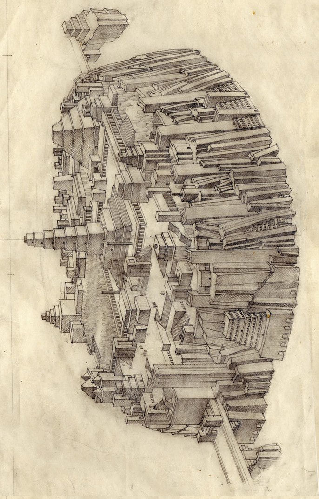
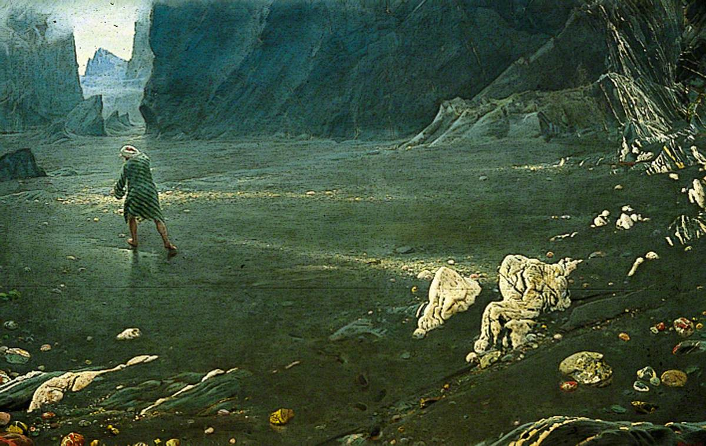
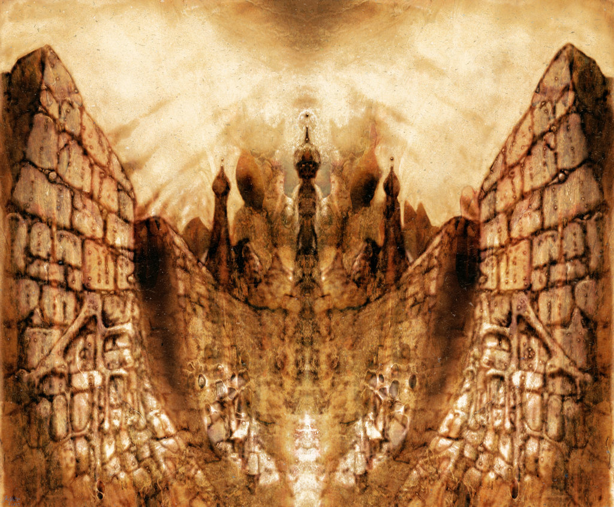
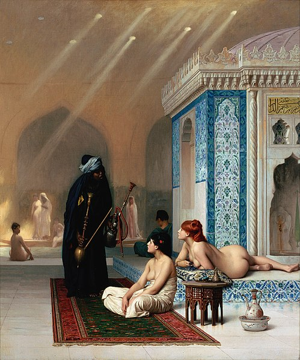
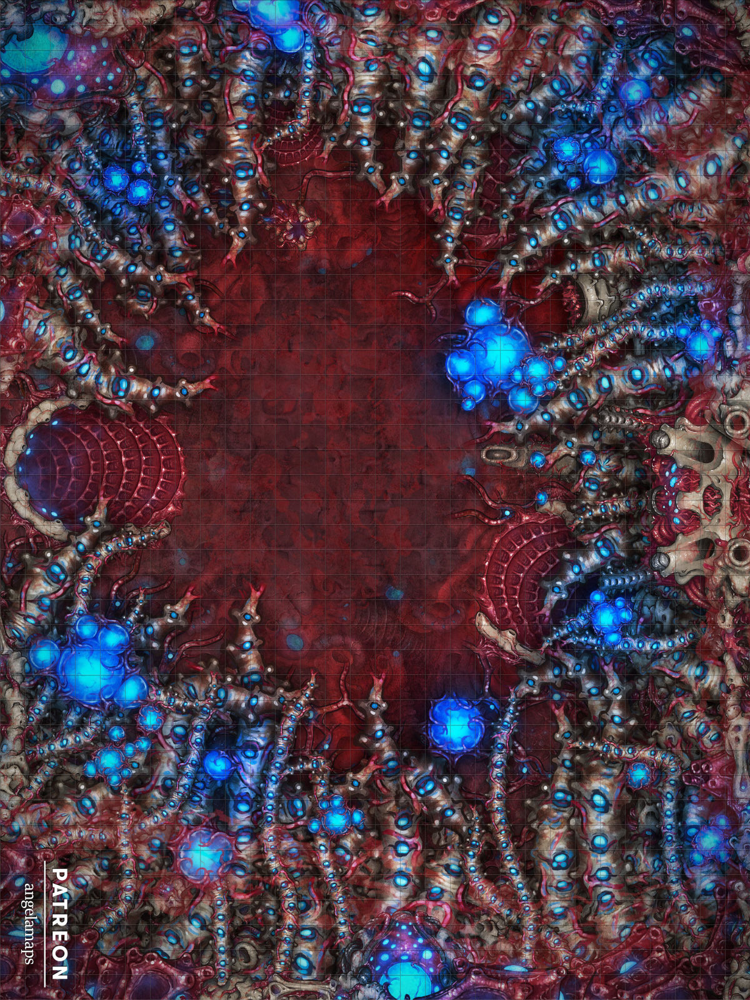
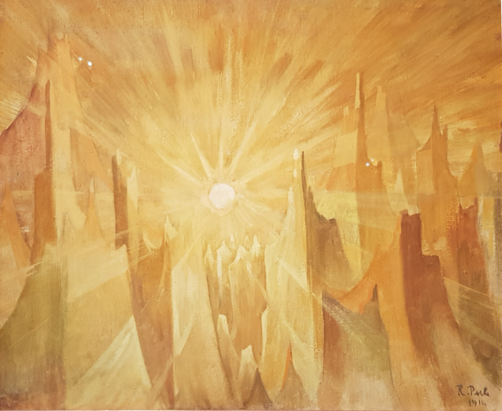

# Lugares míticos

Las 1001 Noches están llenas de lugares mágicos donde los schahriars pueden correr grandes aventuras. Son muchas veces sitios increíbles llenos de tesoros, pero otros muchas veces son también trampas mortales de las que solo los schahriars más avispados y valientes pueden escapar.

* Aram-de-las-columnas
* El valle de los diamantes
* La ciudad sin nombre
* El hammam de las delicias
* La Isla de los Siete Mares
* La cueva de las maravillas
* La Montaña del Imán
* La ciudad de G’harne
* La Ciudad de Bronce

\sinc

## Aram-de-las-columnas

> Y he aquí que aquellas murallas estaban construidas con ladrillos de oro alternados con ladrillos de plata, y en ellas se abrían ocho puertas semejantes a las puertas del Paraíso. La primera era de rubí, la segunda de esmeralda, la tercera de ágata, la cuarta de coral, la quinta de jaspe, la sexta de plata y la séptima de oro.  
> Y penetramos en la ciudad por la puerta de oro, y avanzamos invocando el nombre de Alah. Y atravesamos calles bordeadas de palacios con columnatas de alabastro y jardines donde el aire que se respiraba era de leche y los arroyos de aguas embalsamadas.
> 
> **Referencia:** Las llaves del destino (n. 792)

&nbsp;

\conc

Aram-de-las-columnas es una de las ciudades míticas de las leyendas de oriente medio. Es un lugar del que corren montones de historias y siempre cuentan historias de grandes tesoros, pero también muchos horrores y peligros.

### Cómo llegar

Aram es una ciudad perdida en el sur de la península arábiga, cuya ubicación se perdió en los anales del tiempo. La ubicación de la ciudad se halla marcada en un manuscrito de piel de gacela púrpura (Grimorio NP 4 escrito en griego jónico) que aparece y desaparece según lo roban o se pierde o su propietario muere buscando la ciudad y otra encuentra su tumba.

La ciudad está protegida por una serie de obstáculos y trampas. El primer obstáculo es el desierto de Rub al-Jali. Rub al-Jali, es un erg un desierto clásico de arena y dunas donde si no estás preparado el calor y la sed te matarán seguro.

&nbsp;

\sp

\sinc

[](https://en.wikipedia.org/wiki/G%C3%A9za_Mar%C3%B3ti#/media/File:Mar%C3%B3ti-Atlantisz_1.jpg "Géza Maróti’s plan of Atlantis mock-up")

_Aram-de-las-columnas antes de su colapso_

\conc

\sp

> Y aun viajamos durante tres días y tres noches. Y al cuarto día por la mañana divisamos ante nosotros, en el horizonte, como un anchuroso espejo que reflejase el sol. Y al aproximarnos a ello, vimos que era un río de mercurio que nos cortaba el camino. Y estaba surcado por un puente de cristal sin balaustrada, tan estrecho, tan pendiente y tan escurridizo, que ningún hombre dotado de razón intentaría pasar por él.
> 
> **Referencia:** Las llaves del destino (n. 791)

El segundo obstáculo es un río de mercurio de unos 30 metros de ancho. El río solo tiene un punto de paso, un puente de cristal muy estrecho y muy resbaladizo (-4 Atletismo a no ser que busquen alguna opción para cruzar el puente con seguridad). Caerse al río es una muerte segura. Cada turno en el mercurio es una herida directa, más una herida extra, si fallan una tirada de Vigor.

La ciudad está en un valle con montañas que llegan hasta el cielo y el único acceso es un cañón de piedra negra protegido por una serpiente gigante cornuda (o varias) que no dudará en matarte y devorarte.

El cañón da paso a un inmenso valle que puedes recorrer en un par de semanas. No hay nada en ese valle, solo arena y piedras, arena que es polvo de oro y piedras que son esmeraldas, rubíes, perlas, diamantes, etc. Es muy difícil sobrevivir en este desierto de riquezas sin agua y comida. Al final del valle está la ciudad de Aram-de-las-columnas.

### La ciudad abandonada

Aram lleva siglos deshabitada y, aun así, parece que no ha pasado el tiempo por ella. Está hecha entera de oro y piedras preciosas, ladrillos de oro, cúpulas de piedras preciosas, cristales de diamante, etc. Tiene 7 puertas, cada una hecha de un metal precioso o un tipo de piedra preciosa.

De las fuentes mana miel, leche, vino, agua de rosas, etc. Las calles están llenas de palacios cuyas balaustradas están sostenidas por cientos de columnas, de ahí su nombre, Aram-de-las-columnas.

> Y llegamos a un palacio que dominaba la ciudad y que estaba construido con un arte y una magnificencia inconcebibles, y cuyas terrazas estaban sostenidas por mil columnas de oro con balaustradas formadas de cristales de color y con muros incrustados de esmeraldas y zafiros. Y en el centro del palacio se glorificaba un jardín encantado, cuya tierra, odorífera como el almizcle, estaba regada por tres ríos de vino puro, de agua de rosas y de miel. Y en medio del jardín se alzaba un pabellón con bóveda formada por una sola esmeralda, que resguardaba a un trono de oro rojo incrustado de rubíes y de perlas.
> 
> **Referencia:** Las llaves del destino (n. 792)

\sp

En el centro de la ciudad está el palacio del rey Scheddad. Es el palacio más grande y extraordinario de toda la ciudad. En el centro de palacio, en un jardín, bajo un pabellón hecho de una única esmeralda, hay un trono de oro y encima una caja de oro lleno de azufre rojo, el componente alquímico más poderoso que existe.

Se dice que la ciudad está maldita y si te llevas alguna de las joyas y metales preciosos de la ciudad fuera del valle morirás inmediatamente. La poca gente que ha visitado la ciudad no se ha atrevido a incumplir esa ley. La civilización que puede hacer palacios de oro seguro que sabe proteger sus tesoros.

### Aram y Alhazred

Muy pocos adamitas (descendientes de Adam) han visto Aram-de-las-columnas y Alhazred es una de esas personas. Según lo escrito por Lovecraft, Alhazred paso 10 años en el desierto de Rub al-Jali, y allí debió encontrar las ruinas de la ciudad de Aram, donde encontró textos de una raza de yinns desaparecida anterior a la Humanidad. A través de estos textos abandonó la fe islámica y empezó a adorar a las deidades que él llamaba Cthulhu y Yog-Sothoth.

### La verdadera historia de Aram-de-las-columnas

Aram fue construida por una tribu de yinns perdida en el tiempo, los llamados Aads (o aditas). Alhazred creía que la tribu de los Aads, como otros yinns, eran de fuera de nuestro mundo (puede que de Yaddith, un planeta cerca de Deneb, la estrella más brillante de la constelación del cisne).

Los Aads eran yinns de gran poder mágico y crearon la ciudad gracias a uno de sus grandes secretos, la fórmula para hacer el agente alquímico conocido como azufre rojo. Con ello podían crea oro a partir de plomo y hierro y piedras preciosas con cantos rodados.

El río de mercurio que rodea Aram también es gracias al azufre rojo y las serpientes son seres creados por los Aads con su magia y su ciencia.

El rey de estos yinns era el poderoso Scheddad ben-Aad, uno de los yinns más poderosos de la historia.

\sp

### La caída de Aram

Aram-de-las-columnas es un ejemplo de ciudad maldita destruida por la ira de Alah ante la soberbia de sus habitantes, como pudieran ser Sodoma y Gomorra. Tras la ira divina solo quedaron en pie algunas de sus famosas columnas, el resto de la ciudad fue tragada por la tierra.

Lo que realmente paso fue que la ciudad se autodestruyo debido a su gran desarrollo. Estaba construida sobre un lago subterráneo que daba agua a la ciudad. La ciudad creció tanto que el acuífero se vació y terminó colapsando, tragándose la ciudad. Scheddad ben-Aad y los supervivientes decidieron abandonar la ciudad para desaparecer para siempre. Pero antes de partir, él y su gente recogieron todo el oro y las piedras preciosas que pudieron rescatar y los escondieron en algún lugar de Egipto.

> Al otro lado del mar de los corales, regido por los adoradores de Cthulhu, antes de cruzar el río de la vida y la muerte, existe una montaña de fuego. En su falda, sellado con una losa de mármol, está nuestro tesoro, que nos costó nuestras vidas.

Dejaron pistas de la ubicación del tesoro en la lápida que hay sobre la fosa común donde enterraron a todos los Aads muertos en la destrucción de Aram.

### Cómo meter Aram en tus relatos

Si vas a incluir Aram-de-las-columnas en tus relatos, puedes hacerlo de varias formas. Puede ser una ciudad maldita y abandonada por la que parece que no pasa el tiempo con sus trampas y obstáculos. Esta opción se ajustaría más a la visión de las 1001 Noches. En este caso, incluso podrías enclavar Aram dentro de la Tierra de los Sueños como parte de la imaginería onírica que tanto pega con las 1001 Noches.

Otra opción puede ser como las ruinas de una gran civilización extraterrestre que desapareció por una catástrofe digna de Lemuria o la Atlántida. Esta opción se acerca más al toque pulp de Lovecraft. En esta variante podrías llevar a tus schahriars a la búsqueda del tesoro de Scheddad el constructor de la ciudad y su rey que escondió todos sus tesoros en una cueva secreta. Tendrían en las ruinas de Aram pistas suficientes para lanzarse a la búsqueda de un fabuloso tesoro.

\sp

### Tesoro de Scheddad

> Y el genni contestó desde el interior del sello: "Has de saber, ¡ya sidi! que el lugar en que nos hallamos es el antiguo tesoro de Scheddad, hijo de Aad, el constructor de la famosa ciudad, ahora en ruinas, de Aram-de-las-Columnas. En vida de él, fui yo esclavo del rey Scheddad. ¡Y precisamente el que posees es su anillo, que lo has encontrado en el cristal donde estaba guardado desde tiempos remotos!"
> 
> **Referencia:** Historia del pastel hilado con miel de abejas y de la esposa calamitosa del zapatero remendón (n. 967)

El poderoso y sabio rey Scheddad ben-Aad guardo un inmenso tesoro en un sitio secreto. En unas cuevas subterráneas, cerradas por una gran losa de mármol y cubiertas de tierra, en unos campos a las afueras de la ciudad de Khaitán, en el reino de Sohatán en el cuerno de África.

Encontrar el tesoro de Scheddad es pura suerte, no hay mapas, ni registros de su ubicación, solo si consigues llegar a Aram-de-las-columnas podrías encontrar pistas sobre la ubicación de su increíble tesoro.

Este fabuloso tesoro escondido en unas cámaras secretas subterráneas, ocupa 3 instancias hasta el techo de oro y joyas. Es tan grande que se necesitan 600 mulas y 600 camellos para transportarlo. En una cuarta estancia hay un cofre de cristal que contiene el anillo mágico del Padre de la Dicha, un genio servidor encerrado en el anillo por Scheddad ben-Aad.

\sinc

> Y después de algunos esfuerzos, acabó por conseguir desencajarla y correrla. Y debajo vio una escalera con peldaños de mármol que conducía a una cueva de forma cuadrada que tenía la amplitud de un hammam. Y Maruf, pronunciando la fórmula del "bismilah", bajó a la cueva y vio que la componían cuatro salas consecutivas. Y la primera de aquellas salas estaba llena de monedas de oro desde el suelo hasta el techo; y la segunda estaba llena de perlas, de esmeraldas y de coral, también desde el suelo hasta el techo; y la tercera, de jacintos; de rubíes, de turquesas, de diamantes y de pedrerías de todos colores; pero la cuarta, que era la más espaciosa y la mejor acondicionada, no contenía nada más que un pedestal de madera de ébano, sobre el cual estaba colocado un pequeñísimo cofrecillo de cristal no mayor que un limón. Y Maruf se asombró prodigiosamente de su descubrimiento y se entusiasmó con aquel tesoro. Pero lo que más le intrigaba era aquel minúsculo cofrecillo de cristal, único objeto de manifiesto en la inmensa sala cuarta del subterráneo. \[…\]
> Y dentro halló un anillo de oro con un sello de cornalina, en que estaban grabadas, con caracteres extremadamente finos y semejantes a patas de moscas, escrituras talismánicas. Y con un movimiento instintivo, Maruf se puso el anillo en su dedo y se lo ajustó apretándolo.  
> Y al punto salió del sello del anillo una voz fuerte, que dijo: "¡A tus órdenes! ¡a tus órdenes!
> 
> **Referencia:** Historia del pastel hilado con miel de abejas y de la esposa calamitosa del zapatero remendón (n. 966)

\conc

\sp

```
Si tus schahriars consiguen encontrar el tesoro y llevarlo a una ciudad, otorgarles la ventaja "Rico como un sultán" directamente sin necesidad de requisitos. Solo la cuarta estancia y el anillo mágico del Padre de la Dicha es cosa tuya dárselo o no.
```

> /s/ **Semilla de aventura:** La búsqueda del tesoro de Scheddad puede ser una aventura por todo Oriente Medio buscando primero como encontrar la misteriosa Aram-de-las-columnas y luego buscando el tesoro siguiendo las pistas que hay en Aram-de-las-columnas sobre el tesoro.

\sp

\sinc

[](https://commons.wikimedia.org/wiki/Category:Albert_Goodwin "Sinbad in the Valley of Diamonds - Albert Goodwin") 

## El Valle de los Diamantes

> /p/ Enseguida me levanté del sitio en que me encontraba y recorrí aquel horripilante valle buscando una salida, observando que estaba enteramente creado con rocas de diamante. Por todas partes a mi alrededor aparecía sembrado el suelo de pequeños diamantes desprendidos de la montaña y que en ciertos sitios formaban montones de la altura de un hombre. Comenzaba yo a mirarlos ya con algún interés, cuando me inmovilizó de terror un espectáculo más espantoso que todos los horrores experimentados hasta entonces.
> 
> **Referencia:** La segunda historia de las historias de Sindbad el marino, que trata del segundo viaje (n. 296)

&nbsp;

\conc

Sindbad el marino hablaba de un valle de muy difícil acceso lleno de diamantes y protegido por serpientes gigantes. 

Los mercaderes tiraban carne untada en miel al fondo del valle, los diamantes se pegaban a la carne y grandes águilas (o inclusos rokhs) cogían la carne y se la llevaban a su nido para sus crías. Los mercaderes espantaban a las aves y recogían los diamantes de los restos de carne.

\sp

Todo este relato de Sindbad es una simplificación de una historia mucho más compleja que incluye al mighos, extrañas piedras cristalinas, mutaciones, radiaciones y explosiones nucleares.

### Cómo se formó el Valle de los Diamantes

El inaccesible Valle de los Diamantes surgió hace miles de años de la explosión nuclear involuntaria de un asentamiento minero de al mighos. Los minerales de las tierras raras de la zona fueron afectados por la presión, el calor y la radiación de la explosión, transformándose y cristalizándose en lo que los mercaderes que los recogen creen que son diamantes, pero en realidad son cuasicristales.

Estos causicristales no se consiguen en la naturaleza, solo se pueden crear alquímicamente y, aun así, son muy difíciles de crear. La estructura ordenada, pero no periódica, los hace muy valiosos para estos al mighos que serían de hacer lo que fuera por estos valiosos minerales.

### Peligros del valle

La radiación de la explosión tuvo un efecto secundario en la fauna local, mutando a los animales de la zona, de los cuales solo han sobrevivido las gigantescas serpientes negras que vigilan el valle.

La explosión creó un gran cráter que no permite descender al valle fácilmente. Las paredes son muy lisas debido a que están casi cristalizadas y las pocas rocas salientes están afiladísimas llegando a veces a cortar las cuerdas de escalada o producir heridas en las manos y pies del escalador.

Los mercaderes locales deben enfrentarse a la escalada y las serpientes mutadas, pero siendo la recompensa diamantes como manzanas, bien merecería la pena.

Desarrollaron el sistema de tirar carne al fondo del valle porque saben que estar en el valle es una sentencia a muerte. La radiación ambiental que ellos consideran algún tipo de maldición puedes matarte en horas.

\sp

No hay ninguna forma de saber que la radiación existe a no ser que algún mercader del valle te lo cuente y son bastante huraños y sin mucha disposición a hablar sobre ellos. La «maldición» del valle les da un método fácil para deshacerse de la competencia.

```
El Valle de los Diamantes tiene un nivel radiación bajo según las reglas del Manual Básico de SWEA. La radiación no es detectable de ninguna manera y solo podrán saber de ella hablando con los mercaderes del valle. Los «diamantes» que se sacan del valle, sin embargo, no son radiactivos, pero cualquier otra cosa lo será y la exposición a ellas puede terminar matándote. La tierra podría usarse como veneno, para acabar, por ejemplo, con un pozo de agua.
```

### Los al mighos y el valle

Los al mighos investigaron lo que le paso a su colonia y abandonaron la cantera porque la radiación hacía imposible durante siglos volver a extraer en el valle. Durante ese tiempo encontraron otros lugares igual de interesantes para sacar sus tierras raras y olvidaron el valle.

Lo que no saben, porque no supieron esperar, es que con los milenios terminarán creándose los cuasicristales que para ellos son muy valiosos. Si llegaran a saber lo que se puede extraer del valle, seguramente buscarían la forma de hacerse con el valle y acabar con toda la competencia que extrae los valiosos cristales.

### Tesoro y botín

Usando el método de la carne solo se pueden extraer diamantes. Por cada pieza de carne que se recupere se pueden conseguir 2d6 x 1.000 dinares de oro. Si deciden bajar al valle, podrán conseguir botines en los nidos de las serpientes. Pueden ser cualquier tipo de botín, ya que las serpientes, las paredes del valle y la radiación llevan siglos matando a exploradores que intentaron conseguir diamantes.

> /s/ **Semilla de aventura:** Si tus schahriars consiguen extraer diamantes del valle y venderlos, puede que lleguen a manos de agentes de los al mighos como la progenie de la Luna Creciente. Los al mighos mandarán a sus agentes humanos a averiguar de donde vienen los diamantes y estos harán lo que sea para saber de donde sacaron los cuasicristales. En resumen, tus schahriars deberán enfrentarse a un culto de psicópatas y a una tribu de Yinns por sus vidas.

\sp

\sinc

[](https://es.wikipedia.org/wiki/La_ciudad_sin_nombre#/media/Archivo:The_Nameless_City_by_leothefox.jpg "La ciudad sin nombre, ilustración de leothefox") 

## La ciudad sin nombre

> /p/ Perdida en el desierto de Rub al-Jali se halla la Ciudad sin nombre, ruinosa y desmembrada, con sus bajos muros semienterrados en las arenas de incontables años. Así debía de encontrarse ya, antes de que pusieran las primeras piedras de Ur, y cuando aún no se habían cocido los ladrillos de Babilonia. No hay leyendas tan antiguas que recojan su nombre o la recuerden con vida; pero se habla de ella temerosamente alrededor de las fogatas, y jeiques susurran sobre ella también en sus haimas, de forma que todas las tribus de humanos y de yinns la evitan sin saber muy bien la razón.

&nbsp;

\conc

La Ciudad Sin Nombre es una metrópoli muy antigua, siendo esta demasiado arcaica para ser obra de humanos. Al adentrarse en las profundidades descubrimos que los verdaderos constructores y dirigentes de esa ciudad fueron en realidad seres alienígenas ancestrales, con aspecto reptiliano, baja estatura, cuadrúpedos y una fealdad grotesca. 

\sp

Con los milenios la ciudad cayó en decadencia, para ser abandonada y acabar medio enterrada en las arenas de Rub al-Jali.

La ciudad no se muestra a todo el mundo, solo los que saben que buscan pueden encontrar esta ciudad. Solo los afines a la magia podrán encontrar la ciudad si tienen las indicaciones de adecuadas. Las caravanas que pasan cerca de sus ruinas no la perciben, quizás vean algún tipo de espejismo, y son repelidas por algún tipo de hechizo. La gente de la caravana no se siente tranquila hasta no estar lejos de la ciudad.

Entre las hojas del grimorio Anales de los Antiguos se encuentra la ubicación de la ciudad. También tiene una especie de indicaciones/ritual para poder encontrarla. Principalmente es una combinación fórmulas mágicas en un siseante idioma perdido. Si se hace correctamente (tirada de Espíritu) los espejismos que ocultan la ciudad desaparecen y se puede ver la ciudad y acercarse a explorarla.

Es un conjunto inmenso de edificios semienterrados en la arena, podemos encontrar casas, tiendas y talleres y también templos y palacios. Por de bajo de muchos edificios hay un laberinto de pasadizos que permiten moverse entre los edificios sin salir al sol.

Los edificios están vacíos, solo las cosas de piedra han sobrevivido al tiempo. Todo lo que fuera de madera, metal u otros materiales ha desaparecido. Las paredes de los pasadizos subterráneos y los templos y palacetes están llenos de símbolos de un idioma hace milenios perdido.

Se dice que Abdul Alhazred soñó con esta ciudad la noche antes de pronunciar su inexplicable pareado: "Que no está muerto lo que puede yacer eternamente, Y con los evos extraños la muerte puede morir." Quizás se referiría a que la Ciudad sin nombre no está muerta y algún día resurgirá o quizás simplemente estaba loco.

La ciudad no se rige por la geometría euclidiana y es por ello que explorándola puede ocurrir algunos de estos sucesos por hora de exploración.

### Tabla de Geometría no-euclidiana

Todos estos sucesos extraños tienen un TPC d4, no quiebran tu mente mucho, pero como se suele decir, muchos pocos hacen un mucho.

\sp

\sinc

|d6|Suceso extraño|
|---|---|
|1|**Esquinas rectas:** Cada vez que doblas la esquina parece que vuelves a estar en el mismo lado de la esquina. Solo doblando la esquina de espaldas podrán avanzar.|
|2|**Callejones estrechos:** El callejón se hace cada vez más estrecho hasta no poder avanzar. Si una persona entra en el callejón y otro desde fuera se aleja para que el primero se haga más pequeño por su perspectiva, podrá pasar por el callejón. La pregunta es cómo pasará el último.|
|3|**Escaleras:** Al subir o bajar una escalera no se moverán ellos, se moverá el resto del edificio.|
|4|**Espejismos:** En las largas avenidas verán varias personas delante, que en realidad son ellos mismos, de hecho, harán los mismos gestos y movimientos. Si salen corriendo, los espejismos saldrán corriendo y será imposible alcanzarlos.|
|5|**Miradores:** Si suben a un edificio o algún mirador para orientarse, si giran 360º aún les quedará otros 90º para volver a donde estaban al principio.|
|6|**Demasiadas o demasiadas pocas esquinas:** Las habitaciones y estancias, incluso las plazas y los patios, no se corresponden igual dentro que fuera. Si entran en una estancia cuadrada o rectangular puede que una vez dentro tenga 5 o 3 esquinas.|

\conc

Por otro lado, cada hora de exploración supone una tirada de botín de d4. La exploración puede hacer de hora en hora o dar un número de horas directamente, esto permite hacer 4 tiradas de botín de d4 o acumularlas haciendo una o varias tiradas de botín acumuladas. Por ejemplo, con 4 horas directas de exploración se pueden hacer 2 tiradas de d8 (d4 + 2 niveles/hora) o una sola de d12 (d4 + 4 niveles/hora).

### La tumba de Alhazred

Se cuenta que en una de los miles de salas de la ciudad se halla la tumba de Abdul Alhazred, lo cual choca con la versión «oficial» de que murió en Damasco devorado por un monstruo invisible.

\sp

Puede que en realidad la escena del monstruo no fuera más que una ilusión para secuestrarlo y traerlo aquí. Se cree que fue castigado por alguna oscura entidad por revelar secretos con su Necronomicón así que fue torturado, cegado, cortada su lengua y finalmente ejecutado y los pocos restos que quedaron metidos en un sarcófago sin nombre en una estancia perdida junto a una copia de su ominoso libro.

```
Teniendo en cuenta que Alhazred es uno de los mayores conocedores de los mitos de Cthulhu, podría usarse algún tipo de hechizo de necromancia que permita hablar con los muertos (Adivinación) y obtener información sobre los mitos de Cthulhu.
```

\sp

\sinc

## El hammam de las delicias

> …un hammam tan hermoso, que no podría encontrársele igual en casa de los reyes y kaissares. Y el hammam era todo de jade y alabastro transparente, con piscinas de cornalina rosa y coral blanco y con ornamentos de piedra de esmeralda de una delicadeza encantadora. ¡Y verdaderamente podían deleitarse allá los ojos y los sentidos, porque en aquel recinto nada molestaba a la vista en el conjunto ni en los detalles! Y era deliciosa la frescura que se sentía allí y el calor estaba graduado y proporcionado. Y no había ni un bañista que turbara con su presencia o con su voz la paz de las bóvedas blancas. Pero en cuanto el genni dejó a Aladino en el estrado de la sala de entrada, apareció ante él un joven efrit \[…\] le condujo a la más hermosa de las salas, que estaba toda pavimentada de pedrerías de colores diversos. \[…\] le sentaron cómodamente en un banco de mármol, y se dedicaron a frotarle y a lavarle con varias clases de aguas de olor; le dieron masaje con un arte admirable, y volvieron a lavarle con agua de rosas almizclada. Y sus sabios cuidados le pusieron la tez tan fresca como un pétalo de rosa blanca y encarnada, a medida de los deseos. \[…\] Y el joven y hermoso efrit que habíale conducido se presentó para volver a cogerle y llevarle al estrado, donde le ofreció, como refresco, un delicioso sorbete de ámbar gris.
> 
> **Referencia:** Historia de Aladino y la lámpara mágica (n. 757)

&nbsp;

\conc

El Hammam de las delicias es una especie de prisión donde encerrar a una persona sin que realmente sepas que estás encerrado. 

El Hammam es una especie de reino mágico (en realidad tecnología abu-qith) en la que se encierra la mente de prisionero y se le hace creer que está en un hammam increíblemente lujoso, con todo tipo de delicias, bellos y bellas masajistas, ricos manjares, aceites perfumados, piscinas de agua caliente, etc. Mientras, tu cuerpo puede estar en cualquier parte en estado casi comatoso, sin necesitar casi agua y comida.

Los abu-qith con sus posesiones a través del tiempo tienen que dejar la mente del poseído en su cuerpo mientras ellos poseen el cuerpo del humano. Por ello, intentaron crear estos lugares tecno-mágicos para que los humanos no tuvieran que meterse en los cuerpos de los abu-qith y se quedarán en estos limbos.

La idea era colocar una diadema mágica al cuerpo del abu-qith con la mente humana y mientras el cuerpo apenas sufría deterioro, la mete vivía en ese hammam de las delicias. El problema es que las mentes se deterioraban bastante rápidamente y al final no llegaron a usarlos.


\sp

\sinc

[](https://es.wikipedia.org/wiki/Archivo:HaremPool.jpg "Pool in a Harem by Jean-Léon Gérôme") 

_El hammam de las delicias_

\conc

\sp

Al final se dieron cuenta de que era mucho más práctico y efectivo dejarles vivir dentro de un cuerpo del abu-qith y borrarles la memoria antes de devolver su mente a su cuerpo.

Las diademas funcionan con cualquier entidad o cosa que tenga dentro una mente humana, incluso aquellos malditos en cuerpos de animal o en tubos cerebrales al mighos y crean una fantasía idílica, normalmente el hammam, pero podría hacer otras fantasías para otras culturas.

No hay tirada de resistencia, si te ponen la diadema caes dentro de la fantasía. Pero si podrás despertar, si empiezas a ver fallos dentro de la ilusión. En caso de usar varias diademas, unas cerca de otras, se sincronizan y crean el mismo hammam para todos.

### Formas de despertar

La única forma de despertar por ti mismo es darse cuenta de que estás realidad falsa. Deberás descubrir 3 las siguientes opciones:

* No hay salida, por más que se muevan por las estancias y pasillos del Hammam no tendrá una salida al exterior. Por muchas estancias que recorran nunca llegarán a una estancia que tenga una salida o no tenga salida. Siempre darán a una nueva estancia con más salidas a más estancias. Si vuelven sobre sus pasos en un par de estancias estarán en la primera que estaban, aunque hayan recorrido muchas más al buscar una salida. Esto puede suponer un TPC d4.
* Todas las personas con las que interactuar en el Hammam tienen un limitado número de interacciones preparadas. Llegará un momento en que puedes darte cuenta de que repiten siempre el mismo gesto o cuentan el mismo chiste, etc. Si se pasa más de una semana en el hammam será evidente este punto, lo que supone un TPC d6.
* Nada en el Hammam puede salirse de su programación. La gente no se enfada por mucho que intentes, los objetos no se rompen (no están pensados para romperse), los frascos no se vacían por más que viertas su contenido, etc. Las habitaciones se regeneran al salir de ellas. Genera un TPC d4.
* La magia no funciona. Por más que lo intentes no funciona. Los objetos mágicos tampoco lo hacen, pero no hay gasto de PP.

\sp

* Hay bugs, como puertas que no tienen picaporte, jarrones sin agujero, personas con demasiados dedos o demasiados pocos, manjares que solo saben a pollo, objetos de tamaño no adecuado, etc.
* No hay forma de hacerse daño, puedes hacerte dolor, pero no hay manera de generarte daño a ti mismo o a los demás, en caso de que estéis varios dentro del hammam.
* La diadema no puede procesar bien relaciones sexuales, es capaz de procesar sin problemas masajes sensuales, caricias, lametones, pero a partir de ese punto no sabe como funcionar y se empieza todo a desmoronar.

Una vez conseguidos los 3 puntos puede intentar una tirada de Espíritu contra el Espíritu d10 de la diadema. Pueden darles bonus, si, por ejemplo, son capaces de montar algún tipo de acto que fuerce la máquina, como, por ejemplo, inundar su estancia tapando los desagües o que todas las personas del hammam estén en una sola estancia.

Si alguna persona vuelve al hammam podrá identificarlo fácilmente, pero la tirada de Espíritu deberá superarla y podrá forzar la máquina para conseguir bonus, pero no podrá usar los trucos que uso las anteriores veces.

Si te quitan la diadema saldrás directamente del hammam, pero es bastante traumático y supone un TPC d8 por el shock mental.

\sp

\sinc

## La Isla de los Siete Mares

> Abrió el cofrecillo de oro, y vio un rollo de pergamino, que desplegó al punto.  
> Y decía en lengua griega: Quien desee llegar a ser dueño y soberano de los hombres, de los genios, de las aves y de los animales, no tendrá más que encontrar el anillo que el profeta Suleimán lleva al dedo en la Isla de los Siete Mares que le sirve de sepultura. Ese anillo mágico es el que Adán, padre del hombre, llevaba al dedo en el paraíso antes de su pecado, y que se lo quitó el ángel Gobrail, donándoselo al prudente Suleimán más tarde. Pero ningún navío podría intentar surcar los piélagos y llegar a esa isla situada allende los Siete Mares. Solo llevará a cabo esta empresa quien encuentre el vegetal con cuyo jugo basta frotar la planta de los pies para poder caminar por la superficie del mar. Ese vegetal se encuentra en el reino subterráneo de la reina Yamlika. Y únicamente esta princesa sabe el lugar donde crece tal planta; porque conoce el lenguaje de las plantas y las flores todas, y no ignora ninguna de sus virtudes. Quien quiera dar con este anillo, vaya primero al reino subterráneo de la reina Yamlika.  
> ¡Y si es tan dichoso que triunfa y se apodera del anillo, no solamente podrá entonces dominar a todos los seres creados, sino que también penetrará en la Comarca de las Tinieblas para beber en la Fuente de Vida, que da belleza, juventud, ciencia, prudencia e inmortalidad!
> 
> **Referencia:** Historia de Belukia (n. 357)

&nbsp;

\conc

La Isla de los Siete Mares en el lugar donde se supone que está la Tumba del gran rey y poderoso mago Suleimán. Es una tierra mágica llena de magia y prodigios, desde ejércitos de amazonas a gigantes.

Es llamada así porque para llegar a dicha isla hay que cruzar 7 mares. Son mares tan peligrosos que ningún barco puede atravesarlos. Todas las naves que lo intentan acaban naufragando. La única forma conocida es frotando el jugo de unas plantas mágicas en los pies. Este jugo te permite caminar sobre las aguas y así recorrer los 7 mares. Estas plantas solo las conoce y son cultivadas por la reina Yamlika que vive en una especie de reino subterráneo.

### La reina Yamlika

La reina Yamlika es una poderosa reina maga soñadora de la raza de la serpigente. Yamlika se ha creado con los milenios un mundo onírico que es casi real, por así decirlo, una mini-dimensión propia hecha de sueños. Los 12.000 mil sillones que hay en su sueño son el reflejo de los vasallos que perdió con la desaparición de Mu.

Yamlika es omnipotente en su reino de sueños y nadie puede hacerle nada en ella. Además, ha seguidos sus experimentos mágico-científicos como es el jugo de las plantas para andar por el agua.

\sp

\sinc

> Durante una hora estuvo recorriendo la tal galería, y llegó ante una puerta considerable de acero negro, con cerradura de plata y llave de oro. Abrió aquella puerta, y de repente hallóse al aire libre, en la orilla de un lago, al pie de una colina de esmeralda. En el borde del lago vio un trono de oro resplandeciente de pedrerías, y a su alrededor, reflejándose en el agua, sillones de oro, de plata, de esmeralda, de cristal, de acero, de madera de ébano y de sándalo blanco. Contó estos sillones, y supo que su número era de doce mil, ni más ni menos. \[…\]  
> cuando oyó un son de címbalos y de gongs, y de pronto vio avanzar por la falda de la colina de esmeralda una fila de personas que se desplegaba hacia el lago, deslizándose más que caminando; y no pudo distinguirlas a causa de la distancia.
> Cuando estuvieron más cerca, vio que eran mujeres de belleza admirable, pero cuya extremidad inferior terminaba como el cuerpo alargado y reptador de las serpientes. Su voz era muy agradable, y cantaban en griego loas a una reina que él no veía. Pero enseguida apareció detrás de la colina un cuadro formado por cuatro mujeres serpentinas, que llevaban en sus brazos, alzados por encima de su cabeza, un gran azafate lleno de oro, en el que se mostraba la reina sonriente y llena de gracia. Avanzaron las cuatro mujeres hasta el trono de oro, del que Hassib se apresuró a alejarse, y colocaron allí a su reina, arreglándola los pliegues de sus velos, y se mantuvieron detrás de ella, en tanto que cada una de las demás mujeres serpentinas habíase deslizado hacia uno de los sillones preciosos dispuestos alrededor del lago. Entonces con una voz de timbre encantador, dijo la reina algunas palabras en griego a las que la rodeaban …
> 
> **Referencia:** Historia de Belukia (n. 357)

&nbsp;

\conc

A diferencia de otros miembros de su raza, Yamlika acepta a los humanos y no los ve como una plaga a exterminar o posibles seres para esclavizar. De hecho, de buen grado responde a preguntas con un Saber de Suleimán d12+2 e incluso podría enseñar magia a schahriars que le caigan excepcionalmente bien.

Puede incluso querer tener un encuentro sexual o una relación romántica con alguno de los o las schahriars si los encuentra atractivos o intelectualmente atrayentes. Los suele marcar convirtiendo partes de su piel es escamas de serpiente que ella disfruta acariciando como si fueran de su misma especie.

Para entrar en el reino de Yamlika, debes buscar un lugar deshabitado y ejecutar dos hechizos, uno de Sueño para dormir y otro de Interpretar los sueños para meterse dentro del sueño de Yamlika.

> /p/ Tras de lo cual, seguido por el sabio Offán, salió de su palacio y de su ciudad y se adentró en el desierto.  
> /p/ Solo entonces le dijo el sabio Offán: "¡Aquí es el lugar propicio para hacer los conjuros que deben enseñarnos el camino!" Se detuvieron, pues, y Offán trazó sobre la arena, en torno suyo, el círculo mágico, hizo los conjuros rituales. Un profundo sopor embargó al príncipe y su consejero. Hizo entonces todavía algunos otros conjuros y ambos cayeron dormidos sobre la arena. Cuando se despertaron la tierra se había abierto y les dio paso a ambos hasta el lago que tienes delante de los ojos, …
> /p/ 
> /p/ **Referencia:** Historia de Belukia (n. 357)

\sp

Mientras estés dormido nada físico te puede pasar en el sueño de Yamlika, si puedes perder cordura ante lo que pudiera enseñarte Yamlika. Eso sí, tu cuerpo físico estará desprotegido en el mundo real. Es importante destacar que todo lo que te ofrezca Yamlika se convertirá en real al despertar. Por el contrario, si, por ejemplo, robas oro sin su permiso se quedará en su dimensión onírica.

### Los Siete Mares

#### El primer mar

> De ese modo anduvieron por aquel mar durante tres días y tres noches, y a la mañana del cuarto día arribaron a una isla que les pareció el paraíso de tanto como hubo de maravillarles su hermosura una isla que les pareció el paraíso, de tanto como hubo de maravillarles su hermosura. La tierra que hollaban era de azafrán dorado; las piedras eran de jade y de rubíes; extendíanse las praderas en cuadros de flores exquisitas con corolas ondulantes bajo la brisa que embalsamaban, casándose las sonrisas de las rosas con las tiernas miradas de los narcisos, conviviendo los lirios con los claveles, las violetas, la manzanilla y las anémonas, y triscando ligeras entre las líneas blancas de jazmines las gacelas saltarinas; las frondas de los áloes y de otros árboles de grandes flores refulgentes susurraban con todas sus ramas, desde las que arrullaban las tórtolas en respuesta al murmullo de los arroyos, y con voz conmovida cantaban los ruiseñores a las rosas su martirio amoroso, mientras las rosas escuchábanles atentamente;

\sc

> aquí los manantiales melodiosos se ocultaban bajo cañaverales de azúcar, únicas cañas que en el paraje había; allá, la tierra natural mostraba sin esfuerzo sus riquezas jóvenes y respiraba en medio de su primavera.
> 
> **Referencia:** Historia de Belukia (n. 359)

Tras 3 días y 3 noches de andar sobre el mar, llegaron a una isla paradisíaca con una flora y una fauna exuberante. Seguramente reminiscencias de historias de marinos árabes que visitaron islas exóticas del Índico y el Pacífico Sur.

En esta isla todas las noches, un monstruo indescriptible con una gema luminosa como el sol sale del mar seguido de seres marinos. De las selvas salen más animales y charlan entre ellos. Si descubren a algún humano se lanzarán a matarlo.

#### El segundo mar

Tras varios días de andar por el segundo mar, hay una cadena montañosa hecha de piedras de imán, lo que hace que pierdas todos los objetos metálicos que portes. Solo podrás llevarte contigo un objeto metálico tras pasar una tirada de FUE.

\sp

#### El tercer mar

Tras unas semanas de andar por el tercer mar te encuentras una isla llena de árboles frutales que dan frutas confitadas. Cuidado con comer muchas o podrías enfermar.

#### El cuarto mar

Tras andar 4 días y 4 noches llegan a isla que no es más que un banco de arena lleno de reptiles al sol. Si fuera necesario puedes comerte los huevos a riesgo de atraer la ira de los reptiles.

#### El quinto mar

> Por el Quinto Mar solo viajaron un día y una noche, porque al amanecer vieron una islita cuyas montañas eran de cristal con anchas venas de oro, y estaban cubiertas de árboles asombrosos que tenían flores de un amarillo brillante. Al caer la noche estas flores refulgían como astros, y su resplandor, reflejado por las rocas de cristal, iluminó la isla y la dejó más brillante que en pleno día. Y dijo Offán a Belukia: "Delante de los ojos tienes la Isla de las Flores de Oro. Se trata de unas flores que, después de caer de los árboles y cuando se secan, se reducen a polvo, y su fusión acaba por formar las venas de donde se saca el oro. Esta Isla de las Flores de Oro no es más que una partícula del sol separado del astro, y caída antaño aquí mismo".
> 
> **Referencia:** Historia de Belukia (n. 359)

Atravesar el quinto mar solo lleva 1 día y 1 noche. La isla al otro lado del mar fue creada hace miles de años cuando Nardún intento entrar en nuestro mundo. Dejo parte de su esencia en la isla, creándose la Isla de las Flores de Oro. Si la secta del Fuego y de la Luz llegará a esta isla podría intentar invocar a Nardún de nuevo para que extinga toda vida en la tierra.

#### El sexto y séptimo mar

> Viajaron por el Sexto Mar el tiempo suficiente para experimentar un placer grande al llegar a una isla cubierta de hermosísima vegetación, en la cual pudieron disfrutar de algún reposo sentados en la playa. Se levantaron luego y comenzaron a pasearse por la isla. ¡Pero cuál no sería su espanto al ver que los árboles ostentaban, a manera de frutos, cabezas humanas sostenidas por los cabellos! No tenían la misma expresión todas aquellas frutas en forma de cabeza humana: sonreían unas, lloraban o reían otras, mientras que las que habían caído de los árboles rodaban por el polvo y acababan por transformarse en globos de fuego que alumbraban la selva y hacían palidecer la luz del sol.
> 
> **Referencia:** Historia de Belukia (n. 359)

El sexto mar tarde varias semanas en cruzarse y acaba En una extraña isla llena de árboles frutales. Las frutas tienen tamaño y forma de cabeza y representan a gente real. Su expresión cambia según les vaya bien las cosas o este sufriendo. Cuando alguien muere, su fruta al suelo y se incendia con un gran fulgor.

\sp

Encontrar la fruta de un ser querido supone una TPC d6 y TPC d8 de la propia. Buscar activamente la fruta de alguien podría llevar un día completo y exigir una tirada de Notar -4.

Cruzar el último mar puede tardar meses y podría obligar a los viajeros a tener que pescar para sobrevivir.

### La isla de los siete Mares

Tras cruzar el séptimo mar llegaremos a la isla de los Siete Mares, otra isla paradisíaca con ríos de agua fresca, árboles frutales, aves de vivos colores, etc. Pero la isla está habitada y protegida por una tribu de gugos que cuidan de que nadie salga vivos. Los gugos están repartidos por toda isla vigilando que haya extraños, dándoles caza y devorando sus cuerpos.

### La cripta de Suleimán

> … llegaron a una colina cuyas rocas eran de ámbar amarillo y de almizcle, y en cuyas laderas se abría una gruta magnífica con bóveda y paredes de diamantes. Como estaba tan bien alumbrada, cual a pleno sol, se aventuraron bastante en sus profundidades, y a medida que avanzaban, veían aumentar la claridad y ensancharse la bóveda. 

\sc

> Así anduvieron maravillándose de aquello, y empezaban a preguntarse si tendría fin la gruta, cuando de repente llegaron a una sala inmensa, tallada de diamante, y que ostentaba en medio un gran lecho de oro macizo, en el cual aparecía tendido Suleimán ben-David, a quien podía reconocerse por su manto verde adornado de perlas y pedrerías, y por el anillo mágico que ceñía un dedo de su mano derecha, lanzando resplandores ante los que palidecía el brillo de la sala de diamantes. La mano que tenía el anillo en el dedo meñique, descansaba sobre su pecho, y la otra mano, extendida, sostenía el cetro áureo de ojos de esmeralda.
> 
> **Referencia:** Historia de Belukia (n. 360)

En una colina en el centro de la isla hay una gruta larguísima al final de la cual está la cripta de Suleimán. El cadáver incorrupto de Suleimán porta dos objetos de gran poder, el anillo de Suleimán y el cetro áureo de esmeraldas.

La gruta está protegida con una serie de protecciones mágicas, si intentas acercarte al lecho donde está el cadáver de Suleimán del techo caen diamantes líquidos tan calientes que si te tocan te abrasan vivo.

```
Hay que hacer 5 tiradas de Atletismo para esquivar las gotas de diamante y llegar hasta el lecho. Si se falla la tirada de Atletismo se recibe una herida directa por fuego y si se falla una tirada de Vigor una segunda herida. 
```

\sp

Los hechizos de resistencia al fuego podrían dar un +2 a la tirada de Vigor, pero no protegen de la primera herida.

El anillo de Suleimán es explicado más adelante y el cetro es un objeto mágico de gran poder que maximiza todos los conjuros que se lancen cuando lo portamos. A nivel de juego hace que la persona que lo porte al lanzar un hechizo obtenga un avance extra si consigue lanzarlo.

\sp

\sinc

## La cueva de las maravillas

> /p/ Entonces el magrebí sacó del cinturón un eslabón, con el que hizo lumbre, y prendió fuego al montón de ramas y hierbas secas, que llamearon crepitando. Y al punto sacó del bolsillo una caja de concha, la abrió y tomó un poco de incienso, que arrojó en medio de la hoguera. Y levantóse una humareda muy espesa que apartó él con sus manos a un lado y a otro, murmurando fórmulas en una lengua incomprensible en absoluto para Aladino. Y en aquel mismo momento tembló la tierra y se conmovieron sobre su base las rocas y se entreabrió el suelo en un espacio de unos treinta codos de anchura que desprendía un terrible hedor. Y del fondo de aquel agujero emergieron los restos podridos de un inmenso falak muerto. \[…\]
> /p/
> /p/ Y el magrebí le dijo: "Hijo mío Aladino, tápate la nariz y la boca con mi pañuelo y adéntrate ahora en ese ser mientras declamas tu linaje. Y te hallarás debajo de una bóveda grande dividida en tres buches que se comunican unas con otras. En cada estómago encontrarás objetos singulares y valiosos entre los pliegues de la carne de las paredes. Pero pasa sin detenerte y recógete bien el traje, sujetándotelo a la cintura para que no toques nada; porque debido si tuvieras la desgracia de tocar con los dedos o rozar siquiera con tus ropas las paredes su ponzoñosa sangre y su ácida bilis, al instante morirás envenenado entre terribles dolores. Entrarás, pues, en el primer estómago, y muy de prisa pasarás al segundo, desde la cual, sin detenerte un instante, penetrarás en el tercero, donde verás una pequeña cavidad. Y te adentrarás en ella, y te encontrarás una especie de hornacina de carne y sangre; y en esta hornacina, sobre un pedestal de hueso, encontrarás una lamparita de cobre. Y estará encendida esta lámpara. ¡Ahora, fíjate bien, Aladino! ¡cogerás esta lámpara, la apagarás, verterás en el suelo el aceite y te la esconderás en el pecho enseguida! ¡Y volverás a mí por el mismo camino que hayas seguido! Y una vez que te hayas reunido conmigo, me entregarás la lámpara, fin y motivo de nuestro viaje y origen de nuestra riqueza y de nuestra gloria en el porvenir, ¡oh hijo mío!"
> /p/ 
> /p/ **Referencia:** Historia de Aladino y de la lámpara mágica (n. 738)

&nbsp;

\conc

La cueva de las Maravillas es el lugar mítico donde Aladino consiguió la lámpara mágica. A pesar de lo que pueda parecer, la cueva de las maravillas es uno de los lugares más horribles donde entrar, ya que, en realidad, es el cadáver descompuesto de un gigantesco falak.

No hay una única cueva, sino que hay un mínimo de tres conocidas, una en Kasgar (China), dónde sucede la historia de Aladín, otra cerca de la ciudad de Sana en Yemen y la última en las montañas de Ispahán.

Las razones de la muerte de los falak es desconocida, pero la tradición dice que es tan poderoso que solo su miedo al mayor poder de Dios le impide tragarse toda la creación.

\sp

\sinc

[](https://angelamaps.com/2024/03/12/tentacles/ "Tentacles por AngelaMaps") 

_La Cueva de las Maravillas - Interior de un falak_

\conc

\sp

### Abriendo la cueva

El mago que desee abrir la cueva debe saber la ubicación donde está enterrado el falak y debe realizar un hechizo de Animar cuerpo sobre el cadáver del falak para hacer que salga de la arena y la boca se abra.

Presenciar como el cadáver descompuesto de un falak muerto se levanta de entre las arenas del desierto es un TPC d8, adentrarse en su interior supone una segunda TPC d12.

Recuerda que el poder Zombi solo dura una hora y animar un falak muerto supone un gasto de un montón de puntos de poder debido a su tamaño.

### Peligros de su interior

Al entrar en la ["cueva"](#anchorcuevamaravillas) nos vamos a enfrentar a tres peligros principales, los jugos gástricos del falak, las explosiones de metano que genera el cadáver y la estructura de la propia cueva (el estómago del falak) que tiene simas y precipicios insondables.

El interior apesta terriblemente, lo que exige una tirada de Vigor para aguantar la horrible peste a muerte. Si se falla, se obtiene un nivel de fatiga que dura hasta salir de la "cueva". Usar pañuelos empanados con perfumes y aceites olorosos puede ayudar, ofreciendo un +2 a la tirada de Vigor.

Caer en un charco de ácidos gástricos supone un 1d6 de daño por cada extremidad, cabeza y tronco. Es decir, que si metes una pierna en el ácido te haría una 1d6 y si te caes dentro perderías 6d6 de daño. El ácido se comerá la ropa, el pelo, el papel y la madera. Solo lo que sea de metal, cerámica o cristal se salvará.

El metano acumulado del cadáver puede prender con cualquier chispa, haciendo desde una pequeña llama hasta explosiones devastadoras. Las explosiones quedan a tu discreción, pero lo interesante es dejar esas explosiones para momentos críticos y épicos. Puedes hacerles tirar Notar para detectar el metano y que salgan corriendo.

El falak tiene un tamaño terrible, por lo que puede haber caídas grandísimas de hasta 100 metros en muchos casos. Como siempre, el material de escalada ayudará a moverse por su interior.

\sp

A lo Jonás y la ballena, podría haber seres de los Mitos que sobrevivan en el interior del falak, como ghūles que se dedican a comer la carne del falak.

\sc

### Buscando tesoros

Durante miles de años los falaks han devorado dimensiones extraplanares y planos multidimensionales y restos de esas realidades pueden encontrarse todavía en su podrido sistema digestivo. Buscar una hora dentro de un falak permite una tirada de botín de d12.

\sp

\sinc

## La Montaña del Imán

> /p/ … mañana llegaremos a una montaña de rocas negras que se llama la Montaña del Imán, y hacia ella han de llevarnos a la fuerza las aguas. Y nuestra nave se despedazará, porque volarán todos sus clavos, atraídos por la montaña y adhiriéndose a sus laderas, pues Alah el Altísimo dotó a la Montaña del Imán de una secreta virtud que le permite atraer todos los objetos de hierro. Y no puedes imaginarte la enorme cantidad de cosas de hierro que se ha acumulado y colgado de dicha montaña desde que atrae a los navíos. ¡Solo Alah sabe su número! Desde el mar se ve relucir en la cima de esa montaña una cúpula de cobre amarillo sostenida por diez columnas, y encima hay un jinete en un caballo de bronce, y el jinete tiene en la mano una lanza de cobre, y le pende del pecho una chapa de plomo grabada con palabras talismánicas desconocidas. Sabe, ¡oh rey! que mientras el jinete permanezca sobre su caballo, quedarán destrozados todos los barcos que naveguen en torno suyo, y todos los pasajeros se perderán sin remedio, y todos los hierros de las naves se irán a pegar a la montaña. ¡No habrá salvación posible mientras no se precipite el jinete al mar!”  
> /p/ »Dicho esto, ¡oh señora mía! el capitán continuó derramando abundantes lágrimas, y juzgamos segura e irremediable nuestra pérdida, despidiéndose cada cual de sus amigos.  
> /p/ »Y así fue; porque apenas amaneció, nos vimos próximos a la montaña de rocas negras imantadas, y las aguas nos empujaban violentamente hacia ella. Y cuando las diez naves llegaron al pie de la montaña, los clavos se desprendieron de pronto y comenzaron a volar por millares, lo mismo que todos los hierros, y todos fueron a adherirse a la montaña. Y nuestros barcos se abrieron, siendo precipitados al mar todos nosotros.
> /p/ 
> /p/ **Referencia:** Historia del tercer saaluk (n. 14)

&nbsp;

\conc

En mitad del mar hay una isla llamada la isla de la Montaña del Imán. La isla es una gigantesca montaña salida del mar, sin sitios para fondear o sitios en los que desembarcar. Toda la costa son grandes acantilados con peligrosos arrecifes que imposibilitan bajar a tierra.

En lo alto de la montaña hay una especie de cúpula de cobre soportada por 10 columnas y debajo de ella una estatua ecuestre hecha de un metal desconocido muy parecido al cobre.

La sola presencia de la montaña congela los corazones de los marinos que saben que su fin está cerca.

Enseguida su barco se ve atraído hacia la isla y cuando está cerca, los clavos anclajes y demás elementos metálicos salen volando hacia la montaña. 

Si todavía sigue a flote después de esto acaba estrellándose contra los arrecifes y acantilados y los marinos mueren ahogados al no poder subir a tierra firme.

\sp

La montaña de piedra ferrosa, gracias a la estatua ecuestre, es un gigantesco y superpoderoso imán que atrae a todos los barcos que se le acercan. Las laderas de la montaña están cubiertas de objetos metálicos que el imán ha arrancado de los barcos y sus tripulantes. Algunos llevan siglos allí rotos y oxidados. Además, es casi imposible despegarlos del suelo al que están pegados.

Todo barco con componentes metálicos que entre en el radio de 5 km. de las montañas del imán entra en su zona de atracción y no puede escapar de su zona magnetizar a no ser que se pase una tirada de Pilotar -4. Si se falla, se acerca un kilómetro a la isla y para escapar hay que superar una tirada de pilotar -5 (4 + 1 por cada kilómetro). Si falla se acerca otro km hasta llegar a distancia de recibir daño. Si se pasa la tirada recupera un kilómetro.

La montaña produce 3d6 de daño a todos los barcos que se acerquen a rango de 0.5 km. El daño es producido por todos las piezas de metal arrancadas y los arrecifes contra los que es atraído. El daño se repite cada 5 minutos hasta que lo destruye contra los arrecifes.

```
Dentro de este rango de 0.5 km, cada schahriar puede tratar de evitar que dos de sus objetos metálicos se vayan volando haciendo una tirada de FUE enfrentada contra d10. Si se pasa, durante 5 minutos se puede usar en objeto sin problema. Si falla el objeto sale volando de sus manos. Si los objetos son soltados, salen volando y se pierden.

Toda la montaña se considera terreno difícil debido a la pendiente de la montaña y a la gran cantidad de objetos metálicos oxidados que hay en su suelo. Muchos son, además, punzantes y cortantes y moverse entre ellos sin hacerse daño es bastante complicado.
```

### La estatua ecuestre en la cima

La estatua ecuestre de las montañas de Imán es una de las tres estatuas ecuestres con poderes mágicos que aparecen en las 1001 Noches. Es lo que le da su tremendo poder magnético a las montañas de Imán. Sin esa estatua, las montañas solo sería unos grandes bloques de piedra tierra ricos en elementos férricos.

\sp

Hay varias teorías sobre el origen de la estatua, siendo todas posibles en mayor o meno medida.

* Pudiera ser que contenga encerrado en su interior la esencia de algún primigenio o dios exterior menor relacionado con el magnetismo. Quien le dio la forma ecuestre es un misterio, quizás sea un chiste del dios arquetípico Nodens que no podemos entender.
* Otra teoría es que sean algún tipo de ingenio Al-Migho para extraer materiales magnéticos. Seguramente en origen tendría una forma más eficaz como una esfera para maximizar su poder y con el tiempo alguien tallo la esfera en forma de estatua ecuestre (aunque sea extremadamente dura para usar martillo y cincel). Sobre porque abandonaron el ingenio magnético es un misterio. Puede que la radiación electromagnética fuera peligrosa u otra raza destruyó el asentamiento al migho y abandonó allí la esfera.
* La tercera y, quizás, más acertada es que sea algún tipo de trampa o arma creada por el gran rey y mago Suleimán para destruir a sus enemigos. Un objeto tan poderoso podría destruir naves estelares y hacerlas estrellarse contra la tierra. De alguna manera la estatua acabo en esta montaña o quizás se puso en su ubicación actual para proteger algo debajo de la montaña.

#### Destruyendo la estatua ecuestre

La estatua es inmune a todo ataque que no sea mágico y, además, no puede usarse contra ella armas metálicas porque se quedan pegados a la montaña en cuanto te acercas. Porras de madera o hachas de piedra podrían usarse, pero seguramente se romperán antes de hacer daño al metal de la estatua.

Una opción podría ser encender un fuego en su base y cuando el metal esté al rojo vivo, lanzar agua fría para que el brusco cambio de temperatura la haga estallar. Habría que separarla rápidamente porque si no volvería a reconstruirse por acción del propio magnetismo.

La estatua pesa casi 3 toneladas, así que otra opción sería tratar de moverla y lanzarla al mar lejos de las ferrosas montañas. 

\sp

Un rokh podría cargar con ella y lanzarla lejos a alguna sima oceánica donde no podría molestar a nadie.

> /s/ **Recompensa de cordura (+1):** Destruir la estatua salvará muchas vidas en el futuro y ese acto debería recompensarse con un +1 a Cordura, sobre todo si se conoce los devastadores efectos magnéticos de la estatua y los miles de muertes que ha provocado.

### Saqueo de la isla

Las rocas y piedras de la montaña no funcionan como imán sin la presencia de la estatua ecuestre. Son altamente ferrosas, pero dejan de ser magnéticas al alejarse de la isla. Pasa lo mismo con los objetos metálicos atraídos a la montaña.

Si se está una hora buscando activamente entre los restos de naufragios y los objetos atraídos por el imán, se podrá hacer una tirada de botín de d8.

> /s/ **Semilla de aventura:** Si la teoría del arma anti naves espaciales es cierta, la montaña podría tener unas instalaciones militares de los creadores de la estatua y a las que esta protegía de ataques. Puede haber de todo en esas instalaciones.

\sp

\sinc

[](https://en.wikipedia.org/wiki/R%C5%ABdolfs_P%C4%93rle#/media/File:R%C5%ABdolfs_P%C4%93rle_-_Saule_(1916).jpg "Rūdolfs Pērle - Saule (1916) Tempera") 

&nbsp;

## La ciudad de G’harne

> /p/ y con un suave temblor la duna se empezó a desmoronar ante sí, apareciendo en una ciudad en ruinas. Cuando aquella ciudad supo, como contaban los jeiques de su tribu, que se encontraba frente a la ciudad de G’harne y que su destino estaba sellado, moriría devorado por los falaks que viven en esas arenas, o peor, acabaría convertido en uno de sus esclavos.

&nbsp;

\conc

G’harne es una misteriosa ciudad sita en algún lugar de los desiertos páramos del norte de África. Las tribus bereberes hablan de esta ciudad como un lugar maldito y encontrársela, las raras veces que eso sucede, es un mal augurio.

Nada bueno presagia ver la silueta de G’harne contra el sol del ocaso o del alba.

\sp

De la ciudad de G’harne solo quedan en pie los muros de algún gigantesco templo o palacio y todas las superficies medianamente lisas de las ruinas están llenos de extraños glifos punteados que nadie que los haya visto ha podido descifrar.

### G’harne y los janns

Por la escritura punteada y por diferentes símbolos basados en el pentágono y la estrella de 5 puntas, se cree que la ciudad de G’harne fue fundada haces miles de años (o incluso millones de años) por la tribu de janns, la más antigua de las tribus de yinns que aparecieron en la tierra.

Los glifos de G’harne cuentan la historia de los janns desde su creación hace millones de años hasta hace miles. Si este conocimiento llegara a dominio público, podría cambiar la forma en que la gente ve el mundo y cómo los humanos hemos llegado a él.

Es posible que en alguna de las galerías que hay debajo de las ruinas se puedan encontrar cuerpos de janns que han sido momificados por la acción de la arena y la sequedad del ambiente. Posiblemente, un proceso de hidratación de estos cuerpos pudiera conseguir que estos seres volvieran a la vida. Aunque su reacción ante el nuevo mundo en que se encuentren podría ser muy violenta y peligrosa.

#### Descifrar los giflos punteados

Descifrar los glifos punteados no es tarea fácil, no solo porque no hay referencia en otros idiomas sobre la que basarse y, además, los glifos están muy dañados por los milenios de exposición a la arena y el viento del desierto.

```
Si no se tiene ninguna referencia, ni nada con que compararlo, traducir esos glifos tiene un -6 a las tiradas de Humanidades para traducirlos. La traducción de los glifos punteados de los muros de la ciudad pueden tardarse unas 4 semanas en traducirse una vez se consiga hacer una primera traducción básica. Cada semana exige una TPC d8, de forma que con un poco de mala suerte un traductor podría caer en la locura.
```

La traducción de los glifos puede ordenarse y estudiarse adecuadamente y crear un grimorio/libro de historia bastante interesante para cualquier practicante de las artes mágicas.

\sp

```
El libro que se consiga de las traducciones nos da un interesante grimorio de NP 5. No es tanto un grimorio como un libro de historia, de ahí su bajo nivel, pero como libro de historia otorga un +2 a las tiradas de Saber de Suleimán relacionado con janns y las guerras que mantuvieron con otros tipos de yinns antes de la aparición del hombre.
```

### G’harne y los falaks menores

Los restos de la ciudad atraen por alguna razón a los falaks menores, quizás tengan alguna conexión ancestral con el lugar o quizás sea un estupendo lugar de cría. Sea lo que sea, la presencia de falaks menores en las arenas cercanas a la ciudad lo vuelven un lugar muy peligroso.

Otra opción que explicaría que los falak menores tengan tanto interés en G’harne es que su rey Shudde M’ell está encerrado en algún lugar bajo la ciudad. Sus súbditos estarían tratando de liberarlo y por eso llevan tanto tiempo custodiando el lugar.

La historias que cuentan que G’harne es que solo se aparece a quien la ciudad quiere. Esto puede explicarse en la medida que los falaks menores pueden mover las dunas a su voluntad y tapar o destapar las ruinas.

Los falaks con sus poderes de dominación mental han ido atrayendo a personas de mente débil que pasaban cerca de las ruinas y les han hecho abandonar sus caravanas o sus tribus nómadas. Estas personas sobreviven como pueden en los oasis cercanos y sirven a sus amos espiando para ellos o cumpliendo sus órdenes que van desde espantar a los intrusos a asesinarlos por la noche.

\sp

\sinc

## La Ciudad de Bronce

\conc

La magnifica y maldita Ciudad de Bronce es descrita más ampliamente en el cuento salvaje "Más allá de la Ciudad de Bronce: Historia de la segunda expedición a la Ciudad de Bronce". En él se describe y se explica cómo encontrarla y cómo eliminar la maldición que se ciñe sobre ella y sus habitantes.