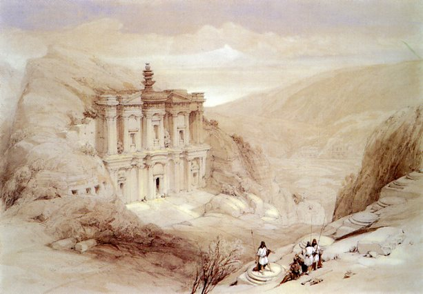
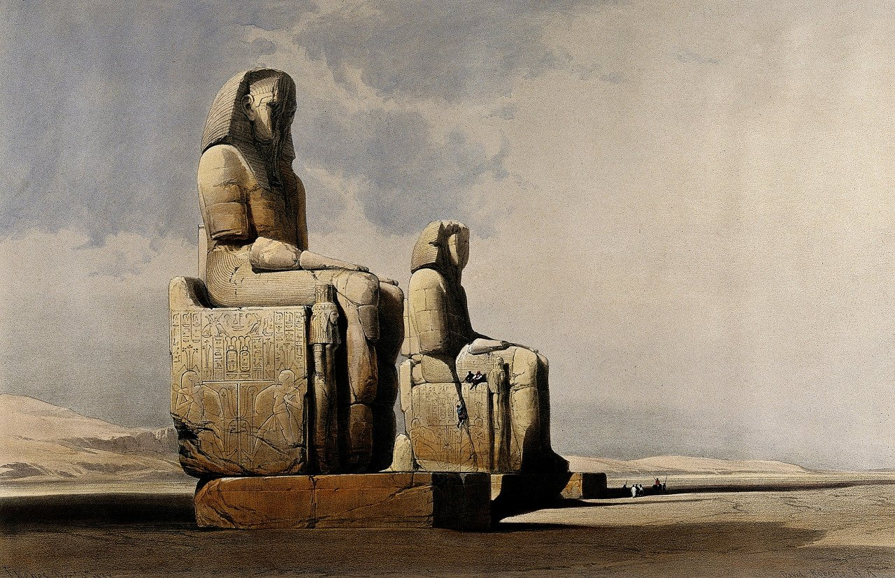
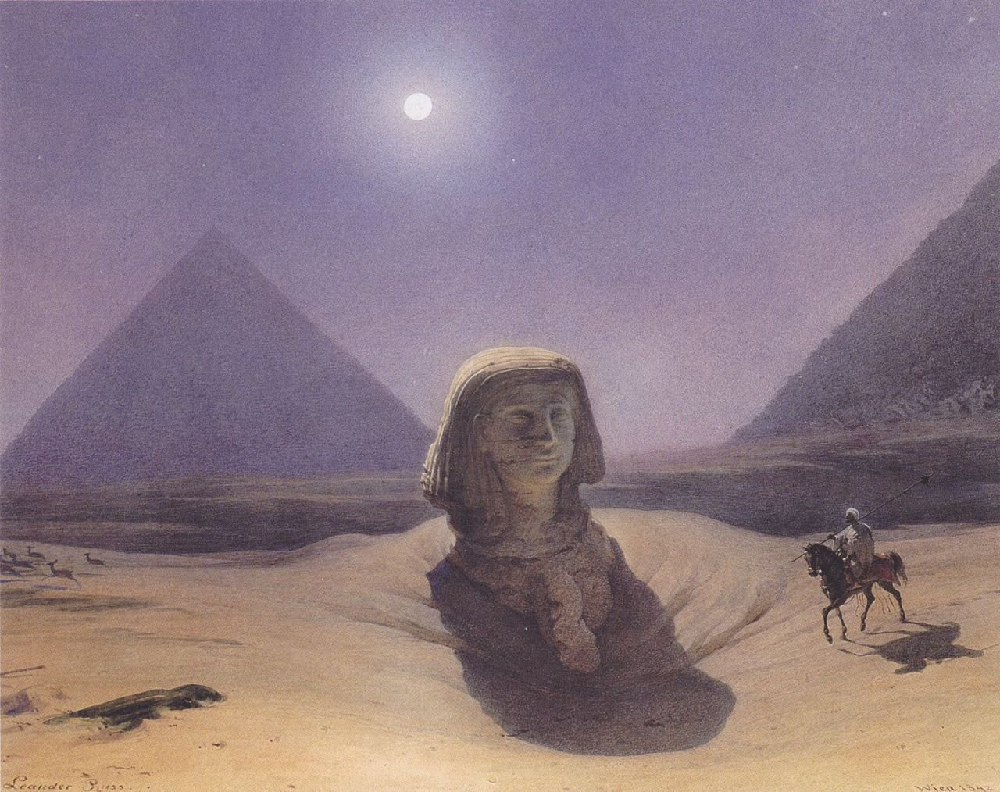
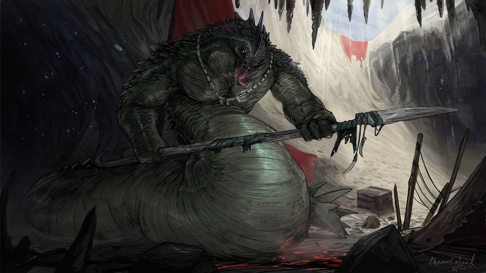
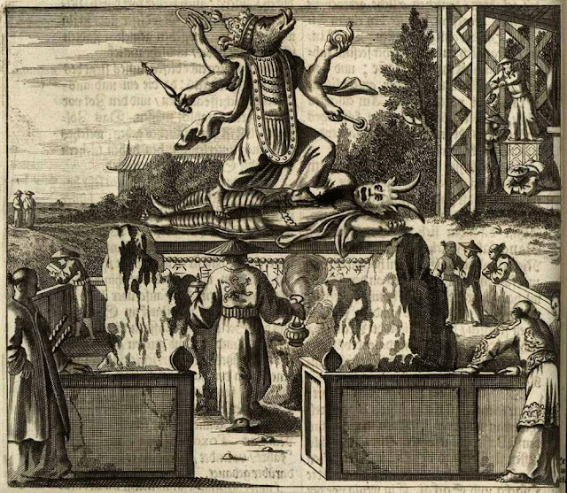

# Guía de viajes

Aunque pueda parecer que todos los cuentos de las 1001 Noches suceden en una especie de Arabia mítica, en realidad ocurren en muchos países y lugares de toda Asia y África, desde Egipto o Marruecos hasta China o India.

\sinc

## Arabia y Persia

\conc

Arabia y Persia son los escenarios principales, pero no los únicos, de los cuentos de las 1001 Noches. Bagdad, Damasco, Basora son nombradas entre sus páginas, pero también Alepo, Mosul, Acre y otros puntos interesantes donde ambientar tus relatos.

### Acre

Acre es el puerto más importante de Palestina. Por ella pasan gran cantidad de mercancías y personas del Mediterráneo a Persia y Arabia. Ha sido tomada y retomada por infinidad de pueblos y todas han dejado huella en ella.

Acre es una ciudad muy interesante, ya que es la ciudad perfecta para ambientar una aventura en tiempos de las Cruzadas. De normal todas las historias de las 1001 Noches son atemporales o están ambientas durante el califato abasí (750-1259) y más concretamente durante el califa Harún al-Raschid (766-809). Pero hay algunas historias posteriores que se encuentran en tiempo de las Cruzadas.

En estas historias los protagonistas se relacionan y muchas veces se enfrentan con los llamados caballeros francos, es decir, con los cruzados, con caballeros Templarios y Hospitalarios. Veamos algunos ejemplos:

> «¡Oh mi señor! la madre de mis hijos es una hija de los francos, y la compré como prisionera de guerra en tiempos de Saladino el Victorioso, después de la batalla de Hattin, que nos libró para siempre de los cristianos extranjeros usurpadores del reino de Jerusalén. ¡Pero ya hace mucho tiempo de eso, porque fue en los días de mi juventud!»
> 
> **Referencia:** El Felah de Egipto y sus hijos blancos (n. 551)

> «¡Ve a llevar tu lino al castillo de Acre, en Siria, donde le venderás con mucho beneficio!» Y yo, que les escuché, cogí mi lino y me fui a la ciudad de Acre, que en aquel tiempo estaba entre las manos de los francos.
> 
> **Referencia:** El Felah de Egipto y sus hijos blancos (n. 551)

\sp

Acre tiene una de las fortalezas templarias más famosas de la historia y fue la última ciudad que mantuvieron los cruzados cristianos antes de ser expulsados de Oriente Medio.

> /s/ **Semilla de aventura:** Puedes montarte una trama rollo Assassin’s Creed, donde los templarios forman un culto de adoradores de algún tipo de dios exterior o primigenio. Puede que tus schahriars deban entrar en la fortaleza de la Ciudadela de Acre en busca de pruebas para que el califa decida tomar la ciudad y acabar con la amenaza de los templarios.

### Alepo

Alepo es otra ciudad importante de oriente medio. En la ciudad de Alepo se cruzan varias rutas comerciales como la ruta comercial entre el Mediterráneo y el río Eufrates o la famosa Ruta de la Seda que une Occidente y Oriente. Debido a ello, Alepo tiene una gran cantidad khans para dar cabida a la gran cantidad de caravanas y mercaderes que la visitan.

Debido al cruce de rutas en Alepo se puede encontrar materias y productos de todo el mundo, otra cosa es el precio tenga. Si buscas buenas sedas chinas, especies indias, maderas nobles del norte de Europa, ámbar del Cáucaso, almizcle, etc. Alepo es un buen lugar donde buscar.

#### Observatorio del emir

El emiresa de Alepo es una fan de la astrología/astronomía y disfruta con la observación de las estrellas y otros astros. Es por ello que mando construir en los jardines de su palacio un observatorio con la última tecnología en astronomía. El observatorio fue diseñado y su construcción llevada a cabo por la creadora de astrolabios Mariam Al-Ijliya al-Asturlabi, una eminencia en astronomía.

```
Toda observación astronómica hecha en este observatorio obtiene un +2 a las tiradas de Ciencias.
```

#### Jabón de Alepo

Alepo es conocida por su jabón. Es un jabón sólido y verde esmeralda y está hecho de aceite de oliva y de laurel. Se lleva haciendo en la zona desde hace siglos. 

\sp

El jabón de Alepo se puede utilizar a diario como jabón para asearse y bañarse, como mascarilla, como crema de afeitar y para bañar a niños y bebés. El aceite de laurel es un limpiador eficaz, con propiedades antimicrobianas, antifúngicas y sirve para calmar el prurito.

El jabón es muy apreciado y es un regalo sencillo, pero tremendamente útil. Cuanto más aceite de laurel mejor es y más caro.

Como se puede tallar de muchas formas, es normal que las personas ricas presuman de su jabón de Alepo con forma de faisán, elefante o tigre en los hammames públicos. También se puede pagar un extra que usen jabón de Alepo al bañarte en las piscinas del hammam.

```
Añadir unos trozos de jabón de Alepo (200 dinares 4 usos) a tu botiquín para lavarte las manos o para limpiar las heridas abiertas e infectadas hace que tus tiradas de Medicina tengan un +1 extra a la hora de tratar ese tipo de lesiones.
```

### Bagdad

Bagdad es la ciudad de las 1001 Noches por excelencia. Muchas de las historias de las 1001 Noches se desarrollan en Bagdad y en ellas participan muchos personajes recurrentes. Es por ello que tienes toda una sección dedicada a la ciudad de Bagdad, con descripciones de sus lugares y sus gentes.

Si deseas crear tu propia ciudad de las 1001 Noches, puedes usar Bagdad como ejemplo y base para tu propia ciudad.

### Basora

En la desembocadura del río Tigris, tenemos Basora, el puerto más importante del califato abasí por el que llegan todos los días producto de toda Asía, especies indias, seda y jade de China, oro, plata, etc. De su puerto partió 7 veces Sindbad el marino rumbo a lo desconocido y 7 veces ha vuelto a su puerto más rico que antes.

#### Escuela de Gramática de Basora

Alrededor del año 638 d.C. Basora se convirtió en el centro intelectual de gramáticos, lingüistas, poetas, filólogos, genealogistas, tradicionalistas y, sobre todo, estudiosos del Corán. A este grupo de personas se le conocía como la Escuela de Gramática de Basora.

\sp

Todo esto ha llevado a que en la actualidad la vida cultural de Basora sea tan interesante o más que la del mismo Bagdad, con tertulias hasta altas horas de la noche sobre filología, representaciones callejeras de obras teatrales populares, duelos de poesía, etc. Sus calles hierven de actividad cultural y solo con estar allí y poner atención puedes aprender muchas cosas.

Pasando dos semanas en Basora y gastando unos 1200 dinares entre invitaciones, regalos y donaciones a poetas y poetisas, compra de libros y demás, se puede mejorar conseguir un +2 a todas las tiradas de Humanidades, intérprete y Conocimientos generales relacionados con uno de estos campos:  
• Poesía y literatura  
• Cultura popular y leyendas  
• Idiomas antiguos

#### El huerto del Comendador de los Creyentes

Mando el padre Al-Raschid construir en Basora un gigantesco jardín botánico donde hay plantados árboles, arbustos y plantas de todas partes del mundo. 

Los jardineros responsables del jardín son expertos en plantas exóticas y pueden cumplir cualquier capricho del califa. Pueden ofrecerle naranjas en agosto y uvas en abril.

> «Y he aquí que en el camino me encontré con un jardinero, hombre de edad, al que le consulté sobre lo de las manzanas. Y me dijo: “¡Oh hijo mío! Es una cosa difícil de encontrar, porque ahora no las hay en ninguna parte como no sea en Basrah, en el huerto del Comendador de los Creyentes. Y aun allí no te será fácil conseguirlas, pues el jardinero las reserva cuidadosamente para uso del califa”.
> 
> **Referencia:** Historia de la mujer despedazada, de las tres manzanas y del negro rihan (n. 18)

Pero el jardín no solo sirve para satisfacer los caprichos del califa, también sirve como suministrador de ingredientes para el visir Giafar. La califesa pide todo tipo de caprichos frutales o tienta al califa con ese tipo caprichos y este puede satisfacerlos en el huerto de Basora.

Es por ello que dedica muchos dinares a mantener el jardín perfectamente surtido y cuidado. Giafar se aprovecha ese dinero para pedir cultivos especiales que usa en sus investigaciones mágicas.

\sp

```
Por unos 300 dinares (como soborno) puedes conseguir que alguien del personal del jardín te consiga de extranjis cualquier ingrediente de tipo vegetal por extraño que sea (a discreción de Scheherazade). También puede por 100 dinares conseguirse frutas u hortalizas por raras que sean y estén o no de temporada.
```

### Damasco

La antigua capital del califato omeya sigue siendo una ciudad rica, bulliciosa y vibrante. En cada esquina hay una historia que contar y una persona a la que conocer.

Damasco en la tercera ciudad en importancia de la región por detrás de Bagdad y Basora y poco a poco está cayendo más y más abajo frente a ciudades como Mosul o Alepo. Las rutas comerciales también están abandonando Damasco, pero sus lujosos khans todavía traen a comerciantes que sacan buenos beneficios de vender sus productos.

Los antiguos gobernantes de Damasco, los omeyas, tenían un excepcional gusto por la jardinería. Llenaron la ciudad de árboles, jardines, fuentes de agua, etc. Es una ciudad tremendamente verde y los árboles y plantas y los canales de agua refrescan toda la ciudad, siendo una de las metrópolis donde mejores veranos se pasan.

#### La pastelería de Hassan Badreddin

> Y el eunuco salió, marchando a la pastelería, donde dijo al pastelero: «He aquí que acabamos de apostar en favor de ese plato de granada, que sabes hacer, contra otro que han preparado los criados. Aquí tienes medio dinar, pero preséntalo con toda tu pericia, pues si no, me apalearán de nuevo. Todavía me duelen las costillas». Entonces Hassán se echó a reír y le dijo: «No tengas cuidado; solo hay en el mundo una persona que sepa hacer este dulce, y es mi madre. ¡Pero está en un país muy lejano!»  
> Después Badreddin llenó muy cuidadosamente la terrina, y aun hubo de mejorarla añadiéndole un poco de almizcle y de agua de rosas. Y el eunuco regresó a toda prisa al campamento. Entonces la abuela de Agib tomó la terrina y se apresuró a probar el dulce, para darse cuenta de su calidad y su sabor. Y apenas lo llevó a sus labios, exhaló un grito y cayó de espaldas.
> 
> **Referencia:** Historia del visir Nureddin, de su hermano el visir Chamseddin y de Hassan Badreddin (n. 24)

En la plaza de Kânun tiene Hassan Badreddin su pastelería, la mejor pastelería de Damasco y quizás del califato. Hassan sigue las recetas familiares y solo usa los mejores productos del zoco para preparar sus dulces y pasteles.

\sp

Pese a su fama y a la cola que hay todos los días frente a su puerta son muy asequibles y hasta los más pobres pueden disfrutar de su arte.

Los pasteles de Hassan puede ser un regalo perfecto para congraciarte con los padres de tu futura pareja o para conseguir el favor de un emir o jeique. Quizás no tan mala idea usar tu alfombra mágica para comprar unos pasteles a Hassan y regalárselos a tu amor.

```
Regalar a una persona una caja de dulces de Hassan y conseguir que los pruebe hará que automáticamente la reacción del agasajado sea un nivel menos hostil. En caso de tirarse en la tabla de Reacciones, podrá pedir tirar de nuevo y quedarse con la que más le interese.
```

### Mosul

Mosul es otra de las grandes ciudades del califato abasí. Está en las orillas del Tigris, pero rio arriba desde Bagdad. De hecho, el tramo de río entre Bagdad y Mosul es navegable, pero con pequeñas barcazas.

Tres cosas caracterizan y dan fama a Mosul, sus sastres y tejedores, las tribus rebeldes cercanas y por ser la ciudad donde nació, vivió y murió el profeta Jonás.

#### La tumba de Jonás

En la ciudad puede encontrarse la tumba del profeta Jonás. Según el antiguo testamento, Jonás fue, como castigo divino, engullido por una ballena y sobrevivió 3 días en sus tripas hasta que lo expulso. Según los escritos de Alhazred, la ballena es en realidad algo más terrible, un dios primordial acuático llamada Cthulhu.

> /s/ **Semilla de aventura:** Si alguien necesitará restos de Cthulhu para alguna invocación, profanar la tumba de Jonás en el cementerio local, sería una idea bastante buena.

#### Los restos de las murallas de Mosul

Recientemente, las murallas de la ciudad han sido derribadas por orden del califa. La ciudad es un foco de problemas por las rebeliones de las tribus nómadas cercanas. Por dos veces tropas rebeldes al califato han tomado la ciudad y se han atrincherado en ella creando grandes problemas para recuperar la ciudad por parte del ejército del Califa.

\sp

Por todo esto y para evitar problemas, se ordenó destruir las murallas de la ciudad que datan gran parte de ellas de tiempos de los romanos e incluso más antiguas. Al derribar la muralla han salido a la luz ruinas de la antigua ciudad de Ninive. Los historiadores de la ciudad hablan de que se han desenterrado varios templos de deidades pre-islámicas y algunos palacios reales.

Desde su destrucción han empezado a suceder cosas extrañas, la alegre ciudad ha cambiado de humor y un sentimiento de tristeza y depresión inunda la ciudad. Incluso ha habido varios casos de suicidios muy sonados y comentados.

> /s/ **Semilla de aventura:** Los trabajos de derribo han roto los sellos mágicos que mantenían a un qareen encerrado en una sala de las ruinas del templo de Isthar. Sacerdotes de la diosa de la guerra y la fertilidad consiguieron atraparlo hace dos milenios y ahora que se ha liberado quiere vengarse de los descendientes de los humanos que lo encerraron. Tus schahriars, contratados por el emir de Mosul, deberán detectar la presencia del qareen y acabar con él en su forma física o encerrarlo y reparar los sellos que lo mantenían encarcelado.

#### Zoco de tejedores y tintoreros

Los sastres, tintoreros y tejedores de Mosul tiene mucha en todo el califato. A sus talleres llegan las mejores telas, sedas de China, lino y algodón de Egipto y lana del Magreb. Los tejedores y tintoreros crean las mejores telas de los más vivos y bonitos colores. Con estos magníficos tejidos y otros materiales como gasas de Turquía, hilo de oro y plata, cristales de roca y nácar, los sastres de Mosul crean, quizás, los más suntuosos y magníficos trajes de todo el mundo.

```
Con entre unos 1.000 y 5.000 dinares, un sastre del zoco de Mosul puede hacerte un traje a medida que te quedará como un guante, resaltando las virtudes de tu físico y ocultando tus defectos. Estos trajes en perfectas condiciones de limpieza y conservación pueden darte un +2 a las tiradas de Persuadir a la hora de hacer negocios, en juicios y similares o para seducir.

Cada traje solo puede tener el bono de una de esas opciones.  
También pueden comprarse al mismo precio trajes que otorguen un +2 a las tiradas de Interpretar a la hora de realizar bailes.
```

\sp

### Otros lugares de Arabia y Persia

Oriente Medio está lleno de lugares fantásticos en los que ambientar cuentos salvajes, lugares de misterio donde culturas perdidas hace siglos dejaron de existir en extrañas circunstancias y de las de que no sabemos nada. Aquí hay algunos de esos posibles sitios.

#### Masada

Esta magnífica construcción se encuentra en el desierto de Judea, al sur del Mar Muerto. El rey Herodes I construyó este palacio fortificado autosuficiente en la cima plana de una montaña en forma piramidal. Es totalmente inexpugnable, ya que las paredes de la montaña son casi verticales y se creó para aguantar largos periodos de asedio. Inexpugnables hasta que llegaron los romanos y lo arrasaron. A partir de entonces la fortaleza cayó en desuso hasta quedar totalmente deshabitado.

Supone primero un desafío llegar hasta ella (mediante una escalada muy difícil) y luego un misterio sus múltiples edificios, palacios, túneles de escape, templos a dioses antiguos, etc.

Puedes añadir misterios a muchas de las cosas que rodean Masada; por qué la construyo Herodes en ese lugar tan complicado, quería ocultar algo a los ojos de su pueblo, etc. Quizás los romanos no querían apaciguar la zona, sino acabar con algo o alguien que había en Masada. Las opciones son muchas.

> /s/ **Semilla de aventura:** Una tribu de al mighos ha tomado la cima de la montaña como base para sus extracciones de minerales raros. Por ahora solo están haciendo voladuras de prospección, pero las tribus monadas de la zona han detectado los temblores y las luces nocturnas. Estos sucesos raros han llegado a los oídos del emir de Judea que busca alguien que lo investigue.

#### Zigurat de Ur

De camino a Basora desde Bagdad se pueden encontrar las ruinas semienterradas de la ciudad sumeria de Ur. Entre las ruinas de casa y palacios destaca la del Zigurat dedicado al dios Nanna («luna», en sumerio). El templo, construido en el 2000 a. C., era conocido como é-temen-ní-gùr-ru en sumerio, que significa casa de cimientos revestidos de terror.

Dentro de los antiguos sumerios había adoradores de diferentes primigenios y dioses exteriores. 

\sp

Entre los restos de sus bajorrelieves y estatuas pueden encontrarse imágenes terroríficas de estas deidades y quizás haya todavía salas secretas con terribles secretos en su interior.

> /s/ **Semilla de aventura:** La astrónoma Mariam Al-Ijliya al-Asturlabi necesita un grupo que le ayude en una expedición a la ciudad de Ur. Está convencida de que su templo a la luna era además un observatorio astronómico y cree que puede encontrar conocimientos perdidos entre sus restos. Puedes montar una historia de exploración en las ruinas en la que despiertan algún antiguo mal.

\sinc

[](https://es.wikipedia.org/wiki/Petra#/media/Archivo:El_deir_petra_2_1839.jpg "El «Deir» en un dibujo de 1839 por David Roberts.") 

\conc

#### Petra

Petra es una antigua ciudad nabatea que se encuentra totalmente deshabitada. Es famosísima por su hemispeos, impresionantes construcciones excavadas en la roca. Hacia el siglo VI d. C., el cambio de las rutas comerciales y los terremotos sufridos condujeron al abandono de la ciudad por sus habitantes.

Todo lo que rodea a Petra es un misterio, desde sus miles de inscripciones en las paredes hasta los laberínticos pasillos y estancias excavadas en la roca. Todo esto hace de Petra un lugar perfecto para enclavar una aventura de exploración.

\sp

Actualmente, una célula de los 40 se ha asentado en Petra y están explorando sus ruinas en busca de conocimientos prohibidos y poderosos objetos mágicos que les ayude en sus apocalípticos objetivos. La célula está haciendo correr rumores de maldiciones y monstruos para que nadie se acerque. Pero si alguien entra en Petra, no tienen problemas en asesinarlos y hacer desaparecer sus cuerpos.

#### Las Ciudades de Perlas del Golfo Pérsico

> Antes de hacerse a la vela, vieron a unos pescadores que se sumergían hasta el fondo del mar, y salían llevando siempre en las manos conchas llenas de perlas.
> 
> **Referencia:** Historia del joven holgazán (n. 669)

A lo largo de la costa del golfo pérsico hay infinidad de pequeños asentamientos y algunos de ellos son famosos por sus pescadores de perlas. Estos pueblos son conocidos como ciudades de perlas. La más importante es la que está localizada en la isla de Siniyah al norte de la actual ciudad de Dubai.

Los pescadores van en sus barcas hasta las zonas que conocen y se tiran al fondo con pesas de plomos atadas con cuerda a la barca. Se mueven por el fondo recolectando ostras y cuando se les acaba el aire sueltan las pesas y suben a la superficie y recuperan las pesas.

```
Entrenamiento para pescar perlas: Las gentes que se dedican a la pesca de perlas nadan casi como peces y pueden aguantar la respiración mucho más que una persona normal. Las técnicas que te pueden enseñar los pescadores de perlas hacen que nades mejor y que aguantes la respiración mucho más.

Por 300 dinares y una semana de entrenamiento pueden entrenarte para mejorar tus dotes de nadador o para practicar tu apnea. A nivel de juego, puedes conseguir un +2 a Atletismo a la hora de nadar o que las rondas que puedes aguantar bajo el agua sean 2 + (2 veces dado de Vigor). Alguien con vigor 8 podría aguantar 18 rondas en vez de 10. Con dos semanas y 500 dinares puedes conseguir las dos ventajas.  
Si tienes la desventaja Mal Nadador y pagas 400 dinares y entrenas 1 semana podrás quitarte la desventaja.
```

##### Siniyah, la isla maldita

Siniyah es la mayor y más importante de las ciudades de perlas. La cantidad de perlas que salen de sus aguas es superior a la producción conjunta del resto de enclaves de pescadores de perlas.

\sp

Esto se debe a que Siniyah tiene un secreto que es a la vez su bendición y su maldición; sus habitantes se han hibridado con las gentes del mar.

Hace muchos años las gentes del mar empezaron a ofrecer perlas a las gentes de Siniyah, les dejaban cestas de algas llenas de perlas en la playa y poco a poco fueron acercándole a estos seres marinos atraídos por las riquezas que les ofrecían. Los dirigentes del poblado entablaron relaciones con la gente del mar y estos enseñaron a pescar más y mejores perlas y a nadar mejor y aguantar más debajo del agua. 

El dinero fue corrompiendo sus almas hasta que aceptaron mezclar su sangre terrestre con la sangre marina bajo la promesa de ser más poderosos, más fuertes, poder nadar y bucear como ellos y ser casi inmortales.

En unas pocas décadas, toda la población eran híbridos capaces de conseguir fortunas en perlas. Lo que no les contaron fuera la degradación que sufrió la población. 

Los híbridos tienen rasgos de entre peces y batracios, son huraños, maliciosos y corruptos. Han abandonado la verdadera fe y rezan a las infieles deidades de las gentes del mar, Baba Daryä y Bu Diryan y sobre todo un dios acuático al que nosotros conocemos como Bahamūt y ellos Cthulhu.

Hace años que nadie de fuera pasa una noche en el asentamiento, solo algunos cobradores de impuestos y buhoneros pasan por la ciudad y no suelen contar cosas buenas de sus gentes. Cuentan que las antiguas casas de los ricos pescadores, que durante años eran la envidia de todo el golfo Pérsico, ahora se caen a cachos. La mezquita está abandonada y en la playa se han levantado altares con materiales de deriva con extraños y profanos símbolos, donde hacen cánticos extraños: ¡Ph’nglui mglw’nafh Cthulhu R’lyeh wgah’nagl fhtagn!

> /s/ **Semilla de aventura:** Las ciudades de las perlas son comunidades pequeñas, aisladas y costeras y son perfectas para montar historias tipo La sombra sobre Innsmouth. Tus schahriars llegan a una población de pescadores de perlas ariscos, huraños y algo deformes que miran mal a extraños. Quizás no sea buena idea pasar la noche en el khan local, pero, ¿qué podría pasar?

\sp

\sinc

[](https://en.m.wikipedia.org/wiki/David_Roberts_(painter) "Roberts&Haghe Thebes") 

## Egipto

\conc

La tierra de los faraones es un lugar perfecto para ambientar cuentos salvajes donde se mezcle las 1001 Noches y los mitos de Cthulhu. Entidades como el Faraón Negro o la diosa Bast son perfectas para estas historias.

El Egipto faraónico no es mencionado en las 1001 Noches. Las pirámides, los templos, las momias son elementos que ni se mencionan de refilón, pero desde luego si ambientas tus aventuras en El Cairo, las pirámides y la esfinge ahí están para que tus schahriars las exploren y descubran sus secretos.

### El Cairo

> … llegó a la ciudad espléndida de El Cairo, esa inmensa ciudad tan diferente de las ciudades de su país, y cuya vuelta exige tres jornadas y media de puente de Sanja, el faro de Al-Iskandaria y la mezquita de los Ommiadas en Damasco. Y le pareció que estaba lejos de haber exagerado las bellezas de aquella ciudad y de aquel país el poeta que ha dicho: «¡Egipto! ¡tierra maravillosa cuyo polvo es de oro, cuyo río es una bendición y cuyos habitantes son deleitosos, perteneces al victorioso que sabe conquistarte!"
> 
> **Referencia:** Historia complicada del adulterino simpático (n. 831)

El Cairo puede ser la ciudad más importante del Norte de África y la capital de la provincia de Egipto.

\sp

Todo comercio terrestre que va a pasar de África a Asia y viceversa pasa por los khans de El Cairo, lo que le proporciona grandes riquezas a la ciudad.

[](https://commons.wikimedia.org/wiki/File:Leander_Russ_-_Bei_den_Pyramiden_-_1842.jpeg "Leander Russ: Bei den Pyramiden") 

Se encuentra en el delta del Nilo y muy cerca están las famosas pirámides de Giza. La ciudad está lleno de restos de todas las culturas que han pasado por la ciudad, egipcios, griegos, romanos, cristianos coptos, etc. Todos han traído sus costumbres y muchas de ellas se han quedado en formas diversas, desde arquitectura hasta gastronomía. Por lo demás, es una típica ciudad árabe con su medina, sus zocos, sus khans, etc.

Algo curioso que tiene El Cairo en las 1001 Noches es que es el lugar a donde huir cuando tienes problemas. Cuando una persona se mete en problemas, casi siempre legales, en Bagdad, Basora, Damasco, etc. huye a El Cairo, donde nadie le conoce y puede empezar una nueva vida.

#### Khan Al-Gaonalí

> Y yo le dije: “Vale cien dracmas”. Entonces me contestó: “Avisa a los medidores de granos y ve con ellos al khan Al-Gaonalí, en el barrio de Bab Al-Nassr; allí me encontrarás”.
> 
> **Referencia:** Relato del corredor nazareno (n. 25)

Khan Al-Gaonalí es el khan más importante de la ciudad. Los más importantes negocios se hacen entre sus aposentos. Es el sitio preferido de los ricos mercaderes que quieren hacer negocio en el Cairo y es famoso por su buen servicio, impecables instalaciones y excelente gastronomía. Su hammam tiene mucha fama entre los viajeros y es algo que no deben perderse.

Además de para hacer negocios, Al-Gaonalí es un lugar perfecto también para encontrar trabajo. Los y las mercaderes necesitan gente que haga recados para ellos, les ayude en sus ventas o les sirva de guardas.

El precio de todo lo que pidas (bebida, comida, cama, …) es un 50% más caro del precio normal, pero la calidad es muy superior y eso se paga.

\sp

A cambio puedes darles bonos a las tiradas a la hora de hacer negocios y buscar trabajo. Las noticias de fuera y de dentro de la ciudad son siempre muy frescas y deberías dar también bonos a escuchar rumores.

#### Lago Karún

> Y he aquí que en el momento en que vuestro padre iba a ponerles la mano encima, se escaparon y fueron a arrojarse, transformados en peces rojos, al fondo del lago Karún, en las proximidades de El Cairo. Y como aquel lago estaba también encantado, por mucho que hizo vuestro padre no pudo atrapar a los dos peces. Entonces fue a buscarme y se me quejó de la ineficacia de sus tentativas. Y enseguida hice yo mis cálculos astrológicos y saqué el horóscopo; y descubrí que aquel tesoro de Schamardal no podía abrirse más que con ayuda y en presencia de un joven de El Cairo llamado Juder ben-Omar, pescador de oficio. Se encontrará el tal Juder a orillas del lago Karún.
> 
> **Referencia:** Historia de Juder el pescador o el saco encantado (n. 470)

El lago Karún es un lago salino situado al oeste del río Nilo, a dos días al suroeste de El Cairo. Mide unos 220 km², está por debajo del nivel del mar y obtiene sus aguas de un canal creado por los antiguos egipcios en 2300 A.C.

Se dice que sus aguas son mágicas y solo los pescadores más desesperados tratan de pescar tilapias en ellas. Se cree que lo que saques con tus redes solo te traerá desgracias y si te zambulles en sus aguas seguramente acabes ahogado.

Las leyendas cuenta, si no mienten, que en el fondo del lago hay dos carpas de colores que son dos príncipes efrits, hijos del rey rojo. Se dice que, si consigues atraparlos con tus propias manos, podrán encaminarte hacia el gran tesoro de Al-Schamardal.

##### El secreto del lago Karún

Si bien el lago no es mágico, sí esconde un secreto. Fue creado hace siglos por los antiguos egipcios para esconder un acceso a la Tierra de los Sueños que algún sacerdote del dios león Tot (dios de los sueños) abrió en ese lugar. La gigantesca losa de piedra que sella la entrada y la presión del agua hacen imposible que se abra del otro lado, pero sí se podría desde la tierra de la Vigilia.

La radiación de la Tierra de los Sueños se filtra por la losa y suele dar terribles pesadillas a los que se bañan en sus aguas, de ahí su mala fama. A su vez también se filtra agua del lago a la Tierra de los Sueños.

\sp

El agua salada que se cuela por los resquicios de losa crea un pequeño arroyo de agua salada en las montañas cercanas a Ulthar que llega hasta la ciudad. Mucha gente de Ulthar se pregunta de donde vendrá ese riachuelo de agua salobre, pero solo llegan hasta una pequeña cascada que brota de una gigantesca mole de arenisca con inscripciones desconocidas (jeroglíficos egipcios). Aparte de los símbolos, sienten curiosidad por la piedra que no se parece a ninguna que haya por esa zona.

Bastante seguidores menores del Fuego y de la Luz están establecidos en las inmediaciones del lago. El objetivo es vigilar el lugar y la gente extraña que se acerque a él. La secta del Fuego y de la Luz trata de encontrar a todo costa el tesoro de Al-Schamardal y, aunque ninguno ha conseguido sacar nada del lago, lo vigilan por si alguien consiguiera alguna pista en el lago que les acerque al tesoro.

### El-Iskandaria

El-Iskandaria (más conocida como Alejandría) fue fundada por Iskandar el bi-corne (más conocido como Alejandro Magno) en el siglo III a.CV.

Según parece, Iskandar tuvo un sueño en el que se le apareció un anciano de cabellos muy blancos y que le recitaba insistentemente cierto pasaje de la Odisea: «Hay a continuación una isla en el mar turbulento, delante de Egipto, que llaman Faros (Φάρος)». Cuando se levantó quiso ir a la isla y se dio cuenta de su situación privilegiada y más aún si, por medio de un dique, se la unía a la costa. Entonces, mandó traer harina para marcar él mismo el enclave de la futura El-Iskandaria, pues no se disponía del yeso con que solía hacerse.

Los pájaros empezaron a comerse la harina e Iskandar temió que fuera un mal augurio. Sus videntes que era una buena señal, que sería una ciudad rica que daría de comer a gentes de todo el mundo.

Lo que ninguno de los oráculos sabía era que el hombre mayor de pelos canosos, era el dios arquetípico Nodens, moviendo los hilos de la historia a su antojo para evitar que algún primigenio o dios exterior pueda cumplir sus planes.

Quizás la vista más impresionante de El-Iskandaria es su famoso faro de unos 100 m de altitud, el edificio más alto de la ciudad a pesar de su mil años de antigüedad.

\sp

#### Cúpula del libro

> … tomó el camino del zoco de los libreros. Y congregó a todos los mercaderes de libros, algunos de los cuales tenían libros procedentes del palacio de los libros que los rums cristianos habían quemado cuando entró Amrú ben El-Ass en El-Iskandaria. Y les mandó que transportaran a su casa cuantos libros de valor poseyeran. Y los retribuyó con más esplendidez de lo que ellos mismos pretendían, sin regateos ni vacilaciones. Pero no se limitó a estas compras. Envió emisarios a El Cairo, a Damasco, a Bagdad, a Persia, al Magreb, a la India, e incluso a los países de los rums, para que compraran los libros más reputados en estas diversas comarcas, con encargo de no escatimar el precio de compra. Y al cabo de cierto tiempo, volvieron unos tras de otros los emisarios, con fardos cargados de manuscritos preciosos. Y el joven hizo ponerlo todo por orden en los armarios de una magnífica cúpula que había mandado construir con esta intención, y que, en el frontis de su entrada principal, tenía escritas en grandes letras de oro y azul estas sencillas palabras: «Cúpula del Libro».
> 
> **Referencia:** Los tragaluces del saber y de la historia (n. 971)

A la muerte de su creador, la «Cúpula del libro» se ha convertido en una biblioteca pública que mantiene gracias a un fideicomiso de su fundador y que compra todo tipo de libros para aumentar su colección.

Puedes consultar cualquier libro de su colección, pero si dañas o robas cualquiera de los libros no te dejarán entrar nunca más. Otra opción es hablar con el bibliotecario e intentar un intercambio, no siempre funciona, pero es la única forma de llevarte un libro que te interese.

```
Esta biblioteca compra cualquier libro que le ofrezcan y pagan muy bien (a discreción de Scheherazade) pero no vende ninguno. Pero sí puedes consultar cualquier libro que tengan en sus fondos. Hay un 5% de que cada vez que pases por Alejandría tenga una copia del grimorio que necesitas o un 20% de cualquier otro libro.

También puede elegir no tirar y gastar un deseo para conseguir un libro normal o dos deseos para un grimorio mágico. Las condiciones de la copia del grimorio que tengan deberás tirarla en la Tabla de Modificaciones de Grimorios.
```

#### La vieja tienda de cosas del mar

Esta vieja tienda, que hace décadas que perdió su nombre, ha pasado de vender productos navales a vender antigüedades, sobre todo a capitanes extranjeros que quieren llevar exóticas antigüedades árabes y egipcias a sus familias y amistades.

\sp

> Era una tienda cuyo amo acababa de morirse de repente. Estaba amueblada con divanes, cual es costumbre, y sus mercancías consistían en objetos para la gente de mar, como velas, cuerdas, cordeles, arcas sólidas, sacas para pacotillas, armas de todas formas y precios, y sobre todo una cantidad enorme de hierro y antigüedades muy estimables por los capitanes de marina, que las compraban allí para venderlas a la gente de Occidente, pues los de este país estiman en mucho las cosas antiguas, y cambian sus mujeres e hijas por un pedazo de madera podrida, por ejemplo, o por una piedra talismánica, o por un sable viejo y enmohecido.
> 
> **Referencia:** Historia del Grano-del-Belleza (n. 269)

Vende oxidados alfanjes mamelucos, descoloridas vasijas y platos del antiguo Egipto, tablillas sumerias con escritos cuneiformes, etc. sin descartar todo tipo de reliquias saqueadas de templos y tumbas de Egipto.

La tienda tiene cierta maldición que hace que sus dueños no duren mucho y cada vez que vas lo lleva alguien distinto. Lo curioso es que siempre hay alguien que la hereda, la compra o la arrienda para seguir vendiendo sus antigüedades. Cada nuevo propietario la remodela y eso hace cada vez que pasas por El-Iskandaria y visitas la tienda hay nuevos productos.

También puedes encontrar trabajos, no es raro que alguien busque un objeto en concreto y haya dejado aviso en la tienda de que compraría tal o cual objeto por una buena suma de dinero si lo alguien lo conseguía.

```
Una vez por visita a El-Iskandaria tus schahriars pueden generar un tesoro de 1d6 pudiendo tirar solo en la tabla de Objetos Especiales, es decir, que necesitan sacar un avance. El precio base, que luego se podrá regatear, se hará tirando otro d6 y solo gastando los éxitos y avances solo en la tabla de Riquezas.
```

### Otros lugares de Egipto

Cualquier templo, pirámide o construcción del antiguo Egipto queda perfecta dentro de los Mitos de Cthulhu y no desentonará con las maravillas que nos acostumbran las 1001 Noches.

#### Pirámide acodada de Dashur

Al sur de El Cairo, a dos días de camino, se encuentra la pirámide acodada de Dashur. Se la llama acodada porque colapso sobre sí misma. Fue uno de los primeros intentos de hacer pirámides y desgraciadamente fue un intento fallido.

\sp

##### La cripta del Faraón Nefrén-Ka

El faraón Nefrén-Ka, conocido como el «Faraón negro», fue un poderoso mago que hizo un pacto con Nyarlathotep para conseguir el don de la profecía. A cambio, sacrificó al dios primordial miles de vidas humanas.

Se cree que su aún no descubierta cripta se encuentran dentro de la pirámide acodada de Dashur. En sus paredes el faraón escribió una serie de profecías de lo que le depara al mundo para los valientes o locos que se atrevan a abrir la cripta.

```
La lectura y traducción del egipcio antiguo de las inscripciones de la tumba tiene un TPC de d8 y si se recoge en un tomo tenemos un grimorio de nivel de poder 8.
```

En la cripta, además, hay un sarcófago vacío con joyas por valor de 20.000 dinares. No hay momia, ya que, al fallecer, Nefrén-Ka se fundió con Nyarlathotep y pasó a ser uno de sus avatares.

Todas las personas sacrificadas en honor a Nyarlathotep pueden ser levantadas como nasnas si deseas crear una aventura basada una invasión de zombis. Quizás tengan que entrar en la pirámide para encontrar algo que detenga a los zombis. O quizás simplemente quieran cargar a caballo desde lo alto de una duna contra una horda de miles y miles de nasnas.

> /s/ **Semilla de aventura:** La pirámide acodada de Dashur es perfecta para montar un dungeon para tus schahriars con salas y pasillos, trampas, puertas ocultas, momias y, al final, el tesoro del Faraón Negro.

#### Khaitán

La ciudad de Khaitán es capital del reino de Sohatán, un pequeño reino en el Cuerno de África. Khaitán es un reino muy pequeño, pero que se ha mantenido igual desde hace siglos. Todo se hace como se ha hecho desde hace cientos de años y nada nuevo ha penetrado sus murallas desde hace siglos. Los extranjeros son mirados con extrañeza y normalmente son tratados con educación, pero recordándote que no eres de allí.

Otro detalle importante es que Khaitán está en la falda del volcán en activo de Erta Ale. Y, en parte, los prósperos cultivos agrícolas de Khaitán se deben a la ceniza del volcán.

\sp

Asi como nada nuevo llega a Khaitán, nada sale de Khaitán. Sus gentes ven el exterior como un lugar horrible, lleno de peligros y amenazas. Muy pocas personas salen de Khaitán y normalmente para temas gubernamentales como entregar los impuestos al califa.

La mayoría de la población gentes profesan la religión islámica, pero en una forma pagana, mezclándola con las antiguas leyes, leyes preislámicas que incluyen la adoración de dioses ancestrales de Egipto. Por ejemplo, los rituales mortuorios siguen las leyes de la antigua religión como la momificación y adoran a dioses paganos como Ra, Anubis, Set, etc.

El gran secreto que esconde Khaitán es que en uno de los campos que están a las afueras hay una losa de mármol enterrada que da acceso a unas criptas donde el poderoso y sabio rey Scheddad ben-Aad, dirigente de Aram-de-las-columnas, escondió un fabuloso tesoro.

#### El río Nilo

El río Nilo en sí solo es perfecto como ubicación. Puedes usarlo como medio de transporte para viajar hacia el sur hasta llegar a sus fuentes. Su fauna puede ser un importante desafío. Las construcciones que se han hecho alrededor del río dan también para aventuras de exploración.

Además, el propio río puede ser una «deidad» al que una secta peligrosa le rinde culto o puede ser envenenado, de forma que sea un peligro para toda la zona. Debido a sus dimensiones, puede ser el hogar de alguna extraña raza mutante de gentes del mar con formas de pensar y actuar y dioses que adorar diferentes de sus primos marinos.

### Egipto y la serpigente

Egipto es un sitio perfecto donde montar aventuras que tengan que ver con la serpigente. El Egipto faraónico con su dios Set y sus diferentes cultos a la serpiente. Dejan la puerta abierta a que haya ruinas serpigente bajo las arenas del desierto o debajo de las pirámides, incluso serpigentes que hayan sobrevivido hasta el día de hoy mezclándose con los humanos.

La estética faraónica es perfecta para dotar a la serpigente de una lógica dentro de los relatos que puedas crear en Egipto. 

\sp

\sinc

[](https://www.deviantart.com/themefinland/art/Cave-nagas-790015712 "Cave nagas by ThemeFinland") 

\conc

Estamos hablando de poderosos magos que quieren acabar con los humanos lanzando terribles plagas o de objetos de gran poder enterrados en ruinas de antiguas instalaciones de la serpigente.

Tampoco sería de extrañar algún culto de adoradores de Set (un avatar de Yig), cuyo líder sea una serpigente con apariencia humana. Incluso puede que alguna de las islas perdidas que visiten tus schahriars pudieran ser los últimos vestigios a flote de la antigua Valusia.

Los objetos de origen valusiano como la alfombra de piel de serpiente también pueden ser interesantes semillas de aventuras, tanto para buscarlos, como destruirlos debido a su terrible poder.

\sp

\sinc

## Magreb

\conc

El Magreb que significa «lugar por donde se pone el sol», el Poniente, es la parte más occidental del mundo árabe. El Magreb incluye las actuales Argelia, Libia, Mauritania (parte de África occidental), Marruecos y Túnez

Si bien, pocas aventuras transcurren en el Magreb, muchos personajes sonde origen magrebí. Normalmente, son personajes malvados como el mago de Aladino o el asesino y mago Bahram el Gauro. Seguramente esto se deba al algún tipo de xenofobia a la gente del Magreb.

Puedes ambientar tus aventuras en importantes e interesantes ciudades como Marrakech o Túnez o quizás organizar una expedición a las ruinas de Cartago. La cordillera del Atlas con monte Tubqal (4.191 m.) y su pico nevado todo el año puede ser interesante también.

Por último el Sahara y sus misterios son una fuente muy interesante de aventuras y el lugar perfecto donde perder a tus schahriars y enfrentarles a los misterios que se esconden bajo las dunas.

### Miknas

Miknas o Mequinez es una ciudad del Magreb, en el actual Marruecos, al pie de las montañas del Atlas. Esta ciudad ha ido creciendo alrededor de una kasbah creada en el siglo VIII. Es una ciudad nueva, aunque pueden encontrarse en las cercanas ruinas romanas, huellas de asentamientos bereberes e incluso extrañas construcciones mucho más antiguas que romanos y bereberes.

El gran interés de Miknas es que está fuera del control de Califato de Bagdad de los abasí, está bajo el control de los Idrisidas. Si tus schahriars tienen que desaparecer por problemas con el califa o con la ley, Miknas es un sitio perfecto para esconderse, no demasiado grande, pero moderno y rico y fuera de los territorios abasíes.

El comercio con la península Ibérica es importante, bastantes caravanas hacia o desde Oriente Medio pasan por la ciudad de Miknas, así que se podría montar algún relato que desde Miknas los lleve al emirato independiente de Córdoba y que se movieran por toda la península Ibérica.

\sp

Cerca de la ciudad corre un río y bajo sus aguas hay una puerta de oro que lleva a la cueva donde está la tumba del gran mago Al-Schamardal.

#### Volubilis

Cerca de Miknas, a medio día a caballo, están las ruinas de la ciudad cartaginense y posteriormente romana de Volubilis. Gran parte de las ruinas llevan siglos usándose de cementerio que una importante comunidad de ghūles ha convertido en su hogar.

Volubilis era famosa en su tiempo por su aceite. Y también por apresar y vender para circos animales salvajes de la Cordillera del Atlas, como el león del Atlas o león de Berbería (Panthera leo leo) y el oso del Atlas (Ursus arctos crowtheri). Pero en los restos de los mosaicos que aún se conservan, se pueden extrañas criaturas que se cazaban en la cordillera del Atlas para el divertimento de la plebe en los circos. Estamos hablando de serpientes gigantes cornudas o quimeras langosta.

Entre los valles y las cimas del Atlas hay una comunidad de estas bestias legendarias que viven tranquilas, lejos de los humanos. La mayoría de estos animales son descendientes de experimentos genéticos que la serpigente realizo en la zona hace miles de años.

> /s/ **Semilla de aventura:** El Califa de Bagdad ofrece buenas sumas de dinares para aquellos que cacen extraños criaturas y animales fantásticos para su zoo. Quizás pasarse por Volubilis y hacer una expedición de caza por el Atlas sea una forma de conseguir dinero rápido o el favor del Califa de Bagdad.

\sp

\sinc

[](https://es.wikipedia.org/wiki/Arnoldus_Montanus "El templo de los diablos - Arnoldus Montanus") 

## China e India

\conc

China es el lugar donde tiene lugar una de las historias más famosas de las 1001 Noches, la historia de Aladino y de la lámpara mágica. Esta historia transcurre en la ciudad de Kolo-ka-tsé. Por otro lado, India ese lugar exótico del que provienen los personajes extraños, las especies raras y los objetos mágicos.

Puedes tomar ambas localizaciones como sitios exóticos de los que vienen productos de gran valor como el acero, la seda, las especies. Siempre que quieras hacer que algo parezca de gran valor, el vendedor puede darle un origen chino o indio para destacar su excepcional calidad y su altísimo precio.

\sp

También puedes usarlos como sitios de los que han venido personajes desconocidos con extraños poderos. Piensa que el creador del caballo de ébano es un genio artesano de la India. Recuerda que, por ejemplo, los budistas son tomados por magos. De hecho, los barmáquidas, la familia de la que desciende Giafar, el visir del emir de Bagdad, son de origen budista.

Las princesas y príncipes de los reinos de la China son de una belleza exótica para las gentes de Oriente Medio, de rasgos suaves y facciones fascinantes. Que prometan alguno de tus schahriars con la heredera o el heredero de un lejano reino de la China asolado por alguna maldición o que esconde un misterioso secreto puede ser una buena semilla de aventura.

Algo importante que hay que tener en cuenta es que muchas veces cuando se habla de India o China se están hablando de esos exóticos países, pero que se hablen de zonas donde se profesa la religión musulmana y donde la comunidad árabe/persa o sus descendientes sean muy importantes.

Junto con China e India puedes usar otros reinos:

* El país de Sind, que sería la zona sur del actual Pakistán.
* Las islas Comores, son un archipiélago de mayoría musulmana entre la costa este de África y Madagascar.
* La isla de Serenbid, visitada por Sindbad el marino y famosa por su canela y su madera de cinamomo, es la actual Sri Lanka.