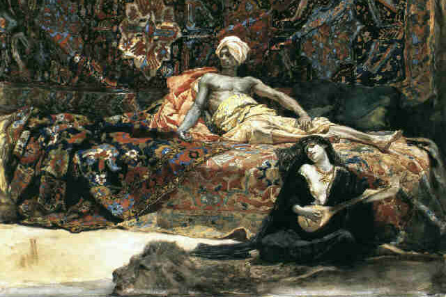

# Bagdad, la ciudad eterna

La descripción que vamos a hacer de Bagdad es durante el califato de Harún al-Raschid más o menos hacia el año 800 d.C. Los personajes, eventos y lugares que aparecen en esta sección pertenecen a esa época, aunque algunas cosas han sido modificadas para adecuarse a las terribles 1001 Noches que surgen de su unión con los Mitos de Cthulhu.

## Historia de Bagdad

Bagdad es una ciudad relativamente joven, fue fundada en el 762 por Al-Mansur, el abuelo de Harún al-Raschid, en las orillas del Tigris, no muy lejos de las míticas ruinas de Babilonia. La idea de Al-Mansur era que la ciudad fuera la nueva capital de su imperio.

En el año 758, Mansur reunió ingenieros, agrimensores y artistas de todo el mundo para elaborar planes para la ciudad. Más de 100.000 trabajadores participaron en la construcción, que comenzó el 23 de julio del año 762 d.C. Siguiendo esos planes, se creó en la orilla oeste del Tigris lo que ahora se conoce como la Ciudad Circular, una ciudad circular completamente amurallada.

La ciudad fue creciendo, debido a su capitalidad, su importancia en las rutas comerciales del Tigris y a que tenía agua y tierras fértiles alrededor. Se extendió primero alrededor de la Ciudad Circular, formando la zona que conocemos con Karkh y, más tarde, en la orilla este, formando Al Rusafa.

Como ya hemos dicho, la ciudad es bastante moderna y no se fundó sobre las ruinas de otra ciudad. Todo esto hace que sea muy difícil meter historias de exploración de ruinas perdidas, pero en compensación tenemos cerca las ruinas de la gran Babilonia y de la ciudad abandonada de Ctesifonte.

## La ciudad

") 

Bagdad es la ciudad más importante de Oriente Medio, es la capital de Califato Abbasí, que tiene como califa a Harún al-Raschid. El califato abarca tierras que van desde Libia hasta Afganistán. Las actuales Irak, Irán, Arabia Saudí, Yemen, Israel, Palestina, Líbano, etc. están bajo el dominio del Califa de Bagdad.

Productos de todo el mundo inundan sus zocos y gentes de todas partes recorren sus calles. Los dinares corren de mano en mano y el lujo y la pompa de la ciudad y sus palacios no tienen igual en el resto del mundo.

La ciudad de Bagdad es un crisol de culturas en la que podemos encontrar no solo árabes, sino también persas, egipcios, judíos, griegos, arameos, turcos, etc. viviendo en una cierta armonía a pesar de sus diferencias culturales. La mayoría de estas comunidades siguen guardando su cultural, pero han pasado con los años a hablar todos árabe.

Todos los avances tecnológicos que se descubren en el mundo acaban en Bagdad. Por ejemplo, hay un molino de papel cuyo funcionamiento se ha conseguido de prisioneros de guerra chinos. Y los inventores e inventoras de todo el mundo vienen a pedir audiencia al Califa para que este vea sus creaciones e inventos y los financie.

El califa, en realidad su visir, en su plan de mejora de las estructuras públicas ha empezado a asfaltarlas con alquitrán, una nueva tecnología que permite mover las mercancías y las personas por la ciudad más fácilmente. De hecho, las principales calles de Bagdad son las únicas del mundo que usan este invento que en el futuro cubrirá medio mundo. El alquitrán evita que las calles se embarren con la lluvia y que los carros y las monturas se atasque en el lodo.

### Clima

Bagdad posee un clima subtropical muy caluroso y árido, de hecho, es una de las ciudades más calurosas del mundo. En verano, la temperatura media es de 35 °C con un sol abrasador y no hay casi lluvias. Durante el día pueden alcanzarse hasta los 50 °C a la sombra y por la noche bajar hasta los 20 °C. La humedad es muy baja y frecuentemente sufren tormentas de polvo veraniegas venidas del desierto.

Durante el invierno las temperaturas se suavizan notablemente, con máximas de 25 ºC, pero las mínimas pueden caer hasta los -5 °C. Es durante el invierno cuando se dan la mayoría de las precipitaciones anuales.

%20and%20accompanied%20by%20sunshine.) 

, corresponding to (772-922AD)") 

## Los barrios de Bagdad

La Bagdad se encuentra divido en infinidad de barrios, pero tenemos 3 principales, la Ciudad Circular, que es la medina o barrio antiguo, Karkh, la orilla oeste del Tigris y Al-Rusafa, la orilla este.

### La ciudad circular

La Ciudad Circular fue la parte inicial que Al Mansur mando construir. Es una ciudad amurallada dividida en 4 porciones. Cada porción forma un barrio con todos los servicios posibles, como suministro de agua o bazares de alimentos.

La ciudad circular se enclava dentro del barrio de Karkh y se accede a él a través de 4 puertas o babs una por cada barrio.

Durante años ha sido la parte rica de la ciudad, pero últimamente las clases altas se están moviendo al Khark donde hay terreno para construir palacetes más grandes con jardines aún más grandes.

#### Palacio de las Maravillas

También conocido como Palacio de la Puerta de Oro o Palacio de la Cúpula Verde (por la gran cúpula verde que exhibía), es la residencia principal del califa y se encuentra en una plaza ajardinada circular en el centro de la Ciudad Circular.

El palacio cuenta con una mezquita y la casa de la guardia a caballo que protegen al Califa. No hay ningún edificio a menos de 200 metros del palacio, de forma que para entrar en el palacio debe atravesarse la plaza y estar a la vista de la guardia de palacio.

 

La sala de audiencias del Califa se encuentra debajo de la cúpula verde y es aquí donde recibe a diplomáticos, resuelve disputas y problemas y a veces administra justicia. Siempre que está aquí, el Califa está acompañado por su visir y su portaalfanje.

Las estancias donde duerme el Califa son famosas por sus excelentes vistas de toda la ciudad. De hecho, por decreto califal ninguna edificación puede ser más alta que las estancias del Califa.

##### La estatua ecuestre de la cúpula verde

En lo más alto de la cúpula verde hay una estatua de un jinete a caballo con una lanza que mágicamente apunta en dirección de los ejércitos de los enemigos del Califa.

A nivel de juego es imposible atacar por sorpresa Bagdad con un ejército (más de 100 unidades de infantería, caballería, …), ya que la estatua avisa con su lanza por donde vienen. Si se realiza algún tipo de hechizo de invisibilidad, ocultación, … se tendrá que hacer una tirada enfrentada contra d12+3 de la estatua.

#### La muralla

El perímetro de la Ciudad Circular está fortificado con un foso de 12 m de ancho, una muralla exterior y una enorme muralla interior.

La muralla interior (44 m de ancho en la base, 14 en la parte superior y 30 m de altura), de ladrillos de adobe y una capa de ladrillo cocido a ambos lados, está custodiada por 132 torres circulares colocadas de forma equidistante en toda su extensión.

La muralla exterior tiene un ancho de 40 m y la misma altura que la interior. Entre las dos murallas había una zona vacía donde era difícil esconderse.

Hay patrullas de guardias vigilando día y noche las dos murallas, bien haciendo rondas (cada media hora pasa una patrulla) o desde las torres de vigilancia de la muralla interior.

La muralla tiene un perímetro de 8 km, lo que supone que necesitarías 2 horas andando para rodearla.

#### El bazar

El bazar de la mediana es el centro del comercio de la ciudad. Los más ricos, extraños y lujosos productos se venden en sus puestos y todos los días nuevos mercaderes con nuevos productos llegan al bazar.

Es el centro del comercio de la ciudad, de la región y de quizás de todo el Califato. En este bazar se hacen negocios de cientos de miles de dinares y se toman decisiones comerciales que montan caravanas de miles de camellos o fletan barcos a distantes regiones del mundo.

No hay ningún alimento, especie, tejido, material o producto manufacturado en todo en el mundo que no pueda comprarse en el bazar, incluso productos muy especiales, raros y casi siempre ilegales como el bang cretense puede ser comprados si sabes a quién preguntar.

El bazar de la medina, como el resto de bazares, es importante para la economía y el Califa tiene toda una serie de empleados públicos que recaudan impuestos, comprueban la calidad de los productos o como el almotacén que revisa que las herramientas de medida como metros o pesos no estén trucados.

##### El zoco

Dentro del bazar hay un zoco, cubierto y cerrado, en donde los comerciantes de productos de gran valor, como sedas, especies, oro y plata y los artesanos de productos como joyeros, sastres, sopladores de vidrio, ceramistas, etc. tienen sus tiendas. Esta zona solo es frecuentada por los ricos y poderosos de la ciudad y las clases bajas son vistas como sospechosas. Como en el bazar hay tabernas donde los comerciantes hacen negocios por miles de dinares mientras toman café o té.

Los propios comerciantes tienen seguridad privada en esta zona día y noche para evitar robos. Las puertas de estas calles del zoco son cerradas de noche con unos grandes candados.

#### La escuela de la docta Simpatía

> Ella le contestó: "¡Oh señor! estudié la sintaxis, la poesía, el derecho civil y el derecho general; la música, la astronomía, la geometría, la aritmética, la jurisprudencia desde el punto de vista de las sucesiones, y el arte de descifrar las escrituras mágicas y las inscripciones antiguas. Me sé de memoria el Libro Sublime y puedo leerle de siete maneras distintas; conozco exactamente el número de sus capítulos, de sus versículos, de sus divisiones, de sus diferentes partes y sus combinaciones, y cuantas líneas, palabras, letras consonantes y vocales encierra: recuerdo con precisión qué capítulos se inspiraron y escribieron en la Meca y cuáles otros se dictaron en Medina; no ignoro las leyes y los dogmas, sé distinguirlos con las tradiciones y diferenciar su grado de autenticidad; no soy una profana en lógica, ni en arquitectura, ni en filosofía, como tampoco en lo que afecta a la elocuencia, al lenguaje escogido, a la retórica y a las reglas de los versos, los cuales sé ordenar y medir sin omitir ninguna dificultad en su construcción; sé hacerlos sencillos y fluidos, como también complicados y enrevesados para deleitar solo a las gentes delicadas; y si a veces pongo en ellos oscuridad, es para fijar más la atención y halagar al espíritu, que despliega por último su trama sutil y frágil; en una palabra, aprendí muchas cosas y retuve cuanto aprendí.
> 
> **Referencia:** Historia de la docta Simpatía (n. 270)

Cuando su amo trato de vender a la inteligentísima Simpatía al Califa para pagar sus deudas, esta le demostró al Califa toda su sabiduría, superando todas las preguntas de los estudiosos y estudiosas de la Casa de la Sabiduría. El Califa Harún Al-Raschid asombrado, la dejó volver con su amo del que ella estaba enamorada y les dio 10.000 dinares. Su ahora marido sabiendo que ella administraría mejor el dinero, la puso al control de las finanzas.

Simpatía montó una academia donde enseña historia, arte, matemáticas, etc. al que le paga, aunque también recuerda sus orígenes y coge a niños y niñas de la calle con aptitudes y les da una educación y un futuro. De hecho, Fátima del Pequeño Consejo selecciona a quién se beca.

La academia es una gran sala llena de cojines y sillones donde los alumnos y alumnas reciben clases de Simpatía. Hay tapices y grabados en las paredes con dibujos de constelaciones, mapas, el sistema solar, etc. Hay astrolabios, compases y reglas, instrumentos musicales y lienzos y pinturas.

Cuando Simpatía no está en su aula, está en la Casa de la Sabiduría devorando los nuevos libros que llegan todas las semanas.

Por 1500 monedas y una semana de aprendizaje intensivo Simpatía puede darte un +1 a alguna de estas habilidades: Ciencias, Humanidades, Medicina o cualquier Idioma normal. Se puede estudiar con Simpatía más de una vez, pero no para la misma habilidad.

 

Hunayn ibn Ishaq, director de la Casa de la Sabiduría, estudiando astronomía.

#### Casa de la Sabiduría

La Casa de la Sabiduría o Casa del Saber es el más importante centro educativo de Bagdad y también funciona como biblioteca. Una de sus funciones principales es recopilar el conocimiento universal y traducirlo al árabe, convirtiendo a Bagdad en el centro intelectual de Oriente Medio y posiblemente del mundo entero.

En los abarrotados estantes de las salas de su biblioteca se estima que hay unos 60.000 tomos que recopilan todo el saber del mundo conocido por los árabes. Tiene traducciones de libros, principalmente griegos, hindúes y persas, pero también pueden encontrarse de lenguas menos comunes o incluso perdidas.

El actual director de la Casa de la Sabiduría es Hunayn ibn Ishaq, médico, traductor y una de las mentes más grandes de este tiempo.

El acceso a tanto a la biblioteca como a las clases que se imparten es público, cualquiera puede entrar siempre que se sepa comportarse, y vaya limpio y aseado. La realidad es que solo los más ricos pueden permitirse estudiar sin tener que trabajar y pagarse todo el material que exigen las clases. Además, solo los que saben leer pueden sacarle jugo a la extensa biblioteca.

Por la universidad hay empleados que pueden ayudarte a encontrar el libro que buscas o te pueden indicar la persona más adecuada para consultarle tus dudas. Por extraña y rara que sea tu duda, es muy fácil que alguno de los expertos y expertas que trabajan en la Casa de la Sabiduría pueda ayudarte a solucionarla.

También hay guardias de la ciudad que se encargan de proteger la valiosísima colección de libros. El robo de los libros o el ataque al personal de la Casa del Saber se paga con la perdida de una mano y la decapitación en caso de reincidencia.

##### El pasillo prohibido

Hay, en lo profundo de la biblioteca, un pasillo cuyo acceso está cerrado con una verja de plata, llamado el pasillo prohibido, donde se guardan las más deleznables obras sobre magia, nigromancia y conocimientos herejes. Solo el bibliotecario general tiene la llave para entrar y solo con el permiso del director se da acceso a esta zona.

La cerrada es bastante compleja, pero puede ser forzada (-4 Latrocinio). Hay que tener en cuenta que si te pillan en el pasillo prohibido sin permiso, te espera un alfanje que separará tu cabeza de tus hombros.

Tanto si alguien quiere pedir prestado como robar algunos o todos los libros del pasillo prohibido, solo tendrá acceso en ese momento a 4 grimorios que deberás generar al azar como si fueran un tesoro (ver más adelante) y sin que se repitan.

### Karkh

> Allá me informé del paraje que más me convendría habitar y me indicaron el barrio Karkh como el barrio mejor frecuentado y residencia habitual de los personajes importantes. Y fui a aquel barrio y alquilé en la calle Zaafarán una hermosa casa a la que mandé transportar mis riquezas y efectos.
> 
> **Referencia:** Historia del joven amarillo (n. 517)

Karkh denomina a toda la ribera oeste del Tigris. Es la zona más rica de la ciudad, donde los ricos y poderosos tienen sus palacios y mansiones. La gran y media burguesía también está establecida en este barrio.

Las infraestructuras municipales son buenas y la guardia de la ciudad vigila las leyes para la tranquilidad de sus ricos vecinos. Cuanto más cerca del río y menos calor y más caras son las casas.

#### Palacio de la Eternidad

> Pero el Destino, \[…\], quiso que el califa Harún-Al Raschid estuviese precisamente a aquella hora tomando el fresco, a la claridad de la luna, sentado junto a una de las ventanas d e su palacio que daba al Tigris. Y mirando por casualidad en aquella dirección, vio toda aquella iluminación que brillaba en el aire y se reflejaba a través del agua.
> 
> **Referencia:** Historia de Dulce-Amiga (n. 35)

Este palacio de nueva construcción a orillas del Tigris es un intento del Califa del huir del calor insoportable de la ciudad de Bagdad, a la que cariñosamente llama la "sauna". Es por ello que lo escribió cerca del frescor del río, pero lejos de los mosquitos de sus orillas.

Saliendo por la puerta de Jorasán en dirección al puente de Bagdad podemos llegar a este palacio. De hecho, su cercanía con el puente hace que muchas de sus aventuras nocturnas empiecen en el puente lleno siempre de actividad.

El palacio es casi igual de grande que el palacio de las Maravillas, pero no tiene zona de audiencias. Cuando el Califa está aquí no recibe a nadie, aunque en caso de necesidad sus siervos podrían montar Una sala de audiencias.

El palacio está rodeado de unos [inmensos jardines](#anchorjardineseternidad). Los que rodean el palacio son privados y para disfrute del califa, pero el resto son públicos para el disfrute de cualquier persona. Aun así, las patrullas que vigilan el palacio también vigilan los jardines privados y públicos.

##### La perrera de los salukis del Califa

Dentro de los terrenos privados del Palacio de la eternidad tiene unas perreras donde tiene a sus salukis o galgos persas con los que suele ir a cazar. Estos perros son excelentes cazadores y el Califa gusta de salir a cazar con ellos.

Giafar ha mandado entrenar a los salukis como perros guardianes y los deja moverse libremente por el jardín privado del palacio para que vigilen el palacio cuando el Califa está en él. Los salukis han demostrado varias veces ser muy útiles contra ladrones y asesinos que querían acabar con la vida del Califa.

#### Casa de fieras

En los jardines públicos del Palacio de la Eternidad, el Califa ha construido una casa de fieras, un zoológico donde el Califa guarda todos los animales que recibe como presente de dignatarios extranjeros. Tiene herbívoros como elefantes, jirafas, cebras, etc. y también peligrosos depredadores como tigres, leones y leopardos.

Todos estos animales están en jaulas repartidas por el jardín. Las condiciones de estos animales no son buenas. Están bien alimentados y cuidados, pero sus jaulas siguen siendo cárceles. Es famosa su gigantesca pajarera, una estructura de 10 metros de alto enrejado donde tiene todo tipo aves.

Pero no solo hay aves y animales en la casa de fieras. Han tenido varios monstruos y yinns expuestos para disfrute y horror de los visitantes como ghūles, habitantes de las arenas o al mighos. El califa paga muy bien por estos seres y hay cazadores de monstruos que traen este tipo de seres para cobrar la recompensa.

> /s/ **Semilla de aventura:** Se dice que el Califa pagaría 20.000 dinares por una cría de Rokh o un huevo viable del que termine saliendo un polluelo. Es mucho dinero como para que un grupo de schahriars no se plantee tratar de traerle un polluelo al Califa.

##### El palomar del califa

Dentro de las instalaciones de la casa de las fieras hay también un palomar bastante grande atendido por un maestro de las palomas que cría, entrena y usa unas 500 palomas mensajeras. Estas palomas permiten al Califa comunicarse con sus generales en tiempos de guerra y con sus embajadores en tiempos de paz.

Todos los mensajes que se envían van encriptados y aunque no es imposible es muy difícil descifrarlos. Muchas veces el tiempo que lleva desencriptarlos es tanto que el mensaje se vuelve irrelevante.

##### El plan del visir

Si bien la casa de las fieras es una idea del Califa, el visir Giafar ha visto que puede servirle de mucho en sus planes de protección de la ciudad contra yinns y otros horrores.

Por un lado, acostumbra a los ciudadanos de Bagdad a este tipo de horrores. Las primeras veces que trajo seres de los Mitos y los expuso en la casa de las fieras, la gente huía despavorida, gritaba histérica o caía inconsciente. Los últimos horrores han empezado a generar curiosidad e incluso risas.

Por otro lado, puede financiar capturas de monstruos peligrosos sin que el califa sospeche nada. Cuando detecta problemas con horrores, hace correr el rumor sobre el monstruo y los cazadores se ponen en marcha esperando cobrar la recompensa que ofrece el califa.

#### El refugio de la secta de la progenie de la Luna Creciente en Bagdad

La secta usa el sótano de una carnicería del zoco de alimentación de arrabal de Karkh como lugar de reunión y para hacer sus rituales impíos. Mataron al anterior dueño y compraron la carnicería a sus hijos.

El hecho de que sea una carnicería les permite esconder fácilmente la entrada de víctimas como piezas de carne y salida de cadáveres perfectamente cortados y deshuesados en la carnicería. El sótano es grande y está perfectamente insonorizado, con una sola entrada y salida por la tienda que siempre está vigilada.

Los esqueletos de las víctimas los están vendiendo como huesos de animales dando buenos beneficios. Son usados para hacer alquitrán, el nuevo material con el que se están cubriendo las calles de Bagdad y que tan buenos resultados está dando.

#### Taberna del judío Abraham

> Y para festejar alegremente su libertad y su nuevo cargo, principió por ir a la taberna regida por el judío Abraham, testigo de sus pasadas hazañas, vaciando dos o tres frascos de su bebida favorita, vino jónico excelente.
> 
> **Referencia:** Historia del Grano-del-Belleza (n. 267)

Este animado local es uno de los más populares de la ciudad. Buena comida, buena bebida, buena música y buena compañía, todo a precios muy populares. Es el sitio perfecto para montar celebraciones, por lo que siempre hay gente celebrando buenos negocios, tras volver de largos viajes o eventos especiales como nacimientos y bodas.

La taberna de una sola planta tiene una zona central con mesas y luego alrededor varias salas privadas que pueden ser alquiladas. Abraham, además, ofrece banquetes, músicos y bailarines para las celebraciones privadas.

Cuentan los parroquianos que el Califa suele visitar esta taberna disfrazados de mercader. Si pasas el suficiente tiempo en su interior, podrías encontrarte con el Califa e invitarle a una ronda para ganarte su amistad.

#### Bimaristán Adudi

Actualmente, Bagdad cuenta con 5 maristanes, pero el Bimaristán Adudi es el mayor y más moderno. Está en la orilla oeste del Tigris, al norte de la ciudad.

Se cuenta que a la hora de buscarle emplazamiento, Al Razi, su primer director, colocó cuatro trozos de carne en cuatro puntos de la ciudad y levantaron el hospital en el lugar en el que más tiempo tardó en descomponerse.

Adudi son las mejores instalaciones médicas de Bagdad y seguramente del mundo.

Como ya hemos dicho, los maristán también se usan como instituciones mentales donde «cuidar» y «curar» a los enfermos mentales. En realidad solo en Adudi se cuida y se trata de curar de las personas con problemas mentales. El resto de maristanes son cárceles para «locos» y «maníacos» donde encerrarlos y maltratarlos. Las cadenas, los abusos y las palizas son el día a día para sus «reclusos».

Aunque de normal no hay forma de recuperar puntos de cordura, a no ser que sea con actos heroicos y de bondad, el personal de Adudi podría, a descripción de Scheherazade, devolver 1 punto de cordura a un schahriar ingresado en sus instalaciones. Esto debería ser extremadamente raro y extremadamente caro. También podría ser un regalo del Califa (o su visir) a persona que ha hecho grandes cosas para el califato.

### Al-Rusafa

Asi se denomina a la ribera este del Tigris. Podríamos definir que es la zona de ensanche de la ciudad. Zonas comerciales y casa baratas para las clases trabajadoras, lejos de palacios y las mansiones de la gente rica y poderosa de Karkh. Aun así, en la orilla del Tigris aún podemos encontrar mansiones y palacios que aprovechan el frescor del río como el palacio de Hasani.

#### Palacio Hasani

Este es el más moderno de los palacios de Bagdad y el más importante de Al-Rusafa. En este palacio vive, cuando no está sirviendo a su señor, el Califa, el visir Giafar. Junto con él viven su mujer, sus hijos, sus hermanos y hermanas y su padre que fue visir del padre de Harún Al-Raschid, el califa Al-Mahdi.

Montado como refugio de «soltero» para el anterior califa donde tener sus escarceos, tiene unos jardines muy bellos con rincones ocultos para sus aventuras amorosos. También estaba lleno de habitaciones con camas gigantescas de muchos estilos dependiendo del humor de Al-Mahdi están ocupadas por la extensa familia del visir.

##### El sótano

Debajo de su palacio, el visir ha montado una guarida secreta en los sótanos del palacio donde realiza experimentos científicos y mágicos. Además, guarda ciertos objetos mágicos y mundanos de gran valor (botín de d12) y una pequeña biblioteca de libros de magia (1 ejemplar en perfectas condiciones de cada libro de la sección Grimorios y libros de hechizos). También tiene un pequeño templo donde lleva a cabo los ritos de su fe budista.

Se baja mediante una entrada secreta que solo es accesible a través de una puerta oculta en el despacho personal de Giafar. Esta puerta oculta solo abre al introducir su báculo de serpiente en determinada ranura de los relieves de la pared donde se oculta la puerta (dificultad -4 para detectarla con Notar).

#### El yakhchāl del califa

> y echó en ella agua de la fuente, que enfrió con un pedazo de hielo, y lo mezcló todo con azúcar y agua de rosas, y después se lo presentó al califa.
> 
> **Referencia:** Historia del mandadero y las tres doncellas (n. 10)

Dentro de los muchos caprichos del Califa, uno de los más extravagantes son los sorbetes, hielo picado con zumos de frutas. Es por ello que el Califa mando construir un yakhchāl en Al-Rusafa, donde se produce y conserva el hielo para sus queridos sorbetes.

_Meybod_Iran.jpg "yakhchal or icehouse (exterior), Meybod, Iran. Ggia") 

Un yakhchāl es un edificio en forma de cucurucho que permite crear hielo en invierno mediante refrigeración por evaporación y de conservarlo en verano sin casi perdidas.

Solo el califa y quien él designe pueden disfrutar de este hielo. No se vende a nadie y robarlo se pena con la perdida del brazo a la altura de codo.

##### La morgue del visir

Giafar usa este yakhchāl como refrigerador donde mantener los cuerpos de diferentes seres mientras los estudia. Mantiene los cuerpos dentro de dos sarcófagos de madera ricamente decorados llenos de hielo picado. Puedes elegir que hay dentro siempre que no sean muy grandes. Si abren uno o los dos sarcófagos tendrán que enfrentarse a TPC del monstruo, pueden ser dos seres de la misma especie (una sola TPC para ambos sarcófagos) o de diferente especie (dos TPC separadas).

#### Taberna de Hagg-Karim al-Mossuli

> Y salió de la casa y se fue a la calle Mustafá, y entró en la taberna de Hagg-Karim el de Mosul.  
> Empezó por hacer una zalema muy amable al tabernero Hagg-Karim, quien se la devolvió con creces, encantado. Entonces le dijo ella: «¡Ya Hagg-Karim! ¡He aquí cinco dinares para ti si quieres alquilarme hasta mañana la sala interior grande, adonde voy a invitar a algunos amigos, sin que puedan penetrar allí tus parroquianos habituales!»
> 
> **Referencia:** Historia de los artificios de Dalila la taimada y de su hija Zeinab la embustera con Ahmad-la-Tiña, Hassan-la-Peste y Alí Azogue (n. 446)

La taberna de Hagg-Karim es el local de peor reputación de todo Bagdad. Su clientela habitual es lo peor de la ciudad y las redadas policiales son bastante frecuentes. Pero es el lugar perfecto si necesitas encontrar gente de los bajos fondos para asesinar, robar o extorsionar. También puedes encontrar todo tipo de productos ilegales o restringidos.

Lo más importante es que hay un acuerdo tácito entre sus habituales de no meterse en los asuntos de otros. Nadie ha visto a nadie en la taberna y no sabe qué buscaba. Si se corre la voz de que alguien es un chivato, es expulsado del bar después de ser embreado y emplumado.

#### El nuevo hammam

> Cuentan ¡oh rey afortunado! que cierto masajista del hammam tenía de ordinario entre su clientela a los hijos de los notables y de los ciudadanos más ricos, porque el hammam donde ejercía su oficio era el mejor acreditado de toda la ciudad. Y he aquí que un día entró en la sala en que esperaba él a los bañistas un mozalbete todavía virgen de pelos, pero muy rollizo y abundante en redondeces por todas partes a la vez; y aquel mozuelo era muy hermoso de rostro; y era el propio hijo del gran visir de la ciudad.
> 
> **Referencia:** El mozalbete y el masajista del hammam (n. 501)

Este hammam de nueva construcción es un prodigio de la arquitectura moderna. Los mejores materiales se han usado en este hammam de una forma muy bella. Tampoco se han reparado en gastos a la hora de comprar incienso, aceites de masajes, perfumes y kohles. Es por ello que la gente rica y poderosa de Bagdad y los y las mercaderes de fuera de Bagdad van a sus piscinas y salas de vapor para relajarse y recibir diversos tratamientos y masajes. Es por ello que sus precios no son para la gente normal.

Es costumbre en el hammam llegar a acuerdos y pactos comerciales y políticos entre sus habitaciones y la discreción de sus trabajadores y trabajadoras es muy importante. Eso no pasa en este hammam, donde su dueño ha puesto mirillas secretas para vigilar a sus clientes y paga a sus trabajadores buenas sumas para que escuchen los secretos que se revelan en sus estancias.

Yussuf Islam, dueño del hammam y apodado el gato, vende todos esos secretos a gente que esté interesada, bien porque les afecta directamente o porque les podría beneficiar o perjudicar. También ha chantajeado a maridos y esposas infieles y respetables personas con oscuros vicios o secretos.

Yussuf no tiene nada por escrito, todo lo retiene en su cerebro, así que todos los secretos deberían morir con él

> /s/ **Semilla de aventura:**Una de las escapadas nocturnas del califa acabó en el Nuevo Hammam y entre el relax de los masajes y los vapores del alcohol que habían tomado antes, a alguien del séquito del califa se le ha ido la lengua. Tus schahriars deberán asegurarse de que Yussuf no hable sobre el tema, desde ejecutándolo a pagarle o borrarle recuerdos.

#### Escuela de danza de Neima Akef

> La primera de estas jóvenes era blanca, la segunda morena, la tercera gruesa, la cuarta delgada, la quinta rubia y la sexta negra. Y en verdad que las seis alcanzaban el límite de las perfecciones, avalorando su espíritu con el conocimiento de las bellas letras y sobresaliendo en el arte de la danza y de los instrumentos armónicos.
> 
> **Referencia:** Historia de las seis jóvenes de distintos colores (n. 331)

 

Neima Akef es una de las mejores bailarinas de Bagdad. En la cima de carrera decidió montar una escuela donde enseñar su arte a las personas que lo aman tanto como ella.

Su escuela, a pesar de lo que podría creerse, está en la pobre Al-Rusafa y no en el rico Karkh, en un antiguo palacio que es también su casa. La realidad es que, aunque cobra bien por sus clases, no puede permitirse un palacete en Karkh con lo que gana como profesora.

En la sala de baile tiene todo tipo de ropajes de sus tiempos como bailarina que sus alumnos y alumnas usan en sus prácticas. Tiene contratados a intérpretes musicales que tocan durante las clases y un par de guardaespaldas que cuidan de ella y de las joyas que siempre lleva encima.

Neima es muy selectiva, por no decir elitista, sobre a quien enseña todo su arte. Normalmente, no acepta a cualquiera, solo enseña su arte a quien ella cree que lo merece y que tenga según ella «verdadero talento».

**Clases de danza:** Por unos 2500 dinares y dos semanas de entrenamiento intensivo, mejorará el valor de Interpretación del schahriar en un nivel de dado cuando baile. Su valor de habilidad no sufre cambios, por ejemplo, al gastar avance.  
Para que te acepte en su escuela deberás demostrar que tienes mucho dinero o un mínimo de d6 en Interpretación.

 

## Las puertas y los caminos de entrada a la ciudad## 

> "¡Apresurémonos, pues, a llegar a Bagdad antes de que cierren las puertas! ¡Porque has de saber, hijo mío, que el califa manda cerrar todas las noches las puertas de la ciudad con el fin de impedir que las hordas fanáticas entren a escondidas y se apoderen de los libros de la ciencia y de los manuscritos literarios encerrados en las salas de las escuelas, arrojándolos luego al Tigris!"
> 
> **Referencia:** Historia del Grano-del-Belleza (n. 259)

Las puertas de Bagdad, también llamadas babs, son muy importantes en la vida diaria de la ciudad. Desde la Ciudad Circular de Al Mansur y sus 4 babs, cada nuevo Califa ha ido fortificando la ciudad y cada nueva muralla ha supuesto la aparición de nuevos babs. Estos babs no solo tienen una función defensiva y de seguridad, también comercial e institucional.

Comercialmente, crean mercados, ya que los comerciantes de determinado producto o material usa unas puertas u otras, de forma que si quieres comprar lana vas a un babs a buscar a los comerciantes que usan esos babs y si necesitas hierro vas a otros babs. En los babs se cierran importantes negocios, dan riqueza a la ciudad.

Por otro lado, los babs sirven para controlar la entrada y salida de productos y de cobrar los impuestos adecuados. También se controla la entrada de contrabando y se vigila la calidad de los productos.

Los babs están abiertos 24 horas y vigilados las 24 horas, pero solo de día pueden moverse grandes cantidades de materiales y productos. Unos 5 guardas y un oficial guardan todo el día y la noche cada puerta con barracones cercanos para comer y dormir, mientras no estás de guardia.

Hay por toda la ciudad una red de campanas que si se hacen sonar hacen que todos los babs se cierren aislando la ciudad del exterior y las diferentes zonas de la ciudad entre sí. Las mismas campanas hacen que los babs se vuelvan a abrir.

### Babs de la Ciudad Circular

La Ciudad Circular tiene 4 babs de acceso en su muralla. Cada bab tiene el nombre de la ruta que empezaba en cada puerta. Así pues, tenemos la puerta de Kufa, la puerta de Damasco, la puerta de Jorasán y la puerta de Basora.

Todos los días al anochecer las 4 babs de la Ciudad Circular se cierra y solo las personas con los salvoconductos apropiados o conocidos por los guardas pueden entrar o salir.

Las puertas son guardadas por unos 20 guardas y unos 3 oficiales y no se abren hasta el amanecer. Durante el día el paso es libre, pero la guardia es libre de parar a cualquiera y registrarle, requisar lo que vea peligroso e incluso denegar la entrada a conocidos criminales y gente de mal vivir.

### Otras puertas de la ciudad

Vemos aquí algunas de las puertas más importantes o más interesantes que están por toda la ciudad de Bagdad.

* **Bab al-Muadham:** Esta puerta es famosa por el mercado de camellos que se monta en sus cercanías. Tanto si quieres una montura fuerte como si quieres participar en carreras de camellos, este es el lugar adecuado. También se venden caballos y mulas.
* **Bab ash-Sharqi:** También conocido como el bab del río porque la mayoría de las mercancías que suben o bajan por el río Tigris pasan por esta puerta. No es extrañar ver a Sindbad el marino cerca hablando y fanfarroneando con los comerciantes del río.
* **Bab Al-Talsim:** Está situada al norte de la ciudad y da acceso al exterior de la ciudad. Todo eso y las grandes explanadas que hay a su alrededor lo hacen ideal para ser el lugar donde organizan la mayoría de las caravanas que salen de Bagdad.
* **Bab al-Wastani:** Esta puerta ha cobrado importancia al ser casi obligatorio pasar por ella para llegar al Palacio de la Eternidad, con lo que es casi como una puerta de la ciudad Circular, cierra de noche y está más vigilada de lo normal.

 

Puente de Bagdad sobre el río Tigris

## El río Tigris

Bagdad se halla a la orilla del Tigris y, como ya hemos dicho, divide la ciudad en dos partes, Karkh y Al-Rusafa. Es su principal fuente de agua y de irrigación.

El Tigris ha sido una ruta de transporte importante durante mucho tiempo a través de un territorio mayormente desértico. Es navegable desde Basora hasta Bagdad por botes de poco calado, pero se requiere de balsas para el transporte hasta Mosul.

Hay una red de puentes a lo largo de la ciudad que une ambas orillas del río, siendo el más importante por su tamaño y tráfico el conocido como Puente de Bagdad. Hay además toda una serie de bateleros que con sus barcas permiten cruzar el Tigris en las zonas en las que no hay puentes. Estos barqueros también pueden llevarte de una parte de la ciudad a otra subiendo o bajando el río.

### Puente de Bagdad

Este puente de piedra es el principal punto de conexión entre las dos orillas del Tigris, Khark y Rusafa. No es el único que cruza el río, pero debido a su cercanía a la medina es el más frecuentado.

Tiene tráfico de personas, animales y mercancías las 24 horas del día y siempre hay algo que ver. Varios mendigos pasan las horas pidiendo caridad en el puente y por una buena propina podrán decirte si han visto pasar a alguien o vigilarán si ven algo o a alguien.

Se dice que el califa cada mes se disfraza de mercader extranjero y junto a su visir y su porta-alfanje recorren la ciudad para vivir aventuras, conocer como vive su pueblo y ver que sus dictados son cumplidos. Uno de sus sitios preferidos para pasear es este puente al anochecer con el frescor de la noche. Además, le pilla muy cerca de su palacio de verano, el Palacio de la Eternidad.

### Molino de papel

En la orilla oeste podemos encontrar un molino papel donde se crea el papel que se usa para los libros y las traducciones de la casa de la sabiduría. Usa las fuerza del agua del Tigris para mover sus gigantes piedras de molino y hacer pulpa de papel.

Esta fábrica se ha construido gracias al apoyo y la intervención del visir Giafar. Se comenta que la tecnología para la fabricación de papel viene de prisioneros chinos de la Batalla del Talas.

El molino tiene lo último en tecnología alquímica y cada cierto tiempo el visir usa las instalaciones para sus investigaciones y experimentos. Los trabajadores son afines al visir y este les paga muy bien por su silencio.

Con el consentimiento del visir o una buena suma de dinero (por su silencio y trabajo extra) y suministrándoles los materiales apropiados, los trabajadores del molino de papel pueden preparar cualquier tipo de compuesto alquímico en grandes cantidades. Si fuera necesario, con aún más dinero o una buena motivación, se podría conseguir en un tiempo récord.

### Fauna y flora del río

El río tiene poca fauna a la altura de Bagdad, algunas aves acuáticas, varias especies de peces y animales domésticos como camellos, burros, perros y gatos vienen a beber al río. La flora tampoco es muy abundante, predominando en sus orillas los cañaverales y palmeras. De mamíferos, pueden encontrarse todavía nutrías, pero estás siendo expulsadas por los pescadores a otros tramos del río.

### Cosas extrañas

El río es una fuente de cosas extrañas que salen de él y que suelen acabar en las redes de los pescadores, desde botellas antiguas de las que hay todo tipo de objetos, peces que son personas encantadas o, en el peor de los casos, cajones llenos de cadáveres descuartizados.

Es un suceso raro, pero se saben de casos de gentes de mar que han subido por el cauce del río, más por exploración que realmente por algún tipo de plan de guerra o similar. Las habladurías dicen que algunos pescadores han tenido relaciones carnales con las gentes del mar, pero solo son habladurías.

Una costumbre curiosa es predecir tu buena fortuna pidiendo a un pescador que lance tu red en tu nombre. Si saca una gran cantidad de peces, tendrá buena suerte. Si la red sale vacía te espera alguna desgracia. Los comerciantes antes de partir con las caravanas o de hacer grandes negocios suelen cumplir este ritual.

**Recompensa de deseos:** Por unas pocas monedas un pescador tirará la red en tu nombre. Tira unos dados detrás de la pantalla y si quieres dales unos deseos a tus schahriars.

## Las afueras de la ciudad

En la periferia de Bagdad podemos encontrar toda una serie de lugares interesantes donde localizar nuestras aventuras. Sitios normalmente abandonados y vacíos que contrastan con las abarrotadas calles de la urbe.

### Ctesifonte

Ctesifonte es ahora mismo una ciudad fantasma. Era la ciudad más grande de la zona, pero con la fundación de Bagdad empezó a perder población que buscaba las oportunidades de negocio y los avances urbanísticos que ofrecía la nueva ciudad del Califa.

Desde hace unos 20 años es una ciudad vacía, solo habitada por mendigos, locos y proscritos. Sus mansiones y sus chozas son poco a poco tragadas por el desierto. Lo que no se llevaron sus dueños ha sido saqueado durante años y ya no hay nada de valor entre sus edificios desiertos.

Los cambios económicos no fueron la única causa del declive de la ciudad, el aura de depresión y locura de un waram que habitaba las catacumbas de la ciudad hizo que mucha gente abandonará la ciudad y su ambiente depresivo y diabólico. Cuando la ciudad se quedó vacía, el nexo de energía que forma el waram se marchó y tarde o temprano aparecerá en otro lugar corrompiéndolo.

> /s/ **Semilla de aventura:** Algún rico personaje de Bagdad puede contratar a tus schahriars para que busquen alguna reliquia familiar que se dejó atrás en Ctesifonte. La ciudad puede estar controlada por alguna secta depravada que la usa de base para su culpo. La secta no quiere testigos de sus actividades y tratará de cazar y matar a tus schahriars. También puede que alguna invocación haya salido mal y la ciudad esté habitada con monstruos de los Mitos que acechan entre las sombras a inocentes visitantes.

### Cementerio de Al-Kazimiyya

Al norte de la ciudad, en las afueras, está el mayor cementerio de la ciudad, el cementerio de Al-Kazimiyya. Es el más grande de la ciudad y es usado principalmente por las clases bajas de Bagdad. Los más ricos prefieren usar los pequeños cementerios que hay dentro de la ciudad, donde sus familias llevan varias generaciones enterradas en lujosos rawdas.

El cementerio tiene a su alrededor zonas para otras confesiones (judíos y cristianos principalmente), pero estas ni se cuidan ni se vigilan. Quedan al cuidado de las personas de sus creyentes y del dinero que puedan recaudar para su protección y mantenimiento.

De día tiene bastante actividad, desde familias de luto a limpiadores, plañideros, sepultureros, etc. pero en cuanto se pone el sol, se cierran sus puertas y nadie o casi nadie se queda dentro temerosos de los yinns que salen de noche.

Una importante comunidad de ghūles vive en este cementerio. De día se esconden en sus madrigueras y en los rawdas más antiguos y abandonados y por las noches salen en busca de los cadáveres recién enterrados. Debido a los saqueos de cuerpos, los ricos y poderosos, que no han conseguido ser enterrados en los cementerios de dentro de la ciudad, construyen mausoleos con fuertes paredes, gruesos suelos y puertas reforzadas para evitar la profanación de sus cadáveres. Mientras los pobres, o vigilan las tumbas de sus muertos, o aceptan el hecho de que el cadáver de su ser querido muerto acabará desapareciendo.

El califa ha mandado varias veces a su guardia a intentar acabar con esos necrófagos, pero sin mucho éxito, ya que su capacidad de cavar les permite desaparecer cuando se ven en peligro. Además, se sabe que la gente herida por un ghūl se convierte en uno de ellos y son pocos los soldados que quieren enfrentarse a la posibilidad de acabar sus días devorando cadáveres en un inhóspito cementerio.

### La guarida de Bahram el Gauro y fosa común de la mayoría de sus víctimas

Al sur de la ciudad de Bagdad, a medio día de camino, en una zona rocosa, Bahram el Gauro tiene una guarida secreta. Es una cueva natural que abre y cierra con las palabras mágicas "Ábrete, sésamo". En su interior tiene todo tipo de utensilios y productos alquímicos, grimorios, mesas de trabajo, etc. También tiene una zona de descanso con un camastro y raciones de comida y agua para varios días.

La cueva está protegida por una serie de defensas mágicas. Además, del hechizo de abrir puertas, cuando se marcha por largos periodos suelen dejar dentro un grupo de 5 o 6 nasnas que acabarían con posibles ladrones e intrusos. También deja algunas trampas explosivas (usar estadísticas de granadas) que se activan al abrir cajones, baúles o armarios.

Si alguien encuentra la cueva y consigue entrar y evitar las defensas mágicas de Bahram puede conseguir un botín de d12. Aparte podrán encontrar 4 grimorios mágicos que deberás diferentes que podrás crear con las tablas de tesoro.

#### El altar

Llama la atención en el centro de la cueva un gran altar de arenisca. La parte de arriba está vaciada y dentro tiene cenizas, restos de madera y huesos sin terminar de incinerar. Encima tiene una parrilla metálica donde Bahram asa literalmente a sus víctimas. La cueva no tiene salida de humos y Bahram debería intoxicarse con los humos que genera el altar al incinerar a sus víctimas. Sin embargo, el altar no genera humo, solo llamas y brasas.

Ver como Bahram quema vivas a las personas que secuestra mientras hace sus rituales a Nardún tiene una TPC d6. Los gritos, el chisporroteo de la grasa de la piel y el olor a carne quemada, acompañado todo por los terribles rituales de Bahram es un espectáculo que te puede conducir a la locura.

#### La llama eterna de Nardún

En un de los lados de cueva hay una hornacina donde Bahram tiene una llama eterna que heredo de su maestro y este del suyo, así durante generaciones. Se supone que viene del fuego que destruyo Sodoma y Gomorra. Para los adoradores del Fuego y de la Luz, Sodoma y Gomorra fueron destruidos por Nardún y ese fuego tendría parte de su esencia.

Esta llama eterna es la que usa para encender el fuego en el altar y al igual que este tampoco arroja humo. Se dice que los yinns fueron creados por un tipo de fuego sin humo que podría tener el mismo origen que el de la llama eterna.

No necesita combustible y ni se apaga ni se hace más grande, pero sí quema. Se podría coger con la mano y meterla en una linterna que alumbraría como una antorcha sin apagarse nunca. Esto sería tomado por los seguidores del Fuego y de la Luz como una herejía y toda la secta se lanzaría a tu caza para recuperar la llama y luego quemarte vivo con ella.

 

#### La fosa común

No lejos de su guarida, entre unos peñascos hay una profunda cueva donde Bahram se deshace de los cadáveres de sus víctimas. En condiciones normales se desharía de los cuerpos en el desierto, pero cuando sus macabros asesinatos son cerca de Bagdad, suele deshacerse del cadáver en esta fosa común.

Además, este "cementerio" le nutre, si lo necesita, de cadáveres para sus impíos rituales y no es la primera vez que usa los restos de cadáveres para alimentar a diferentes seres de otros planos o para levantar nasnas que le protejan.

## Cerca de la ciudad

En los territorios cercanos a Bagdad (a menos de una semana a caballo o camello) podemos encontrar lugares muy interesantes donde pueden ocurrir grandes aventuras, desde ruinas antiquísimas cubiertas de arena y misterios hasta zonas deshabitada llenas de extrañas historias.

### El Valle de los perros

> "Mejor será hijo mío, seguir hasta Bagdad esta misma noche, sin detenernos a acampar aquí. ¡Porque el lugar en que estamos es el más peligroso de todo el viaje! ¡Es el valle de los Perros! ¡Hay gran riesgo de que nos ataquen si permanecemos aquí durante la noche!"
> 
> **Referencia:** Historia del Grano-del-Belleza (n. 259)

El valle de los perros, una zona cercana a Bagdad en la ruta a Damasco, donde los ataques de bandidos son bastante frecuente. La orografía de la zona permite que los bandidos tiendan emboscadas a las caravanas o que les ataquen con la protección de la noche.

Las gargantas y los estrechos pasos, como las redes de cuevas, hacen que la guardia de califa tenga muchos problemas para acabar con los bandidos y hacer segura la zona.

### Región de Balad Ruz

Al noreste Bagdad, antes de llegar a las montañas Zagros hay una gran zona desértica llamada Balad Ruz. Está escasamente poblado y sus pocos pobladores son tribus nómadas bastante belicosas.

El Califa aconsejado por su visir está tratando de crear una ruta comercial que atraviese las montañas que traiga riqueza y paz a la zona. Por ello está creando una calzada y creando khans a lo largo de la nueva ruta.

Las tribus locales son reticentes a estos cambios y los más violentos sabotean los trabajos de construcción. Parece ser que no quieren gentes de fuera en sus tierras, que metan sus narices en lo que no les importa. Aun así, el califa sigue con sus planes, no quiere tener a unos salvajes nómadas tan cerca de su moderna ciudad.

De hace unos años a esta parte la actividad sísmica de la zona ha aumentado más de lo normal. Esto es debido a las excavaciones de los al mighos para extraer tierras raras en las que usan explosivos de baja potencia y técnicas de fracturación hidráulica.

Los ánimos de las tribus de pastores son exaltados por agentes afines a los al mighos. Estos no ven con buenos ojos que la desértica y solitaria zona se llene de comerciantes que les molesten en tus trabajos de minería.

### Wadi us-Salaam

 

Wadi us-Salaam o Valle de la Paz se encuentra en la ciudad de Nayaf, a unos 4 días a caballo al sur de Bagdad. Está considerado como uno de los cementerios de mayor extensión del califato. Fue constituido como cementerio hacia el año 600, aunque se saben de enterramientos muchísimo más antiguos con lo que también es uno de los enterramientos más antiguos que se conocen. Durante los 200 años que lleva recibiendo cuerpos ha ido creciendo exponencialmente.

Hay una gran variedad de enterramientos, desde las tumbas bajas hasta las torres o tumbas altas de más de 4 metros de altura. También hay estancias subterráneas y recintos especiales destinados a familias enteras.

Es tal su tamaño, su número de tumbas, su desorden y lo rápido que cambia que es casi imposible orientarse y todas las tiradas de orientación o similar sufre una penalización de -2.

Lo curioso de esta necrópolis es que con los años se ha convertido en una ciudad viva en la que viven y trabajan todo tipo de personas relacionadas con la muerte y los entierros. Entre sus tumbas se han construido casas para gente que se dedicaba a enterrar los cuerpos, a cuidar y limpiar las tumbas, preparar los cadáveres para ser enterrados, etc. Y esa gente necesitaba otra gente que hiciese pan, herramientas, platos, etc. creándose una minisociedad dedicada a la muerte.

Como no podía faltar, el cementerio atrae a ghūles que ven Wadi us-Salaam como el mayor buffet libre de la historia. Sin embargo, los y las que viven allí han aprendido a combatir a estos seres. Saben sus costumbres y sus tácticas y están preparados para proteger las tumbas de estos yinns carroñeros.

Pasando una semana en Wadi us-Salaam, haciendo una tirada de TPC d4 y gastando 500 dinares, mientras estás allí en comercios locales, limosnas, regalos e invitando a la gente local, puedes aprender de ellos de todo sobre los ghūles. Esto te dará la ventaja Acostumbrado al horror (Ghūles) debido a los diversos avistamientos nocturnos de ghūles junto a los parroquianos y un +2 a las tiradas no de combate que tengan que ver con los ghūles debido a las largas horas escuchando historias y anécdotas sobre estos necrófagos.

Se dice que el cuerpo del profeta Saleh y sus reliquias, como su arco mágico, están enterrados en alguno de los mausoleos de esta necrópolis. Muchos saqueadores de tumbas han tratado de encontrar su tumba, pero parece que nadie ha tenido éxito.

> /s/ **Recompensa de cordura (+1):** Dentro de algunas sectas musulmanas es muy importante ser enterrado en Wadi us-Salaam. Recompensa con un punto de cordura a los schahriars que se encarguen personalmente de que se entierre a PNJ u otros schahriars en Wadi us-Salaam y velen su cadáver contra ladrones de cadáveres y ghūles.

 

### Ruinas de Babilonia

Babilonia es la ciudad más famosa de la antigua Mesopotamia y sus ruinas se encuentran a tres días a caballo al suroeste de Bagdad, en las orillas del Eufrates. Es una de las primeras ciudades de a historia y aparece varias en diferentes textos sagrados de las diferentes religiones de la zona.

Histórica y mitológicamente, Babilonia es famosa por varias cosas que puedes introducir en las partidas.

* Sus jardines colgantes, considerados una de las maravillas del mundo antiguo, aunque no se tengan pruebas actuales de su existencia.
* La famosa torre de Babel que seguramente sería el Etemenanki, un gigantesco templo dedicado a Marduk.
* Babilonia es el lugar que fascino a Iskandar y donde paso sus últimos años. Eso te permite que en las ruinas haya restos de las conquistas de Iskandar por todo el mundo.

Las ruinas de Babilonia pueden ser tan grandes como necesites en tu aventura y pueden contener lo que necesites para tu cuentos, desde altares donde se adoraban a primigenios y dioses exteriores hasta tecnología perdida que pude cambiar la historia de la humanidad.

La configuración de las ruinas puede tener cualquier forma, desde catacumbas, hasta palacios o altas torres y zigurats. Siéntete libre de montar tu zona a explorar como quieras.

En la aventura "La llegada del cometa" tienes un ejemplo de una exploración de las ruinas de la ciudad en busca de una estatua que contiene parte de la esencia de Suc’Naath. Puede que te den alguna idea de como meter Babilonia y sus misterios en tu aventura.

## Personas notables de la ciudad

Bagdad está poblado de todo tipo de personas, ricas y pobres, listas y tontas, tristes y alegres, jóvenes y viejas, … Estas son las más notables e interesantes que deambulan por las calles y callejones de la gloriosa y eterna Bagdad.

### Gobierno de la ciudad

Cuando hablamos del gobierno de la ciudad, hablamos también del gobierno de un inmenso califato. Las decisiones que toma el Califa y su visir no solo afectan a Bagdad, sino a miles y miles de vidas. Muchas decisiones políticas terminan afectando a la ciudad que se ve beneficiada o perjudicada por ellas.

Una ley del califa para que su ejército ataque a un enemigo puede hacer que este se vengue atacando la ciudad o que el visir mande crear una nueva ruta comercial en las tierras del norte, seguramente terminará afectando a la economía de Bagdad.

#### Harún Al-Raschid, Califa de Bagdad

Harún Al-Raschid es un niño caprichoso y bobo en el cuerpo de un Califa dueño de medio mundo. Es celoso, caprichoso y rencoroso. En definitiva, es un caso claro de síndrome de Peter Pan. Solo su tremenda suerte le han librado de muchos problemas, suerte que empezó con la muerte de su hermano mayor que iba a ser el futuro Califa. A partir de ese momento la providencia le ha sonreído en todo lo que ha intentado por muy loco que fuera.

La verdad es que si no fuera por el arduo trabajo de su esposa, la califesa Zobeida, y su visir, Giafar el Barmáquida, los habitantes de Bagdad se habrían rebelado y seguramente le habrían asesinado debido a sus locas y peligrosas ideas políticas que haría llevado a cabo.

#### Sett Zobeida, Fuerza-de-los-Corazones y Califesa de Bagdad

Sett Zobeida es una muy competente regente que junto al gran visir Giafar tratan como puede de compensar y arreglar los desvaríos, caprichos y chaladuras del Califa. De hecho, gran parte de su trabajo es tener al Califa entretenido con acertijos, juguetes y juegos para que esté lo más alejado de la política del reino.

Su matrimonio fue un matrimonio concertado entre su padre y el Califa, de forma que el amor no tuvo nada que ver, de hecho la Califesa Sett Zobeida y su marido el Califa son primos, cosa que no agrada mucho a Zobeida.

Cuentan las malas lenguas que ha tenido algún tipo de affaire con el poeta Abu-Nowas. Sin embargo, esto es totalmente falso. Lo que sí es cierto es que Abu-Nowas es un mirón que se ha dedicado en varias veces a espiarla en sus estancias sin su consentimiento.

#### Giafar, gran visir del Califa de Bagdad

Giafar es el principal personaje de esta ambientación. Es el personaje alrededor del que gira gran parte de las tramas y aventuras ambientadas que suceden Bagdad. Está lleno de secretos y es un excepcional mago con poderes sin paragón. Pocas personas pueden compararse con él y, aun así, será incapaz de escapar al terrible destino que se cierne sobre él.

#### Ibrahim Ibn Jibril, general del Califa de Bagdad (y sumo sacerdote de la Progenie de la Luna Creciente)

La genialidad militar de Ibrahim solo es comparable con su sadismo. De un recluta venido de las inhóspitas tierras de Balaz Rud ascendió hasta general gracias a sus excelentes actuaciones allí donde era enviado.

Lo que nadie sabe es que este exitoso general es el sumo sacerdote del culto de la Progenie de la Luna Creciente. Su carrera militar ha sido impulsada gracias a la magia y la intervención de los al mighos hasta convertirse en el militar de confianza del Califa.

El plan es tener alguien cerca del Califa que pueda impedir todos sus planes de civilizar y modernizar toda la región de Balad Ruz.

#### Yacub Abu-Yussef, kadí supremo de Bagdad

Yacub Abu-Yussef es el juez más sabio de Bagdad. Es duro, pero justo y de normal sus veredictos y decisiones son aplaudidas por las partes en conflicto. Sin embargo, a veces tiene un lado oscuro donde es capaz de tergiversar y retorcer las leyes humanas y divinas para justificar cualquier cosa que haga el Califa o librarle de cualquier problema legal en el que el mismo se mete.

### Gentes de ciencia

Bagdad respeta y cuida a la gente de ciencias, como demuestra su Casa de Sabiduría y es por ello que viven aquí algunas de las más grandes mentes de su época.

#### Hunayn ibn Ishaq, director de la Casa de la Sabiduría

Estudio medicina como su padre, pero enseguida destaco en el estudio de las lenguas y aprendió en diferentes viajes, griego, griego clásico, turco, latín, persa, chino, indio, etc. En esos viajes tradujo obras clásicas escritas en todo esos idiomas y al volver a Bagdad las entrego a la Casa de la Sabiduría. Ante tremendo trabajo se le nombró traductor y fue ascendiendo hasta ser director de la Casa.

En su trabajo actual se junta las 3 cosas que más le gusta del mundo, los idiomas, los libros y conservar y difundir la cultura. Como director ha sentado las bases de la traductología árabe moderna.

El gran secreto que esconde Hunayn ibn Ishaq es que es cristiano. Aunque hay libertad religiosa, los no musulmanes no acceden a altos cargos. Hunayn ibn Ishaq ha conseguido el cargo de director de la Casa de la sabiduría porque el Califa (en realidad la califesa y el visir) al ocultado al pueblo las creencias religiosas de Hunayn ibn Ishaq.

#### Abū Yūsuf al-Kindī, matemático y criptógrafo

Abū Yūsuf es quizás el mejor matemático del califato. Es un destacado filósofo, traductor y matemático con cierto don para la astrología, pero en lo que verdaderamente destaca en la criptografía. No hay clave secreta que no pueda descifrar y sus mensajes encriptados son imposibles de decodificar. Es tan importante para el Califa que su gran visir lo tienen vigilado las 24 horas. Sus sirvientes y sus amigos están pagados por el visir para que cuiden de él y le protejan, todo ello sin que él lo sepa.

Si no está rezando en la mezquita, está en el estudio de su palacete o en la Casa de la Sabiduría ayudando a los traductores.

#### Al-Razi, médico y director del Bimaristán Adudi

Este portentoso médico está consiguiendo en el bimaristán Adudi avances médicos increíbles hace unos años serían impensables. Además, está formando a una nueva generación de doctores y doctoras con sus nuevas ideas que pondrán a Bagdad y al Califato en la vanguardia de la medicina mundial. Incluso está haciendo avances importantes en la olvidada salud mental.

Pero, como todos los grandes personajes, tiene un lado oscuro y la ética y la deontología médica no son campos en los que haya hecho avances. Entre sus sirvientes y sus aprendices corren rumores de experimentos crueles y peligrosos, vivisecciones de enfermos y pruebas de medicamentos con efectos mortales. Todo ello silenciado por las gruesas paredes de los sótanos de los hospitales donde ha trabajado.

### Gentes del arte

Bagdad es la capital de un inmenso Califato, así que no es raro que las bellas artes florezcan en sus palacios, pero también en sus callejuelas. La poesía, la danza, el canto y el teatro inundan toda la ciudad, gracias a grandísimos y grandísimas artistas con unas historias a veces curiosas y divertidas y otras terribles y trágicas.

#### Bahlul el Cuerdo, bufón de la corte

Bahlul el Cuerdo es el bufón de la corte, como su padre antes que él, pero en su tiempo libre es un investigador amateur de lo extraño. Recorre la ciudad escuchando los rumores de los viajeros, los chismes de los parroquianos de las tabernas y los cotilleos que se susurran en el zoco. Filtra y estudio toda esa información e investiga todos los sucesos extraños que pasan en la ciudad.

Gracias a sus investigaciones y soplos a la guardia se han detenido a varios asesinos y se han desmantelado varios cultos que realizaban sacrificios humanos a dioses extraños y terribles.

A pesar de todos los sucesos extraños que ha presenciado a lo largo de los años, como bufón del Califa o como investigador amateur de lo extraño, conserva su cordura intacta. No es por nada que le apoden el Cuerdo.

#### Abu-Nowas, poeta del Califa y el mayor juerguista de Bagdad

Abu-Nowas es el ejemplo de artista hedonista y vividor. Para escribir de la vida has de vivirla y Abu-Nowas no solo la vive, la exprime al máximo. Le gusta el buen comer, el buen beber, los hombres y las mujeres. También es un pendenciero y un descarado. Todo esto alimenta tu poesía y se refleja en tus versos.

Frecuenta las tabernas y los hammames más sórdidos de Bagdad y lo normal es que esté bebiendo, comiendo o coqueteando con alguien usando sus dotes para la poesía.

#### ’Inān bint ’Abd-Alāh, poetisa y qiyan del Califa

’Inān es una muwallada (hija de padre árabe libre y madre esclava). Fue entrenada como qiyan (una esclava que animaba las fiestas con sus cantos y bailes). Aprendió canto, baile, caligrafía, música, cuentacuentos, etc. Muy pronto demostró dotes para la poesía.

La fama de ’Inān llevó al califa Harún al-Raschid a intentar comprarla, pero su amo rechazó el precio de venta de 100,000 dinares. A la muerte de su dueño, el Califa puso a ’Inān en subasta, aparentemente para ayudar a saldar las deudas de su dueño. A través de un agente, al-Raschid entonces la compró por 225,000 dirhams y la hizo una de sus concubinas.

’Inān destaca por sus réplicas, que a menudo son de tono sexual o incluso vulgar. Esto forma parte de su gran fama/infamia. Son famosas sus respuestas a poetas masculinos en retos durante concursos de remate de versos, especialmente al poeta Abu Nowas.

#### Neima Akef, la diosa de la danza

> Y bailó la danza de los velos, y la del pañuelo, y la del bastón. Y bailó las danzas de las judías, y las de las griegas, y las de las etíopes, y las de las persas, y las de las beduinas, con una ligereza tan maravillosa, que, en verdad, solo Balkis, la reina enamorada de Suleimán, las había podido bailar iguales.  
> Y en cuanto hubo bailado todo aquello, cuando el corazón de su amo, y el del hijo de su amo, y el del mercader invitado por su amo quedaron suspensos de sus pasos y los ojos quedaron fijos en la soltura de su cuerpo, esbozó la ondulante danza del puñal.
> 
> **Referencia:** Historia de Alí Babá y los cuarenta ladrones (n. 859)

Aunque retirada, Neima Akef es una leyenda de la danza en todo el Califato. La gente venía de las 4 esquinas del mundo para verla bailar, desde danzas populares a sensuales bailes. La gente todavía se queda de piedra con que de unos pocos pasos.

Neima fue es y será una auténtica diva. Siempre presumida y elegante, devora halagos y reparte sonrisas hasta que pisa las tablas. En ese momento se convierte en una profesora de danza dura y profesional. Sabe por experiencia propia que la excelencia y la fama son fruto de la dedicación y el trabajo duro y su trabajo es inculcar todo esto a su alumnado.

Una adivina le dijo que morirá bailando y eso le da paz ahora que su cuerpo empieza a fallarle.

Las malas lenguas dicen Neima y el poeta Abu-Nowas son amigos con beneficios. De hecho, dicen que es Abu-Nowas quien le baila la danza del velo a Neima.

#### Hachem ben Suleimán, el mejor cantor e intérprete de Bagdad

Como mejor cantante e intérprete de Bagdad, Hachem se codea todos los días con los ricos y poderosos de la ciudad. Sin embargo, Hachem, a pesar de su dinero y fama, es un hombre sencillo de campo, un nómada del país de Sham (actual Siria) que disfruta de la comida sencilla, de los atardeceres en el desierto y de paseos a camello entre las dunas.

#### Ishak Al-Dadim

> Aquel salón solo se abría cuando llegaba el califa, y entonces se encendían las lámparas y la araña y se abrían todas las ventanas, y el califa se sentaba en un magnífico diván forrado de seda, terciopelo y oro, y mandaba a las cantoras que cantasen y a los músicos que tañesen sus instrumentos; pero lo que prefería era oír al ilustre cantor Ishak, cuyos cantos e improvisaciones admiraba todo el mundo. Y en medio de la calma de la noche y respirando aquel aire perfumado con las flores del jardín, el califa descansaba de las fatigas de la ciudad.
> 
> **Referencia:** Historia de Dulce-Amiga (n. 34)

No es tan famoso como Hachem, pero si es el cantante favorito del Califa y eso le proporciona mucha fama y dinero. A diferencia de Hachem, es bastante más cosmopolita y disfruta de los placeres que solo la ciudad y la riqueza puedes ofrecerle. Quizás por eso su arte cala más en el Califa, el cual ve en Ishak alguien que expresa mediante la música las ideas que el propio Califa tiene sobre la vida. Ambos son frívolos, lujuriosos y vividores y siguiendo ese estilo de vida también hace buenas migas con el poeta Abu-Nowas.

### Policía y bajos fondos

El mundo de las fuerzas y cuerpos policiales y del crimen en Bagdad es bastante curioso y un ejemplo de los caprichos del Califa. Por un lado, los dos jefes de policía son antiguos criminales que le hicieron un favor al Califa. Como recompensa los hizo jefes de la guardia de la ciudad.

Por otro lado, la reina de los bajos fondos y su familia se quiere vengar del Califa por temas personales.

#### Ahmad-la-Tiña y Hassan-la-Peste, antiguos criminales y jefes de policía en la actualidad

Estos dos antiguos criminales, de los más peligrosos de la ciudad, fueron convertidos en jefes de policía por el Califa. Como siempre fue idea de la Califesa Sett Zobeida y del visir Giafar coger a los mayores criminales de la ciudad darles un buen sueldo (1.000 dinares mensuales) y convertirlos en jefes de policía. Se quitaban a dos problemas de la calle y les tenían contentos y motivados para atrapar otros criminales con un más que suntuoso sueldo.

Ahmad-la-Tiña (la Mano Derecha del Califa) se encarga de Karkh y Hassan-la-Peste (la Mano Izquierda del Califa) de las dos riberas del río y Al-Rusafa. Cada uno tiene a su cargo directo a 40 guardias de la ciudad que les ayudan en sus pesquisas, en sus detenciones y sus redadas.

Si no están recorriendo la ciudad en busca de criminales, puedes encontrarles en la Taberna de Hagg-Karim al-Mossuli, la antigua taberna que frecuentaban en sus días de delincuentes, recordando sus añoradas aventuras y fechorías de juventud.

#### Ayub Lomo-de-Camello, jefe de los alguaciles de Ahmad-la-Tiña

Ayub es un viejo alguacil de la ciudad de Bagdad ascendido a jefe de alguaciles por Ahmad-la-Tiña por su astucia y sus contactos en los bajos fondos. Se conoce Bagdad como la palma de la mano y pocas cosas pasan en los barrios bajos sin que él lo sepa. Otra cosa es que de vez en cuando acepte sobornos para mirar a otro lado, sobre todo en delitos sin sangre o agresiones como contrabando y se deje engatusar por una cara bonita. Aun así, es bastante decente y tiene manga ancha con los criminales de poca monta.

#### Dalila la taimada, reina de los bajos fondos

Dalila y su hija Zeinab controlan los bajos fondos de la ciudad, nada se hace sin su consentimiento y sin llevarse una tajada. Dalila odia profundamente al Califa, porque su difunto marido era el maestre del palomar del Califa y los colmaba de dinero y regalos. Cuando su marido murió, el Califa se olvidó de la viuda y sus hijas que tuvieron que empezar a vivir de pequeños robos y timos.

Todas sus acciones llevan conseguirle dinero, pero si molestan al Califa, mucho mejor. Aun así, no es una cruel señora de los bajos fondos y dentro de los ladrones y timadores tiene fama de justa.

#### Zeinab la embustera, hija de Dalila la taimada y su lugarteniente

Es la mano ejecutora de Dalila. Es muy mañosa y con don de gentes y es capaz de llevar a cabo los planes de su madre. Su ética es más disoluta que la de su madre, pero sigue obedeciéndola y siguiendo sus órdenes.

#### Alí Azogue, el mejor ladrón de Bagdad

Nacido en el Cairo, abandonó su tierra natal para huir de la justicia que quería encerrarlo y de las bandas criminales que querían vengarse de sus andanzas. No es el mejor ladrón de Bagdad, pero su increíble suerte y su tremendo carisma le sacan de todos los problemas, muchas veces para meterle en otros más grandes y peligrosos. La cuestión es que siempre termina cayendo de pie.

### Otras personas importantes

#### Sindbad el Marino

> Te explicaré, pues, todas las aventuras que me sucedieron y todas las pruebas que sufrí antes de llegar a esta felicidad y de habitar este palacio. Y verás entonces a costa de cuán terribles y extraños trabajos, a costa de cuántas calamidades, de cuántos males y de cuántas desgracias iniciales adquirí estas riquezas en medio de las que me ves vivir en mi vejez.  
> Sin duda ignoras los siete viajes extraordinarios que he realizado, y cómo cada cual de estos viajes constituye por sí solo una cosa tan prodigiosa, que únicamente con pensar en ella queda uno sobrecogido y en el límite de todos los estupores. ¡Pero cuanto voy a contarte a ti y a todos mis honorables invitados no me sucedió, en suma, más que porque el Destino lo había dispuesto de antemano y porque toda cosa escrita debe acaecer, sin que sea posible rehuirla o evitarla!
> 
> **Referencia:** Historia de Sindbad el marino (n. 290)

Sindbad es un marino bagdadí. Se le puede encontrar por las calles de la ciudad contando sus fantásticos viajes a aquel que los quiera escuchar. Normalmente, derrochará una gran cantidad de dinero (tirada de Notar para ver que siempre paga con moneda extranjera) en comida, bebida y ricos ropajes. Así que seguramente en unas semanas se tendrá que enrolar en otro de sus sorprendentes viajes del que volverá más rico y con nuevos relatos magníficos.

Sindbad el Marino es uno de los personajes más famoso de las 1001 Noches y puedes usarlo como una forma de darles pistas o encarrilar a tus schahriars en la dirección correcta para completar alguna aventura. Él les hablará de alguna tierra lejana donde puedan conseguir lo que necesitan para cumplir su misión o les contará algún objeto extraño que vio en sus viajes y que podría ayudarles con algún problema actual que tengan.

Durante sus viajes se ha enfrentado y salido airoso de sus encuentros con seres de los Mitos de Cthulhu. Aunque no tenga muchos conocimientos sobre los Mitos, lo que sabe es tremendamente práctico y muy útil en situaciones peligrosas.

#### Simpatía

> Efectivamente, esta esclava se llamaba Simpatía, y en verdad que jamás nombre alguno cuadró mejor a las cualidades de la que lo llevaba. La esclava Simpatía era una adolescente tan derecha como la letra aleph, de estatura proporcionada, y tan esbelta y delicada que podía desafiar al sol a que prolongase en el suelo su sombra; maravillosas eran la belleza y la lozanía de su rostro; todas sus facciones ostentaban con claridad la huella de la bendición y el buen augurio; su boca parecía sellada con el sello de Suleimán, como para guardar precisamente el tesoro de perlas que encerraba; eran sus dientes collares dobles e iguales; las dos granadas de su seno aparecían separadas por el intervalo más encantador, y su ombligo era lo suficiente ancho y profundo para contener una onza de manteca moscada. En cuanto a su grupa monumental, remontaba dignamente la finura de su talle, y dejaba profundamente impreso en divanes y colchones el hueco creado por la importancia de su peso.
> 
> **Referencia:** Historia de la docta Simpatía (n. 270)

Simpatía es la mejor tutora que puedes contratar en Bagdad, no solo imparte conocimientos, también modales, baile, canto y como tocar instrumentos musicales. También da cocina y como degustar platos y vinos.

Simpatía es comprensiva, cariñosa y muy dulce. Tiene una paciencia infinita con su alumnado y es casi imposible enfadarla. Va siempre muy preparada con pinta de ir o venir de la mezquita, aunque en realidad la mayoría del tiempo está en la Casa de la Sabiduría.

Aunque ya no es la joven que encandilaba toda aquella persona que la viera, su alma buena y generosa sigue saliendo al exterior en forma de una belleza sobria y madura.

## El Pequeño Consejo de Bagdad

 

El Pequeño Consejo es una organización creada por los pillastres de las calles de Bagdad. Es una especie de gremio secreto que se dedica a proteger y ayudar a sus miembros a sobrevivir en las peligrosas calles de Bagdad.

Cada luna nueva se reúnen en los jardines públicos del Palacio de la Eternidad para discutir sus problemas y buscar soluciones. Intercambian información valiosa, se advierten de problemas y se presentan nuevos pillastres.

Para tomar decisiones se vota democráticamente y las decisiones tomadas deben ser acatadas por todos los socios o son expulsados del gremio.

Los tres miembros mayores forman un tribunal que juzga delitos y dirime disputas. Cuando se hacen mayores y abandonan las calles son sustituidos por los y las mayores del gremio.

Aunque no lo parezca, son un aliado muy útil. Tienen ojos en todas partes y es difícil que algo pase en la ciudad sin que se enteren. También puede servirte de mensajeros y recadistas. Pero la amistad del Pequeño Consejo no se consigue fácilmente, no vale con darles unas pocas monedas, solo ayudan a los que les ayudan. Quizás librar a una pillastre de una paliza de un mercader o salvar a un pilluelo de algún lío, sea un buen comienzo.

El consejo ha creado un código secreto de señales y claves que usa para comunicarse. Marcan las puertas de casas y tiendas avisando de si dan limosna o son generosos, señalan sitios seguros donde dormir, etc. También hay claves para decir que están en peligro y lugares donde dejar mensajes seguros.

### Fátima

Fátima es la líder por derecho propio del Pequeño Consejo. Es la más sabia y justa de todos los pillastres callejeros que forman el consejo. Se está haciendo mayor y tendrá que abandonar el consejo, por eso busca desesperadamente alguien que ocupe su lugar.

Fátima hace trabajos para el visir Giafar, pero desconoce el alcance de la organización. Giafar piensa que son 4 niños y niñas de las calles que han formado una banda.

### La caja de resistencia

El Pequeño Consejo tiene una caja de resistencia que los mayores pueden usar para pagar curanderos cuando alguien cae enfermo o para comprar comida a quien no ha podido conseguir dinero. En cada reunión mensual todo el mundo pone 5 dinares. La caja tiene de media unos 2.000 dinares y Fátima no duda en hacer uso de ello cuando es necesario.

> /s/ **Semilla de aventura:** Fátima tiene malas noticias, la caja de resistencia ha sido robada. Si alguien no la recupera bastantes niños y niñas de la calle van a pasarlo muy mal en las semanas venideras.

## Los secretos de Giafar

Bagdad es una ciudad de secretos y por suerte o por desgracia muchos de ellos tienen al visir Giafar como centro de ellos. Si alguno de los secretos de Giafar sale a la luz seguramente su vida correrá peligro y es por ello que solo la gente de máxima confianza del visir sabe de todos estos asuntos.

### Giafar y los barmáquidas

> Así es que, cuando Yahía fue a medianoche en compañía de Massrur a despertar a Harún para notificarle que era dueño del Imperio y califa de Alah sobre la tierra, Harún le dio inmediatamente el título de gran visir y nombró visires a sus dos hijos El-Fadl y Giafar. Y así empezó su reinado bajo los auspicios más dichosos.  
> Y desde entonces la familia de los Barmáquidas fue en su siglo lo que un adorno en la frente y una corona en la cabeza. Y el Destino les prodigó cuanto de más seductor tienen sus favores, y los colmó de sus dones más escogidos. Y Yahía y sus hijos se tornaron astros brillantes, vastos océanos de generosidad, torrentes impetuosos de gracias, lluvias bienhechoras. El mundo se vivificó con su soplo, y el Imperio llegó a la cima más alta del esplendor. Y eran ellos refugio de afligidos y recurso de desdichados. \[…\]  
> Eran, en efecto, visires prudentes, administradores admirables, que aumentaban el tesoro público, elocuentes, instruidos, firmes, de buen consejo, y generosos al igual de Hatim-Tai. Eran fuentes de felicidad, vientos bienhechores que atraen los nublados fecundantes. Y sobre todo, merced a su prestigio, el nombre y la gloria de Harún Al-Raschid repercutieron desde las mesetas del Asia Central hasta el fondo de las selvas norteñas, y desde el Magreb y la Andalucía hasta las fronteras extremas de China y de Tartaria.
> 
> **Referencia:** El fin de Giafar y de los barmáquidas (n. 995)

Giafar es un barmáquidas (por eso se le llama Giafar al-Barmak). Los barmáquidas son una familia persa con una larga tradición de ministros, secretarios y visires al servicio de los primeros califas abbasies. La familia es originaria de Afganistán, exactamente son descendientes del gran sacerdote budista Barmak del monasterio de Nawbahar.

Es por ello que Giafar profesa, como sus antepasados, la fe budista en secreto. De cara al público da a entender que sigue la fe de su señor, pero en realidad es, como su familia, un budista practicante. Aunque el Califa es tolerante con otras religiones, no permitirá que sus asesores más cercanos no sean musulmanes, tanto por propias creencias, como de cara a la opinión pública que vería muy mal que el visir no fuera musulmán.

En caso de descubrirse de que son budistas, una religión que muchos creen de brujos y magos, los barmáquidas serían apresados y ejecutados del más viejo a los niños y todas sus pertenencias quemadas. Seguramente el Califa haría eliminar a Giafar y los barmáquidas de todo registro, desde títulos de propiedad a estatuas, grabados y frescos.

Sin embargo, su fe budista es lo que ha hecho tan buen consejero y visir a Giafar, y los conocimientos ocultos y mágicos que con los siglos han acumulado los barmáquidas y que han transmitido a Giafar han hecho de él el perfecto protector de Bagdad.

### Su propia muerte

El mayor secreto que guarda Giafar es que sabe que el propio Califa será el culpable de su muerte. Pero en vez de tratar de impedirlo o acabar con el Califa, prefiere dejar hacer al Destino, tratar de continuar con sus buenas acciones y de dejar la ciudad lo más protegida posible contra sus enemigos.

Giafar fue poseído por un abu-qith y durante el tiempo que paso en su tierra, la ciudad de Pnakotus, revisando sus archivos, averiguó su propia muerte por orden su señor y amigo, el Califa Harún Al-Raschid. Al devolverle a su cuerpo, el borrado de memoria falló y recuerda retazos de su experiencia, pero su muerte y la caída de su familia quedó grabada en su mente a fuego.

Lo que hizo fallar el borrado de memoria fue una serie de mantras de meditación que pronuncio mientras trasteaban con su mente. Estos mantras interfirieron en la eliminación de sus recuerdos de su estancia en Pnakotus y todo lo que aprendió allí. Los abu-qith desconocen totalmente el fallo en el borrado de memoria de Giafar y por eso Giafar hace todo en el máximo secreto. No quiere que sus actividades se hagan públicas temiendo que los abu-qith vuelvan para acabar lo que dejaron a medias.

También sabe que un terrible destino acecha a la ciudad de Bagdad, pero ahí, el borrado de memoria fue eficaz y no puede recordarlo. Es por ello que está llevando en secretos todo tipo de proyectos para proteger a su querida ciudad.

> Un día, Al-Raschid le había encargado que hiciese perecer en secreto a un descendiente de Alí y de Fátimah, la hija del Profeta, que se llamaba El-Sayed Yahía ben Abdalah El-Hossaini. Pero Giafar, obrando con piedad y mansedumbre, facilitó la evasión de aquel Alida, cuya influencia tenía Al-Raschid por peligrosa para el porvenir de la dinastía abbasí. Pero esta acción generosa de Giafar no tardó en divulgarse y comunicarse al califa con todos los comentarios a propósito para agravar sus consecuencias. Y el rencor que sintió Al-Raschid en aquella ocasión fue la gota de hiel que hace desbordarse la copa de la cólera. E interrogó sobre el particular a Giafar, quien declaró con gran franqueza su acción, añadiendo: "¡Lo he hecho para gloria y buen nombre de mi señor el Emir de los Creyentes!" Y Al-Raschid, muy pálido, dijo: "¡Has hecho bien!" Pero se le oyó que murmuraba: "¡Que Alah me haga perecer si no te hago perecer a ti, oh Giafar!"
> 
> **Referencia:** El fin de Giafar y de los barmáquidas (n. 995)

La muerte de Giafar y la destrucción de la familia barmáquida tuvo como detonante que Giafar desobedeciera las órdenes del Califa y dejará escapar a un peligroso pretendiente a su trono.

Pero la perdición de Giafar llevaba ya años gestándose, en las sombras, sin que él se percatará lo más mínimo.

> Según otros historiadores, convendría buscar la causa de la desgracia de los Barmáquidas en sus opiniones heréticas contrarias a la ortodoxia musulmana. No hay que olvidar, en efecto, que su familia, antes de convertirse al Islam, profesaba en Balkh la religión de los magos. Y se dice que en la expedición al Khorassán, cuna primitiva de sus favoritos, Al-Raschid había notado que Yahía y sus hijos hacían todo lo posible por impedir la destrucción de los templos y monumentos de los magos. Y desde entonces tuvo sus sospechas, que se agravaron, por consiguiente, cuando vio a los Barmáquidas tratar con dulzura, en cualquier circunstancia, a los herejes de todas clases, sobre todo a sus enemigos personales los gauros y los zanadikah, y a otros disidentes y réprobos.
> 
> **Referencia:** El fin de Giafar y de los barmáquidas (n. 995)

Pero la verdadera razón fue que con los años se fueron buscando enemigos que envenenaron los oídos del califa. Por un lado, se usó el hecho de que no pudieran no ser musulmanes, sino que profesaban el budismo o el zoroastrismo. Además, se le hizo creer al califa que las acciones de los barmáquidas, les estaban haciendo más queridos por su pueblo que el propio califa.

### El pasillo prohibido de la Casa de la Sabiduría

El pasillo prohibido es otro de los proyectos de Giafar. Su idea es reunir todo el conocimiento prohibido en un solo lugar, de forma que si en algún momento se necesita este catalogado y accesible.

Giafar y Hunayn ibn Ishaq controlan quién entra en ese pasillo y hacen creer al resto de la Casa de la Sabiduría que en esa sección solo hay libres herejes. La realidad es que muchos son herejes, pero lo importante es que tienen conocimientos muy poderosos que pueden ser útiles en un futuro para la ciudad y para el califato.

### El laboratorio del palacio de Hasani

Como ya hemos dicho, debajo de su palacio el visir ha montado una guarida secreta donde realiza experimentos científicos y mágicos, una biblioteca personal mágica y una buena colección de objetos mágicos y mundanos de gran valor. Además, puede practicar su fe budista en un pequeño templo que ha montado en el subterráneo del palacio. De descubrirse, significaría el destierro en el mejor de los casos y la pena de muerte para Giafar y su familia en el peor. Esa por ello que su entrada es secreta y solo conocida por su padre, su hermano y su mujer.

### El Pequeño Consejo

El visir sabe de la existencia del Pequeño Consejo, de hecho se reúne, disfrazado de mercader, con Fátima para proporcionarles recursos económicos y pedirles favores. Los ha usado para vigilar a enemigos, infiltrarse en sitios donde no podría entrar de normal o para que realicen pequeños delitos y robos útiles para sus intereses.

Aun así, no es consciente de lo grande y bien organizado que está el Pequeño Consejo. Solo cree que es un grupillo liderado por Fátima, no se imagina lo grande y organizado que está.

### Los planes para Bagdad

Giafar lleva años realizando diferentes proyectos urbanísticos con la ayuda de la califesa que han mejorado la calidad de vida de las gentes de Bagdad, pero detrás de ellos hay también planes secretos para proteger a su ciudad.

* Todo el asfaltado de la ciudad es una forma de crear un gran símbolo de protección de Suleimán para proteger toda la ciudad. Además de las ventajas en movilidad urbana que supone asfaltar las calles el visir, está creando un símbolo arcano asfaltando unas u otras calles y mezclando polvo de plata con el asfalto. En caso de necesidad podría lanzarse algún tipo de hechizo protección en toda la ciudad, canalizando el poder a través del símbolo de asfalto y plata.
* Los monstruos que el visir trae a la casa de fieras son una forma de que la gente conozca y sepa como enfrentarse a los yinns y otros monstruos que acechan Bagdad. Es una forma de dar a conocer, su forma, sus poderes y sus debilidades.
* Varias instalaciones como el yakhchāl o el molino de papel han sido promovidas por el visir y son usadas secretamente por él para sus planes ocultos.

La califesa, no conoce exactamente que hay detrás de estas mejoras, pero sabe a ciencia cierta que Giafar es de fiar y son algo bueno para la ciudad. Así que simplemente da su apoyo a Giafar cuando el califa no quiere llevarlas a cabo.