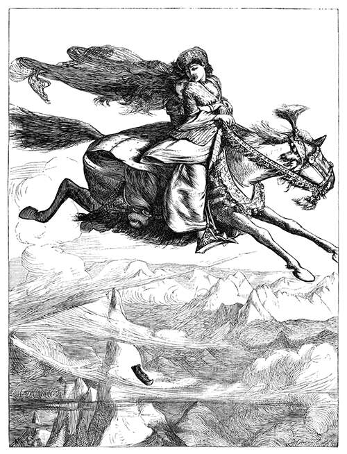
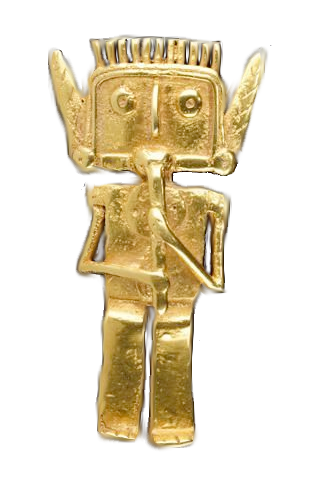
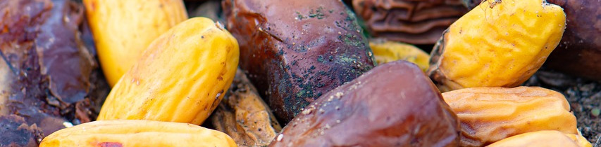

# Tesoros

\sinc

En 1001 Ghūles hay situaciones en las que los schahriars podrán buscar botines y tesoros, puede ser en el interior de una cueva de ladrones, en el laboratorio de un malvado hechicero o al derrotar una bestia sanguinaria venida de una dimensión paralela.

&nbsp;

## Tiradas de botín

\conc

Muchas de las situaciones o peligros a los que se enfrentarán los schahriars tendrán una tirada de botín. Esta tirada puede ser un valor de d4 a d12 o incluso más.

Siempre que se derrote a un monstruo de los Mitos, si la descripción de este no dice lo contrario, se podrá hacer también una tirada de botín de igual valor al TPC del monstruo más modificaciones.

Tras derrotar al monstruo o resolver la situación, uno de los schahriars podrá hacer la tirada de botín. El botín también exige que tengan un mínimo tiempo de buscarlo. 

Si acaban con un shoggoth y tienen que salir corriendo porque un río de lava inunda su estancia, no podrán intentar conseguir botín. La dificultad es 4 y pasarla da un éxito y cada avance da otro éxito más. Según los éxitos que consigan, podrán tirar en diferentes tablas:

* Tabla de riquezas (1 éxito).
* Tabla de objetos especiales (2 éxitos). Solo puede cogerse una vez por tirada de botín.

Si se consigue:

* 1 éxito puede tirar 1 vez en la tabla de riquezas.
* 2 éxitos puede tirar 2 veces en la tabla de riquezas o 1 en la tabla de objetos especiales.
* 3 éxitos suponen, 3 tiradas en la tabla de riquezas, 1 en la de riqueza más 1 en la de objetos extraordinarios, …

Tras decidir como gastar su botín podrán tirar en la Tabla de Riquezas o en la Tabla de objetos especiales.

\sp

\sinc

### Tabla de Riquezas

|1d12|Descripción|Valor en dinares|
|---|---|---|
|1-4|Algunos dinares y monedas de cobre y plata|1d10 x 10|
|5-6|Pequeños objetos de oro como vasos, cubiertos, pequeñas joyas, espejos o peines|2d10 x 20|
|7-8|Piedras semipreciosas|1d10 x 50|
|9-10|Buena cantidad de dinares|1d10 x 100|
|11|Joyas de oro con piedras preciosas|1d10 x 200|
|12|Piedras preciosas de gran valor|1d10 x 500|

Dentro de los objetos especiales podemos tener armas, cuerpo a cuerpo o a distancia, armaduras, objetos mundanos curiosos y objetos mágicos.

&nbsp;

### Tabla de Objetos especiales

|1d10|Tipo|
|---|---|
|1-2|**Arma cuerpo a cuerpo.** Tira en la tabla de armas cuerpo a cuerpo y luego en la de capacidades.|
|3-4|**Arma a distancia.** Tira en la tabla de armas a distancia y luego en la de capacidades.|
|5|**Armaduras .** Tira en la Tabla de Armaduras y luego en la de capacidades.|
|6|**Protecciones.** Tira en la Tabla de Protecciones y luego en la de capacidades.|
|7-8|**Objetos mundanos.** Tira en la Tabla de Objetos mundanos.|
|9|**Objetos mágicos.** Tira en la Tabla de Objetos mágicos.|
|10|**Grimorio .** Tira en la Tabla de Grimorios y luego en la de modificaciones.|

\conc

\sp

\sinc

### Tabla de Armas cuerpo a cuerpo

Puedes usar la tabla siguiente o poner armas más exóticas de pueblos que pasaron por estas tierras como un gladius romano, una falcata o un kopis griego. Las dos últimas son armas con cierta curva que se asemejan a alfanjes y cimitarras.

|1d10|Nombre|
|---|---|
|1-2|Cimitarra|
|3-4|Alfanje|
|5|Jambia|
|6|Shibriya|
|7|Khopesh|
|8|Shotel|
|9|Katar|
|10|Tabar Shishpar|

&nbsp;

### Tabla de capacidades de Armas cuerpo a cuerpo

Las capacidades especiales también son una sugerencia. Igual no quieres armas directamente mágicas para que los enemigos inmunes a ataques físicos sean más complicados o que un practicante de magia las imbuya de su poder.

|1d10|Capacidad|
|---|---|
|1-4|Hecha por herreros yemeníes, +1 a pelea +1 a daño|
|5-6|Afilada, +2 a daño|
|7|Digna de un califa, x10 su precio normal|
|8|Mágica, se considera mágica a la hora de inmunidades, +1 a pelea y +1 a daño|

\conc

\sp

\sinc

|1d10|Capacidad|
|---|---|
|9|Protectora, +2 a parada|
|10|Legendaria, se considera mágica a la hora de inmunidades, +2 a pelea y +2 a daño. Tiene nombre propio y perteneció a alguien famoso.|

&nbsp;

### Tabla de Armas a distancia

|1d8|Nombre|
|---|---|
|1-2|Honda|
|3-4|Arco|
|5-6|Azagaya|
|7|Arco recurvo|
|8|Chakram|

&nbsp;

### Tabla de capacidades de Armas a distancia

|1d10|Capacidad|
|---|---|
|1-4|De excelente calidad, +1 a pelea +1 a daño|
|5-6|Empaladora, +2 a daño|
|7|Digna de un califa, x10 su precio normal|
|8|Mágica, se considera mágica a la hora de inmunidades, +1 a pelea y +1 a daño|
|9|De tirador de primera, dobla los rangos de alcance|
|10|Legendaria, se considera mágica a la hora de inmunidades, +2 a pelea y +2 a daño. Tiene nombre propio y perteneció a alguien famoso.|

\conc

\sp

\sinc

Las capacidades especiales también son una sugerencia. Igual no quieres armas directamente mágicas para que los enemigos inmunes a ataques físicos sean más complicados o que un practicante de magia las imbuya de su poder.

&nbsp;

### Tabla de Armaduras y protecciones

|1d20|Nombre|
|---|---|
|1-2|Chaqueta de tela gruesa|
|3-4|Pantalones de tela gruesa|
|5-6|Caftán/Galabiya/Chilaba reforzada|
|7-8|Turbante reforzado|
|9|Chaqueta de piel gruesa|
|10|Pantalones de piel gruesa|
|11|Camisa de mala|
|12|Pantalones de malla|
|13|Cofia de malla|
|14|Escudo pequeño|
|15|Escudo mediano|
|16|Escudo grande|
|17|Spara|
|18|Casco de turbante|
|19|Jawshan|
|20|Kalantar|

\conc

\sp

\sinc

### Tabla de capacidades de Armaduras y protecciones

|1d10|Capacidad|
|---|---|
|1-2|Reforzado, +1 Armadura/cobertura|
|3-4|Ligero, 3/4 del peso normal|
|5|Digna de un califa, x10 su precio normal|
|6|Antimagia, otorga Resistencia arcana|
|7|Protectora, -1 a todos los daños de origen mágico, +1 a armadura/cobertura|
|8|Legendaria, -1 a todos los daños de origen mágico, +2 a armadura/cobertura. Tiene nombre propio y perteneció a alguien famoso.|

### Tabla de Objetos mundanos

|1d20|Objeto|
|---|---|
|1|Alambique|
|2|Astrolabio|
|3|Dados trucados|
|4|Instrumento musical de calidad|
|5|Maqueta precisa del sistema solar|
|6|Paracaídas|
|7|Tablero de shatranj y piezas de marfil y ébano|
|8|Tinta invisible|
|9|Brea pegalotodo|
|10|Anestésico natural de cactus|

\conc

\sp

\sinc

|1d20|Objeto|
|---|---|
|11|Canicas magnetizadas|
|12|Redes de hilo de seda|
|13|Jaula para monstruos|
|14|Afrodisíaco (1d8 dosis)|
|15|Agua regía (2d10 litros)|
|16|Haschisch (2d8 dosis)|
|17|Bang cretense (1d6 dosis)|
|18|Agua de rosas (2d10 litros)|
|19|Kohl de calidad (3d10 usos)|
|20|Ropajes dignos de un califa (10d100 dinares de oro)|

&nbsp;

### Tabla de Grimorios

|1d8|Objeto|
|---|---|
|1|Liber Ivonis (Libro de Eibon)|
|2|Séfer HaRazim - El libro de los secretos|
|3|Séfer Raziel HaMalaj - El Libro del Arcángel Raziel|
|4|Kitab an-nawamis - Libro de las leyes|
|5|Anales de los Antiguos|
|6|Pnakotica - Manuscritos Pnakóticos|
|7|I Ching|
|8|Historia de las Aventuras de Hassan Al-Bassri|

\conc

\sp

\sinc

### Tabla de Modificaciones de Grimorios

|1d8|Modificación|
|---|---|
|1-2|Traducción|
|3|Incompleto|
|4|Anotado|
|5|Dañado|
|6|Muy dañado|
|7|Edición original|
|8|Maldito|

&nbsp;

### Tabla de Objetos mágicos

|1d100|Objeto|1d100|Objeto|
|---|---|---|---|
|1-4|Vasos canopos del Faraón negro|53-56|Amuleto para vivir debajo del agua|
|5-8|Espejo de Leng|57-60|Sangre de Fénix|
|9-12|Alfombra de piel de serpiente|61-64|Jugo de plantas para caminar sobre las aguas|
|13-16|Llave de plata|65-68|Tambor de piel de gallo|
|17-20|Polvo de Ibn-Ghazi|69-72|Bang cretense (1d8 dosis)|
|21-24|Concha roja|73-76|Hidromiel espacial (1d8 dosis)|
|25-28|Cetros de faraón|77-80|Droga Liao|
|29-32|Semilla de Khizr|81-84|Botella sellada|
|33-36|Búcaro de alabastro|85-88|La joya talismánica de la cama de viaje|

\conc

\sp

\sinc

|1d100|Objeto|1d100|Objeto|
|---|---|---|---|
|37-40|Alfombra volante|89-92|Agujas mágicas|
|41-44|Saco encantado|93-96|Taza talismánica|
|45-48|Batería de Bagdad|97-100|Mesa de arena adivinatoria|
|49-52|Kohl de búsqueda de tesoros|—|—|

\conc

\sp

\sinc

## Tesoros míticos

\conc

Esta ambientación está llena de objetos maravillosos de inmenso poder y muchas veces malditos. Objetos que pueden traerte grandes dones o convertir tu mundo en un infierno en la Tierra. Estos objetos van más allá de alfombras voladoras y lámparas mágicas, estamos hablando de juguetes que te permiten viajar por el espacio (o quizás acabar pedido en la inmensidad del espacio) o armas dignas de dioses que pueden que terminen matando a tus seres queridos.

### Alfombra teleportadora

> Y dijo el vendedor: "¡Tú lo has dicho, señor! ¡Has de saber que, en efecto, esta alfombra está dotada de una virtud invisible que hace que al sentarse en ella sea uno transportado inmediatamente adonde quiera ir, y con tanta rapidez, que se efectúa en menos tiempo del que se tarda en cerrar un ojo y abrir el otro! Y ningún obstáculo es capaz de detenerla en su marcha, porque ante ella se aleja la tempestad, huye la tormenta, se entreabren las montañas y las murallas, y por lo mismo, resultan inútiles y vanos los candados más sólidos. ¡Y tal es ¡oh mi señor! la virtud invisible de esta alfombra de plegaria!"
> 
> **Referencia:** Historia de la princesa Nurennahar y de la bella gennia (n. 808)

\sc

Este espectacular alfombra hecha con hilo de oro y plata y la mejor lana de Cachemira es ya espectacular simplemente como objeto decorativo. Pero, es que además, tiene una asombrosa cualidad, permite teleportarse a las personas que se sienten encima a lugar en la Tierra que quieran.

La diferencia con las alfombras voladoras es que esta alfombra se teletransporta a donde sea, con lo que tarda segundos en hacer viajes de varios meses y además evade puertas, candados, rejas. 

Podría entrar dentro de la sala del tesoro de un califa. Las voladoras se quedarían a las puertas de la cámara, ya que no pueden atravesar puertas candadas.

```
La alfombra permite viajar con hasta otras 3 personas más el piloto. Necesita extenderse la alfombra en el suelo completamente y sin arrugas antes de poder montarse con ella y teleportarse.
```

Es necesario conocer el lugar de alguna manera, bien porque se ha estado allí o porque se conoce mediante dibujos o descripciones detalladas.

\sp

El viaje es instantáneo, lo cual la hace una vía de entrada o escape muy rápida, necesitando solo 3 turnos para colocarla en el suelo bien y sentarse o para levantarse y doblarla.

La alfombra cruza por diferentes dimensiones a la velocidad del rayo, para llegar a su destino. Sus pasajeros podrían tener que hacer unas TPC a discreción de Scheherazade por las cosas que vean en los poco que dura el viaje.

### Anillos mágicos

> … Y he aquí que, cuando el desesperado Aladino frotó, sin querer, el anillo que llevaba en el pulgar y cuya virtud ignoraba, vio surgir de pronto ante él, como si brotara de la tierra, un inmenso y gigantesco efrit, semejante a un negro embetunado, con una cabeza como un caldero, y una cara espantosa, y unos ojos rojos, enormes y llameantes, el cual se inclinó ante él, y con una voz tan retumbante cual el rugido del trueno, le dijo «¡Aquí tienes entre tus manos a tu esclavo! ¿Qué quieres? Habla. ¡Soy el servidor del anillo en la tierra, en el aire y en el agua!»
> 
> **Referencia:** Historia de Aladino y de la lámpara mágica (n. 774)

Los anillos mágicos son uno de los objetos mágicos más comunes de las 1001 Noches y casi siempre están relacionados con genios servidores. Veamos tres ejemplos de anillos mágicos que funcionan exactamente igual que la Lámpara Mágica, pero con "yinns" más o menos poderosos que el genio de la lámpara.

* El anillo de Aladino. Historia de Aladino y de la lámpara mágica (n. 774)
* El anillo del Padre de la Dicha. Historia del pastel hilado con miel de abejas y de la esposa calamitosa del zapatero remendón (n. 996)
* El anillo de Trueno Penetrante. Historia de Juder el pescador o el saco encantado (n. 480)

Estos 3 anillos seguirían las mismas reglas generales que la Lámpara Mágica (ver más adelante) pero con algunas especiales propias.

* El anillo de Aladino. El yinn de este anillo no puede hacer nada en contra de los rokhs.
* El anillo de Trueno Penetrante. Trueno Penetrante es un rey entre las tribus de los suyos y muchas de las tareas que se le encarga como construir un palacio en una noche, él, a su vez, se lo ordena a sus súbditos.

\sp

* El anillo del Padre de la Dicha. Para invocar al servidor de este anillo debes frotar una vez el engarce del anillo, si lo frotas dos veces el anillo se destruye y el yinn se consume. El genio de este anillo no sale del anillo más que para cumplir órdenes y lo hace tan rápidamente que ni se le ve. El anillo también te hace heredero del gran rey y mago Scheddad y su fabuloso tesoro.

#### El anillo mágico de Suleimán

Otro anillo terriblemente poderoso es el anillo mágico de Suleimán, que dicen portaba Adam en jardín del Edén. Este anillo terminó heredándolo el poderoso rey-mago Suleimán con el que fue enterrado en una cripta de la isla de los Siete Mares.

La cripta de Suleimán, donde está el cuerpo preservado del Suleimán con el anillo en el índice de una mano y un cetro de oro y rubíes en la otra, está protegida por poderosas trampas mágicas que exigen una serie de ensalmos para desactivarlas.

En la sección de la isla de los Siete Mares tienes una explicación de como es la cripta y las trampas que hay en ella.

```
En la Historia de Belukia, que es el cuento donde sale este anillo, no se especifica sus poderes, pero teniendo en cuenta que el anillo viene del mismo Adam y lo tuvo el poderoso rey Suleimán, podría hacer cualquier cosa.

Este objeto puede ser el perfecto Macguffin para tus campañas. Puedes dotarle del poder que tú quieras que no cubran otros objetos como traer a la vida una persona muerta, viajar en el tiempo, alzar a los zombis o liberar a un primigenio de su prisión.
```

### Armas del príncipe Diamante

> cogió un cajón que había en otro agujero del muro, lo abrió y sacó de él un arco de oro con sus flechas, una espada de acero chino y un puñal con el puño de jade, y se los entregó a Diamante, diciéndole: "Este arco y sus flechas han pertenecido al profeta Saleh (¡con él la plegaria y la paz!). Esta espada que es conocida bajo el nombre de Escorpión de Suleimán, es tan excelente que si se golpeara con ella una montaña la partiría como jabón. Y por último, este puñal, fabricado en otro tiempo por el sabio Tammuz, es inapreciable para quien lo posee, porque preserva de todo ataque la virtud oculta en su hoja".
> 
> **Referencia:** Historia espléndida del príncipe Diamante (n. 910)

\sp

Estas son las armas que la princesa Gamila entrego al príncipe Diamante para le protegiesen en su aventura en búsqueda de la ciudad de Wakak.

Son el sueño de cualquier combatiente, ya que con ellas podrían llegar a ser leyendas de la lucha enfrentándose y venciendo a cualquier enemigo.

Portar, aunque solo sea una de ellas, otorga un gran prestigio y respeto y la gente se pensará muy mucho enfrentarse directamente a ti.

#### Arco del profeta Saleh

Este arco recurvo con incrustaciones de oro era portado el profeta Saleh mientras predicaba por la península arábiga.

```
El arco tiene 3 flechas, si disparas una de las 3 flechas con el arco negará cualquier tipo de cobertura física o mágica.
```

El arco y las flechas son irrompibles.

Si se lanzan flechas normales se obtiene un +1 a Disparar y al daño.

#### Escorpión de Suleimán

El Escorpión de Suleimán es un dao de acero con empuñadura de jade. Está tan afilado que podría cortar cualquier cosa.

```
Niega hasta los 6 puntos de armadura de cualquier tipo, natural, mágica, de obstáculos, etc.

Por ejemplo, un qatram con dureza de normal de 18, tendría 14 de dureza si es golpeado por esta espada. La espada quita el bono de 4 de su armadura natural.

También reduce en 6 puntos la consistencia de los objetos en caso de que quieras romperlos. Unas cadenas de consistencia 12 pasan a tener 6 si son golpeadas con esta hoja.
```

#### Puñal del sabio Tammuz

Este sencillo puñal de acero con empuñadura de sándalo sin ningún tipo de filigrana ni pedrería protege a su portador de los ataques de sus enemigos.

```
Con solo blandirla, dota a su portador +3 a parada y da Resistencia arcana mejorada.
```

\sp

\sinc

[](https://www.oldbookillustrations.com/illustrations/journey-firouz/ "The Journey of Prince Firouz Schah - Houghton, Arthur Boyd") 

_El caballo de ébano volando por toda la Tierra._

\conc

\sp

### Caballo de ébano

> … un caballo de madera de ébano, de la calidad más negra y más rara, incrustado de oro y pedrerías, y enjaezado maravillosamente con una silla, una brida y unos estribos como solo llevan los caballos de los reyes. Así es que el rey Sabur quedó maravillado hasta el límite de la maravilla y desconcertado por la belleza y las perfecciones de aquel caballo; luego dijo: "¿Y qué virtudes tiene este caballo de ébano?"  
>   
> El persa contestó: "¡Oh mi señor! las virtudes que posee este caballo son cosa prodigiosa, hasta el punto de que cuando uno monta en él, parte con su jinete a través de los aires con la rapidez del relámpago, y le lleva a cualquier sitio donde se le guíe, cubriendo en un día distancias que tardaría un año en recorrer un caballo vulgar".
> 
> **Referencia:** Historia mágica del caballo de ébano (n. 414-431)

El caballo de ébano es una figura de madera de ébano de un caballo trotando a tamaño real tremendamente realista y detallada. 

Tiene unas crines de pelo real, espuelas de plata pura, una silla cubierta de pedrería y finas sedas y unas riendas de hilo de oro y plata. Es tan realista que si no fuera porque está inmóvil pasaría por real.

Este caballo fue creado por un loco artesano y alquimista persa (aunque otros dicen que de origen hindú), que vacío la figura y la relleno de un suero basado en el líquido que usan los al mighos en sus tubos cerebrales.

En este líquido están flotando ciertos órganos extraídos de un ave de Rokh (shantak) que le confieren al caballo algunas de las sus maravillosas propiedades que tiene el caballo.

Al presionar y mover las ruedas, tornillos y palancas que hay escondidas en su cabeza y debajo de la silla, el caballo se estimula diferentes partes de los órganos de ave de Rokh de su interior.

Esto le permite elevarse y volar. Se mueve muy rápidamente si se desea, pudiendo recorrer en un día lo que un caballo recorrería en un año.

Como el ave de Rokh del que saca sus increíbles capacidades, puedes salir al espacio exterior y viajar a otros planetas sin sufrir ningún daño. Deberás llevar suficientes provisiones y agua para sobrevivir durante lo que dure el viaje.

Es importante saber llegar a ese lugar. No puedes ir a sitios de los que no conoces la ruta de viaje.

\sp

```
A nivel de juego, una persona con Afinidad mágica puede gastar un PP y tras pasar una tirada de Pilotar te llevará en un día máximo a cualquier parte del mundo conocido.

Para distancias más cortas puede ser casi instantáneo, por ejemplo, si te mueves entre zonas de una ciudad y horas si te mueves entre ciudades del mismo país o región. Ir de Bagdad a Basora podría llevar una hora de viaje.
```

No puede volar con precisión, no podrías elevarte con él y atacar a desde el aire a tus enemigos o escapar de una gruta que está colapsando esquivando piedras que caen del techo.

De hecho, no debería usarse en interior, solo al aire libre o en estancias muy grandes con ventanales o claraboyas de gran tamaño, como las estancias del palacio de un califa.

Si se fracasa la tirada de Pilotar, el caballo se descontrola y los instintos del ave de Rokh hacen que vaya a algún lugar que visito en vida. Deberás hacer una tirada en la Tabla de perdido en el tiempo y el espacio para saber dónde acabas.

Puedes acabar, por ejemplo, si sobrevives al hambre y la sed, en el centro del universo donde habita el poderoso y lobotomizado Azathoth rodeado de sus servidores.

Si es algún momento el líquido de su interior se derrama, los órganos del ave de Rokh morirán y el caballo perderá sus mágicas habilidades.

No tiene un precio real, nadie debería poder comprarlo o venderlo. Debería usarse como la dote perfecta para poder casarte con el hijo o la hija de un califa o como presente de paz entre reinos en guerra.

Las espuelas, la silla y las riendas no son necesarias para el funcionamiento del caballo y pueden ser sustituidas por otras más baratas sin problema. Estarían valoradas, si quieres venderlas, en unos 10.000 dinares.

### Las 3 estatuas ecuestres

Las estatuas ecuestres son objetos de gran poder en las 1001 Noches. 

Sus orígenes son desconocidos para sus propietarios, pero en realidad son grandes artefactos de los mitos de Cthulhu creados en tiempos antiguos cuando existían Mú o Hiperbórea por poderosos magos para defender sus torres y castillos o derrotar a sus enemigos.

\sp

Las 3 estatuas son:

* **La estatua ecuestre de la montaña del Imán.** Este jinete tiene un gran poder electromagnético que convierte la montaña donde está en un gigantesco imán que atrae todo elemento metálico de los barcos que se le acercan y hace que se hundan. No se sabe muy bien su función, ya que puede ser usado ofensivamente destruyendo a los enemigos o como una herramienta de extracción de metales, incluso una cárcel para algún primigenio magnético.
* **La estatua ecuestre de la cúpula verde del palacio de las maravillas de Bagdad.** Este jinete avisa de los ejércitos enemigos que quieren atacar la ciudad. Fue creado por el propio Eibon de Mhu Thulan para proteger su torre de mago.
* **La estatua ecuestre de la Ciudad de Bronce** abre una especie de portal que permite llegar a la mítica Ciudad de Bronce. Esta estatua juega con la geometría euclidiana haciendo que para encontrar la ciudad de Bronce tengas que volver por el camino que has venido tras rodearla. Cuando parece que has dado un giro de 360º y estás volviendo por donde has venido, en realidad solo has girado 180º y continuas por la dirección por la que ibas. Cualquier otra combinación hará que te pierdas irremediablemente.

### Figura-reloj de pavos reales

> … una gran fuente de plata, en medio de la cual se encontraba un pavo real de oro rodeado por veinticuatro pavas reales del mismo metal. Y el rey Sabur los miró con asombro, y encarándose con el rumí, le dijo: "¡Oh sabio! ¿para qué sirven este pavo y estas pavas?"  
>   
> El sabio contestó: "¡Oh mi señor! a cada hora que transcurre del día o de la noche, el pavo da un picotazo a cada una de las veinticuatro pavas y la cabalga, agitando las alas, y así sucesivamente cabalga a las veinticuatro pavas, marcando las horas; luego, cuando ha dejado transcurrir el mes de esta manera, abre la boca, y en el fondo de su gaznate aparece el cuarto creciente de la luna nueva".
> 
> **Referencia:** Historia mágica del caballo de ébano (n. 414)

Esta figura-reloj es el reloj más preciso que existe en el mundo actual y su tecnología está muy avanzada a su tiempo.

Aun así, no deja de ser un objeto decorativo muy caro que el califa sacará cuando ponga a tus schahriars una fecha límite para cumplir una tarea.

\sp

Está diseñado para contar horas y también los meses, ya que el reloj marca la luna nueva y calendario árabe es lunar.

Es por eso que permite dar desde periodos cortos como horas hasta largos como «hasta la próxima luna llena» o «dentro de dos lunas».

```
Este objeto no tiene ningún poder en realidad, salvo no necesitar darle cuerda, lo cual en realidad lo convierte en una máquina de movimiento perpetuo.

Si algún schahriar lo examina con Ciencias se dará cuenta de que no tienen ningún sentido, se escapa a las leyes básicas de la física y deberá pasar un TPC d6.
```

### Gorro de cuero mágico

> Y a la sazón se dijo Hassán: "¡No cabe duda! ¡Este gorro está encantado! ¡Y su encanto consiste en hacer invisible a quien lo lleva en la cabeza!" Y se puso a bailar de alegría, diciéndose: "¡Alah me lo envía! ¡Porque, con este gorro en la cabeza, puedo correr a ver a mi esposa sin que a mí me vea nadie!"
> 
> **Referencia:** Las aventuras de Hassan Al-Bassri (n. 614)

Este gorro de cuero, que parece totalmente normal, otorga, sin embargo, un poder que cualquier ladrón o asesino le gustaría tener. No tienen ningún tipo de sello o símbolo, así que la única forma de saber qué hace es ponérselo.

Gastando un deseo te haces invisible como si hubieras usado el poder de Invisibilidad. No se consigue ninguna ventaja por avances, ni se puede usar modificadores de poder. 

La invisibilidad dura una hora no pudiéndose volver a usar hasta el día siguiente. Ponerse o quitarse el gorro supone una acción.

Puedes quitártelo en cualquier momento y hacerte visible y volver a ponértelo y hacerte invisible las veces que quieras mientras dure la hora.

El gorro tiene su maldición, está hecho de piel de Ghūl y si eres herido llevándolo puesto, es como si te hubiera hecho una herida un Ghūl (Capacidades especiales: Infección).

### Figura amorfa de oro y joyas con flauta

> /p/ … consistía en un especie de sapo humanoide desnudo, deforme y grotesco hecho de oro, incrustado de gemas y pedrerías de gran precio, que tenía en la mano una flauta de una extraña forma. 

\sp

> /p/ Y le dijo el rey Sabur: ’»¡Oh, sabio! ¿para que sirve esta figura?" El sabio contestó: "¡Oh mi señor! esta abominable figura de oro posee una virtud admirable! ¡Si le colocas a la puerta de la ciudad, será un guardián a toda prueba, pues si viniese un enemigo para tomar la plaza, le adivinará a distancia, y soplando en su extraña flauta que tiene a la altura de su rostro, le paralizará y le hará caer muerto de terror!"
> /p/ 
> /p/ **Referencia:** Historia mágica del caballo de ébano (n. 414)

En el mismo estilo de la estatua del guerrero a caballo que corona la cúpula verde del palacio de las Maravillas de Bagdad, esta monstruosa figura de oro de unos 60 cm de altura hace que las milicias atacantes de la puerta donde se halle, caigan muertas de miedo y huyan despavoridas.


De hecho, ningún miembro del ejército querrá acercarse a la ciudad, ya que de hacerlo empezará a recordar el terrible sonido de su aberrante flauta.

La figura de este flautista amorfo no tiene ningún tipo de bisagra, ni articulación, ni engranaje. Cuando se mueve el metal y las gemas del que está hecho se animan como si fueran carne.

Una tirada de Saber de Suleimán, dejará claro que la figura representa a un flautista amorfo, parte de la Corte del Gran Azathoth, que toca su flauta para tranquilizar y apaciguar a su señor.

[](https://www.pinterest.es/pin/713257659705408985/ "Flautista Tolima, Colombia. Gold statuette 1200 B.C. ") 

De hecho, si se rompiera la figura se vería que está hueca y que en su interior hay los órganos principales de uno de estos amorfos flautistas en un estado parecido al de los cerebros humanos en los tubos cerebrales de los al mighos.

El propio Nyarlathotep secuestró y entregó a uno de estos seres como parte del pacto que hizo con el alquimista que creo este objeto.

\sp

Al romper la figura y hacer un hechizo de destierro adecuado, la esencia del flautista volvería a la Corte de Azathoth donde tomaría carne de nuevo y volvería a tocar para este caótico dios.

```
La figura puede detectar fuerzas enemigas a más de 5 kilómetros de distancia y sacará su flauta avisando a los defensores de que se acercan enemigos.

Cuando las fuerzas enemigas sean visibles hará sonar su flauta y el comandante del ejército enemigo deberá hacer una tirada opuesta de Espíritu contra d12+4 de la figura.  

En caso de fallar, el ejército atacante huirá para no volver en mucho tiempo (a discreción de Scheherazade). En caso de pasar la tirada tendrán un +2 a todas las tiradas de moral en el combate de masa. Los schahriars pueden tirar, si quieren, independientemente de la del comandante del ejército.  

La figura solo puede defender una puerta (entiéndase puerta como un lado de la muralla de la ciudad), pero eso no quiere decir que no pueda ponerse en otras puertas de la ciudad.
```

### Lámpara mágica

> Cuando estés en esta terraza, ¡oh Aladino! ten cuidado, porque enfrente de ti verás una especie de hornacina al aire libre; y en esta hornacina, sobre un pedestal de bronce, encontrarás una lamparita de cobre.

\sc

>  Y estará encendida esta lámpara. ¡Ahora, fíjate bien, Aladino! ¡cogerás esta lámpara, la apagarás, verterás en el suelo el aceite y te la esconderás en el pecho enseguida! Y no temas mancharte el traje, porque el aceite que viertas no será aceite, sino otro líquido que no deja huella alguna en las ropas. ¡Y volverás a mí por el mismo camino que hayas seguido!
> 
> **Referencia:** Historia de Aladino y de la lámpara mágica (n. 731-774)

La lámpara mágica es quizás el objeto más poderoso y a la vez el más peligroso de todos los que podrás encontrarte en este mundo.

Poderoso porque el yinn que en ella habita es un avatar de Nyarlathotep que puede cumplir todas tus órdenes. Peligroso porque malinterpretará a propósito tus órdenes para corromperte y cuando lo haya hecho para acabar con tu vida.

#### Reglas generales de los genios

A diferencia de lo que hayas leído, no cumple tres deseos, cumple todas las órdenes del dueño de la lámpara, pero hay cosas más poderosas que él al que tiene una mezcla de respeto y miedo.

Las normas generales del yinn encerrado en la lámpara son:

\sp

\sinc

[](https://pixabay.com/es/photos/aladin-l%C3%A1mpara-milagrosa-magia-2368384/ "Aladin Lámpara Milagrosa por Karinamannott") 

&nbsp;

\conc

**En general, no son magos.** No hacen magia como tal, son seres tremendamente poderosos que pueden hacer multitud de cosas, pero aplicando solo sus poderes normales. Si les pides que te construyan un palacio en una noche lo hacen porque son superfuertes y superrápidos.

Si quieres oro o vino podrán conseguírtelo, pero no pueden convertir el plomo en oro o el agua en vino. Puede bajar al fondo del mar y rescatar un barco hundido, pero no pueden darte agallas para que respires debajo del agua.

**No tienen poderes mentales.** No pueden controlar las mentes de la gente, ni hacer visiones, ni retocar los recuerdos. Pueden hacer que la gente te quiera regalándoles oro y joyas en tu nombre, pero nada de magia para que la gente te adore.

**No tienen poderes sanadores.** Como ya hemos explicado con otros tipos de poderes, podrán llevarte ante el mejor médico del mundo, pero no curarte una herida mágicamente.

\sp

Tampoco pueden curarte enfermedades, pero sí conseguirte alguna poción sanalotodo. Tampoco pueden trasformar tu cuerpo haciéndote más alto o más guapo, pero podrán buscarte las mejores ropas del mundo y darte los mejores cosméticos.

**Tampoco tienen otros poderes,** como viajar en el tiempo, levantar a los muertos, ver el futuro o el pasado, pero si pueden hablar con todo tipo de seres y tienen gran sabiduría y memoria.

#### Genios como avatares de dioses exteriores

Una forma de integrar los genios de la lámpara dentro de los mitos de Cthulhu es convertirlos en avatares. Los avatares en los mitos son seres de gran poder que representan todo aparte de un dios exterior o primigenio.

Suelen ser criaturas con capacidades divinas, pero con limitaciones y reglas como los genios. Es por ello que ambos conceptos se ajustan muy bien. El genio de la lámpara es en este caso un avatar de Nyarlathotep.

El genio de la lámpara es un ser muy poderoso, relegado al oído y a la obediencia del propietario de la lámpara. Lleva cientos de años sirviendo a los humanos y con el tiempo ha terminado odiándolos y a destruirlos, pero el oído y la obediencia le impide hacerlo. Así busca métodos más sutiles para acabar con su amo.

Sin saltarse las normas de sus poderes y sus propias reglas, hace de todo por ti hasta que eres adicto y no sabes solucionar tus problemas sin ellos. En ese momento te hace caer en desgracia buscando un resquicio legal a tus órdenes para hundirte en la miseria o incluso acabar con tu vida.

Quizás si le pides que te haga un palacio lo construirá a propósito más alto que la del califa que enfurecido por tu osadía te haga decapitar. Tal vez al pedir una montaña de oro lo haga caer sobre ti sepultándote en monedas de oro y mueras aplastado.

Acabando contigo no queda libre de su cárcel de cobre, pero puede ganar un tiempo de tranquilidad.

Estar siglos en éxtasis dentro de una lámpara de aceite en el estómago podrido de un gusano gargantuesco muerto es mejor que cumplir otra orden de un estúpido humano.

\sp

#### Reglas propias del genio de la lámpara:

* No puede tocar a las aves de Rokh. Como criaturas de Azathoth no puede hacer nada contra unos siervos de su señor Azathoth.
* Solo aparece si se frota una zona muy concreta de la lámpara. No todo el mundo puede y sabe invocar al genio.
* La presencia del genio es aterradora para todos los presentes, excepto para el dueño de la lámpara. Provoca un TPC d6 a todos los presentes, excepto a la persona que lo invocó, al que muestra una cara falsa en vez de su auténtica apariencia.

### Lámpara de Alhazred

> /p/ El aspecto de la lámpara de Alhazred era poco corriente. Funcionaba con aceite, y parecía ser de oro. Por su forma, se asemejaba a una marmita oblonga, con un asa curvada a un lado y una espita para la llama al otro. Su decoración consistía en unos extraños dibujos, mezclados con letras y colocados de tal manera que parecían formar unas palabras. 

\sc

> /p/ Pero aquel lenguaje era desconocido para Yassir, que conocía varios dialectos árabes y, sin embargo, no lograba descifrar la inscripción de la lámpara. No era sánscrito. Indudablemente, se trataba de un idioma más antiguo; su escritura se componía de letras y jeroglíficos, algunos de los cuales eran pictografías. Yassir dedicó una tarde entera a limpiarla por dentro y por fuera y, después de haberle sacado brillo, la llenó de aceite.

Se dice que se creó en Aram-de-las-columnas por la mítica tribu de los Aads. Se dice que Abdul Alhazred utilizó la luz de esta lámpara de aceite para escribir su impío Necronomicón en sus noches de insomnio.

Si se llena de aceite y se enciende, la luz que arroja proyectará imágenes sobre las paredes, el techo, el suelo y los objetos de alrededor. El observador se percatará de extraños paisajes alienígenas que posiblemente sean lugares o dimensiones de los Mitos.

```
Encender solo pide a los afines a la magia 1 PP, pero las visiones y las TPC serán para todos los presentes. Las visiones quedan a discreción de Scheherazade y puedes reducir la cordura de quien las estudie, sobre todo si se presencian criaturas o deidades de los Mitos.
```

\sp

```
El TPC de las visiones es aleatorio, así que tira un dado de d12, 1-2 el TPC será d4, 3-4 d6, 5-6 d8, 7-8 d10, 9-10 d12, 11 d12+1 y 12 d12+2. La lámpara exige un sacrificio en cordura, si nadie falla la TPC, no ofrecerá visiones hasta la próxima luna nueva.
```

### Maravillosa manzana curalotodo

> Y dijo el vendedor: "Pues bien, señor; ya que por ti mismo acabas de experimentar efectos tan inesperados aspirando el aroma de esta manzana, has de saber que la tal manzana no es natural, sino fabricada por la mano del hombre; y no es fruto de un árbol ciego e insensible, sino fruto del estudio y las vigilias de un gran sabio, de un filósofo muy célebre, que se pasó toda la vida haciendo investigaciones y experiencias respecto a las virtudes de las plantas y de los minerales. Y logró la composición de esta manzana, que encierra en sí la quintaesencia de todos los cuerpos simples, de todas las plantas útiles y de todos los minerales curativos. 
En efecto, no hay enfermo, cualquiera que sea la calamidad de que esté afligido, aun cuando se trate de la peste, de la fiebre purpúrea o de la lepra, que no recobre la salud al olerla, aunque esté moribundo. Y tú mismo inclusive acabas de sentir hasta cierto punto su efecto, pues que con su olor se te ha disipado el cansancio del viaje. 
> Pero, para mayor certeza, quiero que con ella cure ante tus ojos un enfermo aquejado de un mal incurable, a fin de que estés seguro de sus virtudes y propiedades, como lo están todos los habitantes de esta ciudad. \[…\]  
> Y como para confirmar todo lo bien que hablaban de ella, acertó a pasar por allí un pobre hombre ciego y paralítico, a quien un mozo llevaba a hombros en una banasta. 

\sc

> Y el vendedor se acercó a él con viveza y le puso la manzana junto a la nariz. Y de repente el enfermo se levantó en la banasta, y saltando como un gato por encima de la cabeza del que le llevaba, echó a correr, abriendo unos ojos como tizones. Y todo el mundo le vio y dio fe de ello.
> 
> **Referencia:** Historia de la princesa Nurennahar y de la bella gennia (n. 809)

Esta manzana es una creación de un alquimista que destilo la esencia de miles de plantas y minerales curativos y los combino en este artefacto con forma de manzana.

Su simple olor de esta manzana cura cualquier enfermad y sana cualquier herida, así como quita el cansancio e incluso combate en cierta medida la vejez.

```
Oliendo esta manzana durante un turno se curan todas las enfermedades, venenos y heridas y quitas toda la fatiga acumulada. Los schahriars con desventajas como Sordo, Ciego, Tuerto o Cojo podrán gastar avances para quitárselas. También podrán quitarse la desventaja Anciano.

Tiene dos usos diarios, pero si se desea pueden usarse más veces. Cada uso extra tendrá un 5% de fallar (3º intento 5%, 4º intento 10%, 5º intento 15%) y de inutilizar para siempre la manzana maravillosa.
```

\sp

### El misterioso libro mágico

> Y Giafar y Massrur sostenían sendas antorchas, y el califa cogía libros de los armarios magníficos y de los cofres de madera aromática, y los abría y los cerraba. Y de tal suerte examinó varios estantes, y acabó por echar mano a un libro viejísimo que abrió al azar.
>  Y encontró algo que hubo de interesarle vivamente, porque, en vez de abandonar el libro al cabo de un instante, se sentó y se puso a hojearlo página por página y a leerlo atentamente. Y he aquí que de pronto se echó a reír de tal modo, que se cayó de trasero. Luego volvió a coger el libro y continuó su lectura. Y he aquí que de sus ojos brotó el llanto; y se echó a llorar de tal manera, que se mojó toda la barba con lágrimas que corrían por sus intersticios hasta caer sobre el libro que tenía él en las rodillas. Después cerró el libro, se lo metió en la manga y se levantó para salir.\[…\]  
> "Te ordeno pues, que vayas a buscar a alguien que me diga por qué he reído y llorado con la lectura de este libro y adivine lo que hay en este volumen desde la primera página hasta la última. Y si no encuentras a ese hombre, te cortaré el cuello, y entonces te enseñaré lo que me ha hecho reír y llorar"
> 
> **Referencia:** Historia del libro mágico (n. 895)

Solo el Califa sabe que pone en este antiguo y polvoriento y porque rio y lloró al leerlo. Así que puedes usar este libro como quieras. Quizás leyó la mejor historia del mundo, quizás leyó su futuro o quizás simplemente era un libro de relatos de Howard Phillips Lovecraft perdido en el tiempo y el espacio.

### Saco de arena maldita

> Con unos de sus legamosas extremidades recogió la arena verdosa que acababa de regurgitar y la dejo caer delante del acólito que la recogió con un simple saco de arpillera. Con sus gargantas no humanas pronuncio estas palabras: Esparce mi esencia y profana el poder de la tierra. La tierra, el barro, el fango o las arenas quedará estéril por eones.

Este saco de arpillera lleno de una extraña arena que tiene un extraño brillo verdoso dota a la persona que lo porta el poder de controlar la tierra a su voluntad, podrá mover grandes cantidades de roca, moverse a través de la tierra o golpear a sus enemigos con terremotos o lluvias de rocas. Simplemente, hay que sacar un pellizco de arena y dejarlo caer en el suelo.

El saco extrae su poder de la propia tierra convirtiéndola en cenizas estériles, las plantas que haya en esa tierra se marchitaran al instante para terminar convirtiéndose en cenizas también.

```
Cogiendo un pellizco de arena y dejándolo caer en el suelo, puedes lanzar a voluntad y sin gastos de PP los siguientes poderes: Armadura, Barrera, Captura, Cavar, Chorro, Conmoción, Explosión, Manipulación Elemental y Proyectil.
```

\sp

```
Los poderes tendrán siempre un ornamento de piedra y deberás estar en contacto con la tierra (o roca o arena). No se puede usar ni volando, ni en el agua, tampoco sobre superficies no naturales como el asfalto o madera o piedra trabajada. Como habilidad arcana deberá usarse Espíritu y podrán meterse todas las modificaciones que se deseen.  

Cada vez que se usa el saco y su arena cae en el suelo se crea una área circular de tantas casillas de radio como PP se habrían gastado en el hechizo, se convertirán en cenizas de las que nunca volverá a crecer nada.
```

### Tesoro de Al-Schamardal

> /p/ ¡Es necesario, pues, que aquel de vosotros que desee poseer este libro vaya a abrir el tesoro llamado Al-Schamardal, y me traiga la esfera celeste, la redomita de kohl, el alfanje y el anillo, que todos estos objetos contiene el tesoro! ¡Y son extraordinarias sus virtudes! En efecto, el sello está guardado por un ser más poderoso que el más poderoso de los yinn, cuyo solo nombre da miedo pronunciarlo: se llama Trueno-Penetrante.
> /p/ 
> /p/ **Referencia:** Historia de Juder el pescador o el saco encantado (n. 469)

El tesoro de Al-Schamardal es un conjunto de objetos y armas mágicas que convierte a su portador es un ser tremendamente poderoso capaz de acabar con ejércitos y destruir ciudades con solo desearlo, pero a la vez todos estos objetos traen maldiciones y si se abusa de ellos las consecuencias pueden ser catastróficas.

Al-Schamardal fue un poderoso mago de la antigüedad tan poderoso como para crear la poderosa esfera celeste o de encerrar en un anillo a un poderoso yinn algo solo digno del gran y poderoso rey Suleimán. Su tesoro incluye también riquezas que no podrías gastar en mis vidas.

Todo su tesoro se encuentra en su tumba, donde su cuerpo incorrupto se encuentra sentado en un trono con sus más ricos ropajes y sus más poderosos objetos mágicos.

#### La búsqueda del tesoro

> Juder penetró entonces sin dificultad en la estancia del tesoro, y vio los montones de oro agrupados en apretadas filas; pero se dirigió al pabellón sin prestarles la menor atención, y cuando hubo levantado la cortina, vio al gran adivino Al-Schamardal acostado en el trono de oro, con el alfanje talismánico a la cintura, el anillo en un dedo, la redomita de kohl sujeta al cuello por una cadena de oro, y encima de su cabeza aparecía la esfera celeste, brillante y redonda como la luna.

\sp

> Entonces se adelantó Juder sin vacilar y quitó del tahalí el alfanje, sacó el anillo talismánico, desató la redoma de kohl, cogió la esfera celeste y retrocedió para salir. Y al punto se hizo oír a su alrededor un concierto de instrumentos que hubo de acompañarle triunfalmente hasta la salida, en tanto que de todos los puntos del tesoro subterráneo se elevaban las voces de los guardianes que le felicitaban gritando: "¡Que te haga buen provecho ¡oh Juder! lo que supiste ganar! ¡Enhorabuena! ¡Enhorabuena!" Y no dejó de tocar la música ni dejaron de felicitarle las voces hasta que estuvo fuera del tesoro subterráneo.
> 
> **Referencia:** Historia de Juder el pescador o el saco encantado (n. 469)

Aunque poco conocida, la «Historia de Juder el pescador o el saco encantado» que narra la búsqueda de tesoro de Al-Schamardal es una de las historias más largas y más complejas de las 1001 Noches, donde la magia, las maldiciones, los objetos mágicos y los seres extraños y poderosos abundan.

Por sí sola podría ser una mini-campaña para schahriars experimentados.

##### El mago Al-Schamardal

Al-Schamardal es un mago nacido en hiperbórea hace miles de años y que gracias a la magia negra y los pactos con diferentes divinidades exteriores y primigenias sobrevivió hasta hace unos siglos.

Durante sus siglos de vida fue creando objetos mágicos de grandísimo poder al conseguir esencias de diferentes dioses con Cthugha con la que creo su esfera mágica.

Cuando vio que no podía seguir alargando su vida, decidió, como los faraones egipcios con los que convivió, preparar una tumba en la que guardar sus tesoros y permanecer eternamente como la momia de un faraón.

Contemporáneo del gran mago Eibon, su prudencia y su perfil bajo le permitió vivir miles de años sin granjearse grandes enemigos. Y cuando Mu desapareció y la Atlántida se hundió en las aguas, Al-Schamardal conocido entonces como Alschum siguió viviendo muchos siglos más, siendo más poderoso cada vez.

##### El lago Karum

Según la leyenda, en el fondo del lago hay dos carpas de colores que son dos príncipes efrits, hijos del Rey Rojo. Se dice que, si consigues atraparlos con tus propias manos, podrán encaminarte hacia el gran tesoro de Al-Schamardal.

\sp

Realmente no existen dos carpas rojas, sino dos cilindros cerebrales con las mentes de dos aprendices del mago Al-Schamardal.

Ayudaron a su maestro a preparar su tumba y por ello saben dónde está y qué pruebas hay que pasar para acceder al tesoro. Tras terminar la tumba, Al-Schamardal pensaba matarlos, pero en su lugar los encerró en los cilindros cerebrales y los abandono en el lago Karum.

```
Dalila y Adil, que así se llaman los ayudantes de Al-Schamardal, llevan siglos en éxtasis en los cilindros y primero se necesitará encontrar la forma de que puedan comunicar con el exterior.
```

Puede conseguirse unos moduladores de voz y unos micrófonos para poder hablar con ellos. La secta de la Progenie es sierva un grupo de al mighos que seguro quieren vender su tecnología a cambio de algún servicio. Otra es buscarle un cuerpo y conseguir que los al mighos lo metan dentro.

El segundo problema es que están muy desubicados y con grandes fallos de memoria. Tienen recelos a hablar y será difícil sacarles respuestas. Se necesitará y buenas tiradas de persuadir para sacarles la ubicación de la tumba de Al-Schamardal.

Dalila y Adil, si consigues una forma de que puedan comunicarse (oír y hablar) y de ver, pueden ser usados como grimorios de nivel 6. En su tiempo fueron poderosos y poderosas magas, no tanto como su maestro, pero poderosos y pueden ser usados como grimorios de los que aprender hechizos y ventajas mágicas.

##### Miknas

Hace miles de años las tierras que ocupa Miknas fueron un asentamiento científico avanzado de la serpigente. En la zona había laboratorios de genética, de teletransporte y una nueva tecnología holográfica.

Cuando la serpigente perdió Mu y entro en decadencia, estas instalaciones se abandonaron y se perdieron en el tiempo.

Por suerte, Al-Schamardal conocía estas instalaciones gracias a sus miles de años de vida y decidió aprovecharlos en su beneficio para construir su futura morada tras su muerte.

\sp

##### La tumba de Al-Schamardal

Al-Schamardal no construyo la tumba desde cero, sino que aprovecho unas instalaciones de la serpigente como base para su tumba. De hecho, la mayoría de las trampas de la tumba son sistemas de defensa serpigente modificados.

Lo que para tus schahriars debe parecer un sitio extraño, en realidad es lo que queda de un laboratorio aséptico, con suelos y paredes blancas con carteles de seguridad en Naacal. Todo ello hecho con extraños materiales.

Las baterías alimentadas por un antiguo reactor nuclear siguen funcionando, ya que el sistema se apaga cuando se cierra el laboratorio. Aun así, los focos parpadearan a veces y habrá puertas que cueste abrir.

Al-Schamardal, junto a su gente, vació de objetos como herramientas, mesas, estanterías, aparatos de investigación, etc., dejando las paredes y el suelo completamente vacíos. Luego lo fue llenando todo con alfombras, tapices, cojines, sacos de joyas y monedas de oro, cuberterías de plata, etc.

Más allá de la última estancia hay una sala de control que Al-Schamardal oculto con una pared falsa (-4 a Notar para encontrarla). En ella estaban los controles de los drones, los proyectores holográficos y un sistema de autodestrucción que ya no funciona en caso de fugas biológicas.

##### La puerta de oro bajo el río

> … Sabe ¡oh Juder! que en cuanto yo me ponga a recitar las fórmulas mágicas sobre el incienso humeante, el agua del río empezará a disminuir poco a poco, y el río acabará por secarse completamente y dejar su lecho al descubierto. Entonces verás que en la pendiente del cauce seco se te aparece una gran puerta de oro, tan alta como la puerta de la ciudad, con dos aldabas del mismo metal. Dirígete a esa puerta y golpéala muy ligeramente con una de las aldabas que tiene en cada hoja, y espera un instante. Llama luego con un segundo aldabonazo más fuerte que el primero, ¡y espera todavía! Después llamarás con un tercer aldabonazo más fuerte que los otros dos, y no te muevas ya. Y cuando hayas llamado así con tres aldabonazos consecutivos, oirás gritar a alguien desde dentro: «¿Quién llama a la puerta de los Tesoros sin saber romper los encantos?» Tú contestarás: «¡Soy Juder el pescador, hijo de Omar, de El Cairo! Y se abrirá la puerta …»
> 
> **Referencia:** Historia de Juder el pescador o el saco encantado (n. 473)

Hace milenios la entrada de la tumba fue tapada al cambiar el curso de un río cercano a Miknas.

\sp

Esto hace que solo en caso de sequía se puede acceder a la puerta, la otra opción es usar hechizos de manipulación elemental de agua para abrir las aguas.

La puerta de seguridad de entrada solo se libera una vez al año (el día 20 del primer mes del año) en una especie de reseteo del sistema de seguridad del laboratorio. 

Cuando intenta abrir la puerta, detecta la entrada de agua del río y la vuelve a cerrar por seguridad. Por eso, no serviría sumergirse en el río y esperar el reseteo.

##### Las 7 puertas de la tumba

Al-Schamardal modificó el laboratorio y creo una tumba con 8 estancias

**Defensas holográficas:** Alguna de las puertas están protegidas por drones. Estos drones están envueltos en hologramas creados por cientos proyectores holográficos que hay en las paredes de cada instancia. Tras cada puerta, el dron tendrá una proyección holográfica diferente. Estos drones van armados con armas cuerpo a cuerpo, a distancia y lanzallamas que los proyectores holográficos esconden como alfanjes, arcos, lanzas, porras, garras o aliento de dragón.

* **Atributos:** Agilidad d6, Astucia d4, Espíritu d6, Fuerza d8, Vigor d6.
* **Habilidades:** Atletismo d6, Disparar d6, Idioma materno d6, Intimidar d4 (Variable), Pelear d8
* **Paso:** 6; **Parada:** 6; **Dureza:** 6(1)
* **Equipo:** Arma de filo (FUE+d6), Arma contundente (FUE+d6), Arma de asta (FUE+d6), Lanzallamas
* **Capacidades especiales:**
  * **Dron:** Aunque el holograma sea muy grande como en el caso del caballero, en realidad el proyector holográfico es un dron de pequeño tamaño al que es muy difícil acertar. Aunque el schahriar no lo sepa, tiene un -4 a todas sus tiradas, con lo que su parada es de 10. Si falla normal (tirada menos de 6) parecerá que el holograma le para el golpe. Si saca entre 7 y 10 el arma el dron generará una herida en el diseño del holograma, pero sin hacerle daño. Si saca más de 10 el arma del schahriar impactará en el dron haciéndole daño normal. En caso de golpes apuntados solo se aplicarán si son más de +4.

\sp

* **Capacidades especiales:**
  * **Armadura +1:** El dron está reforzado y obtiene +1 armadura.
  * **Duro:** Puede aguantar una herida antes de quedar incapacitado.

##### 1ª puerta

> Y se abrirá la puerta y en el umbral se te aparecerá un personaje que ha de decirte, alfanje en mano: «¡Si eres verdaderamente ese hombre, presenta el cuello para que te corte la cabeza! Y le presentarás tu cuello sin temor, y alzará sobre ti el alfanje, cayendo a tus pies inmediatamente, ¡y no verás ya más que un cuerpo sin alma! Y no te habrá hecho daño alguno. Pero si por miedo te niegas a obedecerle, te matará en aquella hora y en aquel instante.
> 
> **Referencia:** Historia de Juder el pescador o el saco encantado (n. 473)

Esta primera puerta solo se abre si detecta una sola huella de calor. Si detecta más no se abrirá al acercarse los schahriars. Si alguien puede encubrir su huella de calor podrá entrar y ayudar al schahriar que quiera entrar.

Esta puerta y las siguientes son pruebas cada vez más duras para probar el valor del schahriar. Deberá pasar una tirada enfrentada de Espíritu contra el Intimidar del holograma que es d4, para afrontar una muerte segura a manos del o de la porta-alfanje.

En caso de fallar, el schahriar tratará de huir de la ejecución y el holograma lo perseguirá y tratará de matarlo entrando en combate (con un -2 durante 2 turnos a todas las tiradas de combate y defensa por la intimidación perdida).

En caso de pasarla, el dron se desconectará y el holograma parecerá caer sin vida. Si se le ataca mientras está desconectado se activará y atacará. 

Si el schahriar derrota en combate al dron, los proyectores harán parecer derrotado a la proyección holográfica, pero en este caso el dron sí estará destruido.

Tanto si derrota al dron con su valor como si lo derrota en combate, podrá hacer una tirada de Notar -4 para descubrir el engaño de los hologramas que tomará como algún tipo de magia.

Saber que es un hechizo no le dará ninguna ventaja a priori, pero si se monta una estratagema rápida y que parezca eficaz para ayudarle contra los drones y los hologramas puedes darles uno o dos deseos.

\sp

##### 2ª puerta

> "Cuando hayas roto de tal modo ese primer encanto, pasarás dentro y verás una segunda puerta, a la que llamarás con un aldabonazo solo, pero muy fuerte. Entonces se te aparecerá un jinete con una lanza grande al hombro, y te dirá, amenazándote con su lanza enristrada de repente: «¿Qué motivo te trae a estos lugares que no frecuentan ni pisan nunca las hordas humanas ni las tribus de los genn?» Y por toda respuesta, le presentarás resueltamente tu pecho descubierto para que te hiera; y te dará con su lanza. Pero no sentirás daño ninguno, y caerá él a tus pies, ¡y no verás más que un cuerpo sin alma! ¡Pero te matará si retrocedes!
> 
> **Referencia:** Historia de Juder el pescador o el saco encantado (n. 473)

Como en la puerta anterior, pero habrá que hacer una tirada Espíritu contra Intimidar d6.

En este caso, si falla, no solo le atacará el dron actual, sino que también el de la estancia anterior a no ser que haya sido destruido.

##### 3ª puerta

> "Llegarás entonces a una tercera puerta, por la que saldrá a tu encuentro un arquero que te amenazará con su arco armado de flecha; pero preséntale resueltamente tu pecho como blanco, ¡y caerá a tus pies convertido en un cuerpo sin alma! ¡No obstante, te matará, como vaciles!
> 
> **Referencia:** Historia de Juder el pescador o el saco encantado (n. 473)

Como en la puerta anterior, pero habrá que hacer una tirada Espíritu contra Intimidar d6. En este caso, si falla no solo le atacará el dron actual, sino también el de la estancia anterior a no ser que haya sido destruido.

##### 4ª puerta

> "Penetrarás más adentro y llegarás a una cuarta puerta, desde la cual se abalanzará sobre ti un león de cara espantosa, que abrirá las anchas fauces para devorarte. No has de tenerle ningún miedo ni huir de él, sino que le tenderás tu mano, y en cuanto le des con ella en la boca, caerá a tus pies sin hacerte daño.
> 
> **Referencia:** Historia de Juder el pescador o el saco encantado (n. 473)

Como en la puerta anterior, pero habrá que hacer una tirada Espíritu contra Intimidar d10.

En este caso, si falla no solo le atacará el dron actual, sino también los de las tres estancias anteriores a no ser que hayan sido destruidos.

##### 5ª y 6ª puerta

> "Dirígete entonces a la quinta puerta, de la que verás salir a un negro de betún que te preguntará: «¿Quién eres» Tú dirás: «¡Soy Juder!» Y te contestará él: «¡Si eres verdaderamente ese hombre, intenta abrir la sexta puerta!»  
> "Al punto irás a abrir la sexta puerta, y exclamarás: «¡Oh Jesús, ordena a Moisés que abra la puerta!» Y la puerta se abrirá ante ti y verás aparecer dos dragones enormes, uno a la derecha y otro a la izquierda, los cuales saltarán sobre ti con las fauces abiertas. ¡No tengas miedo! 

\sp

> Tiéndele a cada uno una de tus manos, en las que te querrán morder; pero en vano, porque ya habrán caído impotentes a tus pies. Y sobre todo no aparentes temerlos, pues tu muerte sería segura.
> 
> **Referencia:** Historia de Juder el pescador o el saco encantado (n. 473)

Como en la puerta anterior, pero habrá que hacer una tirada Espíritu contra Intimidar d12.

##### 7ª puerta

> "Llegarás a la séptima puerta, por último, y llamarás en ella. ¡Y la persona que ha de abrirte y aparecerte en el umbral, será tu madre! Y te dirá: «¡Bienvenido seas, hijo mío! ¡Acércate a mí para que te desee la paz!» Pero le contestarás: «¡Sigue donde estabas! ¡Y desnúdate!»  
> Ella te dirá: «¡Oh hijo mío, soy tu madre! ¡Y me debes alguna gratitud y respeto, en gracia a que te amamanté y a la educación que te di ¿Cómo quieres obligarme a que me ponga desnuda?»! Tú le contestarás, gritando: «¡Si no te quitas la ropa, te mato!» Y cogerás un alfanje que hallarás colgado en la pared, a la derecha, y le dirás: «¡Empieza pronto!» Y ella procurará conmoverte y hará para engañarte, para que te apiades de ella. Pero guárdate de dejarte persuadir por sus ruegos, y cada vez que se quite una prenda de vestir, has de gritarle: «¡Quítate lo demás!» Y continuarás amenazándola con la muerte hasta que esté completamente desnuda. ¡Pero entonces verás que se desvanece y desaparece!
> 
> **Referencia:** Historia de Juder el pescador o el saco encantado (n. 473)

\sc

> /p/ **¡¡¡Atención!!!** Esta prueba es bastante fuerte. Revísala bien y piensa en tus schahriars antes de meterla en tu aventura. En caso de querer introducirla en tu aventura, recuerda haber preparado antes herramientas de seguridad para tus schahriars.

A tu elección el holograma puede ser de cualquier ser querido, amistad verdadera, amor perdido, etc.

Puedes dejarlo en una simple tirada enfrentada contra Intimidar d12+1 o puedes interpretarlo.

##### La sala del tesoro

> "Y de esta manera ¡oh Juder! habrás roto todos los encantos y disuelto todos los hechizos, a la vez que pondrás en salvo tu vida. Y te restará solo recoger el fruto de tus trabajos.  
> "A tal fin, no tendrás más que franquear esa séptima puerta, y dentro encontrarás montones de oro. Pero no les prestes la menor atención, y dirígete a un pabellón pequeño que hay en medio de la estancia del tesoro, y sobre el cual se extiende una cortina corrida. ¡Levanta entonces la cortina, y verás, acostado en un trono de oro, al gran mago Schamardal, el mismo a quien pertenece el tesoro! Y junto a su cabeza verás brillar una cosa redonda como la luna: es la esfera celeste. ¡Le verás con el alfanje consabido a la cintura, con el anillo en un dedo y con la redomita del kohl sujeta al cuello por una cadena de oro! ¡No vaciles entonces! ¡Apodérate de esos cuatro objetos preciosos, y date prisa a salir del tesoro para venir a entregármelos!
> 
> **Referencia:** Historia de Juder el pescador o el saco encantado (n. 473)

\sp

La sala del tesoro es una zona de almacenaje en las que el mago fue acumulando los tesoros que atesoró durante siglos. Podemos encontrar todo tipo de monedas de muchas épocas, así como lingotes de oro y plata y piedras preciosas talladas en todo tipo de formas. Todas estas riquezas son otra de las pruebas/trampas de la tumba.

```
Todas estas riquezas están impregnadas por diferentes sustancias mutagénicas. Al tocar las monedas, los lingotes o las piedras, el mutágeno entra en contacto con la víctima.

Hay que hacer una tirada enfrenta de Vigor contra d8 del mutágeno. Si se pasa la tirada, resistes el mutágeno y te vuelves inmune. Si fallas tu mano y tu antebrazo se cubren de escamas de serpiente. Con cada avance que te haga el mutágeno, las escamas cubren más partes de tu cuerpo, brazo, medio pecho, cuello y cabeza. 

Si vuelves a tocar el tesoro y no eres inmune vuelves a tirar Vigor y si fallas la mutación continúa extendiéndose.

Si el mutágeno llega al cerebro, te conviertes en una especie de híbrido de serpigente en 1d6 semanas mientras el mutágeno modifica tu cerebro. Si en esas semanas no se encuentra una forma de curar la mutación, el schahriar pasa a ser un secuaz de Scheherazade.
```

En un pabellón de ricas sedas con las cortinas cerradas en el centro del almacén está el cuerpo incorrupto de Al-Schamardal con su túnica de mago y sus objetos mágicos. Estos se puede recoger sin problemas y sin temor de que el cadáver se levante y les ataque.

#### Los poderosos objetos del tesoro

En el cadáver incorrupto de Al-Schamardal hay 5 objetos de tremendísimo poder.

##### El anillo de Trueno Penetrante

> "¡Oh Juder, toma este anillo que realizará todos tus anhelos! Porque has de saber que este anillo tiene por servidor a un genni, llamado Trueno-Penetrante, que estará a tus órdenes para cuanto le pidas. ¡No tienes más que frotar el engarce del anillo, y al punto se te aparecerá Trueno-Penetrante, que se encargará de ejecutar todas tus voluntades y de darte, si se los pides, todos los bienes del universo que desees!" Y para enseñarle su manejo, lo frotó delante de él con el pulgar. Al punto apareció el efrit Trueno-Penetrante, e inclinándose ante el magrebí, dijo: 
> "¡Heme aquí, ya sidi! ¡Ordena y serás obedecido! ¡Pide y recibirás! ¿Quieres reconstruir una ciudad en ruinas o destruir una ciudad floreciente? ¿Quieres matar y asesinar? ¿Quieres arrancar el alma a un rey o solamente diezmar sus ejércitos? ¡Habla!"
> 
> **Referencia:** Historia de Juder el pescador o el saco encantado (n. 480)

Este anillo, que forma parte del tesoro de Al-Schamardal, tiene encerrado el poderoso efrit Trueno Penetrante.

\sp

```
El efrit de este anillo sigue las reglas generales del genio de la lámpara y como habrás visto en la parte de anillos mágicos tiene una regla propia.
```

##### El alfanje de derrotar ejércitos

> Quien posea el alfanje, podrá destruir a su albedrío ejércitos sin más que blandirlo, pues al punto saldrán de él llamas y relámpagos, que reducirán a la nada a todos los guerreros.
> 
> **Referencia:** Historia de Juder el pescador o el saco encantado (n. 469)

Este alfanje de finísima calidad y digno de un califa tiene en su hoja grabadas llamas y rayos. Cuando un schahriar blande este alfanje, las llamas toman un brillo rojizo y los rayos un tono azulado.

```
Para activar el poder del alfanje debe gastarse un 1 PP antes de atacar. Al golpear hace un extra de 2d6 dados de daño de fuego (daño par) o electricidad (daño impar). Si derrotas al enemigo, el rayo o el fuego saltan al enemigo o aliado más cercano y hace otros 2d6 de daño. Mientras siga derrotando contrincantes o amigos irá saltando de persona en persona hasta fallar.

En caso de varios objetivos a la misma distancia se elige al azar. No importa la distancia a la que estén los posibles objetivos, pero deben formar parte del combate.
```

##### La esfera celeste de recorrer el mundo sin moverse de sitio

> Quien posea la esfera celeste, podrá viajar a su antojo por todos los puntos del universo sin molestarse ni cambiar de sitio, y visitar también las tierras del sueño aun estando en el mundo de la vigilia. Para ello, le bastará tocar con el dedo el punto adonde quiere ir y las regiones que desea recorrer, y la esfera empezará a dar vueltas, haciendo desfilar ante sus ojos todas las cosas interesantes del lugar en cuestión, así como sus pobladores, todo cual si lo tuviese entre las manos. Y si a veces está quejoso de la hospitalidad de los indígenas de cualquier país o el recibimiento que le dispensó una ciudad entre las ciudades, le bastará dirigir el sol hacia el punto en que se encuentra la región enemiga, e inmediatamente será la tal presa de las llamas y arderá con todos sus habitantes.
> 
> **Referencia:** Historia de Juder el pescador o el saco encantado (n. 469)

Quizás este sea el más poderoso de todos los objetos del tesoro Al-Schamardal y a la vez el más peligroso para su portador.

Esta esfera, muy parecido a un Google Maps de la antigüedad, te permite ver cualquier parte del universo poniendo el dedo en la ubicación correcta de la esfera.

Es muy preciso para poder ver todo el universo, puede apuntar a una ciudad o un pueblo de bastante tamaño, pero no lo suficiente para ver una casa o una persona en concreto.

\sp

Cuando apuntas con el dedo obtienes información general sobre el lugar que estás viendo. Cosas que la gente de la ciudad sabría sin problemas sobre ellas, como quién en el emir de la ciudad, donde está el zoco, cuantos guardias hay en la ciudad, precios del zoco, etc.

Pero su gran poder está en su capacidad de incendiar el objetivo dirigiendo, el sol al punto que has marcado. Eso hacer que caiga una lluvia de fuego sobre tu objetivo.

La esfera celeste tiene esa capacidad porque está hecha con parte de la esencia de Nardún, el dios ígneo, y al usarla así invocas su poder de incineración.

De hecho, el gran Al-Schamardal tuvo que invocar al gran Nardún y robarle parte de su esencia para crear esfera.

Debido a su relación con Nardún, este objeto es buscado y venerado por los seguidores del Fuego y la Luz. El propio Bahram el Gauro lleva recorriendo los caminos de oriente medio y el Magreb buscando pistas de este tesoro.

\sc

&nbsp;

```
Usando la esfera puedes ver cualquier sitio del mundo, pero debes ser capaz de calcular su posición en la esfera con una tirada de Navegación para sitios en la tierra o de Astronomía (Ciencias) en cualquier lugar del Universo.

Todos los bonos a Navegación y los de Ciencias aplicados a astronomía se aplican en esta tirada. Scheherazade podría aplicar negativos a ver sitios como R’lyeh o la Ciudad de bronce que están perdidas en el tiempo y el espacio.

Hay que tener en cuenta que las cosas que se vean en la visión podrían tener TPC, como por ejemplo ver Yuggoth, pero bajarían un nivel (mínimo TPC d4) por ser a través de la esfera y con tranquilidad de verse fuera del alcance.

Convocar a la lluvia de fuego no exige tirada, pero otorga a Scheherazade 5 benis que solo podrá usar en contra del schahriar que invoco la lluvia de fuego y obtendrá la desventaja de Secreto (Mayor), la destrucción de la ciudad que hayan elegido.  
  
El usar el poder de videncia consume 1 PP, pero usar la lluvia de fuego supone usar todos tus PP, mínimo 3 PP.
```

##### La redomita de kohl para abrir los ojos a lo oculto

> En cuanto a la redomita de kohl, quien se frota los párpados con el kohl que contiene, ve al instante todos los tesoros ocultos en la tierra.
> 
> **Referencia:** Historia de Juder el pescador o el saco encantado (n. 469)

\sp

Al aplicar el kohl de esta redomita (que no se acaba nunca) permite ver todos aquellos tesoros enterrados en la tierra o detrás de paredes de roca.

Se verá donde debe cavarse o picar, pero no se verá exactamente cuál es el tesoro, solo el tipo y de forma muy general.

\sc

&nbsp;

```
Se considera tesoro todos aquellos objetos que podrían salir en una tirada de botín y todos los tesoros míticos. No hay que hacer tirada de Notar, solo en caso de haberse usado una tirada de Ocultación mágica.

El efecto dura hasta quitar el maquillaje voluntariamente o involuntariamente o al día siguiente.
```

\sp

\sinc

[](https://pixabay.com/es/photos/frutas-amarillas-fechas-cosecha-4689385/ "Frutas Amarillas Fechas Cosecha por Ri_Ya") 

## Objetos mágicos

\conc

Los objetos que aparecen aquí no son tan poderosos y únicos como los anteriores, pero son objetos mágicos de bastante poder que te permiten hacer hazañas increíbles.

Estamos hablando de alfombras voladoras, amuletos de protección, materiales alquímicos, etc. En general te van a permitir emular los poderes básicos de Savage Worlds, como volar, respirar bajo el agua o ser invisible.

Mientras que los tesoros míticos suponen campañas conseguirlos, todos estos tesoros pueden ser conseguidos con algo de suerte en tiradas de botín. 

Si consideras que alguno es más poderoso de lo normal o puede entrometerse de forma negativa en tu campaña, puedes quitarlo o rebajar su poder como tú veas.

\sc

### Agujas mágicas

> Y he aquí que, apenas quedó clavado el último alfiler, la joven desposada se metamorfoseó repentinamente en tórtola con un pequeño moño en la cabeza. Y salió volando muy de prisa por la ventana del palacio. Porque los alfileres que sus hermanas le habían clavado en los cabellos eran alfileres mágicos, \[…\] 
> Y la tórtola se echó a temblar entre sus manos y empezó a dar sacudidas, sin dejar de arrullar tristemente. Y él se puso a acariciarla con delicadeza, alisándole las plumas y rascándole la cabeza. Y he aquí que, al rascarle la cabeza, sintió bajo sus dedos unos pequeños objetos duros como cabezas de alfiler. Y los extrajo del moño delicadamente, uno tras otro. Y cuando él le hubo sacado el último alfiler, la tórtola dio una sacudida y de nuevo se tornó en joven.
> 
> **Referencia:** La pulsera de tobillo (n. 883)

Estas agujas del pelo están malditas, convirtiendo a la persona que se pone todas las agujas del juego de 6 en una tórtola. La tórtola tienen un pequeño moñito del que se pueden sacar las agujas.

\sp

Si se sacan todas las agujas, la tórtola vuelve a convertirse en persona. Hay que recordar que puedes ponerte todas las agujas sin ayuda, pero no puedes quitártelas, deben quitártelas.

Se cree que existen otros juegos de agujas con más o menos agujas que convierten en otros animales, algunos más fuertes y peligrosos que una tórtola.

```
Este objeto maldito solo puede ser usado contra afines a la magia y para evitar ser transformado en tórtola puede hacer una tirada enfrentada de Espíritu contra d12. La maldición dura hasta que se deshaga el moñito y se extraigan las 6 agujas.
```

### Alfombra de piel de serpiente

> Además, había una alfombra hecha con una enorme piel de serpiente, con escamas grandes como un dinar de oro, que tenía la virtud de curar todas las enfermedades a quienes se acostaban en ella.
> 
> **Referencia:** La sexta historia de las historias de Sindbad el marino, que trata del sexto viaje (n. 311)

Tras dormir una noche envuelto en esta manta, todas las enfermedades normales son curadas sin dejar ningún tipo de secuela. Los eruditos y eruditas de la taumaturgia que han podido estudiarla han llegado a la misma conclusión, está hecho a partir de la muda del antiguo dios egipcio Set, un avatar del primigenio Yig.

La realidad no queda muy lejos, la alfombra es un artilugio de alta tecnología usado por los científicos genetistas serpigente, de cuando dominaban la Tierra y hacían experimentos con los humanos.

Es un artilugio que cura cualquier enfermedad humana. En sus experimentos necesitaban que sus conejillos de indias estuvieran en perfecto estado y con esa alfombra los mantenían sanos y fuertes, preparándolos para las terribles consecuencias de los horribles experimentos que les iban a practicar.

```
Cualquier enfermedad por grave que sea, siempre que sea de origen natural y no de origen mágico o algún tipo de maldición, es curada tras pasar una noche envuelto en esta alfombra. No importa la gravedad de la enfermedad ni el estado del enfermo. Por ejemplo, un enfermo terminal de lepra verá como toda su piel vuelve a su estado original.
```

\sp

Recuerda que solo cura enfermedades, nada de heridas, huesos rotos, miembros amputados o venenos. Tampoco cura enfermedades mentales a no ser que tengan un origen en una enfermedad física.

### Alfombra volante

> Y se encontró a tres hombres que disputaban entre sí. Y les preguntó: "¿Por qué disputáis?" Le contestaron: "¡Por una cosa!" Él les dijo: "¿Una cosa? ¿Cuál?" Le contestaron: "Tenemos esta alfombra que ves. A quien se ponga encima y la golpee con esta varita, pidiéndole que le lleve aunque sea a la cumbre de la montaña Kaf, la alfombra le transporta en un abrir y cerrar de ojos. ¡Y por poseerla nos disponíamos a matarnos en este momento!"
> 
> **Referencia:** Historia contada por el octavo capitán de policía (n. 949)

Esta colorida alfombra de gran tamaño permite viajar de forma casi instantánea a cualquier parte del mundo siempre que se conozca el destino o por lo menos una idea general de cómo es y donde está el destino.

Con la alfombra va una varita que al golpear la alfombra con ella activa los poderes de la alfombra. Sin la varita la alfombra no es más que un simple mueble de gran calidad.

A nivel de juego, una persona con Afinidad mágica puede gastar un PP y golpear la alfombra con su varita te llevará en un día máximo a cualquier parte del mundo conocido. Para distancias más cortas puede ser casi instantáneo, por ejemplo, si te mueves entre zonas de una ciudad y horas si te mueves entre ciudades del mismo país o región. Ir de Bagdad a Damasco podría llevar una hora de viaje.

La alfombra permite viajar con hasta otras 3 personas más el piloto. Necesita extenderse la alfombra en el suelo completamente y sin arrugas antes de poder montarse con ella y volar.

La alfombra no es especialmente rápida en el despegue y el aterrizaje, lo que hace que si se quiere escapar en ella de algún peligro no sea especialmente eficaz. Primero porque hay que extenderla y segundo porque flota unos segundos hasta que se eleva y desaparece a toda velocidad. En el despegue, se puede atacar cuerpo a cuerpo a los pasajeros durante dos turnos y a distancia durante 3 más.

\sp

### Amuleto para vivir debajo del agua

> Sabe que, por virtud de los nombres grabados en el sello de Suleimán ben-Daúd (¡con ambos la plegaria y la paz!), vivimos y andamos por el fondo del mar como se vive y anda por la tierra; y respiramos en el agua como se respira en el aire; y el agua en vez de asfixiarnos, contribuye a nuestra vida, y ni siquiera moja nuestras vestiduras; y no nos impide ver en el mar, donde tenemos los ojos abiertos sin ninguna dificultad; y poseemos vista tan excelente, que atraviesa las profundidades marinas \[…\] lo mismo cuando los rayos del sol penetran hasta nosotros que cuando la luna y las estrellas se miran en nuestras aguas.
> 
> **Referencia:** Historia de Flor-de-Granada y de Sonrisa-de-Luna (n. 530)

Este amuleto con el sello de Suleimán otorga la capacidad de vivir bajo el agua. No solo permite respirar bajo el agua, también sobrevivir a la presión, ver en la oscuridad, hablar con normalidad y andar por el fondo marino como si lo hicieras por tierra seca y cuando sales del agua apareces completamente seco.

```
No puedes ahogarte, puedes andar por el fondo marino a tu paso normal y también puedes comunicarte normalmente bajo el agua.

Aguantas presiones normales (no se puede acceder a simas abisales) e ignoras las penalizaciones a la visibilidad por penumbra y oscuridad, pero no las de oscuridad completa.
```

\sc

&nbsp;

```
Por último, nadar tiene un coste normal, es decir, puedes nadar lo mismo que tu paso.
```

### Azufre rojo

> Y encontró dentro unos polvos rojos, y exclamó: "¡He aquí el Azufre rojo, ya Hassán Abdalah! ¡Esta es la Kimia de los sabios y de los filósofos, todos los cuales murieron sin dar con ella!" \[…\] "¡Oh pobre! ¡Ese polvo es la fuente misma de todas las riquezas de la tierra! Y un solo grano de este polvo basta para convertir en oro los metales más viles. ¡Es la Kimia! ¡Es el Azufre rojo!, ¡oh pobre ignorante! ¡Con este polvo, si quiero, construiré palacios más hermosos que éste, fundaré ciudades más magníficas que ésta, compraré la vida de los hombres y la conciencia de los puros, seduciré a la propia virtud y me haré rey, hijo de rey!" Y le dije: "Y con ese polvo, ¡oh mi señor! ¿podrás prolongar un solo día tu vida o borrar una hora de tu existencia pasada?"
> 
> **Referencia:** Las llaves del destino (n. 792)

El Azufre Rojo o Kimia es una sustancia alquímica muy buscada que permite grandes prodigios de transmutación.

Cada dosis de azufre rojo que uses en un hechizo de transmutación baja el nivel de dificultad en 10 niveles, con un mínimo de 1 nivel.

\sp

### Batería de Bagdad

> /p/ Y vertió toda una tinaja de agua regia que el mismo había filtrado en el alambique de su taller en un recipiente de barro, donde introdujo un cilindro del más puro cobre y una barra de hierro frío. El agua regia empezó a generar un humo rojizo que invadió toda la estancia. En unos segundos, yinns que deberían estar ahí se hicieron visibles para el sabio alquimista y pudo percatarse como le percibían ahora y le atravesaban con suss miradas \[…\] los cheitáns no dejaron de acosarlo con sus miradas, sus ensalmos y sus gritos, hasta que consumido por la locura salió corriendo de su casa para morir atropellado por un carro.

La [batería de Bagdad](https://es.wikipedia.org/wiki/Bater%C3%ADa_de_Bagdad) es un recipiente de barro de unos 14 centímetros. Tiene dentro un cilindro de cobre y dentro de una barra de cobre.

Si se llena de agua, la batería produce unas pequeñas descargas eléctricas que podrían hacer chispear una pequeña bombilla o dar algún chispazo a un humano. Es capaz de producir esas descargas gracias a la capa de azufre rojo que cubre su interior.

Pero sus capacidades van más allá de generar electricidad, en realidad es una versión muy primitiva del aparato que 11 siglos más tarde crearía el doctor Crawford Tillinghast capaz de estimular la glándula pineal de los seres humanos.

Al estimularse esta glándula, se pueden percibir la realidad más allá de lo que nuestros 5 sentidos nos permiten hacer de normal.

Para que estimule la glándula pineal hay que llenarla de agua regía (descubierta por el alquimista Ŷabir ibn Hayyan) que combinando con sus capacidades eléctricas crea ondas electromagnéticas que afectan a las glándulas pineales de las personas que estén su alrededor.

```
La batería de Bagdad no tiene un poder específico. Es un objeto que tú, como Scheherazade, puedes usarlo como quieras. El efecto que la batería tiene sobre la glándula pineal de tus schahriars puede ser cualquier cosa.

Estamos hablando desde ver seres de otros planos de existencia o fantasmas, hasta poco a poco pasar a otra dimensión, por ejemplo, una totalmente opuesta a la nuestra en plan Mirror Universe de Star Trek.
```

\sp

### Botellas selladas

> /p/ Al abrirla encontró un enorme jarrón de cobre dorado, lleno e intacto. La boca estaba cerrada con un plomo que ostentaba el sello de nuestro señor Suleimán, hijo de David. \[…\] Intentó mover el jarrón, pero hallándolo muy pesado, se dijo para sí: «Tengo que abrirlo sin remedio; meteré en el saco lo que contenga y luego lo venderé en el zoco de los caldereros». Sacó el cuchillo y empezó a maniobrar, hasta que levantó el plomo. Entonces sacudió el jarrón, queriendo inclinarlo para verter el contenido en el suelo. Pero nada salió del vaso, aparte de una humareda que subió hasta lo azul del cielo y se extendió por la superficie de la tierra. \[…\] Una vez que hubo salido todo el humo, comenzó a condensarse en torbellinos, y al fin se convirtió en un terrible siervo alado cuyas negras alas abiertas eran más grandes que la barca del pescador, mientras las garras de sus pies se hundían en el polvo.
> /p/ 
> /p/ **Referencia:** Historia del pescador y el efrit (n. 3)

A lo largo de todas las 1001 Noches hay varios ejemplos de botellas o tinajas selladas con el sello se Suleimán de las que salen todo tipo de cosas, desde maldiciones y monstruos hasta increíbles riquezas y yinns servidores. Y a veces simples mensajes con relatos fantásticos de sus autores.

Toda la magia de estas botellas se encuentra en el sello de Suleimán que crea una dimensión de bolsillo dentro del recipiente. En esa mini-dimensión no pasa el tiempo para tu cuerpo, pudiendo pasar milenios dentro, pero sí pasa para tu mente que está encerrada por siglos en esta prisión dimensional.

[](https://pixabay.com/es/photos/decantador-vidrio-esta%C3%B1o-azul-942521/ "Decantador Vidrio Estaño por 27707") 

Quedar encerrado en la botella, supone una TPC cada 10 años de prisión. Es importante decir quién rompe el sello, ya que a no ser que se diga lo contrario será al único al que le afectará el contenido del recipiente.

Al romper el sello y abrirla, normalmente saldrá un humo negro del que se materializará lo que haya dentro. Puedes decidir lo que sale o puedes tirar al azar en la siguiente tabla el contenido de la botella.

\sp

\sinc

#### Tabla de Objetos en botellas selladas

|1d12|Objeto|
|---|---|
|1|**Arena:** Al abrir la botella y darle la vuelta solo cae arena del desierto.|
|2|**Objeto perdido en el tiempo:** El objeto que han encontrado es algo venido del futuro por alguna extraña razón. Puede ser cualquier cosa, desde una bandeja de plástico hasta una botella de refresco de cola o un reproductor MP3. Descríbelo de la forma más críptica que puedas. Todas las tiradas de Saber de Suleimán para identificarlo fallarán siempre y nadie podrá decirles qué es. Puedes usarlo como gancho para alguna loca aventura o haz que alguien descubra por casualidad su función. Igual el califa se encapricha de él por su extrañeza.|
|3|**Libro en un extraño idioma:** Este libro está escrito en Aklo. Parece algún tipo de grimorio, por sus esquemas y sus símbolos, pero en realidad es una trampa. Si se envía a traducir a alguien, solo los sectarios de algunos cultos saben Aklo y podrán traducirlo. El grimorio pide que se mate al portador del libro por ser una persona ajena al culto que seguramente ha robado el libro. Por lo demás, el libro no tiene ningún valor ni poder. Esto te puede servir como semilla de partida en la que tus schahriars tienen que escapar de asesinos sectarios.|
|4|**Cajita de azufre rojo:** Dentro de una cajita de madera bastante usada hay 1d6 dosis de azufre rojo.|
|5|**Arma digna de un sultán:** Genera un arma cuerpo a cuerpo o a distancia al azar usando las tablas de botín y asígnale como extra la capacidad "Digna de un califa". Si te sale esa capacidad en las tiradas, repítela.|
|6|**Armadura digna de un sultán:** Genera una armadura al azar usando las tablas de botín y asígnale como extra la capacidad "Digna de un califa". Si te sale esa capacidad en las tiradas, repítela.|

\conc

\sp

\sinc

|1d12|Objeto|
|---|---|
|7|**Talega llena de dátiles amarillos y rojos:** Al disiparse el humo aparece un saquito de tela lleno de dátiles rojos y amarillos con propiedades mágicas.|
|8|**Kohl de invisibilidad:** El humo toma forma de una cajita lapislázuli con kohl de invisibilidad en su interior.|
|9|**Una mujer con vestiduras antiguas:** Empieza el cuento salvaje La viajera del tiempo.|
|10|**Cilindro cerebral de los al mighos:** Estos cilindros de metal verdusco con extrañas luces y una especie de tubo por donde salen sonidos tiene algo en su interior flotando en líquido.|
|11|**Grimorio:** Al disiparse el humo aparece un grimorio de magia. Coge al azar uno de los que se presentan en la sección de Grimorios y libros de hechizos o puedes crear uno como Scheherazade.|
|12|**Una docena de huevos:** Aparecen una docena de huevos y parecen de gallina. En realidad son huevos puestos por un gallo y si se encuban adecuadamente y eclosionan se convertirán en pollos cuya curcusilla tiene propiedades mágicas.|

\conc

A propósito no se ha añadido ningún tipo de yinn que salga de una botella, este es un tropo argumental tan clásico que creo que deberías usarlo tú cuando lo desees y no porque haya aparecido en una tabla aleatoria.

Recuerda que Imán de lo extraño puede usarse en esta. Gastando un deseo podrás repetir la tirada, pero te quedas con el segundo resultado. En este caso solo podrá usar esta ventaja aquel que abra la botella.

### Búcaro de alabastro

> Y he aquí que el búcaro de alabastro que había comprado la joven hilandera era un búcaro mágico. Y cuando su dueña quería comer, él le proporcionaba manjares deliciosos, y cuando ella quería vestirse, él la satisfacía.
> 
> **Referencia:** La pulsera de tobillo (n. 882)

\sp

Esta vasija de alabastro es una especie de cornucopia que da a la persona que lo sostiene todo tipo de bienes, manjares, ropajes, joyas, etc. Se puede conseguir cualquier tipo de objeto normal y corriente de tamaño pequeño que no sea muy complejo (con poleas, engranajes, productos alquímicos, …).

```
Un afín a la magia, gastando 1 PP, podrá pedir manjares y bebidas para saciar a una persona por un día. También puede dar suntuosos trajes y valiosas joyas dignas de la realeza, pero también objetos comunes como cuerdas, cubos, zurrones, etc.

En general, solo da objetos de tamaño -2 o inferior (unos 15 kg y 60 cm). Los objetos invocados desaparecen con el siguiente cambio de fase lunar (1d6 días).
```

### Cetros de faraón

> /p/ Para los antiguos egipcios estos cetros simbolizaban la fuerza y el poder y por eso solo faraón podía portarlos. El disco que representa al sol y el ankh que representa al divino río Nilo dotan de poder al portador. Mi pregunta es ¿quién les dotó a ellos de poder? ¿cómo los imbuyo con los fantásticos poderes que acabáis de observar? y por último, ¿qué fantástico material uso? ¿quizás era orichalco?

Estos cetros, fruto del saqueo de tumbas reales egipcias, están hechos de un extraño metal. Uno tiene una especie de disco solar y otro un ankh. 

Son símbolos de poder y protección y parece por los grabados que pasaron de un regente egipcio a sus descendientes durante siglos.

```
Una persona afín a la magia puede gastar 1 PP y durante 1 turno los cetros ofrecen inmunidad a ataques físicos o a ataques mentales y mágicos. Solamente hay que coger los cetros, uno en cada mano, y cruzarlos delante del pecho.

Si ponemos el cetro del ankh delante se consigue inmunidad física y con el del disco solar delante inmunidad mágica y mental.
 
Todo esto exige que la persona que porta los cetros no pueda hacer nada más ese turno que moverse y sostener los cetros. No puede atacar, ni coger cosas, ni darlas, etc.
```

### Cilindro cerebral de los al mighos

> /p/ Allí, en una fila ordenada, había más de una docena de cilindros de un metal que ningún creyente ni infiel hubiera visto nunca: cilindros que llegaban a un codo de alto y algo menos de ancho, con tres curiosas cavidades colocadas en un triángulo isósceles sobre la superficie frontal convexa de cada uno. Uno de ellos contaba con 2 cornetas, una grande y abierta y otra más pequeña y estrecha de la que salia un zumbido constante. No necesité que me explicaran su significado

\sp

Dentro de estos cilindros de metal verdusco hay un cerebro humano vivo. Los Mi-Go se dedican a meter cerebros de humano sobresalientes en estos cilindros para llevárselos a su planeta y poder estudiarlos y aprender de ellos.

Estos cilindros tiene un sensor que le permite al cerebro escuchar que pasa a su alrededor y otro dispositivo que le permite comunicarse con una voz metálica.

Estos cilindros están pensados para transportar cerebros y por eso los mantienen medio desactivados. El cerebro puede contestar preguntas y elaborar teorías a partir de sus conocimientos, pero sus funciones sociales/sentimentales están desactivadas, ni se aburre, ni se emociona, ni siente miedo, … Tampoco tiene muy claro qué es ahora, quién fue o cómo acabo en un cilindro.

```
A nivel de juego, cada cerebro permite a su schahriar hacer una tirada de d10 (sin dado salvaje) de Conocimientos Generales, Ciencias, Humanidades, Medicina o Tácticas.
```

\sc

&nbsp;

```
Scheherazade puede decidir la habilidad al azar o escoger una según el contexto donde se encontró. Si alguna persona abre el cilindro o se rompe y deja ver su contenido, todos los presentes tendrán que hacer una TPC de d6.
```

### Concha roja

> /p/ Y allí pregunté por el sabio Saadalah, y me guiaron, no sin cierto temor, a él; y me presenté a él y le entregué cien mil dinares y el regalo del rey; luego le di el trozo de concha roja, y después de explicarle el objeto de mi misión, le rogué que me preparara un amuleto contra los terribles dolores que estaban llevando al borde de la locura a la hija de mi señor el califa. Y el sabio de Babilonia empleó siete meses enteros en consultar los astros, ¡y transcurridos aquellos siete meses, acabó por encontrar un día propicio para trazar sobre el trozo de concha unos extraños caracteres talismánicos y llenos de misterio que ves en las dos caras de este amuleto! Y cogí este amuleto, volví junto al rey y se lo entregué.
> /p/ 
> /p/ **Referencia:** Historia del joven amarillo (n. 524)

Esta concha, de color rojo sangre y del tamaño de una mano, evita sentir dolor por grande que sea, desde dolores de muelas o de cabeza hasta el producido por heridas graves o el que se siente cuando se amputan extremidades gangrenadas.

\sp

Gastando un deseo se pueden anular durante una hora los negativos por heridas o los que pudieran producir enfermedades, hechizos, venenos o drogas, siempre que estos negativos sean producidos por fuertes dolores.

Por ejemplo, el -1 que da un terrible dolor de muelas desaparecería usando este amuleto. Hay que tener en cuenta que el amuleto solo quita el dolor, no cura el veneno o la enfermedad que habría que tratarla aparte.

La concha roja es un regalo muy apreciado entre las mujeres, ya que este objeto puede aliviar totalmente los terribles dolores del parto.

### Curcusilla de gallina

> /p/ Ella contestó: "Mientras salí para hacer una necesidad, mi hijo, a espaldas mías ha arrancado con sus dientes la curcusilla y se la ha comido". Y el judío exclamó:
> /p/ "¡Mal hayas! Yo te he dado mi dinero por esa curcusilla. ¿Dónde está el granuja de tu hijo, que voy a abrirle el vientre y a sacársela?" Ella contestó: "¡Ha huido de terror!" Y el judío salió a toda prisa, y empezó a viajar por ciudades y pueblos, dando las señas del muchacho, hasta que le encontró en el campo, dormido. Y se acercó sigilosamente a él para matarle; \[…\] 

\sc

> /p/ Y sacó del cinto su cuchillo para abrir el vientre al muchacho. Pero el chico cogió al judío con una sola mano, y le alzó en vilo y le tiró contra el suelo, moliéndola los huesos y dejándole más ancho que largo. Y el judío (¡maldito sea!) murió al instante.
> /p/ 
> /p/ **Referencia:** Historia contada por el octavo capitán de policía (n. 949)

Se dice que si te comes la curcusilla de un pollo que ha salido de un huevo puesto por un gallo, este te da una fuerza y una resistencia extraordinaria. La curcusilla es la cola de las gallinas, que comúnmente se llama el culo de la gallina.

La única forma posible de que un gallo ponga huevos es algún tipo de mutación que produzca hermafroditismo, es decir, que tuviera órganos sexuales y reproductivos de los 2 sexos y además fueran funcionales.

Lo normal es que el gallo que tenga esas capacidades sea fruto de algún experimento genético, de radiación, de magia oscura o de los extraños designios de algún dios exterior.

```
Consumir la curcusilla te da temporalmente dos niveles de FUE y VIG durante unos 4 días hasta que es digerida y excretada.
```

\sp

```
La curcusilla estará activa mientras este dentro de tu cuerpo, de forma que si te lo hacen vomitar o defecar o te la extraen quirúrgicamente, sus poderes podrían desaparecer antes. Además, no podrás ser herido por acumulación de estados aturdidos.

La curcusilla tiene una desventaja muy grave y es que mientras está en tu cuerpo, la ventaja Afinidad Mágica no se puede usar en ninguna de sus formas. Podríamos decir que está ocupada haciendo que la curcusilla otorgue sus poderes al schahriar.
```

### Dátiles rojos y amarillos

> /p/ Y la hija del rey observó que eran dátiles amarillos, los que más le gustaban precisamente. Y se comió los dieciséis, uno tras de otro, en el tiempo justo para llevárselos a la boca. Y dijo: "¡Oh corazón mío, cuán deliciosos son!" Pero apenas había pronunciado estas palabras, sintió un atroz dolor en dieciséis sitios distintos de la cabeza. Y se llevó inmediatamente la mano a la cabeza, y sintió que le agujereaban el cuero cabelludo dieciséis tentáculos en dieciséis sitios distintos y simétricos. Y ni tiempo de gritar había tenido, cuando ya los dieciséis pseudópodos se habían desarrollado, y de cuatro en cuatro habían ido a clavarse en la pared fuertemente.\[…\]
> /p/ Pues que el hijo del tañedor de clarinete, que solo esperaba aquel momento, entró al palacio y subió al aposento de la princesa, diciendo: "Yo haré que le desaparezcan los tentáculos". Y en cuanto estuvo en su presencia, cogió un dátil rojo, lo partió en pedazos, y lo puso en la boca de la princesa. Y en el mismo instante se separó de la pared un tentáculo, y a ojos vistas, se fue encogiendo y acabó por desaparecer enteramente de la cabeza de la joven.
> /p/ 
> /p/ **Referencia:** Historia contada por el octavo capitán de policía (n. 950)

\sc

Estos dátiles rojos y amarillos son indistinguibles de los dátiles normales. Tienen el olor, el sabor, la textura y el color dátiles normales.

Los amarillos hacen que crezcan multitud de tentáculos pulposos que supuran algún tipo de icor de la cabeza que se enganchan o se clavan en los objetos cercanos, quedando la víctima atrapada.

Los dátiles rojos contrarrestan el efecto de los amarillos haciendo desaparecer los pseudópodos.

Pueden ser usados como si fuera una maldición. De hecho, supone una TPC d6 para el que lo sufre y un TPC d4 para el que lo contempla.

La persona que consume los dátiles amarillos queda inmovilizada y es vulnerable.

No se puede mover, sus atacantes tienen una bonificación de +2 y tiene un -2 a todas sus acciones.

Se pueden romper los cuernos con armas mágicas (consistencia 12) o hechizos de Disipación (tirada enfrentada contra d12).

\sp

### Droga Liao

> /p/ Tengo aquí cinco píldoras de la droga de Liao, que era usada por nuestro el gran mago Suleimán ben-Daúd, y bajo cuya influencia tuvo muchas visiones. Se dice que en una de ellas volvió a tiempos pretéritos donde conoció el poder del hexagrama de los lemurios, que le serviría para crear el poderoso sello de Suleimán.

Esta sustancia, llamada a veces Droga Plutónica, proveniente de Asia se crea a partir de extracto de loto negro. Esta droga tiene la propiedad de enviar la mente del schahriar afín a la magia que la tome hacia atrás en el tiempo.

La droga Liao es tan poderosa que puede hacer retroceder a tu mente tanto en el tiempo que atraigas la atención de los sirrush que no dejaran de perseguirte hasta darte caza y destruirte.

```
La droga Liao no tiene mecánica de juego, úsala como creas conveniente. Simplemente es un recurso que como Scheherazade puedes usar para dar información a tus schahriars.

La toman, tienen las visiones del pasado que te interesan haciendo avanzar la historia y sigues jugando. Tira dados detrás de la pantalla si quieres añadirle tensión a la narración de las visiones.
```

\sc

### Espejo de Leng

> /p/ y llevaba un espejo en la mano. Y se encaró con Zein, y le dijo: "Debo decirte, ¡oh Zein! que es imposible conocer la verdadera apariencia de un yinn si ha usado su perversa magia para disfrazarse. \[…\]. Así es que, como yo no te lo puedo enseñar de otro modo, para darte ese conocimiento te traigo este espejo, cuyo cristal de roca fue extraído en las tierras de Leng, que ha de ser más seguro que todas las conjeturas de los hombres.
> /p/ 
> /p/ **Referencia:** Historia maravillosa del espejo de las vírgenes (n. 725)

A este cristal espejado se le ha añadido un mango de madera de sándalo. Sus propiedades mágicas permiten ver la auténtica forma de las personas y cosas, así como los seres invisibles o etéreos.

Solo es necesario que el objetivo se refleje en el espejo podremos saber que es realidad, quizás un kadí transformado en un asno o un ghūl disfrazado de alguna joven beldad, … nada escapa al espejo de Leng.

Pero a veces enseña más de la realidad de lo que quisiéramos y para lo que nuestra cordura no está preparada.

```
Funciona como un espejo normal, pero una persona afín a la magia puede gastar 1 PP y ver la verdadera forma de las personas y cosas que se reflejen en él.
```

\sp

```
Esto supone, que se verá sin necesidad de tiradas todo ser disfrazado mágicamente o transformados o transmutado, incluso maldiciones. 

También permitirá ver invisibles, pero debido a la dificultad de mirar el espejo y atacar impone un -2 a atacar y no se podrá usar dos armas porque una está ocupada con el espejo.

El espejo tiende a distorsionar de alguna manera lo que refleja y hacerlo más perturbado y caótico. Por ello, si se tiene que hacer una TPC por algo visto a través del espejo, la TPC tiene un nivel más.
```

### Jugo de plantas para caminar sobre las aguas

> … llegamos ante las mazorcas de una planta, que con todas las corolas rojas de sus flores cantaban bajo la brisa que la inclinaba: 
> "¡Yo soy la maravillosa que otorga a quien se frota los pies con mi jugo la facultad de caminar sin mojarse por la superficie de todos los mares que creó Alah el Altísimo!" \[…\]
> "Cuando el joven Belukia y el sabio Offán me dejaron para ir a la isla situada allende los Siete Mares, donde se encuentra el cuerpo de Suleimán, llegaron a la orilla del Primer Mar, y se sentaron allí en tierra, y empezaron por frotarse enérgicamente la planta de los pies y los tobillos con el jugo que habían recogido en el frasco.
\sc

> Luego se levantaron, y con mucha precaución al principio, se aventuraron por mar. Pero cuando comprobaron que podían marchar por el agua sin temor a ahogarse, y aún mejor que en tierra firme, se animaron, y se pusieron en camino muy de prisa para no perder tiempo.
> 
> **Referencia:** Historia de Belukia (n. 358)

\sc

Las plantas de las que sacar este curioso jugo son extremadamente raras y no se dan de normal en la naturaleza, han de ser cultivadas por mujeres y hombres de gran sabiduría y magia.

Una vez obtenidas es fácil obtener el jugo, solo hay que exprimir los frutos que da. De cada pieza de fruta sale jugo para un uso.

La única forma de llegar a la isla de los Siete Mares es cruzando de los 7 mares y solo pueden cruzarse los 7 mares usando este jugo de planta. En la isla de los Siete Mares está la tumba del gran rey Suleimán, llena de tesoro de valor incalculable y objetos mágicos de inmenso poder.

```
Una persona afín a la magia puede gastarse 1 PP y frotarse el jugo en las plantas de los pies y ponerse a caminar sobre las aguas.

Con ello se gana el poder de caminar sobre el agua hasta a volver tocar tierra firme. Adicionalmente, permite moverse sobre grandes masas de agua muy rápidamente.

Un schahriar podría atravesar todo el mar Rojo en un día o andar por el Tigris desde Basora a Bagdad en medio día. Para distancias más cortas, como cruzar el Mar Muerto, podría ser casi instantáneo.
```

\sp

### Hidromiel espacial

> /p/ El hidromiel de los Reyes Yinns vuelve al bebedor insensible a los efectos del tiempo y el espacio, para que pueda viajar más allá de los astros celestiales. No muchos alquimistas han conseguido destilar este maravilloso líquido dorado y cada uno guarda su propia receta secreta que protege con su vida.

Este líquido espeso y dorado, de ahí su nombre de hidromiel, se crea alquímicamente de varias formas. La hidromiel pone en éxtasis a la persona que bebe y mientras está en ese estado es inmune a los rigores del viaje espacial.

Durante el éxtasis no se tiene mucho control de que sucede a tu alrededor y tu capacidad de reacción es casi nula. Podrías tomarlo e invocar algún tipo de yinn con capacidad de viajar por el espacio, como los Al-Mighos, para que te lleve con él hasta tu destino.

```
Cada dosis de hidromiel espacial permite a un schahriars que gaste 1 PP resistir las inclemencias que supone un viaje estelar (vacío, falta de oxígeno, hambre, sed, frío, etc.).

Una vez se llegue al destino, no importa la distancia, se acaban sus efectos. La hidromiel no provoca ninguna TPC, pero puedes considerar que el viaje si lo debiera.
```

### La joya talismánica de la cama de viaje

> Lo cogió y comprobó, en el límite del asombro, que era una gran gema talismánica, tallada en seis facetas y colgada de cadenilla de oro viejo. Y en las facetas estaban grabados nombres con caracteres desconocidos, que se parecían mucho a hormigas o a insectos del mismo tamaño.\[…\]  
> Ella dijo: "¡Vamos allá!" Y cogió la cornalina y volvió hacia el cielo una de sus caras, en que estaba grabada la imagen de una cama, y frotó rápidamente aquella cara con el pulgar, diciendo: "¡Oh cornalina, en nombre de Suleimán te ordeno que me proporciones una cama de viaje!" 
> Apenas pronunciadas tales palabras, se colocó delante de ellos un lecho de viaje, con sus sábanas v almohadones. Lo ocuparon los dos y se tendieron cómodamente. Entonces la princesa Mariam cogió entre los dedos la cornalina, volvió hacia el cielo una de sus caras, en que estaba grabado un pájaro, y dijo: ¡Cornalina, ¡oh cornalina! te ordeno, por el nombre de Suleimán, que nos transportes sanos y salvos a Iskandaria por la vía más directa!  
> Apenas había dado la orden, cuando la cama se levantó sola por el aire, sin sacudidas, subió hasta la cúpula, salió por el mayor ventanal, y más rápida que el ave más rápida, hendió el espacio con maravillosa regularidad, y en menos tiempo que el necesario para orinar los depositó en Iskandaria.
> 
> **Referencia:** Historia del Grano-del-Belleza (n. 269)

Esta joya talismánica está llena de grabados cuneiformes de origen mesopotámico que le dan su poder. En dos de sus facetas hay dibujados una cama de viaje y un pájaro.

\sp

Exponer directamente a la luz el dibujo de la cama hace aparecer a esta y exponer la cara del pájaro y decir un destino hace que se viaje a gran velocidad a ese lugar.

```
A nivel de juego, una persona con Afinidad mágica puede gastar un PP y alzar la joya por la cara que se ve una cama de viaje. Al meterse en la cama, con espacio para dos personas, te llevará en un día máximo a cualquier parte del mundo conocido.

Para distancias más cortas puede ser casi instantáneo, por ejemplo, si te mueves entre zonas de una ciudad y horas si te mueves entre ciudades del mismo país o región. Ir de Bagdad a Damasco podría llevar una hora de viaje. 

Solo se necesita un turno para que aparezca la cama y una acción completa para meterse en la cama y decirle a donde ir. No es especialmente rápida en el despegue y el aterrizaje, lo que hace que si se quiere escapar en ella de algún peligro no sea especialmente eficaz.

Se puede atacar cuerpo a cuerpo a los pasajeros durante dos turnos y a distancia durante 2 más hasta desaparecer por los aires.
```

### Kohl de invisibilidad

> Y he aquí que el humo del estiércol quemado, que llenaba el aposento, atacó a mis ojos de una manera tan insoportable que se me llenaron de agua, y me vi obligado a sacármelos repetidamente con los bajos de mi ropa. Y no se me ocurrió ¡oh mi señor! que, con esta maniobra, me iba quitando el kohl, cuyas virtudes me hacían invisible y del que había tenido la imprevisión de no llevarme un buen repuesto antes de la muerte de mi maestro.
> 
> **Referencia:** Historia del tercer loco (n. 844)

Al aplicar este polvo mágico en los parpados, tú y tus pertenencias os volvéis invisibles.

El efecto dura una hora máximo. El efecto también desaparece si te limpias el maquillaje o algo hace que se corra, como por ejemplo las lágrimas o la lluvia. También se acaba el efecto si realizas ataques o hechizos.

Untarse el kohl requiere dos acciones, una por cada ojo. Si solo se aplica en un ojo tendríamos el aspecto de un nasnas. Puede aplicarse más kohl antes de que se acabe el efecto para aumentar la duración una hora más.

Normalmente, viene en una pequeña cajita de maquillaje con 1d10+5 usos. Cada uso da para pintarse los dos parpados.

El kohl afecta a como vemos el mundo y estando invisible podremos ver muchas veces la verdadera forma de las gentes y las cosas. Eso hace que las TPC tengan un nivel más mientras eres invisible.

\sp

### Kohl de búsqueda de tesoros

> Cuando tuve el bote entre las manos, lo abrí, y mirando su contenido, dije al derviche: 
> "¡Por Alah sobre ti, ¡oh hermano derviche! completa tus bondades diciéndome cómo se usa y qué virtudes tiene esta pomada que desconozco!" Y añadió: "Sabe, ya que lo preguntas, que esta pomada ha sido triturada por los dedos de los genn subterráneos, que han puesto en ella facultades maravillosas. En efecto, si se aplica un poco alrededor del ojo izquierdo y en el párpado, hace aparecer ante quien la ha utilizado los escondrijos donde se encuentran los tesoros de la tierra. Pero si, por desgracia, se aplica esta pomada al ojo derecho, de repente queda uno ciego de ambos ojos a la vez. Y tal es la virtud y tal es el uso de esta pomada, \[…\]  
> Y el derviche no quiso hacerse rogar más, y siempre amable y tranquilo, tomó un poco de pomada con la yema del dedo y me la aplicó alrededor del ojo izquierdo y en el párpado izquierdo, diciéndome "¡Abre el ojo izquierdo y cierra el derecho!"Y abrí el ojo izquierdo untado de pomada, ¡oh Emir de los Creyentes! y cerré el ojo derecho. Y al punto desaparecieron todas las cosas visibles a mis ojos habitualmente para dejar sitio a planos superpuestos de grutas subterráneas y marinas, de troncos de árboles gigantescos ahuecados por la base, de estancias abiertas en roca y de escondrijos de todas clases.
> Y todo aquello estaba lleno de tesoros de pedrerías, orfebrerías, joyeles, alhajas y dinero de todos los colores y de todas las formas. Y vi metales en sus minas, plata virgen y oro natural, piedras cristalizadas en su ganga y filones preciosos circundando la tierra. Y no cesé de mirar y de maravillarme, hasta que sentí que mi ojo derecho, que me veía obligado a tener cerrado, se fatigaba y quería abrirse.

\sc

> Entonces lo abrí, y al punto los objetos del paisaje que me rodeaba se pusieron por sí solos en su sitio habitual, y todos los planos, debidos al efecto de la pomada mágica, desaparecieron, alejándose.
> 
> **Referencia:** Historia del ciego que se hacía abofetear en el puente (n. 876)

Si se una en el ojo izquierdo, permite ver detectar puertas ocultas, estancias secretas y cavernas escondidas. En juego ofrece un +4 a Notar para buscar puertas, estancias o compartimentos ocultos y +2 a Reparar para tratar de abrir el mecanismo o retirar trampas.

El efecto dura hasta que se quite el kohl al lavarlo, al sumergirte en el agua o al frotarse los ojos o llorar.

Si se unta en el ojo derecho, el schahriar queda ciego como si le hubieran lanzado una maldición de Invidencia. La condición de cura es encontrar algún ungüento mágico u otros objetos con poderes curativos.

Normalmente, viene en una pequeña cajita de maquillaje con 1d10+5 usos. Cada uso da para pintarse uno de los parpados.

\sp

### Llave de plata

> /p/ Y cada una de estas llaves era un talismán. Y el hombre que se apropiara de cada una de aquellas llaves tenía que sufrir la suerte que iba aneja a ella. Porque eran las llaves del Destino: la llave de oro era la llave de las miserias, la llave de plata la de los sueños, la llave de cobre chino la de la muerte, la llave de hierro la de la gloria y la llave de plomo la de la sabiduría y de la dicha.
> /p/ 
> /p/ **Referencia:** Las llaves del destino (n. 790)

Esta llave de gran tamaño, de un material desconocido parecido a la plata y con extraños jeroglíficos, abre cualquier cerradura automáticamente, incluso aquellas cerradas mágicamente. Cada vez que la usen saca una carta de acción. Si sale el comodín, la puerta se abre a la tierra de los sueños.

> /s/ **Semilla de aventura:** Entrar despierto en la tierra de los sueños es el primer paso para llegar a la Última Puerta custodiada por ’Umr-At-Tawil (avatar de Yog-Sothoth) que puede permitirte entrar en la estancia de Yog-Sothoth. Al entrar en la estancia tienes derecho a una audiencia con el mismísimo Yog-Sothoth, que aquí puede manifestarse en todo su esplendor.

\sc

### Mesa de arena adivinatoria

> como estaba muy versado en la geomancia, cogió su mesa de arena adivinatoria, que hubo de sacar del fondo de un armario, sentóse sobre una estera cuadrada, en medio de un círculo trazado con rojo, alisó la arena, arregló los granos machos y los granos hembras, y las madres y los hijos, murmuró las fórmulas geománticas, y dijo: "Está bien, ¡oh arena! veamos. ¿Qué ha sido de \[…\]  
> Y pronunciando estas palabras agitó la arena con arreglo al rito. Y he aquí que nacieron las figuras y se formó el horóscopo. Y el magrebí, en el límite de la estupefacción, después de un examen detallado de las figuras del horóscopo, descubrió sin ningún género de duda que …
> 
> **Referencia:** Historia de Aladino y de la lámpara mágica (n. 764)

Sobre esta mesita baja hecha con una gran bandeja de bronce y 4 patas de madera de ébanos plegables se vierte una gran cantidad de arena. Al lanzar el hechizo de Geomancia aparecen diferentes símbolos y a veces incluso figuras en la arena que responden a tus preguntas.

Cada vez que se lanza un hechizo sobre la mesita, la arena es más activa que la anterior vez llegando a crear escenas enteras con arena.

```
Esta mesa, si se usa adecuadamente al lanzar un hechizo de Geomancia, otorga un +2 a la habilidad mágica.
```

\sp

### Polvo de Ibn-Ghazi

> /p/ Todos ustedes conocen de sobra la fama de brujos que tenían los Wadi, pues bien, este abominable ser tiene mucho de brujería, y para acabar con él hay que recurrir a los mismos procedimientos que utilizaban ellos. He visto el diario de Hassim Wadí y examinado algunos de los extraños y antiguos libros que acostumbraba a leer, y creo conocer el conjuro que debe pronunciarse para que desaparezca para siempre. Naturalmente, no puede hablarse de una seguridad total, pero vale la pena intentarlo. Es invisible —como me imaginaba—, pero este saco de cuero contiene unos polvos que deben hacerlo visible por unos instantes. Dentro de un rato vamos a verlo.

Este polvo plateado tiene la capacidad de volver visible por un momento (1d6 turnos) a criaturas invisibles e inmateriales (pueden ser dañados por armas físicas) cuando este se dispersa soplándolo hacia ellos (alcance 2 casillas). El saco tiene 1D6 usos.

### Saco encantado

> Y metió la mano en el saco, y extrajo de él un plato de oro con dos pollos asados y calientes; luego metió la mano por segunda vez, y sacó un plato de oro con chuletas de cordero, y uno tras otro, sacó exactamente los veinticuatro platos que había enumerado. Estupefacto quedó Juder al ver aquello. Y le dijo el magrebí: Come, pobre amigo mío!" Pero exclamó Juder: "¡Ualah! ¡oh mi señor peregrino! ¡sin duda has colocado en ese saco una cocina con sus utensilios y cocineros!" El magrebí se echó a reír, y contestó: Oh Juder, ¡este saco está encantado! ¡Lo sirve un efrit que, si quisiéramos nos traería al instante mil manjares indios y mil manjares chinos!"
> 
> **Referencia:** Historia de Juder el pescador o el saco encantado (n. 471)

Una persona con Afinidad mágica, gastando un PP, puede sacar hasta 24 platos de comida diferentes perfectamente cocinados. Cada plato da de comer a una persona durante un día. Estos ricos manjares vienen servidos en platos de oro con cubiertos de también de oro.

Una vez acabada la comida hay que devolver la vajilla. Si no se devuelve, la próxima vez solo podrá sacarse 23 platos y así hasta que no queden platos.

El efrit es un ser resentido con los que le encerraron en ese saco. Por cada plato que se saque, hay que sacar carta, si sale un joker el efrit atacará lanzará una llamarada de fuego (arma lanzarrayos) al anfitrión que está sacando los platos.

\sp

### Sangre de Fénix

> /p/ Y de pronto se irguió sobre ambos pies, dejó al descubierto sus hombros, como hacen los peregrinos de la Meca al partir, y empapando un extremo de su cinturón en la sangre del Fénix mezclada con los sesos y el corazón de uno de los enemigos muertos, me ordenó que le frotara la espalda y los hombros con aquella mixtura. Y me puse a ejecutar la orden. Y a medida que le frotaba, veía que la piel de los hombros y la espalda se le hinchaba y estallaba entre terribles dolores para dar paso a unas alas que, aumentando a ojos vistas, no tardaron en llegarle hasta el suelo. Y el beduino las agitó con fuerza, y tomando impulso de improviso, se elevó por los aires.
> /p/ 
> /p/ **Referencia:** Las llaves del destino (n. 792)

Este líquido rojo similar a sangre hace crecer unas alas funcionales a los afines a la magia al mezclarse con restos humanos frescos y frotarlo en la espalda y hombros.

Las alas son de gran tamaño y llegan hasta el suelo. Otorgan la capacidad especial de Vuelo 8 indefinidamente. Las alas no pueden ser ocultadas de ninguna manera, como mínimo se notará algo raro en la espalda del schahriar. Para romper el hechizo hay que amputarlas. Luego solo quedará un pequeño muñón donde estaban las alas y donde volverán a crecer si se vuelve a usar la sangre de Fénix.

Las alas pueden tener diferente forma según el carácter y karma del schahriars. Desde brillantes alas blancas para la gente de buena fe, de águila para personas valientes y heroicas, de murciélago para gente malvada y de mariposa para niños y niñas (aunque no es de buena gente hacer que niños pasen ese terrible trago). Sean como sean las alas, dan Paso volando 12.

La gente tiende a ver a las personas aladas como yinns o cheitán yinns renegados o demonios y pueden querer acabar con tu vida.

Como consigas los restos humanos es cosa tuya, pero el crecimiento y la posterior amputación de las alas exige unas TPC de 8 para el que la sufre y un TPC d4 para e que la contempla.

Los testigos pueden acostumbrarse normalmente a ambos procesos, pero el sujeto que lo sufre siempre debe tirar el TPC. El dolor sigue siendo terrible por más que lo repitas.

\sp

### Semilla de Khizr, guardián de los vergeles y los huertos

> ¡Y tú, ¡oh santo hombre! que llevas a la espalda ese manojo de verduras excelentes, eres, sin duda alguna, el gran Khizr, guardián de los vergeles y los huertos, el que reviste de coronas verdes a los árboles, hace correr las aguas fugitivas, despliega la alfombra verdeante de las praderas, y cubierto con su manto verde por las tardes combina las tintas ligeras con que se coloran los cielos en el crepúsculo!
> 
> **Referencia:** La malicia de las esposas (n. 848)

Según las leyendas populares, Khizr, un personaje legendario de la cultura islámica, se detuvo a descansar en una tierra desértica, y la misma se volvió exuberante y llena de vegetación.

En realidad, lo que tienes entre las manos es una semilla de Ubbo-Sathla. Ubbo-Sathla es un dios primigenio que vino a nuestro planeta desde el espacio y que se cree que es el origen de la vida en la Tierra.

Es una masa informe con un color y una textura parecida al légamo, sin cabeza ni extremidades reconocibles.

Si se planta en la arena del desierto, a la mañana siguiente, en el lugar donde se plantó, habrá crecido un oasis lleno de vegetación (un círculo de 100 metros de radio).

Las plantas y árboles son versiones prehistóricas de las plantas que hay hoy en día en la zona. Es por ello que saldrán palmeras gigantes, flores gigantescas, helechos de varios metros de altura, etc.

No habrá agua en este oasis, pero los extraños y desconocidos frutos son tan grandes y tan jugosos que pueden calmar la sed y el hambre de hasta 5 personas durante una semana.

Presenciar en vivo este proceso de crecimiento descontrolado de plantas y árboles es impactante, pero no provoca ninguna perdida cordura.

### Tambor de piel de gallo

> /p/ Y cogió el tambor, y apoyándoselo en el costado, hizo como si tocase sobre la piel de gallo con los dedos. Después dijo a Hassán: "¡Hay que hacer así!" y Hassán dijo: "¡Ya he comprendido, hermana mía!" Y a su vez cogió el tambor de manos de la joven, y tocó como había visto hacerlo a Botón-deRosa, pero con mucha fuerza. Y al instante surgieron de todos los puntos del horizonte camellos grandes, dromedarios de carrera, mulas y caballos. Y todo aquel rebaño al galope acudió a alinearse tumultuosamente en una fila muy larga con los camellos primero, detrás los dromedarios, y por último las mulas y los caballos.

\sp

Este tambor de piel de gallo tiene el poder de invocar monturas: camellos, dromedarios, caballos y mulas. Además, da a estas monturas mayor velocidad, resistencia y capacidad de carga, pudiendo incluso montar una caravana en pocas horas.

```
Una persona con Afinidad mágica puede gastar 1 PP y hacer una tirada de Interpretar al tocar el tambor. Con un éxito consigue invocar dos monturas y otros dos por cada avance.

Puede invocar, camellos, dromedarios, caballos, mulas y asnos. La montura invocada tiene el doble de paso y puede cargar el doble de lo normal. 

Cada invocación solo sirve para hacer un trayecto y cuando se haga y se quite la carga a la montura está se irá para desaparecer.
```

### Taza talismánica

> Y quiso precipitarse sobre el mago Azania, que, al ver aquello, extendió la mano y le arrojó al rostro algunas gotas del agua que contenía la taza grabada con palabras talismánicas, gritándole: "¡Conviértete en oso!" Y al punto Alí Azogue quedó transformado en oso, con una gruesa cadena unida a una anilla de hierro que le atravesaba el hocico, y con bozal, como los osos amaestrados para que bailen.\[…\]
> Tras de lo cual cada una de las dos jóvenes cogió una taza talismánica, y después de haber murmurado en lengua hebrea algunas palabras, rociaron con el agua al perro Alí, diciéndole: "¡Por las virtudes, y los méritos de Suleimán, torna a convertirte en un ser humano vivo! Y al instante saltó sobre sus dos pies Alí Azogue, más joven y más hermoso que nunca.

\sc

> **Referencia:** Historia de los artificios de Dalila la taimada y de su hija Zeinab la embustera con Ahmad-la-Tiña, Hassan-la-Peste y Alí Azogue (n. 463)

Si no fuera por sus extraños grabados en diferentes idiomas, esta taza de bronce parecería bastante normal. Sin embargo, el ojo entrenado de una persona con habilidades mágicas se da cuenta de que es especial.

Presumiblemente fue creada por el poderoso rey Suleimán como forma de castigar a pequeños criminales, haciéndoles, por ejemplo, trabajar penosamente como asnos transportando pesadas cargas de sol a sol.

Esta taza permite a tu portador convertir a una persona en un animal y volver a convertirlo en humano de nuevo.

Simplemente hay que salpicar unas gotas del líquido que contiene y pronunciar las palabras grabadas en ella.

Si se deja sin líquido la taza, está pierde sus propiedades mágicas hasta que se vuelva a llenar de líquido.

\sp

```
Esta taza permite a un afín a la magia lanzar un Cambiar Forma. Cada uso supone 1 PP. 

El objetivo tiene que estar adyacente y la duración del hechizo es hasta que se deshaga el hechizo con la propia taza o hasta la próxima luna llena. Puede transformarse en animales un nivel de tamaño por arriba o por abajo. Se resiste con una tirada enfrentada de su Espíritu contra d10 de la taza.

Por cada avance extra que saque la taza en la tirada enfrentada, el animal será más horrible (pústulas, llagas, pseudópodos, ampollas, olor fétido, etc.) y, por tanto, tendrá su propia TPC. Con un avance TPC d4, con dos TPC d6, y así sucesivamente. Aparte de eso la transformación, sigue las reglas del poder Cambiar Forma.
```
[_MET_DP164136.jpg)](https://en.wikipedia.org/wiki/Canopic_jar#/media/File:Canopic_jar_with_a_baboon-headed_lid_(Hapy)_MET_DP164136.jpg "By This file was donated to Wikimedia Commons as part of a project by the Metropolitan Museum of Art. See the Image and Data Resources Open Access Policy, CC0, https://commons.wikimedia.org/w/index.php?curid=60924434")

### Vasos canopos del Faraón negro

> /p/ En lo único que pensaban esas gentes era en la muerte y en los muertos. Imaginaban una resurrección literal del cuerpo que les impulsaba a momificarlo con extremo cuidado, y a conservar los órganos vitales en vasos canopes que depositaban junto al cadáver; pero además de creer en el cuerpo, creían en otros dos elementos: en el alma, que después de pesada y aprobada por Osiris moraba en la tierra de los bienaventurados, y en el oscuro y portentoso ka, o principio vital, 

\sc

> /p/ que vagaba por los mundos superior e inferior de manera horrible, pidiendo de cuando en cuando que se le permitiese retornar al cuerpo preservado, consumiendo las ofrendas de alimento hechas por los sacerdotes y los piadosos familiares en la capilla mortuoria, y —según murmuraban los hombres— tomando a veces posesión de su cuerpo o de su réplica en madera, siempre enterrada junto a él, para salir, malévolo, a ejecutar ciertas misiones especialmente repugnantes
> /p/ 
> /p/ **Referencia:** Encerrado con los faraones

Los vasos canopos son recipientes de piedra con tapa de cabeza de animal/dios egipcio que contienen restos extraídos a un cuerpo que se va a momificar como cerebro, entrañas, …

Estos vasos canopos seguramente fueron sacados de la pirámide acodada de Dashur, donde yace el cuerpo momificado del faraón Nefrén-Ka, conocido como el «Faraón negro».


Contienen los restos del Faraón Negro, al que Nyarlathotep le concedió el poder de ver el futuro.

```
Consumir alguno de los 1d4 órganos guardados en cada uno de ellos permite usar una vez el poder de Adivinación, usando Espíritu como habilidad arcana y sin gastar PP. Si se busca consultar con primigenios o dioses exteriores, la tirada deberá ser con Saber de Suleimán.
```
\sp

\sinc

## Objetos mundanos

\conc

A pesar de no ser mágicos, en las 1001 Noches hay toda una serie de objetos mundanos que pueden ser muy interesantes, útiles en determinados momentos e, incluso, buenas semillas de historias. Veamos algunos ejemplos:

**Anestésico natural de cactus:** Este bebedizo hecho con extractos de cactus del desierto quita un nivel de penalización por daño durante una escena. El recipiente tiene 1d6 usos.

**Alambique:** También llamado alquitara, es un conjunto de recipientes y tubos que permite, mediante la evaporación y condensación, destilar diferentes sustancias como alcohol o sustancias medicinales. Con los conocimientos científicos necesarios (tirada de Ciencias) y los materiales adecuados se puede hacer uso del alambique para producir todo tipo de sustancias.

**Astrolabio:** El astrolabio era un instrumento astronómico usado por los navegantes y astrónomos para localizar los astros y observar su movimiento, para determinar la hora a partir de la latitud y viceversa. Los marinos lo usan para calcular el horario de oración y localizar la dirección de La Meca. Ofrece un +2 a las tiradas de Navegación si sabe usarse (con una tirada de previa de Ciencias).

**Brea pegalotodo:** Este ungüento maloliente es un potente pegamento de secado muy rápido que permite reparar un objeto roto de tamaño normal (algo que se pueda llevar en una mano) en un solo turno con una tirada exitosa de Reparar. La duración de la reparación no suele ser muy larga, utiliza la Tabla de Duración del trastorno para determinar la duración de la reparación. También puede usarse para reparar agujeros en odres o cántaros.

Si se quiere reparar algo de mayor tamaño, Scheherazade podrá establecer las dosis y turnos que se necesitan para hacer las reparaciones. El bote tiene 1d12 usos.

**Canicas magnetizadas:** Estas bolas de metal ennegrecidas del tamaño de canicas se magnetizaron cuando las toco un rayo de tormenta. Ahora se atraen entre sí, aunque haya mucha distancia entre ellas. 

\sp

Son perfectas para meter una de las canicas en un cofre o ponérsela en un bolsillo a una persona y así poder seguirle el rastro a distancia. Mientras el personaje que lleva la canica este a menos de un kilómetro, podrá saber dónde está la otra canica, dejando la suya rodar por el suelo y siguiendo la dirección que indique.

**Dados trucados:** Estos preciosos dados de marfil y ébano están trucados y según como se lancen obtienen unas tiradas u otras. Al usarlos en juegos de azar se obtiene un +2 a las tiradas. Una tirada de Latrocinio con dos avances permitirá al resto de jugadores darse cuenta de la trampa.

> Y el príncipe Jazmín hizo entrar en una jaula de hierro a los dos cerdos-gamos y se los ofreció al padre de Almendra en calidad de homenaje.
> 
> **Referencia:** La tierna historia del príncipe Jazmín y de la princesa Almendra (n. 1001)

**Jaula para monstruos:** Esta jaula que permite transportar a un ser del tamaño de oso (tamaño 2) es muy ligera (40 kilos) pero terriblemente resistente (consistencia 12). Se puede desmontar y montar en unos minutos. Si fuera necesario se puede montar en 6 turnos (1 turno por cada lado) si se pasa una tirada de Reparar.

**Instrumento musical de calidad:** Es un instrumento de muy buena calidad con partes enjoyadas o de metales preciosos. Puede ser un ud (laúd árabe), un qanun (salterio), un rabel (similar a un violín), etc. Otorga un +2 a Interpretar cuando. Tiene un precio en mercado que puede rondar 1d10 x 500 dinares. También puede ser un excelente regalo para granjearse la amistad de alguna persona que lo aprecie.

**Maqueta precisa del sistema solar:** Este artilugio mecánico representa precisamente nuestro sistema solar. Da un +2 a las tiradas de Ciencias relacionadas con la astronomía si puede dedicarse una hora a trabajar y hacer cálculos usando la maqueta.

**Paracaídas:** El ingeniero Abbas ibn Firnas, hizo varios intentos de construir una máquina que volara. Inventó el paracaídas al usar una tela estirada por puntales de madera y lanzarse desde un acantilado. Reduce a 0 todo daño por caída.

\sp

Si hay mucho viento o se cae sobre un terreno como rocas puntiagudas podría hacerse 1d6 de daño.

**Redes de hilo de seda:** Estas redes hechas de hilo de seda son tremendamente resistentes (consistencia 10) y muy ligeras (5 kilos). Parecen ser de origen chino y permiten atrapar peces de gran tamaño sin romperse (+1 a toda actividad de pesca). Un manitas podría adaptarlas fácilmente para crear una trampa para atrapar animales (y monstruos) de gran tamaño (tamaño 3).

**Tablero de shatranj y piezas de marfil y ébano:** El shatranj es una forma previa del ajedrez de origen persa. Las piezas y el tablero son muy parecidas a los del actual ajedrez y este juego es de una altísima calidad. Su precio rondaría d6 x 1.000 dinares. Sería un buen regalo para aficionados al juego.

**Tinta invisible:** Está compuesto por un juego de tintero y pluma y un saquito de polvos. El mensaje que se escribe con esta tinta se hace invisible en segundos y solo se revela cuando echan encima los polvos del saquito. Hay tinta y polvos para 1d8 usos.