# Gentes de la Arabia mítica

En estas páginas encontrarás a las personas más importantes de los cuentos salvajes de 1001 Ghūles. Todos estos PNJ habitan este Oriente Medio de los Mitos y son fuerzas capaces de cambiar la historia. Eres libre de hacer con ellos lo que quieras y cambiar los detalles que no te gusten.

Aquí podrás encontrar intrépidas exploradoras como la Princesa Alya o villanos que supuran maldad como Bahram el Gauro o Ibrahim Ibn Jibril. Pero también encontrarás gente normal como el poeta y vividor Abu-Nowas que solo quiere divertirse y escribir poesía o Fátimah que trata de ayudar a pillastres como ella que sobreviven como pueden en las calles de Bagdad.

Las sugerencias de interpretación están pensadas para ayudarte a darles carácter, pero recuerda que solo son sugerencias. Y recuerda que se usa este símbolo ☾ para marcar a los comodines.

#### PJ para aventuras en Bagdad

* Harún Al-Raschid, Califa de Bagdad
* Sett Zobeida, Califesa de Bagdad
* Giafar al-Barmak, gran visir del califa de Bagdad
* Fátimah, líder del Pequeño Consejo
* Hunayn ibn Ishaq, director de la Casa de la Sabiduría
* Ibrahim Ibn Jibril, general del califa de Bagdad y sumo sacerdote de la Progenie de la Luna Creciente
* Bahlul el Cuerdo, bufón de la corte
* Abu-Nowas, poeta del califa y el mayor juerguista de Bagdad
* Hachem ben Suleimán, el mejor cantor e intérprete de Bagdad
* ’Inān bint ’Abd-Alāh, poetisa y qiyan del Califa
* Yacub Abu-Yussef, kadí supremo de Bagdad
* Ahmad-la-Tiña, antiguo criminal y jefe de policía de Bagdad
* Hassan-la-Peste, antiguo criminal y jefe de policía de Bagdad
* Ayub Lomo-de-Camello, jefe de los alguaciles de Ahmad-la-Tiña
* Dalila la taimada, reina de los bajos fondos Bagdad
* Zeinab la embustera, hija de Dalila la taimada y su lugarteniente
* Alí Azogue, el mejor ladrón de Bagdad
* Dana, joven ghūl aliada del Pequeño Consejo

\sp

\sinc

[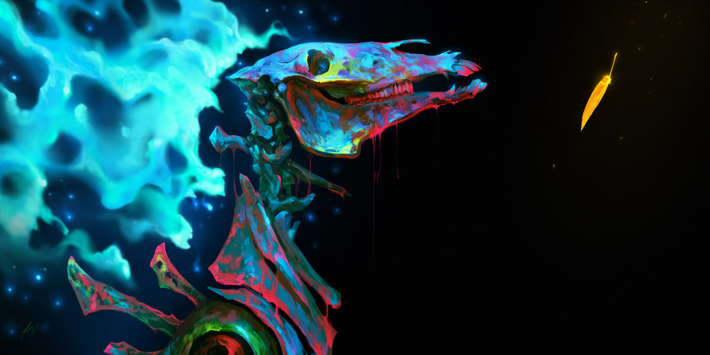](https://www.deviantart.com/artdoge/art/Every-Story-767384006 "Every Story by ArtDoge") 

&nbsp;

\conc

#### PJ de la segunda expedición a la Ciudad de Bronce

* Princesa Alya de Damasco, líder de la segunda expedición a la Ciudad de Bronce
* Muhammad al-Lawati, explorador principal de la segunda expedición a la Ciudad de Bronce
* Mahmoud Assy, consejero personal de la princesa Alya de Damasco

#### PJ de la llegada del cometa

* Ziba Al-Alephi, maga suprema y suma sacerdotisa de la Mano Dorada
* Alura, amazona, guardaespaldas de Ziba y asesina principal de la Mano Dorada de Suc’Naath

#### PJ de todas partes

* Bahram el Gauro, Adorador del Fuego, alquimista de oficio y líder de la secta del Fuego y de la Luz
* Mariam Al-Ijliya al-Asturlabi, nombradora de estrellas y fabricante de astrolabios
* Sett Zahía, la mujer más instruida y más elocuente de Bagdad

\sp

\sinc

## Harún Al-Raschid, Califa abasí de Bagdad ☾

\conc

> Y al oír estas palabras dichas con un acento tan delicioso, Al-Raschid se dilató y se holgó, y exclamó: «¡Maschalah! ¡oh molde de la perfección!» Y la miró aún más atentamente, y creyó volverse loco de alegría. Y Giafar y Massrur también creyeron volverse locos de alegría. Luego Al-Raschid se levantó de su trono y descendió hacia la jovenzuela, y se acercó a ella, y muy dulcemente le echó sobre el rostro su velillo de seda: lo que significaba que para en lo sucesivo pertenecía a su harén y que cuanto ella era se hundía para en lo sucesivo en el misterio prescrito a las elegidas de los Creyentes.
> 
> **Referencia:** Historia de la jovenzuela obra maestra de los corazones, lugartenienta de los pájaros (n. 929)

Harún Al-Raschid es el peor califa de la dinastía abasí. Harún era el segundo al trono y realmente no quería el puesto.

Prefería pasarse el día vagueando y disfrutando de todo lo que su posición y sus riquezas le daban, manjares, libaciones, baños y masajes, sexo ocasional, etc. 

Pero tras la muerte en combate de su hermano mayor, se convirtió sin quererlo en el máximo dirigente de un vastísimo imperio.

[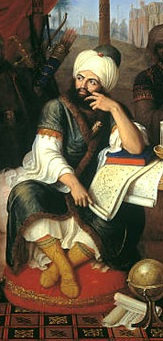](https://www.ecured.cu/Archivo:Harun_al-Rashid_(763-809).jpg "Harún Al-Raschid en su tienda con los sabios de oriente por Gaspare Landi") 

Muchos esperarían que la responsabilidad le hubiera hecho mejor persona, pero, sin embargo, solo amplifico todos sus malos hábitos y sus vicios, es infantil, vago, inculto, soberbio, iracundo, engreído, etc.

\sp

Sin embargo, ha hecho dos cosas muy bien durante su califato, casarse con su prima Sett Zobeida (aunque casi fue obligado) y tener a Giafar como su visir (aunque la tradición familiar abasí ya era tener a un barmáquida de consejero).

El Califa tiene la costumbre del segundo día del mes disfrazarse de mercader extranjero y pasearse de noche por Bagdad. Suele ir acompañado por Mansurr y Giafar y por sus algunos de sus «amigotes» como Abu Nowas. Su excusa para las escapadas es conocer a sus súbditos y ver qué cosas necesitan y qué puede hacer por ellos. No obstante, la mayoría de las veces son juergas locas.

La mayoría de sus escapadas suelen empezar con tremendas borracheras y suelen acabar en locos y peligrosos juegos o desafíos, como carreras de camellos por el bazar, concursos de beber o comer. También suelen acabar en peleas con otros juerguistas o con la guardia de la ciudad.

Si hay algo destacable en su persona es su increíble suerte. Tal es su suerte que ha evitado varios intentos de asesinato y que, a pesar de sus imprudencias, haberse librado de terribles accidentes.

Harún siempre va acompañado de su portaalfanje o guardaespaldas personal, Massrur (Guardia de palacio comodín con ventaja Grande). Massrur también hace las veces de verdugo del Califa y la verdad que tiene bastante trabajo.

* **Atributos:** Agilidad d6, Astucia d6, Espíritu d6, Fuerza d4, Vigor d6
* **Habilidades:** Atletismo d6, Cabalgar d8, Ciencias d4, Conocimientos Generales d4, Idioma materno d6, Humanidades d6, Interpretar d4, Notar d4, Pelear d6, Persuadir d4, Saber de Suleimán d4, Sigilo d4
* **Paso:** 6; **Parada:** 4; **Dureza:** 5
* **Desventajas:** Hábito (mayor, adicto al sexo), Obligaciones (mayor, deberes de Califa), Suspicaz (menor)
* **Ventajas:** Afinidad mágica, Alcurnia, Muy afortunado, Rico como un sultán
* **Equipo:** Ropajes carísimos y pretenciosos y todo lo que se le ocurra, cualquier capricho sobre todo de comida y bebida. Si está de incógnito, llevará ropas caras, pero no pretenciosas, pero seguramente portará alguna botella de licor o comida callejera.

\sp

**Sugerencia de interpretación:** Harún es muy sencillo de interpretar, solo tienes que ser lo más infantil y caprichoso posible. Sin olvidarte de ser totalmente despótico y de cogerte alguna rabieta de vez en cuando. Si tus schahriars le odian es que lo estás haciendo bien.

\sinc

## Sett Zobeida, Califesa de Bagdad ☾

\conc

> Cuentan que el Comendador de los Creyentes, Harún Al-Raschid, entró un día a dormir la siesta en las habitaciones de su esposa Sett Zobeida, y ya iba a echarse cuando notó precisamente en mitad del lecho una extensa mancha, fresca todavía, de cuyo origen no podía dudarse. Al ver aquello, se ennegreció el mundo ante el califa, que llegó al límite de la indignación. Hizo llamar al punto a Sett Zobeida, y con los ojos inflamados de cólera y temblándole la barba, le dijo: «¿De qué es esa mancha que hay en nuestro lecho?» Sett Zobeida acercó la cabeza a la mancha consabida, la olió y dijo: «Es de licor de hombre, ¡oh Emir de los Creyentes!» Conteniendo a duras penas el estallido de su cólera, exclamó él: «¿Y puedes explicarme la presencia de ese líquido aún tibio en un lecho donde no me he acostado contigo desde hace más de una semana?»
> Ella exclamó muy conmovida: «¡La fidelidad sobre mí y alrededor de mí ¡oh Emir de los Creyentes! ¿Acaso me acusas de fornicación?»s
> 
> **Referencia:** El flagrante delito de Sett Zobeida (n. 380)

Sett Zobeida es la califesa de Bagdad y la mujer más poderosa del califato. Aunque su palabra no es ley, ha aprendido a manejar a su marido de manera que sus tonterías y chaladuras se conviertan en leyes justas y buenas y sus despilfarros y sus derroches en gastos lógicos y ayudas para sus súbditos, sobre todo los más necesitados. Gran parte de su trabajo es tener al Califa entretenido con acertijos, juguetes y juegos para que esté lo más alejado de la política del reino.

Ha querido el destino que Zobeida sea el yin que equilibra el yang loco del califa. Sin la califesa con la ayuda de Giafar el visir, el califato habría caído en el caos hace años.

Su matrimonio fue un matrimonio concertado entre su padre y el califa, de forma que el amor no tuvo nada que ver, de hecho la califesa y su marido el califa son primos, cosa que no agrada mucho a Zobeida. Hace años (desde que le dio descendencia) que el califa y la califesa no tiene relaciones y aunque el califa lo intenta, ella se encarga de tenerlo alejado.

\sp

[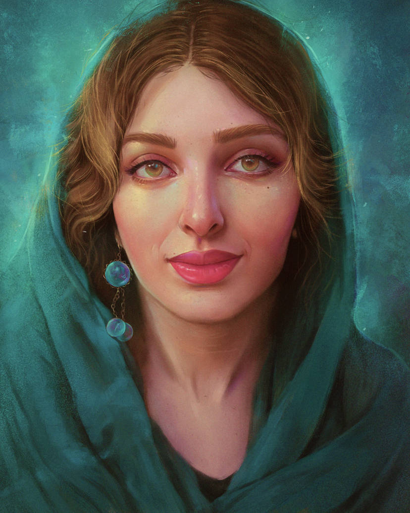](https://www.deviantart.com/arthurhenri/art/Farnoush-832619998 "Farnoush by ArthurHenri") 

Sett, a diferencia de lo que pudiera pensarse, se lleva muy bien con las concubinas del califa. Las cuida, las aconseja y las protege y no siente ningún tipo de celos contra ellas. Con su ayuda conoce todas las cosas que hace el califa y ellas le ayudan a manipular al califa.

* **Atributos:** Agilidad d6, Astucia d10, Espíritu d10, Fuerza d6, Vigor d6
* **Habilidades:** Atletismo d4, Ciencias d6, Conocimientos Generales d4, Humanidades d6, Idioma Materno d10, Investigar d6, Interpretar d6, Medicina d6, Notar d8, Pelear d6, Persuadir d8, Sigilo d6, Tácticas d6
* **Paso:** 6; **Parada:** 5; **Dureza:** 5
* **Desventajas:** Cauta (menor), Curiosa (mayor)
* **Ventajas:** Afinidad mágica, Alcurnia, Carismática, Responsable, Rico como un sultán
* **Equipo:** Ropajes caros, pero sobrios y elegantes

**Sugerencia de interpretación:** Eres rápida respondiendo a las tonterías del califa y su séquito de inútiles, así que es complicado pillarte con la guardia baja. Eres realmente la persona que maneja el califato y estás muy cansada de tener que pasarte el día arreglando los desmames de tu marido. Por lo demás, eres una buena persona que solo busca lo mejor para sus súbditos.

\sp

\sinc

## Giafar al-Barmak, gran visir del califa de Bagdad ☾

\conc

> /p/ Miro sus manos y solo encontró unas pinzas de cangrejo del Mar Rojo y mirando su cuerpo solo vio una especie de caracola gigantesca como las que los pescadores de Basora recogen en las playas. Su fe budista ya le había preparado para el ciclo eterno del karma y la reencarnación, pero aquello superaba lo que su cordura podía resistir. Su mirada se nubló y luego nada …  
> /p/ Cuando el sentido volvió a su cuerpo, a su lado estaban dos seres como él que según Alhazred eran yinns de la tribu de abu-qiths. Y ahora era parte de la tribu y o mejor todos sus conocimientos eran también suyos.

Giafar es el principal personaje de esta ambientación. Es el personaje alrededor del que gira gran parte de las tramas y aventuras ambientadas que suceden Bagdad. Está lleno de secretos y es un excepcional mago con poderes sin parangón. Pocas personas pueden compararse con él y, aun así, será incapaz de escapar al terrible destino que se cierne sobre él.

Giafar es un barmáquidas (por eso se le llama Giafar al-Barmak). Esta familia persa es originaria de Afganistán, exactamente son descendientes del gran sacerdote budista Barmak del monasterio de Nawbahar.

Los barmáquidas tiene una larga tradición de ministros, secretarios y visires al servicio de los primeros califas abasíes. De hecho el padre de Giafar, Yahía al-Barmak, sirvió al padre de Harún, Mansur al-Mahdi. Es por ello que desde muy pequeño fue preparado para que él y su hermano mayor, El-Fadl, fueran su sustituto cuando su padre se retirara.

Giafar lleva toda su vida estudiando ciencias y humanidades como parte de su preparación para ser visir. Rápidamente descubrió el mundo del ocultismo y descubría que la magia se le daba muy bien, convirtiéndose con los años en un fabuloso mago. Dispone de una increíble biblioteca mágica con varios incunables de grandísimo valor.

Giafar fue poseído por un abu-qith, seguramente por su excepcionalidad y su interés histórico. Durante el tiempo que paso en su tierra, la ciudad de Pnakotus, revisó sus archivos y averiguó su propia muerte por orden su señor y amigo, el Califa Harún Al-Raschid. 

\sp

[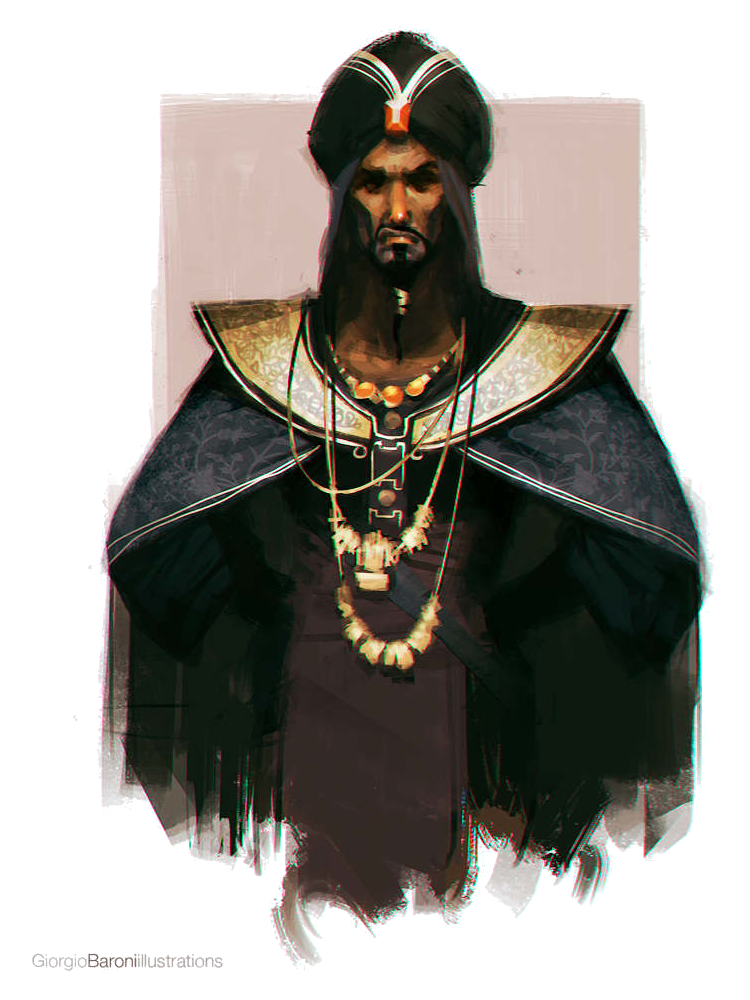](https://www.deviantart.com/giorgiobaroni/art/Sketch-Dailies-Jafar-530933382 "Sketch_Dailies: Jafar by giorgiobaroni") 

Al devolverle a su cuerpo, el borrado de memoria falló y recuerda retazos de su experiencia, pero su muerte y la caída de su familia quedó grabada en su mente a fuego.

Giafar es budista como el resto de su familia, algo que han llevado en secreto durante siglos, ya que sería una vergüenza que el visir del califa no fuera de re islámica. Aunque corren rumores, nunca han podido ser demostrados, pero eso no quiere decir que no se hayan usado para envenenar el oído del califa contra Giafar.

Giafar está felizmente casado y con hijos, pero tiene ciertos sentimientos por ’Inān bint ’Abd-Alāh, concubina del califa.

* **Atributos:** Agilidad d8, Astucia d10, Espíritu d10, Fuerza d6, Vigor d8
* **Habilidades:** Atletismo d6, Cabalgar d4, Ciencias d10, Conocimientos Generales d4, Humanidades d10, Idioma Materno d10, Idioma Aklo d6, idioma Chino d6, Idioma Indio d6, Idioma Franco d6, Intimidar d8, Medicina d6, Notar d8, Saber de Suleimán d12+1, Persuadir d6, Pelear d8, Sigilo d4
* **Paso:** 6; **Parada:** 6; **Dureza:** 6
* **Desventajas:** Secreto (menor, conoce cuándo y cómo morirá), Secreto (Mayor, budista)
* **Ventajas:** Afinidad mágica, Alcurnia, Canalización, Investigador, Nuevos poderes x3, Trasfondo arcano (Sihr), Puntos de poder x2, Temple
* **Capacidades especiales:**
  * **Hechizos:** 30 PP, Círculo de detección, Diamante líquido, Dotar de alas, Dominio tierra, Encerrar en una botella (maldición), Geomancia, Hisopar, Petrificar, Visto y no visto
* **Equipo:** Alfanje digno de un califa (FUE+d8), ropajes de calidad y normalmente oscuros y con poco adorno.

\sp

**Sugerencia de interpretación:** La responsabilidad que recae sobre tus hombros es muchísima, muchas vidas están a tu cargo y tus acciones pueden significar la diferencia entre que vivan o mueran. Es por ello que no dejas nada al azar, eres preciso en tus órdenes, te cuesta mucho delegar y no admites fallos. El saber cuándo y cómo vas a morir, te ha llevado a aceptar tu muerte. Aun así, de vez en cuando te dejas disfrutar de los pequeños placeres de la vida como una buena comida, una charla con los amigos o meter los pies en agua fría en pleno verano en Bagdad.

\sinc

## Fátimah, líder del Pequeño Consejo ☾

\conc

> /p/ Así es que, en cuanto bajo ella, empezó por besar la mano de su amo y le deseó la bienvenida, como tenía costumbre de hacer cada vez que entraba él en la casa. Su amo le dijo: «¡Oh Fátimah! ¡Hoy es el día en que me vas a dar prueba de tu listeza, de tu abnegación y de tu discreción!» Y le contó el fin funesto de Kassim, y añadió: «Y ahora ahí le tienes, hecho seis pedazos, en el tercer asno. ¡Y es preciso que, mientras yo subo a anunciar la fúnebre noticia a su pobre viuda, pienses en el medio de que nos valdremos para hacerle enterrar como si hubiera muerto de muerte natural, sin que nadie pueda sospechar la verdad!» 
> /p/ Y ella contestó: «¡Escucho y obedezco!» Y su amo, dejándola reflexionar acerca de la situación, subió a ver a la viuda de Kassim.
> /p/ 
> /p/ **Referencia:** Historia de Alí Babá y los cuarenta ladrones (n. 855)

Fátimah es la líder por derecho propio del Pequeño Consejo. Es la más sabia y justa de todos los pillastres callejeros que forman el consejo.

Se está haciendo mayor y tendrá que abandonar el consejo, por eso busca desesperadamente alguien que ocupe su lugar.

Fátimah es una esclava huida, es hija de una esclava que su amo tenía como concubina. En cuanto pudo huyó para vivir en las calles de Bagdad y sabe que pueden ser muy duras para los huérfanos y huérfanas de la ciudad. Es por ello que cuando le dieron la oportunidad de unirse al Pequeño Consejo no desaprovechó la oportunidad.

Cuando creció y fue elegida como jefa por su predecesora juro hacer lo que fuera por el Consejo y su gente. Hará lo que sea por sus compañeros y seguramente daría su vida por los y las pillastres de Bagdad.

\sp

[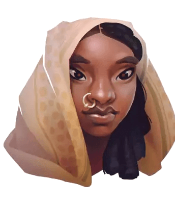](https://www.deviantart.com/tsynali/art/indi-girl-530934040 "indi girl por tsynali") 

Se hace mayor y tiene que buscar alguien que la sustituya, quizás alguno de tus schahriars atraiga el interés de Fátimah y herede el cargo.

* **Atributos:** Agilidad d6, Astucia d10, Espíritu d10, Fuerza d4, Vigor d6
* **Habilidades:** Atletismo d6, Cabalgar d6, Conocimientos Generales d4, Idioma Materno d10, Medicina d6, Notar d4, Pelear d4, Persuadir d10, Reparar d6, Saber de Suleimán d6, Sigilo d6
* **Paso:** 6; **Parada:** 4; **Dureza:** 5
* **Desventajas:** Joven (menor), Heroica
* **Ventajas:** Acaparadora, Afinidad mágica, Afortunada, Mujer de recursos
* **Equipo:** Ropas baratas y usadas, Jambia (FUE+d4) para autodefensa, tizas de colores para hacer señas y calderilla para ayudar a niños y niñas del Pequeño Consejo.

**Sugerencia de interpretación:** Eres una de las personas más optimistas del mundo. Siempre ves el lado bueno de las cosas, e incluso en las peores situaciones ves la parte positiva. Estás siempre con una sonrisa en la boca y una palabra dulce en los labios tratando de ayudar en todo lo que puedas. Eso no quiere decir que no puedas ponerte seria, cuando la situación lo pide.

\sp

\sinc

## Princesa Alya de Damasco, líder de la segunda expedición a la Ciudad de Bronce ☾

\conc

> /p/ Había momentos en que la princesa Alya, como los derviches que bailan, se alejaba del mundo y su mente entraba en otro mundo del que no sabíamos nada. Pero según la expedición se acercaba a su destino, la Ciudad de Bronce, esos momentos eran más frecuentes y largos. Cuando volvía estaba unos minutos silenciosa como digiriendo lo que acababa de ver.  
> /p/ Ninguno de nosotros podía imaginar lo que pasada esos momentos, pero ni por asomo pudimos pensar que esos lapsus terminarían como terminaron.

Alya es la nieta del antiguo califa de Damasco, Abdalmalek, de la dinastía omeya que hace décadas fue sustituida por la dinastía abasí. A pesar de todo, su familia siguió siendo muy poderosa y rica en Damasco.

Alya ha crecido entre lujo y riquezas, pero siempre se ha sentido extraña, sabiendo que no estaba en el lugar que debía.

Cuando conoció la historia de su abuelo, supo que la Ciudad de Bronce era el sitio donde debía que estar.

Es por ello que se preparó desde pequeña para esa expedición y cuando tuvo la edad cogió parte de la fortuna familiar para montar la caravana y así cumplir la promesa de su abuelo.

Su obsesión con la ciudad de Bronce es total y sabe perfectamente que si la encuentra no volverá, sino que se quedará allí para siempre. Esta obsesión que tiene la princesa se debe un gran secreto familiar, por sus venas corre sangre de gente de mar.

Su abuelo hizo concubinas a las hembras de gente del mar que vinieron con la primera expedición y tuvieron descendencia. Uno de los príncipes híbridos tuvo a Alya con una concubina para después desaparecer de Damasco, seguramente en el Mediterráneo.

Alya desconoce todo esto, pero su tutor y consejero personal Mahmoud Assy está a tanto de las profanaciones de su abuelo y está convencido de que la expedición es la sangre tirando de ella.

\sp

[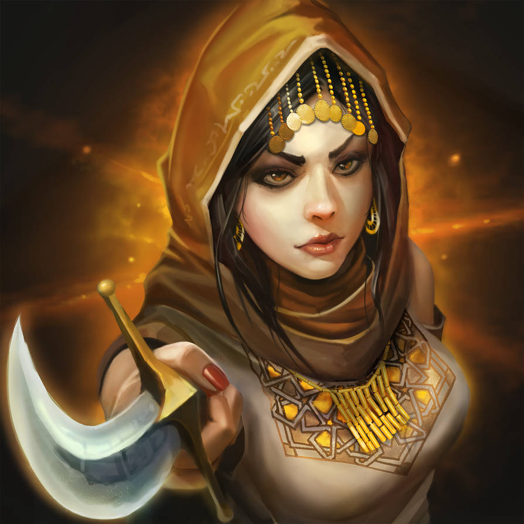](https://www.deviantart.com/maxprodanov/art/Surrender-717572378 "Surrender! by maxprodanov") 

* **Atributos:** Agilidad d8, Astucia d6, Espíritu d6, Fuerza d8, Vigor d8
* **Habilidades:** Atletismo d8, Cabalgar d6, Ciencias d6, Conocimientos Generales d6, Humanidades d6, Idioma Materno d8, Idioma de la gente del mar d4, Interpretar d6, Medicina d6, Notar d6, Pelear d8, Persuadir d6, Sigilo d6
* **Paso:** 6; **Parada:** 7; **Dureza:** 6
* **Desventajas:** Obsesión (mayor, encontrar la Ciudad de Bronce), Secreto (mayor, sangre de profundo)
* **Ventajas:** Afinidad mágica, Bloqueo, Nervios de acero, Mando, ¡Mantened la formación!
* **Capacidades especiales:**
  * **Semiacuáticos:** Pueden respirar bajo el agua sin problemas, pero nada como un humano normal.
  * **Longevidad:** Puede llegar a vivir hasta los 150 años y no necesita dormir.
  * **Resistencia primigenia:** Alya no se cansa por mucho esfuerzo que haga en las condiciones que sean, sin casi agua, bajo un sol de justicia, etc. Repite todas las tiradas de Vigor para evitar puntos de fatiga que falle.
  * **Resistencia al veneno y las enfermedades:** +4 a las tiradas para resistir venenos y enfermedades.
  * **Cerca de su dios:** Alya se vuelve más poderosa cuanto más cerca está de la Ciudad de Bronce y de su gran señor Cthulhu. De forma que por cada parte del camino recibe al principio de cada sesión un beni extra por cada etapa después de «Adentrándose en lo desconocido». De esa manera, cuando esté en la Ciudad de Bronce en la parte de «Rompiendo la maldición» tendrá 3+7 benis.
* **Equipo:** Astrolabio, Ropas de viaje de calidad preparadas para el desierto, alfanje de calidad (FUE+d6), Jambia(FUE+d4), equipo de supervivencia

\sp

**Sugerencia de interpretación:** La sangre de gente del mar corre por tus venas y se nota en tu carácter hosco y huraño. Sabes que Damasco no es tu lugar, es donde naciste, pero no donde deberías estar. Farfullas por lo bajo cuando te llevan lo contrario y sientes que nadie te comprende. Esos «pieles blandas» no te comprenden … ¿por qué les he llamado pieles blandas?

&nbsp;

```
Una tirada de Saber de Suleimán puede indicarte que hay algo extraño en la princesa, pero para detectar su auténtica esencia deberán sacar por lo menos 2 avances. Si tienen pruebas, como que puede aguantar muchos años bajo el agua o que aguanta enfermedades, venenos o alcohol mejor que el resto de la gente, solo necesitarán 1 avance, para descubrir la verdad.
```

\sinc

## Muhammad al-Lawati, explorador principal de la segunda expedición a la Ciudad de Bronce ☾

\conc

> /p/ Era un viejo truco de las gentes del desierto que había aprendido de joven, podía sacar algunos nutrientes de las raíces de las rosas del desierto. No era mucho, pero era algo. Fue recogiendo las raíces cuando noto el temblor.  
> /p/ No era que nunca hubiera notado las sacudidas, pero esta era diferente. No temblaba toda la duna, solo la arena debajo de él. Las vibraciones se hicieron tan intensas que cayó de espaldas y en ese momento aquel gigantesco gusano surgió de la arena a sus pies. Se alzó hasta tapar el sol y los tentáculos de su cabeza empezaron a moverse como si hablará y Muhammad le escuchó, aunque no a través de sus oídos.

Este joven bereber lleva toda su vida sirviendo de guía para caravanas en el Norte de África, siguiendo la tradición familiar. Le encanta el desierto y solo se imagina sobre una duna con el sol poniéndose y el viento en su cara.

Muhammad sabe leer el viento y la arena de desierto como nadie y puede guiarse sin problema entre sus dunas. Podría sobrevivir semanas con el agua y la comida que una persona normal consume en una. Se sabe de memoria la ubicación de los pozos de agua y no hay plantas comestibles que no conozca.

Por el contrario, es completamente inútil en la ciudad. La gente, el ruido y los olores le aturullan y es incapaz de hacer nada útil. Por eso las evita siempre que puede.

\sp

[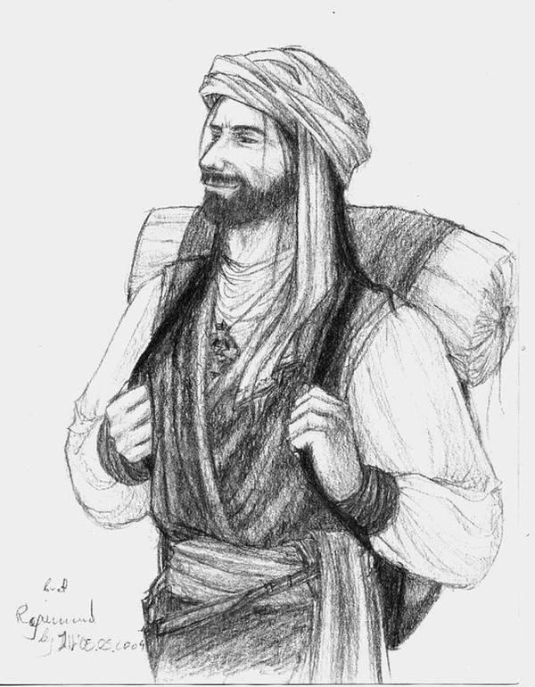](https://www.deviantart.com/a6a7/art/Traveller-47123209 "Traveller by A6A7") 

Siempre va acompañado por su camello Abu. Llevan juntos toda la vida, de hecho, su madre le recuerda que mientras la matrona le ayudaba a dar a luz a Muhammad, su padre ayudaba en el parto de Abu. Un camello vive entre 40 y 50 años, así que estarán juntos mucho tiempo.

No es un genio del shatranj, pero desde luego se le da bien. Todas las noches que no tiene guardia o alguna tarea que hacer las pasa jugando con Mahmoud Assy. Recibe unas palizas tremendas, pero espera que a la vuelta haya podido ganarle una partida. Si quieres ganártelo una manera muy sencilla, lo mejor es darle algún consejo de shatranj o enseñarle alguna apertura que desconozca.

* **Atributos:** Agilidad d8, Astucia d8, Espíritu d8, Fuerza d8, Vigor d8
* **Habilidades:** Atletismo d8, Cabalgar d8, Conocimientos Generales d6, Disparo d8, Idioma Materno d8, Notar d10, Persuadir d6, Pelear d10, Reparar d6, Saber de Suleimán d4, Sigilo d4, Supervivencia d10, Tácticas d6
* **Paso:** 6; **Parada:** 8(1); **Dureza:** 6
* **Desventajas:** Impulsivo, Fobia (enoclofobia, miedo a las multitudes, mayor)
* **Ventajas:** Afinidad mágica, Bloqueo, Leñador, Señor de las bestias, Temple
* **Equipo:** Ropas de viaje, alfanje (FUE+d8), equipo de supervivencia, ajedrez de viaje, Semilla de Khizr (es un legado bereber, espera al momento justo para usarlo)

**Sugerencia de interpretación:** Eres tremendamente bonachón, alegre y simpático y siempre tienes una palabra de ánimo con tus compañeros de viaje. Estás donde quieres estar y haces lo que te gusta que es explorar. Detrás de cada duna puede haber algo sorprendente, así que porque esperar a mañana para ver las maravillas que oculta.

\sp

\sinc

## Mahmoud Assy, consejero personal de la princesa Alya de Damasco ☾

\conc

> /p/ El jeique, al que todos creían dormido, abrió los ojos, miro la losa de piedra y sin subir el tono de voz dijo con toda calma: «Ohh Princesa de la estrella de la tarde, lo que ves ante tus ojos es griego en caracteres jónicos, y es para mí, vuestro humilde esclavo, un honor traducirlo para su majestad».  
> /p/ «Adelante, mi querido jeique».  
> /p/ «Escucho y obedezco» Fue la respuesta del anciano consejero mientras se levantaba de su silla y se acercaba a la gigantesca piedra.

Assy es un barmáquida como el visir Giafar y profesa la fe budista, es por ello que es un pacifista convencido. Lleva toda su vida sirviendo a la familia de Alya, primero como empleado público, más tarde como kadí y por último como consejero del padre de Alya y luego como tutor de la propia Alya.

Ya está mayor y la muerte le ronda, así que la expedición puede ser su último gran viaje. Seguramente no vuelva, no cree que pueda sobrevivir a los peligros de la Ciudad de Bronce, pero será un gran viaje que se contará durante años y le agrada esa idea de reencarnación como personaje de alguna historia o de cuento popular.

Assy conoce la extraña herencia genética que tiene la princesa Alya, pero lo ha guardado siempre. Puede que en algún momento de la nueva expedición que la princesa Alya está organizando a la Ciudad de Bronce tenga que contárselo.

Es un fanático del shatranj y pasa largas noches jugando con la princesa Alya. Usa esas partidas para enseñar importantes lecciones vitales y filosóficas basadas en su budista. También suele jugar con al-Lawati.

* **Atributos:** Agilidad d4, Astucia d8, Espíritu d10, Fuerza d4, Vigor d6
* **Habilidades:** Atletismo d4, Ciencias d6, Conocimientos Generales d4, Humanidades d6, Idioma materno d8, Idioma Latín d8, Idioma Griego clásico, Investigar d8, Notar d8, Pelear d6 (solo defensa), Persuadir d4, Sigilo d4, Tácticas d8
* **Paso:** 5; **Parada:** 5; **Dureza:** 5
* **Desventajas:** Anciana (mayor), Secreto (Mayor, budista), Pacifista (mayor)

\sp

[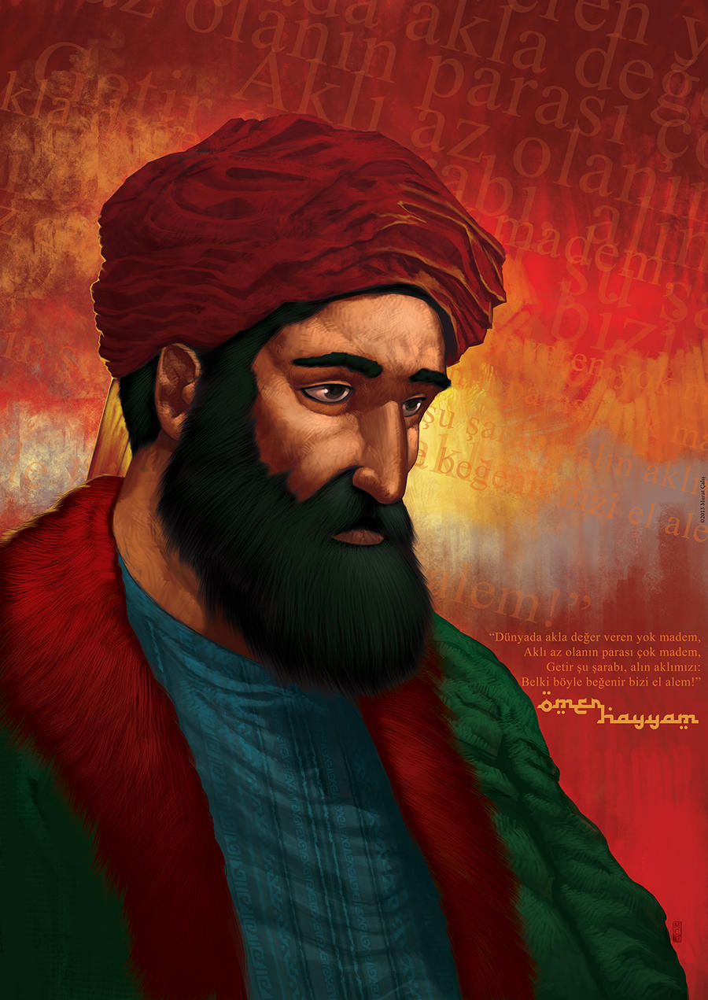](https://www.deviantart.com/muratcalis/art/Omar-Khayyam-354059432 "Omar Khayyam by MuratCALIS") 

* **Ventajas:** Afinidad mágica, Lingüista
* **Equipo:** Ropajes caros y de calidad, pero poco ostentosos, bastón para caminar finamente tallado con filigranas de oro y plata

**Sugerencia de interpretación:** Mahmoud es la persona más callada que existe y cuando habla dice poco, pero es oro puro. Deberías usar a Mahmoud como voz de Scheherazade. Cuando tus schahriars estén perdidos, Mahmoud abrirá la boca y en 4 palabras les dará la clave para continuar.

\sp

\sinc

## Ziba Al-Alephi, maga suprema y suma sacerdotisa de la Mano Dorada ☾

\conc

> /p/ Y ella dijo entonces: «¡Duerme! ¡Y así no te despiertes nunca más! ¡Por Alah, te detesto! Y detesto hasta tu imagen, y mi alma está harta de tu trato». Después se levantó, se puso su mejor vestido, se perfumó, se ciñó una espada, y abriendo la puerta del palacio se marchó. En seguida me levanté yo también, y la fui siguiendo hasta que hubo salido del palacio. Y atravesó todos los zocos, y llegó por fin hasta las puertas de la ciudad, que estaban cerradas.
> /p/ Entonces habló a las puertas en un lenguaje que no entendí, y los cerrojos cayeron y las puertas se abrieron, y ella salió. Y yo eché a andar detrás de ella, sin que lo notase, hasta que llegó a unas colinas formadas por los amontonamientos de escombros, y a una torre coronada por una cúpula y construida de ladrillos. Ella entró por la puerta, y yo me subí a lo alto de la cúpula, donde había una terraza, y desde allí me puse a vigilarla. \[…\]
> /p/ Y levantando el brazo, me disponía a herirla, cuando ella, pronunciando unas palabras misteriosas, y dijo: «Por la virtud de mi magia, que Alah te convierta mitad piedra y mitad hombre». E inmediatamente, señor, quedé como me ves. Y ya no puedo valerme ni hacer un movimiento, de suerte que no estoy ni muerto ni vivo. Después de ponerme en tal estado, encantó las cuatro islas de mi reino, convirtiéndolas en montañas, con ese lago en medio de ellas, y a mis súbditos los transformó en peces. Pero hay más. Todos los días me tortura azotándome con una correa, dándome cien latigazos, hasta que me hace sangrar. Y después me pone sobre las carnes una camisa de crin, cubriéndola con la ropa.
> /p/ 
> /p/ **Referencia:** Historia del joven encantado y de los peces (n. 7)

Ziba de Alepo desciende de una larga tradición de adoradoras de Suc’Naath. Su madre adoraba a Suc’Naath y su abuela antes que ella. Y todas ellas portaban la esencia de su divinidad, lo que las convertía en poderosas canalizadoras del poder mágico. La magia no solo es fuerte en su familia, también las riquezas, lo que permitieron pagar los mejores maestros y profesores.

Cuando su madre murió, toda la esencia se concentró en ella, ofreciéndole un gran poder mágico y la fortuna familiar. Con ello obtuvo todo lo necesario para liderar la Mano Dorada y embarcarla en la misión de liberar a Suc’Naath de la música infernal que hace que baile alrededor de Azathoth.

Ziba mantiene en secreto sus lazos con la Mano Dorada y mantiene una imagen pública de poderosa maga «bondadosa» y de mujer muy sabia. Nada más alejado de la realidad, teniendo en cuenta que quiere liberar a un dios caótico y cruel en la Tierra.

\sp

[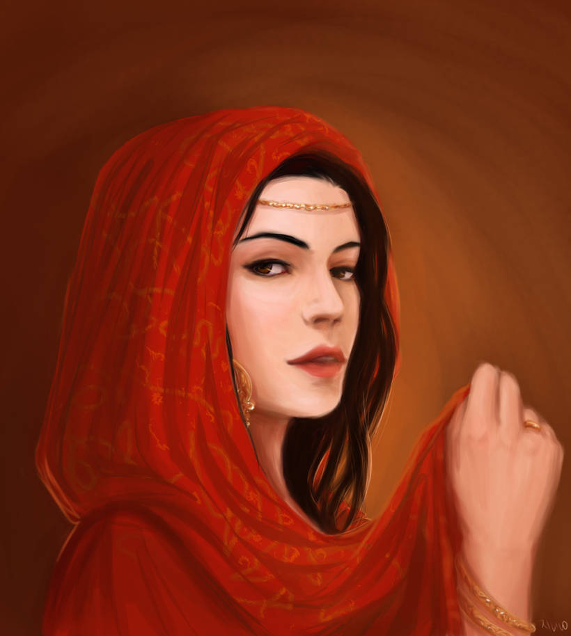](https://www.deviantart.com/a6a7/art/Innuendo-157531990 "Innuendo by A6A7") 

Ziba quizás sea la maga más poderosa de todo Oriente Medio y si bien su poder no el comparable al Rey Suleimán puede vencer en combate mágico a humanos y yinns por igual.

Los recursos económicos de Ziba son inmensos. Domina el arte de la trasmutación y tiene gran una cantidad de azufre rojo, con lo que hacer oro a partir de plomo es muy fácil. Si gastase todo su azufre rojo podría tener su propia montaña de oro.

* **Atributos:** Agilidad d8, Astucia d10, Espíritu d12, Fuerza d6, Vigor d8
* **Habilidades:** Atletismo d6, Cabalgar d6, Ciencias d8, Conocimientos Generales d12, Humanidades d8, Idioma Materno d10, Investigar d8, Medicina d6, Notar d4, Pelear d8, Persuadir d10, Saber de Solimán d12+1, Sigilo d6, Tácticas d8
* **Paso:** 6; **Parada:** 6; **Dureza:** 6
* **Desventajas:** Secreto (mayor, líder de la Mano Morada), Vengativa
* **Ventajas:** Afinidad mágica, Canalización, Trasfondo arcano (Sihr), Nuevos poderes x3, Puntos de poder x 2, Subidón de poder
* **Capacidades especiales:**
  * **Esencia de Suc’Naath:** Suc’Naath ofrece su poder a sus elegidos, pero exige un sacrificio en dolor. Los negativos por heridas se restan del gasto de PP de los hechizos.
  * **Hechizos:** 36 PP, Bola de fuego, Círculo de detección, Encerrar en una botella, Hisopar, Ojos de Serpiente, Interpretar sueños, ¡Sésamo, ábrete!, Torbellino, Transformar en animal
* **Equipo:** Ropajes caros, jambia de plata con incrustaciones de oro para rituales (FUE+d6), 1d4 dosis de bang cretense, 5d10 dosis de azufre rojo, 1d6 dosis de sangre de Fénix, por lo menos dos grimorios al azar

\sp

**Sugerencia de interpretación:** Como Ziba debes exudar confianza y seguridad, ni la más mínima señal de duda debe cruzar tu semblante. Sabes en todo momento lo que hay que hacer y cómo hacerlo y si no lo sabes, tomas una decisión con la convicción de que no habrá el mínimo fallo. Esta confianza te viene de saber que estás tocada por la divinidad y es por ese aplomo que tus seguidores y seguidoras irán y harán lo que les digas. Toca cambia cuando pierdes el control y la ira y la sed de sangre se apodera de ti. En esos momentos solo puedes gritar maldiciones y destilar odio a tus enemigos.

\sinc

## Alura, amazona, guardaespaldas de Ziba y asesina principal de la Mano Dorada de Suc’Naath ☾

\conc

> Y ante él aparecieron, formadas en cuadro movible y formidable, guerreras montadas en yeguas leonadas como el oro puro, de cola larga, de jarretes vigorosos, con las riendas altas y libres, más veloces que el viento del Norte cuando sopla con violencia por el lado del mar tempestuoso. Y cada una de aquellas guerreras, armadas para el combate, llevaba al costado un sable pesado, una larga lanza en una mano y en la otra una porción de armas que asustaban al verlas; y con sus muslos oprimían cuatro jabalinas que mostraban sus cabezas espantables.
> 
> **Referencia:** Las aventuras de Hassan Al-Bassri (n. 605)

Alura es hija de las amazonas de la reina Abriza, hija del rey griego Hardobios y señora de Kaissaria en Chipre.

Abriza tenía un ejército de fiera y mortales amazonas y una de sus guardaespaldas personales era la madre de Alura.

Su madre se quedó embarazada y abandonó el ejército para criar a su hija. Su madre, Helena, la entreno en todas las artes de la guerra, pero la verdad que descuidó otras partes de su educación.

Alura se tiró varios años como mercenaria al mejor postor hasta que se encontró con Ziba que la puso bajo su protección y la ha tratado como su hija y a la vez como su maestra asesina. Alura no es creyente de Suc’Naath, solo es leal a Ziba, por la que profesa verdadera devoción.

\sp

[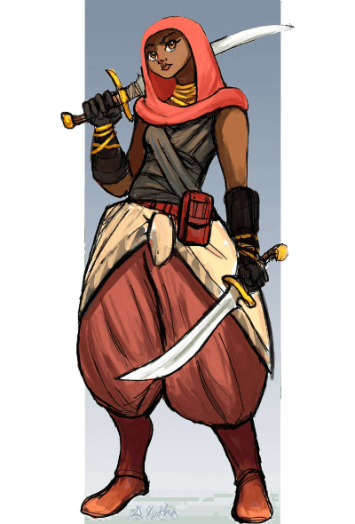](https://www.deviantart.com/thelivingshadow/art/Character-Design-Ammani-491123317 "Character Design: Ammani by TheLivingShadow") 

Alura es una gran combatiente, diestra, fuerte, rápida y resistente. Con un gran don para la táctica y las emboscadas. Sus puntos débiles que no tiene estudios, apenas conoce los números y no sabe leer ni escribir. El otro punto débil es que tiene cero capacidades sociales. No sabe moverse entre sus congéneres y muchas de las aptitudes sociales básicas se le escapan debido a que en su niñez no pudo ponerlas en práctica.

* **Atributos:** Agilidad d12, Astucia d6, Espíritu d6, Fuerza d10, Vigor d12
* **Habilidades:** Atletismo d12, Cabalgar d10, Conocimientos Generales d6, Disparar d10, Idioma materno d6, Notar d4, Pelear d12, Persuadir d4, Sigilo d12, Tácticas d10
* **Paso:** 6; **Parada:** 9 (1); **Dureza:** 13/12 (4/3)
* **Desventajas:** Secreto (asesina principal de la Mano Dorada de Suc’Naath)
* **Ventajas:** Afinidad mágica, Ambidextro, Ataque repentino, Con un par, Bloqueo, Fornida, Frenesí, Resistencia mágica
* **Equipo:** Cimitarra mágica +1/+1(FUE+d8+1), Katar (FUE+d6), Jawshan (+4 peto, +3 piernas y brazos), Chakram, Arco recurvo con 10 flechas

**Sugerencia de interpretación:** No pillas ni las ironías, ni lo dobles sentidos, ni nada por el estilo. Eres bastante literal interpretando los comentarios de la gente de tu alrededor. Ziba lo sabe y actúa en consecuencia, pero el resto de las personas no y eso hace que terminen alejándote de ti porque no saben por dónde vas a salir.

\sp

\sinc

## Hunayn ibn Ishaq, director de la Casa de la Sabiduría ☾

\conc

> /p/ Ha llegado a mis oídos, o príncipe de los creyentes, que en la época del califa Al-Raschid, había un médico de muy saber llamado Hunayn ibn Ishaq. Era un hombre muy recto y de severos principios éticos. Se cuenta que el propio califa le había pedido a cambio de una gran suma de dinero preparar un bebedizo mortal para deshacerse de uno de sus enemigos. Pero Hunayn rehusó diciéndole:  
> /p/ «Mi ciencia solo trata de sustancias benéficas; por ello no he estudiado otras. Dos cosas me impiden preparar el veneno mortal: mi religión y mi profesión. La primera me enseña que debemos hacer el bien incluso a nuestros enemigos, y con tanta mejor razón a nuestros amigos. En cuanto a mi profesión, ha sido instituida para el más grande beneficio de la humanidad, con el fin exclusivo de curar y de aliviar. Además, como todos los médicos, he jurado no dar a nadie una sustancia mortal».  
> /p/ Como todavía se negaba a obedecer sus mandatos, el califa intentó doblegarlo con amenazas y conduciéndolo a prisión; pero como no lograba nada de él, al fin lo liberó y lo recompensó incluso por su integridad moral ofreciéndole una gran suma de dinero y nombrándolo su médico personal.

Hunayn ibn Ishaq estudio medicina como su padre, pero enseguida destaco en el estudio de las lenguas y aprendió viajando, sobre todo por las tierras de los francos, griego, griego clásico, turco, latín, pero también, persa, chino, indio, etc.

En esos viajes tradujo obras clásicas escritas en todo esos idiomas y al volver a Bagdad las entrego a la Casa de la Sabiduría. Ante tremendo trabajo se le nombró traductor y fue ascendiendo hasta ser director de la Casa.

En su trabajo actual se junta las 3 cosas que más le gusta del mundo, los idiomas, los libros y conservar y difundir la cultura. Como director ha sentado las bases de la traductología árabe moderna.

Es un hombre muy recto y de severos principios éticos, regidos por su fe cristiana. Y ese es su gran secreto, que es cristiano. Si bien todas las fes son permitidas (sobre todo si pagan impuestos) no son aceptadas en altos cargos. Si se descubriera este secreto, Hunayn podría perderlo todo, pero lo que más teme es que destruyan todo su trabajo literario como médico y como traductor.

Si quieres granjearte su amistad, no hay nada mejor que regalarle algún tratado antiguo de origen griego, chino, indio o alguna lengua muerta hace muchos siglos. 

\sp

[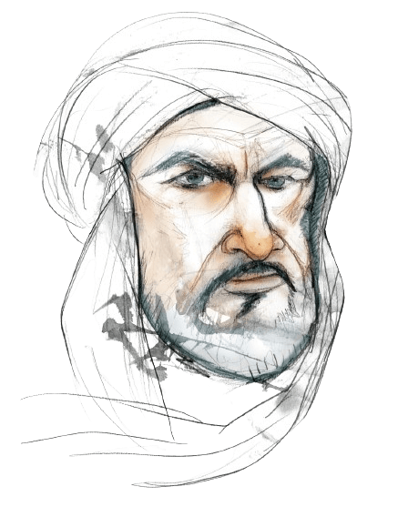](https://en.wikipedia.org/wiki/Al-Zarqali#/media/File:Azarquiel_(MUNCYT,_Eulogia_Merle).jpg "Retrato de Azarquiel. Fundación Española para la Ciencia y la Tecnología, Eulogia Merle.") 

Por otro lado, si necesitas alguien que te traduzca un manuscrito, Hunayn ibn Ishaq es la persona adecuada.

También estará encantado de financiar cualquier tipo de expedición que pueda traer tomos de saber interesantes para la Casa de la Sabiduría.

* **Atributos:** Agilidad d6, Astucia d10, Espíritu d10, Fuerza d6, Vigor d8
* **Habilidades:** Atletismo d6, Ciencias d6, Conocimientos Generales d6, Humanidades d8, Idioma materno d10, Idioma Griego d10, Idioma Latín, Idioma Persa d10, Idioma Judío d10, Idioma Hindú d10, Idioma Chino d10, Idioma Turco d10, Idioma Franco (francés) d10, Idioma Bereber d10, Idioma Naacal d10, Investigar d6, Medicina d10, Notar d8, Pelear d6, Persuadir d4, Sigilo d4
* **Paso:** 6; **Parada:** 5; **Dureza:** 6
* **Desventajas:** Secreto (Cristiano)
* **Ventajas:** Afinidad mágica, Lingüista x2
* **Equipo:** Utensilios de escritura, libros que ha sacado o va a entregar a la Casa del Saber, ropajes de calidad, pero sobrios

**Sugerencia de interpretación:** La seriedad es tu marca personal, ni gritar, ni reír, ni farfullar, siempre un rictus serio y un tono de voz comedido. Ese semblante recto solo cae cuando un libro cae en tus manos, entonces se te pone una sonrisa bobalicona y balbuceas y tartamudeas de emoción, deseoso de leerlo y traducirlo.

\sp

\sinc

## Bahlul el Cuerdo, bufón de la corte ☾

\conc

> He llegado a saber que el califa Harún Al-Raschid tenía, viviendo con él en su palacio, a un bufón encargado de divertirle en sus momentos de humor sombrío. Y aquel bufón se llamaba Bahlul el Cuerdo. Y un día le dijo el califa: «Ya Bahlul, ¿sabes el número de locos que hay en Bagdad?». Y Bahlul contestó: «¡Oh mi señor! un poco larga sería la lista». Y dijo Harún: «Pues quedas encargado de hacerla. ¡Y supongo que será exacta!» Y Bahlul hizo salir de su garganta una carcajada prolongada. Y le preguntó el califa: «¿Qué te pasa?» Y Bahlul dijo: «¡Oh mi señor! soy enemigo de todo trabajo fatigoso. ¡Por eso, para complacerte, voy en seguida a extender la lista de los cuerdos que hay en Bagdad! Porque ese es un trabajo que apenas exigirá el tiempo que se tarda en beber un sorbo de agua. Y con esta lista, que será muy corta, ¡por Alah que te enterarás del número de locos que hay en la capital de tu imperio!»
> 
> **Referencia:** Bahlul, bufón de Al-Raschid (n. 795)

Bahlul el Cuerdo es el bufón de la corte, como su padre antes que él. Es una de las personas que más sufre los caprichos del Califa, incluso en sus propias carnes, pero las acepta con resignación y sigue con sus bobadas y sus ocurrencias.

De hecho, la califesa se encarga de compensarle con buenas sumas de dinero todas las niñerías del Califa.

La propia Sett Zobeida ha cuidado las heridas de los latigazos que Harún ha mandado dar a su bufón por sus impertinencias. Tienen una serie de señas secretas para que cuando ella quiera, salga con sus tontadas y sus cabriolas y así despiste al Califa de los asuntos que tenía entre manos.

No sería la primera vez que gracias a esto el Califa no ha declarado la guerra a otro país o ha sentenciado a muerte a gente de extraordinario valor.

Lo más interesante fuera de la corte es que en su tiempo libre es un investigador amateur de lo extraño. Recorre la ciudad escuchando los rumores de los viajeros, los chismes de los parroquianos de las tabernas y los cotilleos que se susurran en el zoco. Filtra y estudio toda esa información e investiga todos los sucesos extraños que pasan en la ciudad.

No es un gran conocedor de lo extraño, pero ha oído cosas y ha visto cosas bastante increíbles. Tiene contactos en los bajos fondos y le llegan todo tipo de rumores todas las semanas.

\sp

[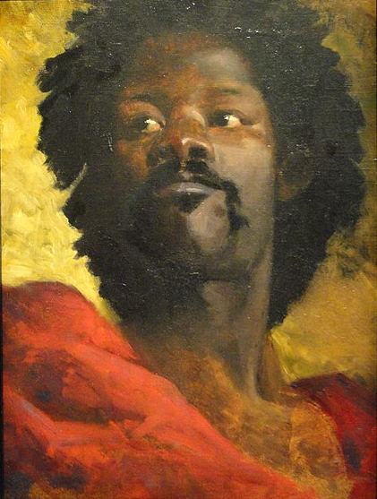](https://commons.wikimedia.org/wiki/File:Henri_Regnalt_-_Head_of_a_Moor_-_Stierch.jpg "Henri Regnault: A Chief of Abyssinia") 

* **Atributos:** Agilidad d6, Astucia d8, Espíritu d8, Fuerza d6, Vigor d8
* **Habilidades:** Atletismo d6, Humanidades d8, Idioma materno d8, Investigar d8, Interpretar d8, Notar d8, Pelear d8, Persuadir d8
* **Paso:** 6; **Parada:** 6; **Dureza:** 6
* **Desventajas:** Bocazas (menor), Curioso (mayor)
* **Ventajas:** Acróbata, Afinidad mágica, Carismático,
* **Equipo:** Ropas ridículas, grandes y chillonas cuando está de bufón y ropajes normales, material de escritura y alfanje (FUE+d8) en su vida normal.

**Sugerencia de interpretación:** Tienes casi una doble personalidad, cuando eres el juglar, eres alocado y deslenguado con un humor bastante afilado, mientras que cuando eres el investigador eres serio y centrado observando todo lo que pasa.

\sinc

## Abu-Nowas, poeta del califa y el mayor juerguista de Bagdad ☾

> El eunuco se personó en la casa de Abu-Nowas, y como no le encontró allí, salió en su busca por todos los lugares públicos de Bagdad, y le encontró al fin en cierta mal afamada taberna, a lo último del barrio de la Puerta Verde. Se acercó a él y le dijo: «¡Oh Abu-Nowas, por ti pregunta nuestro amo el califa!»
> Abu-Nowas se echó a reír, y contestó: «¿Cómo quieres, ¡oh padre de blancuras! que me mueva de aquí, si me retiene como rehén un jovencito amigo mío?» El eunuco preguntó: «¿Dónde está y quién es?» Y le contestó el otro: «Es menudo, imberbe y lindo. ¡Le prometí un regalo de mil dracmas, pero como no tengo encima esa cantidad, no me parece decente irme antes de satisfacer mi deuda!»
> 
> **Referencia:** Aventuras del poeta Abu-Nowas (n. 287)

\conc

\sp

[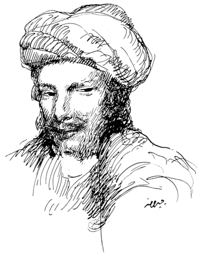](https://es.wikipedia.org/wiki/Abu_Nuwas#/media/Archivo:Abu_Nuwas.jpg "Abu Nuwas, Drawing by Kahlil Gibran al-Funun") 

Abu-Nowas es el ejemplo de artista hedonista y vividor. Para escribir de la vida has de vivirla y Abu-Nowas no solo la vive, la exprime al máximo.

Frecuenta las tabernas y los hammames más sórdidos de Bagdad y lo normal es que esté bebiendo, comiendo o coqueteando con alguien usando sus dotes para la poesía

Abu-Nowas es abiertamente bisexual y creo que es un detalle que deberías mantener en tus aventuras. Ya sé que el estereotipo de bisexual libertino está muy manido y se aleja mucho de la realidad, pero parece que en este caso tanto el personaje histórico como el de las 1001 Noches es así y es por ello que he querido mantenerlo tal cual.

* **Atributos:** Agilidad d6, Astucia d8, Espíritu d12, Fuerza d6, Vigor d6
* **Habilidades:** Apostar d8, Atletismo d6, Conocimientos Generales d8, Humanidades d8, Idioma materno d8, Interpretar d12, Notar d6, Pelear d6, Persuadir d10, Sigilo d4
* **Paso:** 6; **Parada:** 5; **Dureza:** 5
* **Desventajas:** Hábito (Mayor, adicto al sexo)
* **Ventajas:** Afinidad mágica, Carismático, Coraje líquido, Famoso, Maquillaje
* **Equipo:** Ricos ropajes con manchas de vino y licor y una botella o una jarra llena de cualquier tipo de alcohol

**Sugerencia de interpretación:** Eres un vividor, te gusta el buen comer, el buen beber, los hombres y las mujeres. También eres un pendenciero y un descarado. Todo esto alimenta tu poesía y se refleja en tus versos.

\sp

\sinc

## Hachem ben Suleimán, el mejor cantor e intérprete de Bagdad ☾

\conc

> Un día en que el califa Harún Al-Raschid había oído encomiar el talento del músico cantor Hachem ben Suleimán, envió a buscarle. Y cuando introdujeron al cantor Harún le hizo sentarse delante de él y le rogó que le dejase oír alguna composición suya. Y Hachem cantó una cantilena de tres versos con tanto arte y tan hermosa voz, que el califa exclamó, en el límite del entusiasmo y del arrebato: «Has estado admirable, ¡oh hijo de Suleimán! ¡Alah bendiga el alma de tu padre!». Y lleno de gratitud, se quitó del cuello un magnífico collar enriquecido de esmeraldas y colgantes tan gordos como peras almizcladas, y lo puso en el cuello del cantor.
> 
> **Referencia:** El collar fúnebre (n. 984)

Como mejor cantante e intérprete de Bagdad, Hachem se codea todos los días con los ricos y poderosos de la ciudad.

Sin embargo, Hachem, a pesar de su dinero y fama, es un hombre sencillo de campo, un nómada del país de Sham (actual Siria) que disfruta de la comida sencilla, de los atardeceres en el desierto y de paseos a camello entre las dunas.

Aunque no es un líder político, sus palabras son tomadas en consideración por las tribus nómadas. Sus canciones protesta pueden llegar el corazón de sus oyentes de una manera que ningún otro cantante ha podido.

La edad empieza a ser un problema para su prodigiosa voz y busca un sustituto que siga sus pasos como cantante del pueblo. Quizás algún schahriar con buena voz y buenos principios morales y éticos pueda aprender de él y seguir su senda.

* **Atributos:** Agilidad d6, Astucia d8, Espíritu d10, Fuerza d6, Vigor d6
* **Habilidades:** Atletismo d4, Cabalgar d6, Conocimientos Generales d8, Disparar d6, Humanidades d8, Idioma materno d8, Interpretación d10, Notar d8, Persuadir d4, Pelear d6, Sigilo d4, Supervivencia d6
* **Paso:** 6; **Parada:** 5; **Dureza:** 5
* **Desventajas:** Apacible (menor), Leal (menor)
* **Ventajas:** Afinidad mágica, Famoso

\sp

* **Capacidades especiales:**
  * **Cantautor:** Las letras de sus canciones más reivindicativas suelen usarse como himnos. Gastando 1 PP y pasando una tirada de Interpretación puede otorgar a la masa oprimida un +1 a las tiradas relacionadas con su lucha mientras continúe cantando. Con dos avances otorga un +2.
* **Equipo:** Ropajes caros y ostentosos, instrumento musical de calidad, caramelos para la garganta, joyas de oro y diamantes de gran valor regalo del Califa.

**Sugerencia de interpretación:** Eres un sencillo hombre de campo con gustos sencillos que evita en la medida de los posibles los lujos y las excentricidades de los ricos y poderosos de la ciudad. Prefieres un paseo por el campo que una noche de fiesta con el Califa, sencillos platos de campo que los estrambóticos y exóticos que pide el Califa y ropajes cómodos y frescos a los vistosos trajes de la gente de la corte.

\sinc

## ’Inān bint ’Abd-Alāh, poetisa y qiyan del Califa ☾

\conc

> El califa daba un concierto, al cual asistían sus íntimos amigos de siempre: Giafar, el poeta Abu-Nowas, Massrur y Grano-de-Belleza. Detrás del tapiz cantaba la propia favorita del califa, la más bella y perfecta de sus concubinas.
> 
> **Referencia:** Historia del Grano-del-Belleza (n. 267)

’Inān es una muwallada (hija de padre árabe libre y madre esclava). Fue entrenada como qiyan (una esclava que animaba las fiestas con sus cantos y bailes). Aprendió canto, baile, caligrafía, música, cuentacuentos, etc. Muy pronto demostró dotes para la poesía.

La fama de ’Inān llevó al califa Harún al-Raschid a intentar comprarla, pero su amo rechazó el precio de venta de 100,000 dinares. A la muerte de su dueño, el Califa puso a ’Inān en subasta, aparentemente para ayudar a saldar las deudas de su dueño. A través de un agente, al-Raschid entonces la compró por 225,000 dirhams y la hizo una de sus concubinas, curiosamente el gestor que vendió a ’Inān estaba al servicio del califa.

\sp

[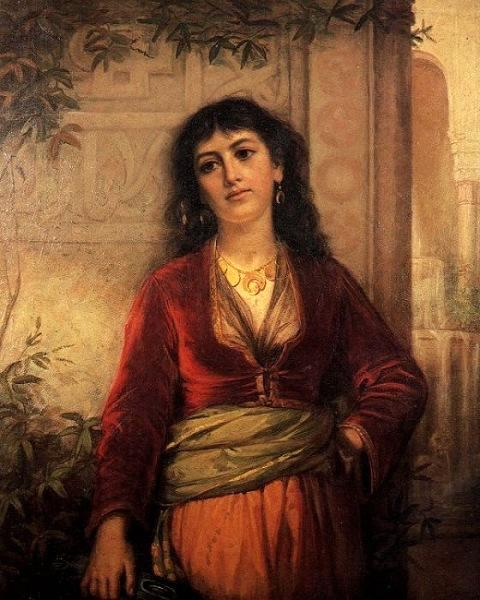](https://www.jwwaterhouse.net/the-unwelcome-companion-a-street-scene-in-cairo-1873/ "The Unwelcome Companion - A Street Scene in Cairo 1873 by John William Waterhouse") 

’Inān destaca por sus réplicas, que a menudo son de tono sexual o incluso vulgar. Esto forma parte de su gran fama/infamia. Son famosas sus respuestas a poetas masculinos en retos durante concursos de remate de versos, especialmente al poeta Abu Nowas. De hecho, la califesa, a pesar de ser una concubina, tiene en gran estima su mente y su ingenio y se hace acompañar por ella cuando el califa está con Abu Nowas. La califesa disfruta mucho como las ingeniosas réplicas y las rápidas rimas dejan sin palabras a Abu Nowas al que tanto odia.

A pesar de estar enamorado de su mujer, Giafar siente una atracción por ’Inān aunque nunca ha revelado sus sentimientos por ella quedando, por ahora en algo «platónico».

* **Atributos:** Agilidad d8, Astucia d8, Espíritu d10, Fuerza d4, Vigor d6
* **Habilidades:** Atletismo d10, Conocimientos Generales d8, Humanidades d8, Idioma materno d8, Interpretar d10, Investigar d6, Notar d8, Pelear d4, Persuadir d8, Sigilo d8
* **Paso:** 6; **Parada:** 4; **Dureza:** 5
* **Desventajas:** Bocazas (menor), Marginado (menor, esclava y concubina del califa)
* **Ventajas:** Acróbata, Afinidad mágica, Cuentacuentos, Maquillaje
* **Equipo:** Equipamiento de escribano, maquillajes y colonias, ropajes caros y vistosos

**Sugerencia de interpretación:** Eres una especie de Cyrano de Bergerac. Lo tuyo son respuestas rápidas, contundentes y muy afiladas y antes de que se den cuenta todo el público se está riendo de tus contrincantes. Pero también sabes ser seductora y coqueta y puedes atraer a las personas con tus cantos y bailes como las lámparas de aceite a las polillas.

\sp

\sinc

## Ibrahim Ibn Jibril, general del califa de Bagdad y sumo sacerdote de la Progenie de la Luna Creciente ☾

\conc

> /p/ El general Ibrahim Ibn Jibril entró en la sala de audiencias del califa y tras postrarse a sus pies como un siervo más, mostró las cabezas cercenadas y conservadas en pez de los jefes rebeldes. «Oh emir de los creyentes, tu humilde servidor ha cumplido tus órdenes con la mayor presteza. Ni mi señor, ni los hijos de mi señor, ni los hijos de los hijos de mi señor deberán preocuparse de los rebeldes de Aqaba. Personalmente me he encargado de exterminar estirpe de la faz de la tierra, ni hombre, ni mujeres, ni niños, ni siervos, ni animales de carga han sobrevivido a vuestra mano justiciera».

De un recluta venido de las inhóspitas tierras de Balaz Rud ascendió hasta general gracias a sus excelentes actuaciones allí donde era enviado. Ibrahim es el general más joven y exitoso del califato y, como no, el favorito del califa que disfruta mandándoles apaciguar todas las revueltas a lo largo de su vasto imperio para luego escuchar sus escabrosos relatos de guerra.

La genialidad militar de Ibrahim solo es comparable con su sadismo, de hecho ya correr muchos rumores de sanguinarias acciones de guerra que sobrepasan con mucho lo que dictan las reglas de la guerra.

Lo que nadie sabe es que este exitoso general es el sumo sacerdote del culto de la Progenie de la Luna Creciente. Su carrera militar ha sido impulsada gracias a la magia y la intervención de los al mighos hasta convertirse en el militar de confianza del Califa.

También ha ayudado a su meteórico ascenso en el escalafón militar que Dalila la taimada vendiera secretos a la Progenie de la Luna Creciente sobre sus competidores para qué medrará en su carrera militar hasta ser un alto general.

Lo que buscaban los al mighos y sus agentes humanos de la Progenie con todo esto es poner a uno de sus agentes humanos cerca del califa para influir en él. Lo que no sabían y empiezan a sospechar es que el califa es un estúpido y que sus cortesanos son los que en realidad andan metiendo sus zarpas en Balaz Rud y creando problemas a los al mighos.

\sp

[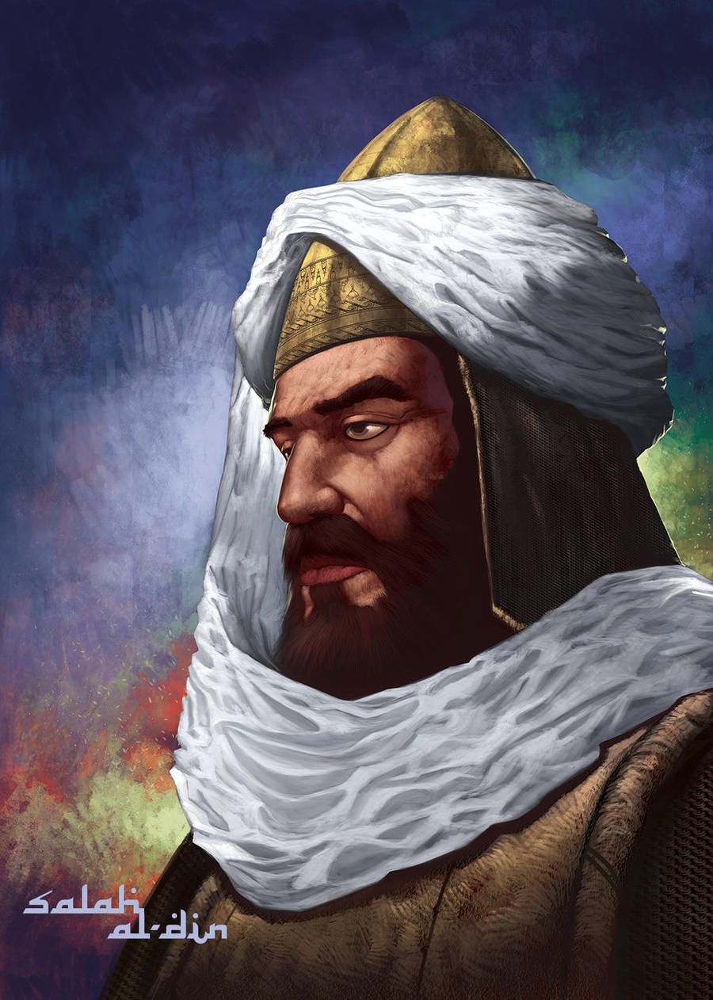](https://www.deviantart.com/muratcalis/art/Salah-Al-Din-Yusuf-Ibn-Ayyub-354014608 "Salah Al-Din / Yusuf Ibn-Ayyub by MuratCALIS") 

* **Atributos:** Agilidad d10, Astucia d8, Espíritu d8, Fuerza d10, Vigor d10
* **Habilidades:** Atletismo d10, Conocimientos Generales d8, Disparar d8, Idioma Aklo d8, Idioma materno d8, Investigar d6, Notar d8, Pelear d12, Persuadir d8, Saber de Suleimán d8, Sigilo d6, Supervivencia d6, Tácticas d10
* **Paso:** 6; **Parada:** 8; **Dureza:** 11(4)
* **Desventajas:** Secreto (mayor, líder de la Progenie de la Luna), Despiadado (mayor)
* **Ventajas:** Afinidad mágica, Berserk, Contraataque, Nervios de acero, Puntos de poder, Trasfondo arcano (Sihr)
* **Capacidades especiales:**
  * **Hechizos:** 16 PP, Arma afiladísima, Bola de fuego, Torbellino
* **Equipo:** Shotel (FUE+d8), Armadura Kalantar (Coraza +4 para el peto y cota de malla +3 para brazos y piernas), Turbante reforzado (Tela gruesa +1 cabeza), Jambia (FUE+d4)

**Sugerencia de interpretación:** Tu carácter se basa en dos elementos clave, la marcialidad del ejército y tu fanatismo de sectario. Como general y líder del culto de la Progenie de la Luna Creciente, esperas que se te escuche y no se te cuestione. Esperas que tus órdenes sean obedecidas sin fallos y por ello siempre son claras y precisas. Esperas de tus hombres obediencia ciega y en caso contrario eres expeditivo en tus métodos para hacerte ser obedecido, muy expeditivo.

\sp

\sinc

## Bahram el Gauro, Adorador del Fuego, alquimista de oficio y líder de la secta del Fuego y de la Luz ☾

\conc

> … En cuanto al persa que se marchó en el navío con el arca, era realmente un mago muy formidable; y se llamaba Bahram el Gauro, Adorador del Fuego, alquimista de oficio. Y cada año escogía entre los niños de los musulmanes un joven bien formado, para llevárselo y hacer con él lo que le impulsaba a hacer su descreimiento, su perversión y su raza maldita; porque, como ha dicho el Maestro de los proverbios, ¡era un perro, hijo de perro, nieto de perro; y todos sus antepasados eran perros! ¿Cómo iba a ser entonces otra cosa que un perro, ni hacer otra cosa que las acciones de un perro?
> 
> **Referencia:** Las aventuras de Hassan Al-Bassri (n. 582)

Bahram el Gauro es el hombre del saco de las 1001 Noches. Cuando algo malo pasa, y por malo nos referimos a crímenes terribles y sangrientos con tortura y amputaciones, se le culpa a Bahram el Gauro y no sueles equivocarte.

Bahram es el líder de la secta del Fuego y de la Luz y vive para servir a su señor Nardún. Nunca está en sitio fijo, sino que se mueve por todo el mundo disfrazado como un derviche (monje mendicante) creando problemas, asesinando gente y provocando incendios.

En el momento en que huele algo (persona, objeto, ritual, etc.) que le permita acercarse a Nardún centra toda su atención en ese algo y lo persigue como un perro de presa usando todos sus recursos personales y de la secta y sin importarle si tiene que robar, torturar o asesinar.

* **Atributos:** Agilidad d6, Astucia d10, Espíritu d8, Fuerza d6, Vigor d6
* **Habilidades:** Atletismo d4, Ciencias d6, Conocimientos Generales d10, Humanidades d6, Idioma materno d10, Medicina d6, Notar d6, Pelear d8, Persuadir d4, Saber de Suleimán d10, Sigilo d6, Reparar d8
* **Paso:** 6; **Parada:** 6; **Dureza:** 5
* **Desventajas:** Hábito (mayor, piromanía), Paranoia (mayor), Megalomanía (mayor)
* **Ventajas:** Afinidad mágica, Concentración, Nuevos poderes, Puntos de poder, Trasfondo arcano (Sihr)

\sp

[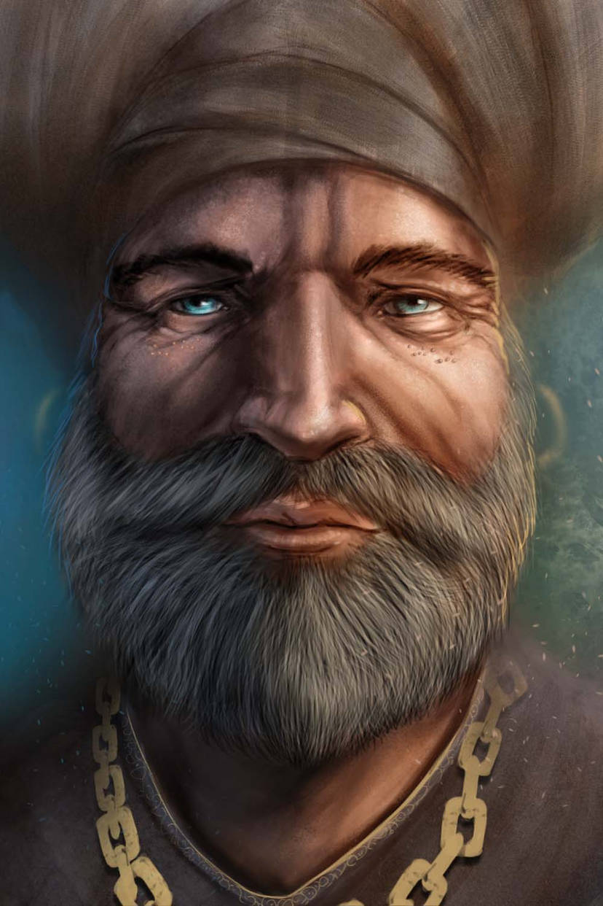](https://www.deviantart.com/dottorfile/art/Zaharia-artwork-Zeoren-401307083 "Zaharia artwork: Zeoren by DottorFile") 

* **Capacidades especiales:**
  * **Hechizos:** 16 PP, ¡Sésamo, ábrete!, Aura de fuego, Bola de fuego, Levantar Nasnas, Aceite salomónico
* **Equipo:** Utensilios varios alquímicos, yesca, pedernal y combustible, jambia (FUE+d4), d4 dosis de sangre de Fénix, d4 dosis de bang cretense, d6 dosis de kohl de invisibilidad

**Sugerencia de interpretación:** Eres un sociópata de manual y un asesino en serie. Frío y calculador, nunca pierdes la calma, porque si la perdieras todos verían todo lo oscuro y dañino que hay dentro y no podrías moverte por el mundo como lo haces ahora.

\sinc

## Mariam Al-Ijliya al-Asturlabi, nombradora de estrellas y fabricante de astrolabios ☾

\conc

> /p/ … y pasaba los días en su taller y las noches sin luna en la torre del palacio del Emir de Alepo, que disfrutaba como ella de la ciencia de nombrar los objetos que nuestro creador decidió poner en la esfera celeste …

Mariam Al-Ijliya al-Asturlabi nació en Alepo. Es hija del famoso geógrafo y astrónomo Coshiar Eljili, con lo que la joven Mariam se crio en un ambiente matemático y astronómico. Esto la llevó a ser una gran experta en estos campos del conocimiento. Profundizó en ambas ciencias hasta el punto de volverse tremendamente hábil en sus complicadas ecuaciones y cálculos. 

\sp

[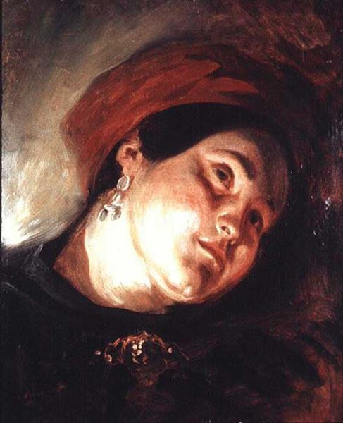](https://www.wikiart.org/es/eugene-delacroix/head-of-a-woman-in-a-red-turban-1831 "Head of a Woman in a Red Turban by Eugène Delacroix") 

Con la edad empezó a diseñar y construir astrolabios, aprendiendo todo tipo de habilidades manuales con herrería, carpintería y soplar vidrio.

Es una enamorada de las estrellas y demás cuerpos celestiales. De hecho, ha escrito varios tratados sobre astronomía y ha predicho con gran precisión el paso cerca de la Tierra del cometa Aiin. Sin embargo, la vida se le escapa de las manos, una enfermedad degenerativa está destruyendo su cuerpo y no le queda tiempo para nombrar tantas estrellas como hubiera querido.

Por suerte (o desgracia) le han ofrecido un trato que no quiere rechazar, dejar atrás su viejo cuerpo y vivir como un cerebro inmortal viajando por las estrellas y planetas y viendo los mundos que solo ha podido imaginar.

* **Atributos:** Agilidad d6, Astucia d10, Espíritu d8, Fuerza d6, Vigor d4
* **Habilidades:** Atletismo d4, Ciencias d12, Conocimientos Generales d10, Humanidades d6, Idioma materno d10, Investigar d8, Medicina d6, Notar d6, Persuadir d4, Reparar d8, Sigilo d4
* **Paso:** 5; **Parada:** 2; **Dureza:** 4
* **Desventajas:** Anciana (mayor), Anémica (menor), Despistada (mayor)
* **Ventajas:** Afinidad mágica, Erudito (Ciencias)
* **Equipo:** Astrolabio de gran calidad, herramientas de todo tipo y utensilios de escribano.

**Sugerencia de interpretación:** La edad, la enfermedad y tus conocimientos te han dado una visión de la vida muy diferente al resto del mundo. Eres meticulosa y pausada, para ti todo se puede abordar y solucionar usando la ciencia y el método científico. Nunca te han fallado y ahora en el ocaso de tu vida seguirán sin fallarte.

\sp

\sinc

## Yacub Abu-Yussef, kadí supremo de Bagdad ☾

\conc

> Bajo el reinado del califa Harún Al-Raschid, el kadí supremo de Bagdad era Yacub Abu-Yussef, el hombre más sabio y el jurisconsulto más profundo y más listo de su tiempo. Había sido el discípulo y el compañero más querido del imán Abu-Hanifah.
> 
> **Referencia:** La crema de aceite de alfóncigos y la dificultad jurídica resulta (n. 989)

Este viejo kadí lleva las leyes humanas y divinas en la sangre y ha mamado burocracia desde muy pequeño. Es el más famoso jurista del califato y participa directamente o como consejero en todo proceso judicial importante de Bagdad.

Es duro, pero justo y de normal sus veredictos y decisiones son aplaudidas por las partes en conflicto.

Los conocimientos legales de Yacub solo son comparables con su capacidad para buscar agujeros y triquiñuelas legales para saltarse las propias leyes que normalmente defiende. Es por ello que cada vez que el Califa se mete en algún tipo de embrollo legal, por ejemplo, jurando algo que no puede o no quiere cumplir, llama con urgencia a Yacub para que le saque del atolladero.

En esas ocasiones tiene un lado oscuro donde es capaz de tergiversar y retorcer las leyes humanas y divinas para justificar cualquier cosa que haga el Califa o librarle de cualquier problema legal en el que el mismo se mete.

Como hombre de leyes es terriblemente tradicional, por no decir que retrogrado, rancio y reaccionario. De hecho, trata por todos los medios de que su hija Zoraida no se relacione sentimentalmente con la Sett Zahía, la gran Maestra.

* **Atributos:** Agilidad d6, Astucia d10, Espíritu d8, Fuerza d6, Vigor d4
* **Habilidades:** Atletismo d4, Conocimientos Generales d6, Humanidades d8 (Especialización Leyes), Idioma Materno d4, Investigar d10, Latrocinio d6, Notar d8, Pelear d4, Persuadir d4, Saber de Suleimán d4, Sigilo d4, Tácticas d8

\sp

[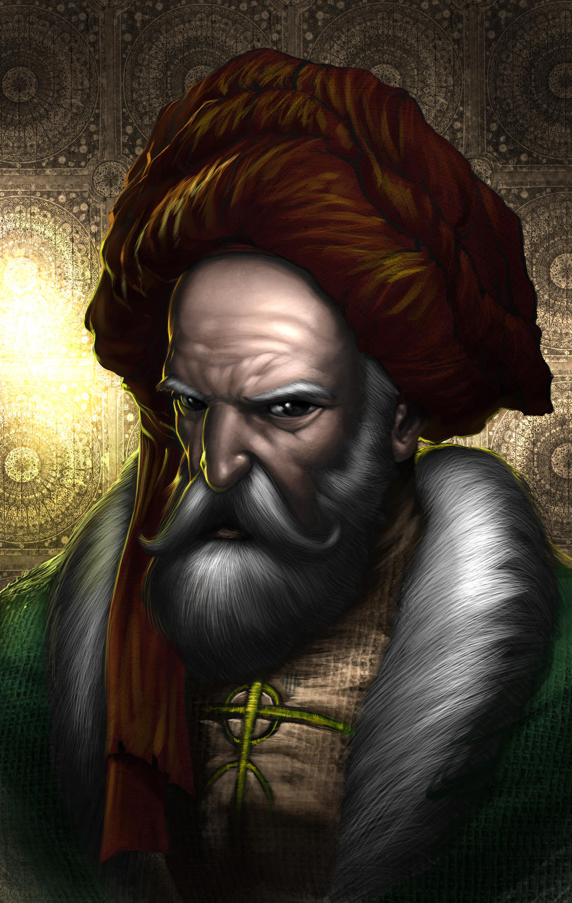](https://www.deviantart.com/muratcalis/art/Hasan-Ibn-i-Sabbah-291239907 "Hasan Ibn-i Sabbah by MuratCALIS") 

* **Paso:** 5; **Parada:** 4; **Dureza:** 4
* **Desventajas:** Anciano (Mayor), Juramento (Mayor, Respetar la ley)
* **Ventajas:** Afinidad mágica, Alcurnia, Alerta
* **Equipo:** Ropajes caros, material de escribano, libro de derecho

**Sugerencia de interpretación:** Mira a todos en silencio como si fueran como mínimo sospechosos y seguramente culpables. Pregunta corto y conciso y a poder ser preguntas de sí o no. Cuando tengas toda la información, dicta tu sentencia condenatoria.

\sp

\sinc

## Ahmad-la-Tiña, antiguo criminal y jefe de policía de Bagdad ☾

\conc

> Cuentan ¡oh rey afortunado! que en tiempo del califa Harún Al-Raschid había en Bagdad un hombre llamado Ahmad-la-Tiña y otro hombre llamado Hassán-la-Peste, y estaban reputados ambos por su maestría en estratagemas y latrocinios. Sus hazañas a este respecto eran completamente prodigiosas, por lo cual, el califa, que sabía sacar partido de los talentos de cualquier clase que fueran, les llamó y les nombró jefes de policía. A tal fin les invistió con su cargo, dándole a cada uno un ropón de honor, mil dinares de oro mensuales como emolumentos, y una guardia de cuarenta jinetes sólidos.  
> Ahmad-la-Tiña quedó encargado de la seguridad de la ciudad en su parte terrestre, y Hassán-la-Peste del lado del río. Y en las grandes ceremonias marchaban ambos a los lados del califa, uno a su derecha y otro a su izquierda.
> 
> **Referencia:** Historia de los artificios de Dalila la taimada y de su hija Zeinab la embustera con Ahmad-la-Tiña, Hassan-la-Peste y Alí Azogue (n. 432)

Este antiguo y peligroso criminal, fue nombrado jefe de policía por el Califa en una astuta jugada ideada por la Califesa Sett Zobeida y el visir Giafar. De un plumazo se quitaban de las calles un peligroso criminal y conseguían un jefe de policía con grandes conocimientos del mundo del hampa. Le mantienen contento y motivado en su trabajo con un más que jugoso sueldo mensual (1.000 dinares) y grandes honores como ir en los desfiles a la derecha del Califa.

La jurisdicción de Ahmad-la-Tiña (la Mano Derecha del Califa) son todo el Karkh y tiene unos 40 hombres a caballo a su cargo.

Si no está recorriendo la ciudad en busca de criminales, puedes encontrarle en la Taberna de Hagg-Karim al-Mossuli, la antigua taberna que frecuentaba en sus días de delincuentes, recordando sus añoradas aventuras y fechorías de juventud, muchas veces junto a Hassan-la-Peste.

* **Atributos:** Agilidad d8, Astucia d10, Espíritu d8, Fuerza d8, Vigor d8
* **Habilidades:** Atletismo d4, Apostar d6, Cabalgar d6, Conocimientos Generales d6, Idioma materno d8, Intimidar d6, Investigar d8, Latrocinio d8, Notar d8, Pelear d8, Persuadir d8, Provocar d6, Sigilo d4
* **Paso:** 6; **Parada:** 6; **Dureza:** 6
* **Desventajas:** Hábito (menor, alcohol), Hábito (menor, ludopatía)

\sp

* **Ventajas:** Afinidad mágica, Alerta, Investigador
* **Equipo:** Ropajes caros, Alfanje digno de un califa (FUE+d6), todo regalado por el Califa

**Sugerencia de interpretación:** Ahmad-la-Tiña es una persona jovial y divertida con un chiste preparado y una gracieta en la boca. Nadie escapa de sus bromas y sus cortes. Como siempre dice «Que sea trabajo no quiere decir que no sea divertido».

\sinc

&nbsp;

## Hassan-la-Peste, antiguo criminal y jefe de policía de Bagdad ☾

\conc

> Cuentan ¡oh rey afortunado! que en tiempo del califa Harún Al-Raschid había en Bagdad un hombre llamado Ahmad-la-Tiña y otro hombre llamado Hassán-la-Peste, y estaban reputados ambos por su maestría en estratagemas y latrocinios. Sus hazañas a este respecto eran completamente prodigiosas, por lo cual, el califa, que sabía sacar partido de los talentos de cualquier clase que fueran, les llamó y les nombró jefes de policía. A tal fin les invistió con su cargo, dándole a cada uno un ropón de honor, mil dinares de oro mensuales como emolumentos, y una guardia de cuarenta jinetes sólidos.  
> Ahmad-la-Tiña quedó encargado de la seguridad de la ciudad en su parte terrestre, y Hassán-la-Peste del lado del río. Y en las grandes ceremonias marchaban ambos a los lados del califa, uno a su derecha y otro a su izquierda.
> 
> **Referencia:** Historia de los artificios de Dalila la taimada y de su hija Zeinab la embustera con Ahmad-la-Tiña, Hassan-la-Peste y Alí Azogue (n. 432)

Este antiguo criminal, de los más peligrosos de la ciudad, fue convertido en jefe de policía por el Califa. En realidad fue idea de la Califesa Sett Zobeida y del visir Giafar coger a los mayores criminales de la ciudad y convertirlos en jefes de policía. De esta forma quitaban de las calles un peligroso criminal y le tenían contento y motivado para atrapar a otros criminales gracias a los honores concedidos como ir en los desfiles a la izquierda del Califa y un espléndido sueldo.

Hassan-la-Peste (la Mano Izquierda del Califa) se encarga de vigilar las dos riberas del río y Al-Rusafa y tiene unos 40 hombres con sus 40 caballos a su cargo.

\sp

Si no está recorriendo la ciudad en busca de criminales, puedes encontrarle en la Taberna de Hagg-Karim al-Mossuli, la antigua taberna que frecuentaba en sus días de delincuentes, discutiendo con Ahmad-la-Tiña quién hace mejor su trabajo y quién vigila la zona más rica y poderosa.

* **Atributos:** Agilidad d6, Astucia d10, Espíritu d8, Fuerza d6, Vigor d6
* **Habilidades:** Atletismo d4, Cabalgar d6, Humanidades d6, Conocimientos Generales d8, Idioma materno d8, Intimidar d10, Investigar d8, Latrocinio d8, Medicina d6, Notar d8, Pelear d8, Persuadir d6, Provocar d8, Sigilo d6, Tácticas d6
* **Paso:** 6; **Parada:** 6; **Dureza:** 5
* **Desventajas:** Hábito (menor, alcohol), Tozudo
* **Ventajas:** Afinidad mágica, Amenazador, Contactos (bajos fondos)
* **Equipo:** Ropajes caros, Alfanje digno de un califa (FUE+d6), todo regalado por el Califa

**Sugerencia de interpretación:** Hassan-la-Peste es totalmente lo contrario a Ahmad-la-Tiña. Es serio, muy serio. No dejes de mirar a todo el mundo muy serio y habla muy pausado y no sonrías nunca. El crimen a ambos lados de la ley es algo muy serio y reflejas esa seriedad.

\sinc

## Ayub Lomo-de-Camello, jefe de los alguaciles de Ahmad-la-Tiña ☾

\conc

> Y he aquí que el jefe de los alguaciles de Ahmad-la-Tiña era un hombre ducho en esta clase de pesquisas, y que se llamaba Ayub Lomo-de-Camello.
> 
> **Referencia:** Historia de los artificios de Dalila la taimada y de su hija Zeinab la embustera con Ahmad-la-Tiña, Hassan-la-Peste y Alí Azogue (n. 432)

Ayub es un viejo policía, lleva toda la vida como alguacil de la ciudad y antes que él su padre y antes su abuelo. 

Se conoce las calles como la palma de su mano, habla la jerga de la calle y tiene informantes en toda la ciudad.

Esperaba convertirse en jefe de la policía, pero cuando el Califa hizo a Hassan-la-Peste y a Ahmad-la-Tiña, jefes de policía de Karkh y Al-Rusafa, vio truncado sus sueños. 

\sp

[](https://es.wikipedia.org/wiki/Archivo:Imru_al-Qays.png "Pre-Islamic Arab Poet ʾImruʾ al-Qays por Desconocido") 

Lo bueno es que Ahmad-la-Tiña lo puso como su segundo con un buen sueldo y sin los problemas que traía el cargo de jefe de policía.

Es bastante decente, aunque no es un santo y alguna vez ha aceptado soborno de criminales menores o se ha quedado con arte de lo requisado. De hecho, es aficionado a consumir haschisch que saca de los detenidos.

* **Atributos:** Agilidad d6, Astucia d8, Espíritu d8, Fuerza d8, Vigor d8
* **Habilidades:** Atletismo d6, Conocimientos Generales d6, Disparar d6, Idioma materno d6, Intimidar d8, Investigar d8, Latrocinio d6, Notar d8, Pelear d8, Persuadir d6, Sigilo d4
* **Paso:** 6; **Parada:** 6; **Dureza:** 6
* **Desventajas:** Hábito (menor, haschisch), Suspicaz (menor)
* **Ventajas:** Afinidad mágica, Callejear, Conexiones (red de soplones), Mandíbula de hierro
* **Equipo:** Garrote de madera (FUE+d4), Alfanje (FUE+d8), cajita con 1d4 dosis de haschisch

**Sugerencia de interpretación:** Para ti todo el mundo es sospechoso y si no estás delinquiendo, estás pensando en delinquir. Mírales intimidatoriamente y no dejes de preguntar. Seguro que si escarbas encuentras algún delito.

\sp

\sinc

## Dalila la taimada, reina de los bajos fondos Bagdad ☾

\conc

> Y en verdad que la tal Dalila era una vieja experta en astucias, artificios, latrocinios, trapisondas y recursos de toda especie, una bruja capaz de engañar a la serpiente, atrayéndola fuera de su guarida, y de dar al mismo Eblis lecciones de astucia y de embaucamientos.
> 
> **Referencia:** Historia de los artificios de Dalila la taimada y de su hija Zeinab la embustera con Ahmad-la-Tiña, Hassan-la-Peste y Alí Azogue (n. 432)

Dalila, junto a su hija Zeinab y su grupo de sicarios, controlan los bajos fondos de la ciudad. Nada se hace sin su consentimiento y sin llevarse una tajada. Sus métodos de trabajo se alejan bastante de la amenaza y la intimidación. Su imperio criminal se basa más en la picaresca, la estafa y la extorsión. Sabe muchos secretos de mucha gente importante y se lo recuerda cuando necesita que le hagan un favor o miren hacia otro lado. Solo en casos muy extremos recurrirá al daño físico y nunca al asesinato.

Dalila odia profundamente al Califa, porque su difunto marido era el maestre del palomar del Califa y los colmaba de dinero y regalos. Cuando su marido murió, el Califa se olvidó de la viuda y sus hijas que tuvieron que empezar a vivir de pequeños robos y timos. Es por ello, que todas sus acciones criminales llevan a conseguirle dinero y si molestan al Califa mucho mejor.

Dalila ha tenido tratos con seres de los mitos, pero casi siempre con sus agentes humanos. Ha conseguido extraños materiales para una célula de los 40 que actúa en Bagdad y vendió secretos a la Progenie de la Luna Creciente para que su líder Ibrahim Ibn Jibril medrará en su carrera militar hasta ser un alto general.

Se considera una genio del crimen y cree que solo el inspector Ahmad-la-Tiña se le iguala en perspicacia e inteligencia. Para ella, Hassan-la-Peste es un tarugo que no encontraría garrapatas en un perro callejero.

* **Atributos:** Agilidad d4, Astucia d10, Espíritu d10, Fuerza d4, Vigor d6

\sp

[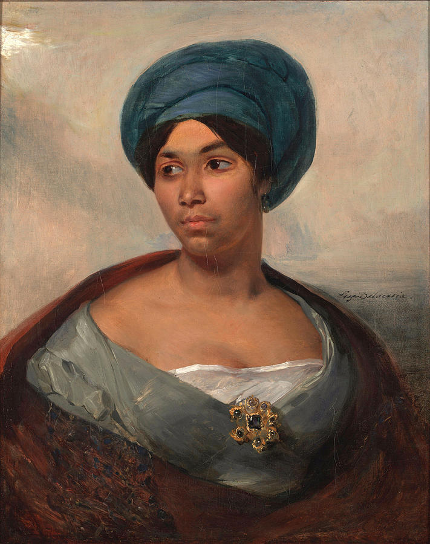](https://www.wikiart.org/es/eugene-delacroix/portrait-of-a-woman-in-a-blue-turban "Portrait of a Woman in a Blue Turban by Eugène Delacroix") 

* **Habilidades:** Atletismo d4, Conocimientos Generales d10, Intimidar d8, Idioma materno d10, Investigar d8, Latrocinio d10, Medicina d6, Notar d8, Pelear d6, Persuadir d4, Sigilo d4, Tácticas d8
* **Paso:** 5; **Parada:** 4; **Dureza:** 5
* **Desventajas:** Anciana (Mayor), Buscada (Mayor), Vengativa (mayor)
* **Ventajas:** Afinidad mágica, Callejear
* **Equipo:** Ropas de calidad y usadas, pero bien cuidadas, bastón para andar, 1d4 dosis de bang cretense.

**Sugerencia de interpretación:** Actúa como una simpática abuela. Ofrece de beber y comer a tus schahriars, cógeles de los mofletes aunque sean mayores, hazles preguntas indiscretas como si tienen pareja o cuando tendrán descendencia. En cuanto te quedes solo con los schahriars o con su gente de confianza, conviértete en la señora del crimen taimada y amenazante.

Dalila es una buena cuidadora de palomas mensajeras y tiene su propio palomar. Por 300 dinares puede dejarte una jaula con 2 palomas entrenadas para ir a su palomar. Ella se encargará de entregar el mensaje sellado a la persona que le hayas indicado al alquilar las palomas. Si las palomas no vuelven, mueren o cree que han sido maltratadas te intentará cobrar una multa de 500 dinares por paloma.

\sp

\sinc

## Zeinab la embustera, hija de Dalila la taimada y su lugarteniente ☾

\conc

> /p/ Entonces Zeinab, que era una joven graciosa y esbelta con ojos oscuros en un rostro encantador y claro, se levantó al punto y se vistió con gran elegancia y se veló la cara con una ligera muselina de seda, de modo que el brillo de sus ojos era más aterciopelado y subyugante. Adornada a la sazón de esta manera, fue a abrazar a su madre, y le dijo:  
> /p/ «¡Oh madre! ¡juro por la integridad de mi candado intacto y cerrado, que me adueñaré de los cuarenta y uno y serán mi juguete!»\[…\]  
> /p/ Entonces Zeinab arrastró los cadáveres de los pies uno por uno y los arrojó a lo último de la tienda, amontonándolos unos sobre otros, y escondiéndolos debajo de una manta grande, corrió por delante de ellos una amplia cortina, y salió para apostarse de nuevo en la puerta de la taberna.
> /p/ 
> /p/ **Referencia:** Historia de los artificios de Dalila la taimada y de su hija Zeinab la embustera con Ahmad-la-Tiña, Hassan-la-Peste y Alí Azogue (n. 446)

Zeinab, igual que su madre, es una criminal muy inteligente, capaz de engañar y timar a cualquiera. En cierta medida es la mano ejecutora de Dalila, cuando la edad de esta le impide llevar a cabo sus planes criminales.

Está especializada en timos y estafas. También es una carterista de mucho nivel, puede robar una bolsa de monedas de un maniquí lleno de campanas sin que suene ninguna. Es una aduladora nata y puede distraer a quien sea, mientras sus cómplices le roban hasta las babuchas.

Su principal defecto es su carácter vengativo, que hace que se meta en estúpidas venganzas, muchas veces con gente con la que no debiera. Por suerte también es bastante afortunada y suele caer de pies cuando las cosas se ponen complicadas.

* **Atributos:** Agilidad d6, Astucia d8, Espíritu d10, Fuerza d6, Vigor d6
* **Habilidades:** Atletismo d6, Conocimientos Generales d8, Interpretar d8, Idioma materno d8, Latrocinio d10, Notar d8, Pelear d6, Persuadir d10, Saber de Suleimán d4, Sigilo d6
* **Paso:** 6; **Parada:** 5; **Dureza:** 5
* **Desventajas:** Buscada (Mayor), Vengativa (mayor)
* **Ventajas:** Afinidad mágica, Afortunada, Callejear, Maquillaje
* **Equipo:** Ropajes seductores, Jambia (FUE+d4), 1d4 dosis de bang cretense

\sp

[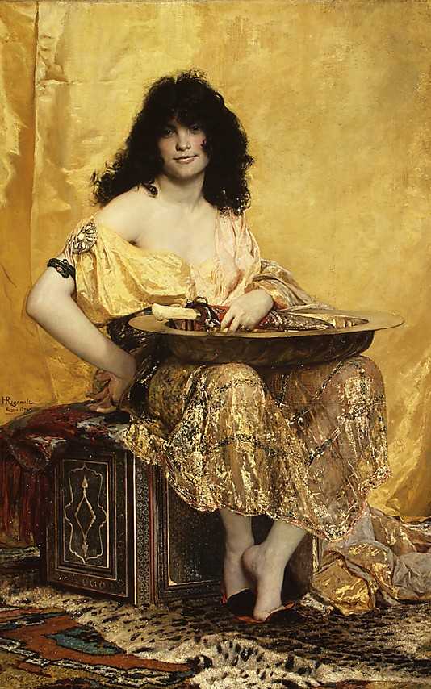](https://en.wikipedia.org/wiki/Henri_Regnault#/media/File:Regnault,_Henri,_Salom%C3%A9.jpg "Salomé (1870), Metropolitan Museum of Art by Henri Regnault") 

**Sugerencia de interpretación:** La intimidación y la fuerza no son tu estilo. Lo tuyo es el carisma y la zalamería. Unas palabras bonitas y aduladoras y tienes a todo el mundo comiendo de tu mano. Para que abrir una cerradura con ganzúas si puedes engañar a la persona que la vigila para que te abra.

\sp

\sinc

## Alí Azogue, el mejor ladrón de Bagdad ☾

\conc

> He llegado a saber ¡oh rey afortunado! que en tiempos de Ahmad-la-Tiña y Hassán-la-Peste, había en Bagdad otro ladrón tan sagaz y tan escurridizo que jamás consiguió capturarle la policía; pues no bien creía tenerle ya cogido, se le escapaba como se escurre entre los dedos una bola de azogue que se quisiera sujetar. A eso obedecía que en El Cairo, su patria, le pusieran el apodo de Alí Azogue.
> 
> **Referencia:** Historia de los artificios de Dalila la taimada y de su hija Zeinab la embustera con Ahmad-la-Tiña, Hassan-la-Peste y Alí Azogue (n. 449)

Ali es el epítome del ladrón de guante blanco, es ágil, sigiloso y diestro. No hay pared que no pueda escalar o cerradura que no pueda abrir. Podría robarle su sorbete al califa de las manos sin que se diera cuenta.

Ya tuvo que huir de El Cairo, su ciudad natal, por problemas a ambos lados de la ley, y como siga así tendrá que abandonar también Bagdad. La guardia ha puesto una recompensa por su captura y a los criminales de la ciudad no les cae muy bien por su exceso de confianza que le lleva a arriesgar demasiado.

Contratar a Ali Azogue es una opción muy interesante si tus schahriars necesitan conseguir algún objeto muy bien custodiado. Además, siempre anda con problemas de dinero por su ludopatía, con lo que se le puede comprar fácilmente.

Cuando haces tratos con Alí has de saber que tienden a pasar cosas extrañas a su alrededor y siempre termina metiéndose en situaciones extrañas y bizarras. Pero desde luego, al lado de Alí nunca te vas a aburrir.

* **Atributos:** Agilidad d12, Astucia d8, Espíritu d6, Fuerza d8, Vigor d8
* **Habilidades:** Apostar d6, Atletismo d12, Conocimientos Generales d8, Interpretar d8, Idioma materno d8, Latrocinio d12, Notar d4, Pelear d8, Persuadir d6, Sigilo d10
* **Paso:** 8; **Parada:** 6; **Dureza:** 6
* **Desventajas:** Exceso de confianza, Hábito (menor, ludopatía), Imán de lo extraño
* **Ventajas:** Acróbata, Afinidad mágica, Callejear, Ladrón, Pies ligeros
* **Equipo:** Alfanje, ropas oscuras, herramientas de ladrón, cuerda y garfio de escalada y 1d6 dosis de kohl de invisibilidad

\sp

[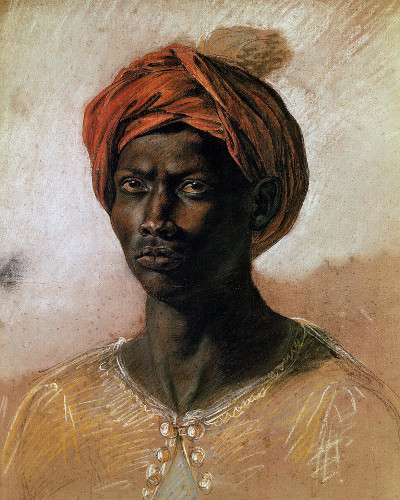](https://www.wikiart.org/es/eugene-delacroix/portrait-of-a-turk-in-a-turban "Portrait of a Turk in a Turban by Eugène Delacroix") 

**Sugerencia de interpretación:** Ali es el típico ladrón de guante blanco de películas clásicas de robos. Es elegante, de buenas maneras, modales finos y gustos caros. Cuando no estás trabajando disfrutas de los placeres de la vida en restaurantes, tabernas y hammames. Coquetea continuamente y no dejes de halagar a la gente de alrededor, los halagos te han librado de prisión más veces que tus acrobacias.

\sinc

&nbsp;

## Sett Zahía, la persona más instruida y más elocuente de Bagdad ☾

\conc

> En el año quinientos sesenta y uno de la hégira hizo un viaje a Hama la mujer más instruida y más elocuente de Bagdad, la que todos los sabios del Irak llamaban la Maestra de los Maestros. Y he aquí que aquel año llegaron a Hama desde todas las comarcas de los países musulmanes los hombres más versados en las diversas ramas de los conocimientos; y todos se alegraban de poder oír e interrogar a esta mujer maravillosa entre todas las mujeres, que viajaba de aquel modo de país en país, en compañía de un joven hermano suyo, para sostener tesis públicas acerca de las cuestiones más difíciles, e interrogar y ser interrogada sobre todas las ciencias, la jurisprudencia, la teología y las bellas letras.
> 
> **Referencia:** ¿Mujeres o jovenzuelos? (n. 390)

Sett Zahía es la persona más sabía de todo el califato. Huérfana de padres, vive de una inmensa fortuna que le legaron sus padres tras morir y que sus tutores han administrado mientras era niña. Desde su más tierna infancia se ha educado en todo tipo de ciencias, ha aprendido varias lenguas vivas y muertas y ha discutido y argumentado con lógica con la gente más sabía y educada que se ha encontrado.

\sp

[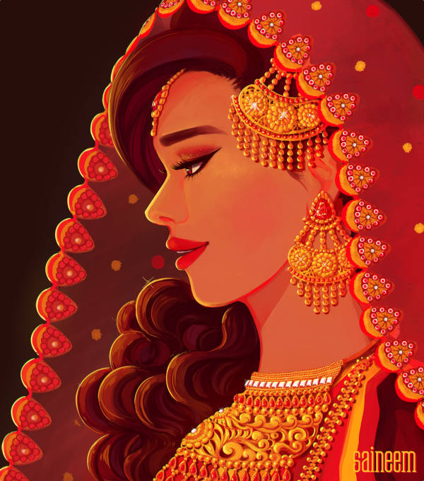](https://www.deviantart.com/saineem/art/Somebody-That-I-Used-to-Know-869762983 "Somebody That I Used to Know by Saineem")

Tras solucionar varios problemas matemáticos que llevaban siglos sin solución y dirimir varios juicios que los más avispados juristas no habían podido solucionar, su fama se extendió por todo el califato. Era reclamada de todas partes para ayudar a solucionar todo tipo de problemas, primero por gentes humildes y luego por los ricos y poderosos.

Sett viaja por todo el califato solucionando problemas y ofreciendo su sabiduría y su astucia a ricos y pobres cobrando solo lo que puedan pagar. Viaja con un joven pupilo llamado Abbas que hace pasar por su hermano, para evitar habladurías.

Ha derrotado a todos los maestros de shatranj que se han querido enfrentarse a ella y oficialmente no tiene ningún rango, pero podría retar y ganar sin problema a cualquier aliyat.

También es una intérprete musical de buen nivel y como contadora de cuentos es excepcional, no solo por la cantidad de historias que conoce, sino también por la pasión que pone en sus narraciones. Ser una persona tan lista y astuta le ha traído la ira y la envidia de muchas personas y no son pocas las veces que ha salvado su pellejo contando una buena historia al califa, califesa, emir, emiresa o kadí de turno.

Zahía tiene un secreto que guarda con mucho celo, porque podría poner en peligro su vida. Es hermanastra del Califa Harún Al-Raschid, su madre era una concubina del Califa Al-Mahdi, padre de Harún. Al-Mahdi, al morir, dispuso en secreto con su visir (el padre de Giafar) que no le faltará nada (casa, comida, ropa, etc.) y recibiera la mejor educación que el dinero pudiera pagar.

\sp

Si saliera a la luz este secreto, algún enemigo del Califa podría intentar secuestrarla para sacar dinero o asesinarla para hacerle daño. Ella además perdería su libertad de ir y hacer lo que quisiera y dejaría de ser una de las personas más sabias del mundo para convertirse en la hermanastra del Califa.

Sett Zahía es abiertamente lesbiana y creo que es un detalle que deberías mantener en tus aventuras. Está locamente enamorada de Zora, la hija de Yacub Abu-Yussef, kadí supremo de Bagdad. La tragedia es que si bien es un amor correspondido, es imposible por la sociedad en la que viven.

* **Atributos:** Agilidad d6, Astucia d12, Espíritu d10, Fuerza d6, Vigor d6
* **Habilidades:** Atletismo d6, Ciencias d12, Conocimientos Generales d6, Humanidades d12+2, Todos los idiomas normales humanos d12, Interpretar d8, Medicina d12, Notar d10, Pelear d4, Persuadir d4, Saber de Suleimán d10, Sigilo d4, Tácticas d12
* **Paso:** 6; **Parada:** 4; **Dureza:** 5
* **Desventajas:** Pacifista (Menor), Secreto (Mayor, es hija de una concubina del padre del Califa Harún Al-Raschid, por tanto, su hermanastra).
* **Ventajas:** Afinidad mágica, Erudito (Humanidades) Lingüista, Cuentacuentos
* **Equipo:** Ricos ropajes conjuntados con muy buen gusto, varios libros y algún instrumento musical.

**Sugerencia de interpretación:** Como Sett Zahía eres una biblioteca andante, todo el saber del mundo está en tu cabecera. No solo eres lista y sabes cosas, sino que eres tremendamente astuta.

```
La función de Sett en esta ambientación es de servir de voz de Scheherazade. Cuando tus schahriars se bloqueen y no sepan continuar pueden hablar con ella y les dará una pista, pero no debería convertirse en una costumbre. Si ves que recurren mucho a Zahía, puedes hacer que no este disponible, de hecho viaja mucho resolviendo problemas y dudas por todo el califato. Y si no están en Bagdad, qué casualidad, está por la zona para hablar con las personas de ciencia y humanidades del lugar.
```

\sp

\sinc

## Dana, joven ghūl aliada del Pequeño Consejo ☾

\conc

> /p/ Y merced a aquella circunstancia, a pesar de la sorpresa espantosa que me embargaba, pude ver a la ghūla, que no me veía, aproximarse a la joven y cogerla de la mano para llevarla al borde de una fosa. Y se sentaron ambas, una frente a otra, al borde de aquella fosa. Y la ghūla se inclinó hasta el suelo y se incorporó sosteniendo en sus manos un objeto redondo, que entregó en silencio a la muchacha. Y en aquel objeto reconocí un cráneo humano recientemente separado de un cuerpo sin vida. Y la chica, lanzando un grito de bestia feroz, clavó con fruición sus dientes en aquella carne muerta y se puso a roerla de un modo horroroso.
> /p/ 
> /p/ **Referencia:** Historia del joven dueño de la yegua blanca (n. 863)

Dana es una ghūl que vive en el cementerio de Al-Kazimiyya. Vive aislada del resto de los ghūles del cementerio, ya que la evitan por ser mucho más antigua y, por tanto, más fuerte y poderosa. Además, no es una ghūl de nacimiento, sino que se infectó siendo joven, hará unos 300 años en la cercana y abandonada ciudad de Ctesifonte. Hace unos 5 años, cuando la ciudad de Ctesifonte empezó a despoblarse, se mudó a Bagdad.

Es un importante aliado para el Pequeño Consejo no solo porque lleva varios años ayudando al Consejo, sino también, porque sus contactos en el submundo extraño de Bagdad son realmente útiles. Nada relacionado con los yinns, los cultos y los dioses extraños pasa sin que ella se entere y se encarga de tener informado al Consejo.

Su principal misión es dentro del Pequeño Consejo es poner a prueba a los nuevos. El rito de iniciación del Pequeño Consejo es pasar una noche en un cementerio y Dana se encarga de ponerles a prueba. Los acecha y los asusta, los ataca (sin llegar a herirles), los amenaza e incluso ha llegado comerse los restos de un cadáver delante de un grupo bastante valiente para amedrentarles.

Debido a su gran inteligencia y sus gustos necrófagos se ha convertido en un excelente forense. Si le permiten examinar un cadáver (mejor si puede devorarlo) o se le describen bien las señales que tenga el muerto podrá elaborar alguna teoría interesante y casi siempre acertada.

\sp

También es una experta albañil y cantera y cuando tiene tiempo se dedica a restaurar las tumbas más viejas de su cementerio. De hecho, muchas veces el Consejo no le paga sus servicios en oro, sino que le da herramientas y materiales de construcción.

* **Atributos:** Agilidad d8, Astucia d10, Espíritu d8, Fuerza d8, Vigor d8
* **Habilidades:** Atletismo d4, Conocimientos Generales d6, Humanidades d6, Idioma materno d8, Latrocinio d6, Medicina d4, Notar d8, Pelear d8, Persuadir d4, Saber de Suleimán d8, Repara d6, Sigilo d10
* **Paso:** 6; **Parada:** 6; **Dureza:** 7(1)
* **Desventajas:** Bocazas
* **Ventajas:** Afinidad mágica, Trasfondo arcano (Sihr), Puntos de poder
* **Capacidades especiales:**
  * **Infección:** Cualquiera que sufra una herida de un ghūl debe hacer una tirada de Vigor al de una semana. El éxito indica que está bien. El fracaso le otorga un nivel inmediato de fatiga debido a las fiebres. Un fallo crítico indica que el personaje está infectado. El infectado tiene un d6 meses antes de que la transformación en ghūl esté completa (y el personaje se vuelve injugable). Quizás puedas encontrar a alguien con los suficientes conocimientos en Mitos que sepa como curarla, pero seguramente le deberás un gran favor. Los propios ghūles podrían darte esa información. Si se supera la infección o se pasa la tirada de Vigor la víctima se vuelve inmune a la infección y la próxima vez ni tendrá el nivel de fatiga.
  * **Armadura +1:** Piel dura.
  * **Excavar 4:** Los ghūles pueden excavar en tierra y piedras suelta y reaparecer en el siguiente turno en cualquier sitio a 6 pasos.
  * **Debilidad luz solar:** Sufren un -2 a todas sus tiradas de habilidad a plena luz del día.
  * **Visión nocturna:** No sufren penalización por condiciones de iluminación.
  * **Forense:** Su habilidad de Medicina sube dos niveles (d6) cuando trata con cadáveres y hace análisis forenses, 3 niveles (d8) si le permiten devorar partes del cadáver. Puede averiguar cosas que la ciencia de su tiempo no puede como causa y hora de la muerte.
  * **Garras/Mordisco:** FUE+d6

\sp

* **Hechizos:** 16 PP, Los cerrojos se caen y las puertas se abren, Levantar nasnas, Visto y no visto
* **Equipo:** Alfanje, herramientas de albañil y cantero, grimorio (Historia de las Aventuras de Hassan Al-Bassri).
* **TPC:** 1d4

**Sugerencia de interpretación:** Eres una gótica encerrada en un cuerpo de ghūl. Realmente te encantan los cementerios y la muerte, asustar a la gente, contar historias de miedo, leer sobre nigromancia y, desgraciadamente, devorar la carne de los muertos. Tu vida anterior era un sufrimiento, pero tu transformación como ghūl te permitió liberarte de todo eso. Eres más lista y fuerte que la media y sabes magia y eso hace que el resto de ghūles te tengan miedo y te respeten y normalmente te eviten. Eres un poco bocazas pasa mucho tiempo sola y cuando estas con gente no dejas de hablar contando cosas que quizás no debieras.