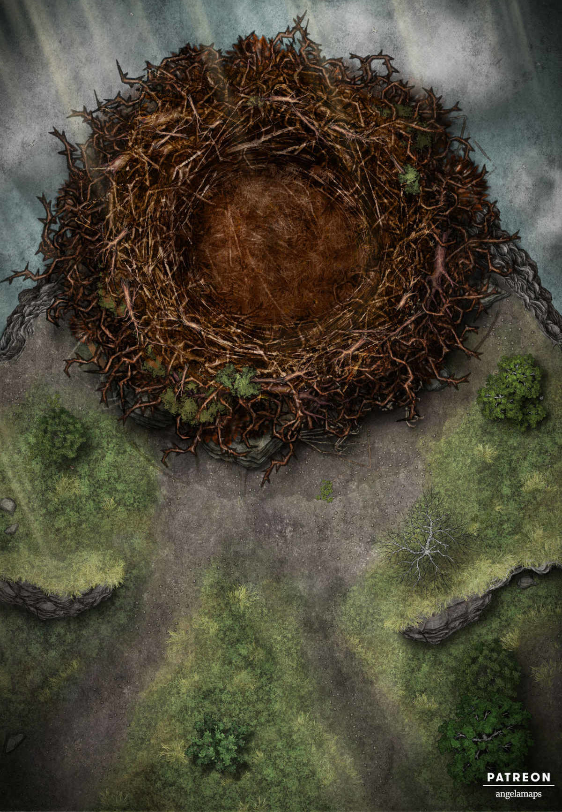
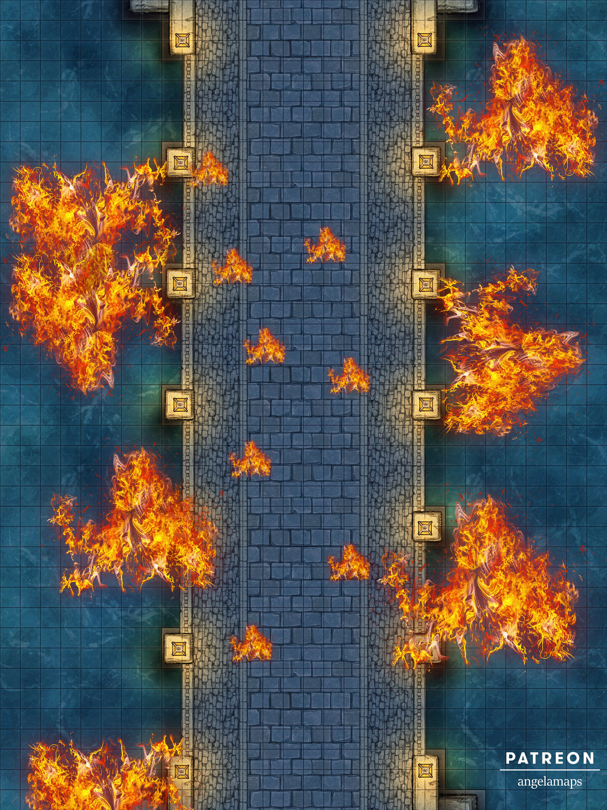
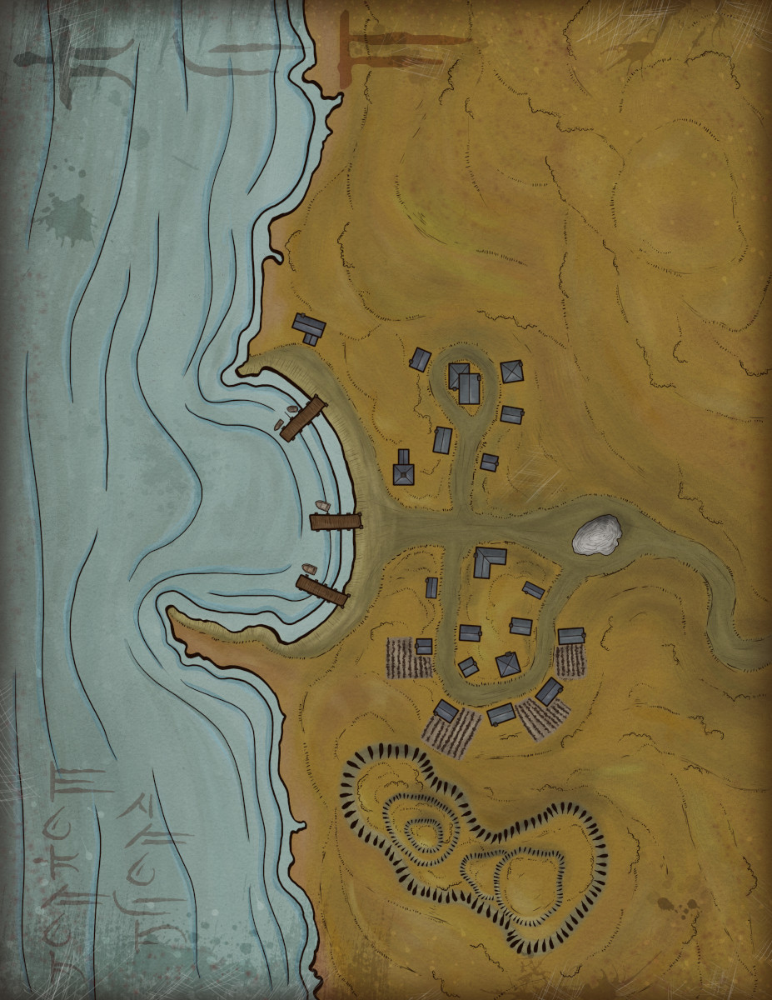

# Recursos y mapas

\sinc

, corresponding to (772-922AD)")

_Mapa de Bagdad_

\conc

\sp

\sinc

_Nido de ave de Rokh_

\conc

\sp

\sinc

_La garganta_

\conc

\sp

\sinc

_El puente de Bagdad (noche)_

\conc

\sp

\sinc

_Puente de Bagdad en llamas_

\conc

\sp

\sinc

_Tumba del Faraón_

\conc

\sp

\sinc

_Ruinas en el desierto_

\conc

\sp

\sinc

_Plano de un Khan_

\conc

\sp

\sinc

_Pueblo pesquero del Mar Rojo_

\conc

\sp

\sinc

_Campamento en el desierto_

\conc

\sp

\sinc

[![[MAP] THE TOMB OF DEVAS - Miska Fredman](./images/ruinas-babilonia.webp)](https://www.miskasmaps.com/maps/map-the-tomb-of-devas/ "[MAP] THE TOMB OF DEVAS - Miska Fredman")

_Ruinas de Babilonia_

\conc

\sp

\sinc

_Cueva de las maravillas - Interior de un falak_

\conc

\sp

\sinc

_Jardines del Palacio de la Eternidad_

\conc

\sp

\sinc

_Calles de un bazar_

\conc

\sp

\sinc

## Pistas e indicios

> **Inscripción en la lanza de la estatua ecuestre:**  
>   
> ¡Audaces viajeros que pudisteis llegar, hasta las tierras vedadas, ya no sabréis volver sobre vuestros pasos!  
> ¡Si os es desconocido el camino de la ciudad, movedme sobre mi pedestal con la fuerza de vuestros brazos, y dirigíos hacia donde yo vuelva el rostro cuando quede otra vez quieto!
> 
> **Referencia:** La estatua ecuestre

&nbsp;

> **Secretos oscuros del shatranj**
> 
> **Nivel de poder:** 3  
> **Idioma:** Árabe  
> **Condición:** Traducción del hindú
> 
> Secretos oscuros del shatranj tiene un pequeño capítulo de unas 5 o 6 hojas sobre el shatranj que buscan.
> 
> Este juego de shatranj, creado por el poderoso soberano Suleimán, tiene en cada pieza un poderoso mared. Cuando se mueve la primera pieza de marfil (piezas blancas), el juego empieza una partida con las piezas de ébano (piezas negras). Cada vez que se mueve una pieza de marfil, el mared imbuido en el tablero establece un movimiento de una pieza de ébano y el mared imbuido en ella genera con su magia unas ilusiones muy realistas de ejércitos que se mueven o atacan al ejército del jugador con las piezas de marfil.
> 
> Los peones son infantería, los caballos caballería ligera, los elefantes caballería pesada y carros de guerra y las torres fortalezas y maquinaria de asedio.
> 
> Suleimán creo este artefacto con el objetivo de practicar y aprender tácticas de guerra. El tablero simula movimientos enemigos, ataques sorpresa, huidas, reagrupaciones, etc. y el jugador humano mueve sus fichas y sus ejércitos respondiendo o adelantándose a los movimientos del enemigo. Cuando el mared del tablero lo considera oportuno, otorga la victoria al jugador ébano o marfil.
> 
> Las ilusiones pueden ser a veces muy realistas y podrían suplantar incluso a mensajeros y oficiales que darían órdenes de atacar objetivos reales.
> 
> **Referencia:** El shatranj de Suleimán: Historia del pasillo prohibido de la Casa de la Sabiduría (III)

&nbsp;

> **Extraño laylay (rayuela):**  
>   
> Cada letra en árabe representa un 8, 6, 4, 2. Es un cuadro mágico en la que cada columna y fila no se repiten ninguno de los números.
> 
> |laylay.html|
>
> **Referencia:** Historia del dibujante de laylays

&nbsp;

> **Inscripción en la lápida de la fosa común de Aram-de-las-columnas:**  
>   
> Al otro lado del mar de los corales, regido por los adoradores de Cthulhu, antes de cruzar el río de la vida y la muerte, existe una montaña de fuego. En su falda, sellado con una losa de mármol, está nuestro tesoro, que nos costó nuestras vidas.
> 
> **Referencia:** Aram-de-las-columnas

&nbsp;

> Saludos mi muy querido amigo Giafar,  
>   
> Que las bendiciones sean contigo y tu extensa familia. Llevo unas semanas estudiando un extraño fenómeno espacial que he denominado la Convergencia de 6 Astros, Dentro de 15 días el Sol, junto a 6 astros (Mercurio, Venus, Tierra, Luna y Marte) se alineará cósmicamente y a la puesta del sol y Bagdad estará en el centro de esa alineación.  
>   
> Sabes que soy una mujer de ciencias y necesito pruebas y ensayos de todo, pero esta vez me he debajo guiar por mi instinto y este me dice que algo grande y terrible podría asolar tu querida ciudad.  
>   
> Mi situación actual no me permite serte de más ayuda, pero quiero que sepas que mis rezos están contigo para ayudarte en la gran tarea que te espera.  
>   
> Desde más allá de las estrellas,  
>   
> **Firmado: Mariam Al-Ijliya al-Asturlabi**

&nbsp;

> ¡Soy la virgen Tadnaar, hija del rey de los amalecitas, y esta ciudad es mi ciudad! ¡Puedes llevarte cuanto te plazca a tu deseo, viajero que lograste penetrar hasta aquí! ¡Pero ten cuidado con poner sobre mí una mano violadora, atraído por mis encantos y por la voluptuosidad!
> 
> **Referencia:** Inscripción junto a la princesa dormida de la ciudad de Bronce

&nbsp;

> **Texto del sarcófago de Kusch ben-Scheddad ben-Aad**
> 
> ¡En el nombre del Eterno, del Inmutable!  
> ¡En el nombre del Dueño de la furia y del poder!  
> ¡Aprende, viajero que pasas por aquí, a no enorgullecerte de las apariencias, porque su resplandor es engañoso!  
> ¡Aprende con mi ejemplo a no dejarte deslumbrar por ilusiones que te precipitarían en el abismo!  
> ¡Voy a hablarte de mi poderío!  
> ¡En mis cuadras, cuidadas por los reyes que mis armas cautivaron, tenía yo diez mil caballos generosos!  
> ¡En mis estancias reservadas tenía yo como concubinas mil vírgenes escogidas entre aquellas cuyos senos son gloriosos y cuya belleza hace palidecer el brillo de la luna!  
> ¡Diéronme mis esposas una posteridad de mil príncipes reales, valientes cual leones!  
> ¡Poseía inmensos tesoros: y bajo mi dominio se abatían los pueblos y los reyes, desde el Oriente hasta los límites extremos de Occidente, sojuzgados por mis ejércitos invencibles!  
> ¡Y creí eterno mi poderío y afirmada por los siglos de los siglos la duración de mi vida, cuando de pronto se hizo oír la voz que me anunciaba los irrevocables decretos del que no muere!  
> ¡Entonces reflexioné acerca de mi destino!  
> ¡Congregué a mis jinetes y a mis hombres de a pie, que eran millares, armados con sus lanzas y con sus espadas!  
> Y a presencia de todos ellos hice llevar mis arquillas y los cofres de mis tesoros, y les dije a todos:  
> «¡Os doy estas riquezas, estos quintales de oro y plata si prolongáis por un día mi vida sobre la tierra!»  
> ¡Pero se mantuvieron con los ojos bajos, y guardaron silencio!  
> ¡Hube de morir a la sazón! ¡Y mi palacio se tornó en asilo de la muerte!  
> ¡Si deseas conocer mi nombre, sabe que me llamé Kusch ben-Scheddad ben-Aad el Grande!  
> 
> **Referencia:** Historia prodigiosa de la ciudad de bronce (n. 340)

&nbsp;

> **Carta de Giafar después de su ejecución**  
>   
> ¡Bhadraṃ te!  
>   
> Si estáis leyendo esta misiva es porque antes habéis leído mi epitafio. El califa ha hecho cortar mi cabeza por ayudar a escapar a un posible heredero legítimo del califato y que podría tratar de reclamar el trono. Mis creencias no me permitían tomar la vida de un niño inocente y mis actos fueron usados por los conspiradores que envenenan el oído del califa para convencerle de que era un traidor y debía ejecutarme.  
>   
> Mi marcha a otro plano de existencia ha supuesto que mi último deber con mi querida Bagdad haya quedado incompleto y es por ello que necesito que vosotros la terminéis por mí, cerrando así el ciclo infinito del Karma.  
>   
> Lo que os pido, no como visir, sino como persona preocupada por el bienestar de sus congéneres, es que frustréis los planes los Seguidores de Fuego y de la Luz. Para ello dejé preparado un minucioso plan que necesito que vosotros completéis.  
>   
> Nota: La persona que porta esta misiva es una de las mejores personas que he tenido el gusto de conocer y es de mi total confianza. Desearía que tomarais sus resoluciones como si fueran mías y os ayudará en todo lo que pueda, que afortunadamente es mucho.  
>   
> Namaste  
>   
> **Firmado: Giafar al-Barmak**

&nbsp;

> **Primera inscripción:** ¡Oh hijo de los hombres, qué vanos son tus cálculos! ¡La muerte está cercana; no hagas cuentas para el porvenir; se trata de un Señor del Universo que dispersa las naciones y los ejércitos, y desde sus palacios de vastas magnificencias precipita a los reyes en la estrecha morada de la tumba; y al despertar su alma en la igualdad de la tierra, han de verse reducidos a un montón de ceniza y polvo!
> 
> **Referencia:** Historia prodigiosa de la ciudad de bronce (n. 343)

&nbsp;

> **Segunda inscripción:** ¡Oh hijo de los hombres! ¿Por qué te ciegas con tus propias manos? ¡Cómo puedes confiar en este vano mundo! ¿No sabes que es un albergue pasajero, una morada transitoria? ¡Di! ¿Dónde están los reyes que cimentaron los imperios? ¿Dónde están los conquistadores, los dueños del Irak, de Ispahán y del Khorassán? ¡Pasaron cuál si nunca hubieran existido!
> 
> **Referencia:** Historia prodigiosa de la ciudad de bronce (n. 343)

&nbsp;

> **Tercera inscripción:** ¡Oh hijo de los hombres! ¡Anegas tu alma en los placeres, y no ves que la muerte se te monta en los hombros espiando tus movimientos! ¡El mundo es como una tela de araña, detrás de cuya fragilidad está acechándote la nada! ¿Adónde fueron a parar los hombres llenos de esperanzas y sus proyectos efímeros? ¡Cambiaron por la tumba los palacios donde habitan búhos ahora!
> 
> **Referencia:** Historia prodigiosa de la ciudad de bronce (n. 343)

&nbsp;

> **Cuarta inscripción:** «¡Oh el misterio del nacimiento y de la muerte! ¿Por qué nacer, si hay que morir? ¿Por qué vivir, si la muerte da el olvido de la vida? ¡Pero solo Alah conoce los destinos, y nuestro deber es inclinarnos ante El con obediencia muda!»
> 
> **Referencia:** Historia prodigiosa de la ciudad de bronce (n. 343)

&nbsp;

> **Quinta inscripción:**¡Que no está muerto lo que puede yacer eternamente! Y con los evos extraños la muerte puede morir.